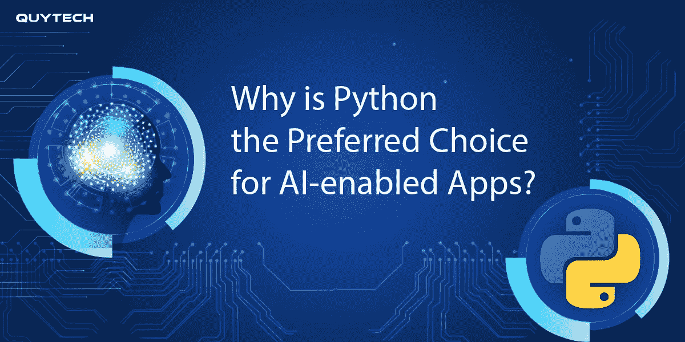

# 为什么 Python 是支持人工智能的应用程序的首选？

> 原文：<https://medium.com/analytics-vidhya/why-is-python-the-preferred-choice-for-ai-enabled-apps-2e774daee127?source=collection_archive---------22----------------------->

人工智能和人工智能已经成为数字领域的游戏规则改变者。它们通过提高效率、简化流程和最大化技术能力，为企业提供了无限的扩张机会。

AI 不再是科幻概念。我们日常使用的许多商品和服务都包含人工智能组件，这些组件可以分析大量数据，并帮助企业做出更快的响应。

如今，许多企业不确定为他们的下一个主要人工智能项目选择哪种编程语言。

在 Quytech，我们选择 Python，并相信它是开发人工智能和机器学习应用程序的最佳语言。

具有前瞻性思维的企业正在对机器学习和人工智能软件开发表现出兴趣并进行投资，以利用自主先进技术的力量。

但是，是什么让 python 对支持人工智能的应用如此有益呢？

继续阅读，了解为什么 Python 是开发支持人工智能的应用程序的最佳选择。

# Python 的起源及其在人工智能中的重要性

Python 是一种功能强大的语言，具有大量用于 AI 和机器学习的库，通过为 AI 和机器学习活动提供预写代码来节省开发人员的时间。

此外，由于 Python 的流行，企业希望为他们各自的项目雇佣 Python 开发人员。Python 现在是发展最快的编程语言之一，因为它具有可伸缩性、简单易学和通用性。

Python 是人工智能最强大的语言之一，因为它提供了预配置的库，如用于科学计算的 Numpy、用于计算机科学的 Scipy 和用于机器学习的 py brain(Python 机器学习)。

当你用 Python 写作时，你会得到一个结构良好且经过测试的环境来快速将你的想法付诸实践。解决复杂的计算问题也需要更少的编码和工作。

现在，让我们继续检查，

# 为什么 Python 是支持人工智能的应用程序的首选？

Python 对每个人都有一长串的优势，不管你是小公司还是大企业。由于 Python 越来越受欢迎，企业现在可能会雇佣 Python 开发公司来从事机器学习(ML)、人工智能和其他项目。

有了这个观点，这里有一些使用 Python 进行人工智能和机器学习的最有说服力的理由。所以看看吧！

# #1.内置库

Python 具有内置库的优势，这对任何人工智能相关的项目开发都非常有价值。Python 通过降低构建基于人工智能的应用程序所需代码的复杂性来节省大量时间，互联网协议、字符串操作、在线服务工具和操作系统接口是这些库的基本方面。

# #2.灵活性

Python 的灵活性是一个关键的品质，这使它成为人工智能和机器学习项目中最具适应性的流行语言之一。例如，为了创建功能丰富的应用程序，开发人员可以将 Python 与其他几种语言集成在一起。

它还允许开发人员对代码进行更改并立即看到结果，而不必重新编译源代码。

# #3.平台独立性

Python 的平台独立性是一个奇妙的特性，增加了它的通用性。平台独立性是基于 WORA(一次编写，随处运行)的理念。

开发人员可以使用这个功能在任何平台上运行独立的代码，包括 macOS、Windows、UNIX、Linux 等等。它还有助于减少开发时间和费用。

# #4.测试

Python 的可理解性是它作为编程语言最吸引人的特性之一。虽然 AI(人工智能)有很多独特的技术，但 Python 测试的简单性使其成为最受欢迎的编程语言之一，尤其是与 C++或其他语言相比。

# #5.形象化

Python 附带了许多预安装的库。其中一些可以用来帮助可视化。

开发人员可以使用图形和图表来显示结果数据。这对于非技术人员来说足够简单，可以掌握。

在 AI 和 ML 的背景下，这是相当有用的。例如，Matplotlib 等工具用于创建直方图、图表和绘图，以改进数据解释、展示和可视化。

应用程序编程接口(API)的多样性使开发团队能够构建简洁的报告，这是另一个有助于可视化过程的特性。

# 最后的想法

人工智能(AI)和机器学习(ML)是两种快速发展的技术，使工程师和研究人员能够通过适当的解决方案来处理实时问题。Python 帮助开发基于人工智能和 ML 的解决方案更简单、更快、更便宜，这要归功于它出色的框架集、简单明了的编码结构、快速的原型开发、非凡的灵活性和大型社区参与。

随着人工智能继续快速发展，企业有巨大的潜力在行业中取得成功，这就是为什么在未来，Python 将成为各种人工智能应用开发的主要语言。

因此，如果你不太熟悉 Python 语言，你应该寻找最好的 Python 开发者或公司来帮助你完成基于人工智能的 Python 项目。

如果你有任何问题或者正在寻找 python 开发者，我们希望这个博客已经提供了我们承诺的详细信息！联系我们。

# 来自...的消息

*原载于 2021 年 6 月 27 日*[*【https://www.whatech.com】*](https://www.whatech.com/mobile-apps/blog/706302-why-is-python-the-preferred-choice-for-ai-enabled-apps)*。*