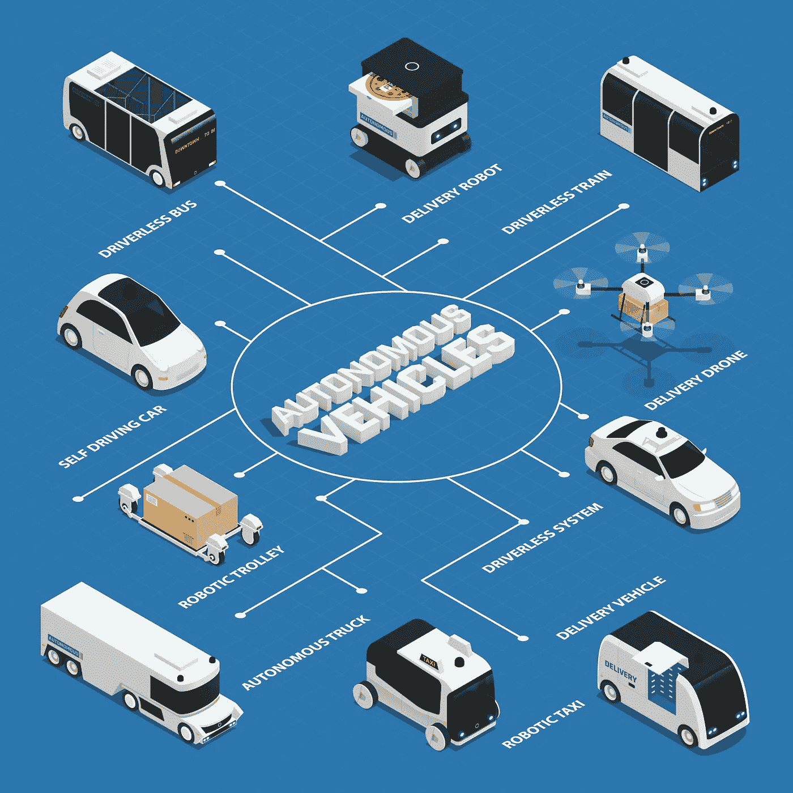
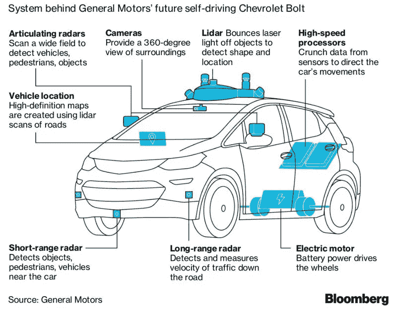
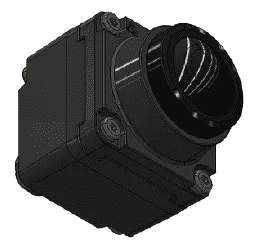
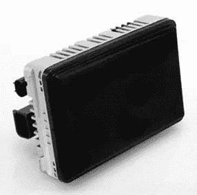
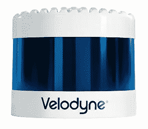
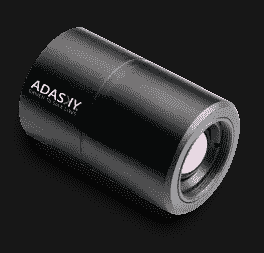
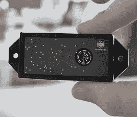

# 为什么在自动驾驶汽车中训练机器学习算法需要传感器数据融合？

> 原文：<https://medium.com/analytics-vidhya/why-is-sensor-data-fusion-required-to-train-machine-learning-algorithms-in-autonomous-vehicles-45251aff3615?source=collection_archive---------14----------------------->

来源:宏向量创建的汽车向量—[www.freepik.com](http://www.freepik.com)

自动驾驶汽车(AVs)将带来潜在的好处，如拯救生命、减少伤害、减少有害排放、降低油耗和提高生产率。

AVs 使用相机、激光雷达、雷达、超声波和远红外(热)传感器，通过模仿人脑的机器学习算法来感知环境。在不同的环境、范围和可靠性下，每种类型的传感器在检测能力上都有其优势和劣势。让我们逐一讨论。

来源:[彭博文章](https://www.bloomberg.com/quicktake/driverless-cars)

# 照相机

来源: [Sekonix 相机](http://sekolab.com/products/camera/)

在车辆周围使用高分辨率和不同视野的摄像机，以获得更好的全景。由摄像机产生的图像被馈送到用于检测和识别对象的对象分类的 ML 算法。由于相机图像可以有颜色和字体，这些图像可以解释交通灯、标志、车道标志等。它们体积小，成本低。立体摄像机可以产生用于测距的物体的 3D 几何形状。

摄像机本身无法帮助 AVs 感知环境，因为它们在低能见度条件下(如夜间、雾、降雪或下雨)检测物体时存在局限性。潮湿的环境会对传感器产生负面影响，因为光线会被潮湿的路面反射。它们还需要大量的计算系统来处理数据。需要计算到障碍物的距离，其精度有限。

# 雷达(无线电探测和测距)

来源:[大陆 ARS540 雷达](https://www.continental-automotive.com/en-gl/Passenger-Cars/Autonomous-Mobility/Enablers/Radars/Long-Range-Radar/ARS540)

雷达(无线电探测和测距)传感器使用无线电波来探测场景中的物体，并测量它们的距离和相对于车辆速度的速度。它们擅长探测金属物体，被放置在 AV 周围。AVs 使用短程(24Ghz)和远程(77GHz)雷达。短程雷达用于监控盲点、停车辅助和车道保持。远程雷达用于距离保持和制动辅助。雷达体积小，重量轻，没有移动部件，成本低。它们也有助于探测远距离低能见度(弱光)条件下的物体。

单靠雷达无法提供 360 度的感知。这些图像分辨率很低。他们无法区分不同类型的物体，因为信息仅限于形状和颜色。雷达传感器之间也会有相互干扰。

## **激光雷达**(光探测和测距)

来源:[威力登激光雷达](https://velodynelidar.com/products/)

激光雷达(**Li**ght**D**detection 和 **R** anging)传感器以很快的速度使用不可见的激光(低强度和无害光束)。这些传感器用于测量从 AV 到场景中各种对象的距离，并且还允许根据反射回来的信号创建对象的 3D 图像。这些信号产生代表车辆周围环境的点云*。它提供了周围物体(汽车、行人和其他)的形状和深度以及道路地理。图像具有良好的精度和分辨率。类似于雷达传感器，它们有助于在低能见度(弱光)条件下检测物体。在多个激光雷达传感器中没有明显的干扰。这些传感器可以在能见度良好的情况下看到远处的反车辆前方。激光雷达和其他传感器可以识别场景中的对象(另一辆车或行人)。它们允许创建 AV 环境的 360 度视图。*

雨、雪或雾有时会对它们探测 AV 周围物体的能力产生负面影响。潮湿的环境也会对传感器产生负面影响，因为光线会被潮湿的路面反射。激光雷达传感器非常昂贵(大约是相机和雷达成本的 10 倍)，因为它们的生产依赖于稀土金属。由于传输不密集，可能无法检测到小物体。由于机械部件的原因，它们的维护费用很高，并且还需要更多的功率。在潮湿的道路条件下，光线会从道路上反射，这对激光雷达传感器构成了挑战。

## 远红外(FIR)传感器/热感相机

来源:[阿达斯基热感相机](https://www.adasky.com/viper/)

FIR 传感器通过检测目标物体辐射的热能(高于-460 华氏度或-273 摄氏度)来被动收集信号。这些传感器不需要任何光线来检测、分割和分类 AV 周围的物体和行人，否则摄像机、雷达或激光雷达可能察觉不到这些物体和行人。与雷达和激光雷达传感器不同，FIR 传感器不会产生干扰。与激光雷达相比，远红外传感器更便宜、更小。

与相机传感器相比，FIR 传感器的分辨率较低。图像是灰度的。建议将 FIR 数据与互补金属氧化物半导体(CMOS)相机的数据融合，以提供更好的检测能力。FIR 传感器数据需要更多的计算资源。

## 超声波传感器

来源: [Toposens TS3 3D 超声波传感器](https://toposens.com/ts3/)

超声波传感器通过发出高频声波来模仿蝙蝠的导航过程。当声波击中一个物体时，它们产生的回声揭示了该物体的位置。它们对探测透明物体很有用。它们用于能见度低的情况。它们用于近距离和低速，并在自动停车时使用。这些传感器体积小，成本低。

来自其他超声波传感器的干扰会影响性能。这些传感器只能用于近距离和低速。大风和高温环境可能会对传感器的性能产生负面影响。

## 需要传感器数据融合

基于上述分析，单一类型的传感器无法提供完整的 AV 感知，因为它们具有局限性，并且在不同的使用情况下非常有用。因此，来自不同传感器或特定 AV 任务的传感器组合的数据被*融合*并馈入 ML 算法以做出适当的决定。传感器数据融合可以解决由于夜间、雾、雪、雨、潮湿条件、低图像分辨率、其他传感器干扰等引起的目标检测问题。

**感谢**的阅读！请👏如果你喜欢这篇文章，请跟我来，因为它鼓励我写更多！