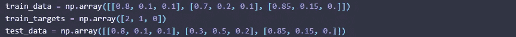
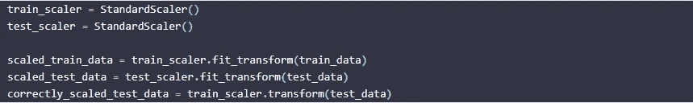
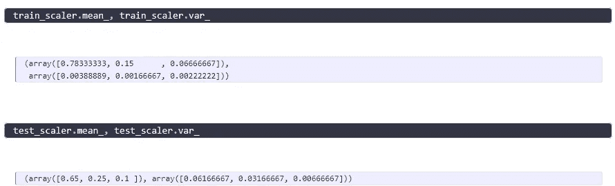
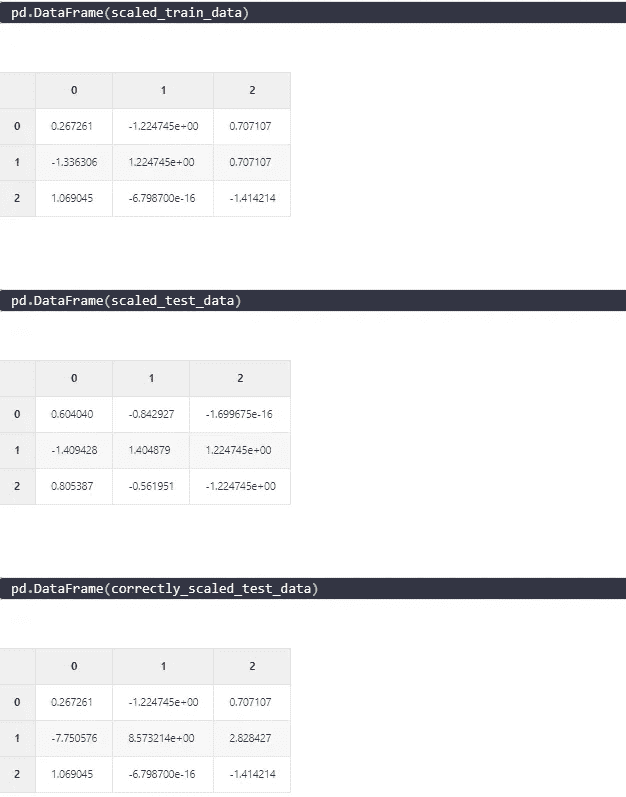
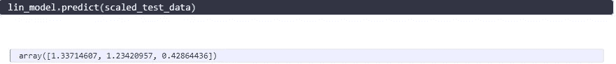
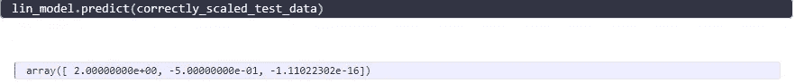

# 为什么如何标准化训练和测试集会有所不同

> 原文：<https://medium.com/analytics-vidhya/why-it-makes-a-difference-how-to-standardize-training-and-test-set-e95bf350bed3?source=collection_archive---------2----------------------->

在 [Unsplash](https://unsplash.com?utm_source=medium&utm_medium=referral) 上[叫我弗雷德](https://unsplash.com/@callmefred?utm_source=medium&utm_medium=referral)

在这篇博文中，我想简要说明为什么正确衡量你的训练和测试数据很重要。虽然我认为大多数机器学习实践者自动避免了不使用来自训练集的学习定标器标准化测试数据的谬误，但我认为许多实践者并不知道确切的原因。在这里，我将给出一个具体的例子，说明为什么您也需要为测试集使用来自训练集的 scaler。

让我们首先创建一些虚拟数据。例如，我们可以假设以下是由三个变量描述的三个不同的用户。我们还创建目标，例如，我们可以考虑每个用户所属的不同集群:

你可以看到在 *test_data* 中，用户 1 和用户 3 完全一样。这是故意的。让我们创建两个标准缩放器，这意味着我们将减去平均值，然后除以方差。

您已经可以看到这两种方法之间的差异。前两个 *scaled_data* 是使用来自 StandardScaler 的 fit_transform 方法构建的，而最后一种方法使用来自 trainset 的“经过训练的”Scaler 来缩放 test_dataset。让我们来看看不同的均值和方差:

这是数据的样子:

乍一看，正确缩放的测试数据看起来是错误的，只是因为这些数字似乎太遥远了。然而，让我们看看当我们在训练集上拟合简单的线性回归并在测试集上进行预测时会发生什么:

记住，在我们的测试集中，我们期望用户 1 和用户 3 分别被归类为 2 和 0。

但这在这里根本没有发生。我们看到，第一个用户和第三个用户都没有被正确分类，尽管他们完全相同。让我们来看看使用我们列车组的定标器时会有什么结果:

这一次，线性模型正确地将用户 1 和用户 3 分类。所以你可以看到错误使用缩放会产生多大的差异。这就是为什么我们使用训练集的均值和方差来标准化测试集。

拉塞

*原载于 2021 年 10 月 25 日*[*https://lschmiddey . github . io*](https://lschmiddey.github.io/fastpages_/2021/04/10/DeepLearning_TabularDataAugmentation.html)*。*