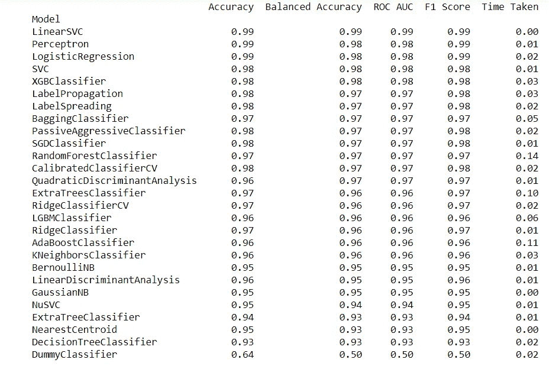
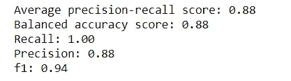

# 为什么要成为一名优秀的数据科学家，仅仅运行模块是不够的

> 原文：<https://medium.com/analytics-vidhya/why-its-not-enough-to-just-run-modules-to-be-a-good-data-scientist-b395a757251f?source=collection_archive---------23----------------------->

卡拉·埃尔南德斯在 [Unsplash](https://unsplash.com?utm_source=medium&utm_medium=referral) 上的照片

因此，我们都知道，作为一名数据科学家，只需要下载最新、最棒的 Python 机器学习模块，启动并运行它，将它指向我们的数据，可能还需要一点调整，然后掌声就会滚滚而来，对吗？轻松点。

然而，当你下载了这些模块中的一个，事情并不像你预期的那样工作，会发生什么呢？你会抛弃它，失去所有你期待的功能吗？还是你坚持不懈，努力解决这个问题？如果你是一名数据科学家，我当然希望你的直觉是后者。这里有一个最近的例子，我发现自己就处于这种情况。

我读到了这个模块[懒惰预测](https://lazypredict.readthedocs.io/en/latest/readme.html)，这似乎是一个非常有用的想法。当您开始一个新的 ML 项目时，有许多模型可能会在 Sci-Kit 学习模块中使用，但是使用哪一个呢？

显然，您需要确定这是一个分类任务还是回归任务，这减少了可用的模型选择。除此之外，人们会有他们自己最喜欢的模型，如果你特别了解这些选项，你也许能够给出一个理论上的理由，为什么一个特定的模型可能工作得最好，但是除此之外，你会去哪里呢？

Lazy Predict 提供了一个选项，即尝试 Sci-Kit 中所有可用的模型，逐一了解您的数据，并为您提供一些基本的性能衡量指标。然后，您可以选择前几个性能最佳的模型，调整超参数，并有理由相信您拥有最佳模型，这似乎比随机选择几个模型并进行调整更好。

但是，我建议您确保研究并理解您选择使用的任何模型，并且永远不要盲目地相信一些性能统计数据。

所以我想我会下载并亲自测试它，看看它是如何工作的，以及我是否可以将它包含在未来的项目中。

按照他们的文档[主页](https://lazypredict.readthedocs.io/en/latest/readme.html)上的分类模型指南，我运行了以下程序，对 Sci-Kit Learn 中包含的众所周知的乳腺癌数据集进行了一些分类:

注意，由于与 Sci-Kit Learn 最新版本的兼容性问题，我不得不做一些额外的工作来让 Lazy Predict 安装并运行该模块。这里有一个临时的补丁，希望在适当的时候会被排序。

到目前为止，输出如下:

延迟预测输出

因此，似乎有了 LinearSVC、感知器或逻辑回归模型，我们可以轻松获得 99%的 F1 分数，这看起来相当不错！我们现在可以研究这些模型，看看它们是如何工作的，并调整它们以获得更好的性能。工作做得好吗？

假设我们选择使用 LinearSVC 模型，我们可以根据我们的数据轻松构建和训练它:

像任何优秀的数据科学家一样，我们应该仔细检查我们的结果，对吗？不要相信任何我们不熟悉的东西，但它应该很简单，只需打印出一些统计数据:

输出是:

线性 SVC 统计

等等，这不是我们所期待的…发生了什么？有什么问题吗？我们能信任这个模块吗？我们做错什么了吗？文档页面相当稀疏，没有任何东西表明我们应该得到不同的结果。因此，在这一点上，你可以选择放弃，但我真的希望你不是那种数据科学家，我们已经走了这么远，让我们看看发生了什么。

该模块的代码可以在 [Github](https://github.com/Sudarshan-gurav/lazypredict/blob/master/lazypredict/Supervised.py) repo 上找到，但如果你能在你的电脑上找到它就更好了，我在 C:\Users\下找到了我的代码。\ AppData \ Roaming \ Python \ Python 38 \ site-packages \ lazy predict 在这种情况下，查看本地安装的代码实际上更有用，因为它似乎与 Github 上的版本略有不同。

我注意到 Supervised.py(这个模块的主要代码)中的关键代码是这样的:

Lazy Predict 不是直接在 dataframe 上运行模型(这无论如何都无法处理大多数数据，因为您通常会期望某种分类数据),而是进行一些预处理，以将数据转换为 Sci-Kit Learn 期望的格式。这非常有意义，但是对于使用这种工具的初学者来说，可能不是很明显。

事实上，我们现在可以确切地看到 Lazy Predict 所做的处理，我们现在可以自己复制它，或者如果我们喜欢不同的东西，可以在模块内调整它。此外，通过深入研究代码，我们可以看到正在显示的度量标准、正在比较的模型等的变化。

所以现在，只要稍微挖掘一下，我们就可以复制模块给出的结果，我们确切地了解模块正在做什么，并且相信它实际上是如何工作的，这在使用任何新工具时总是至关重要的。此外，我们获得了很大的权力，可以随心所欲地调整事情。如果我们在遇到第一个障碍时就尝试这个模块并放弃的话，我们永远也做不到这些。