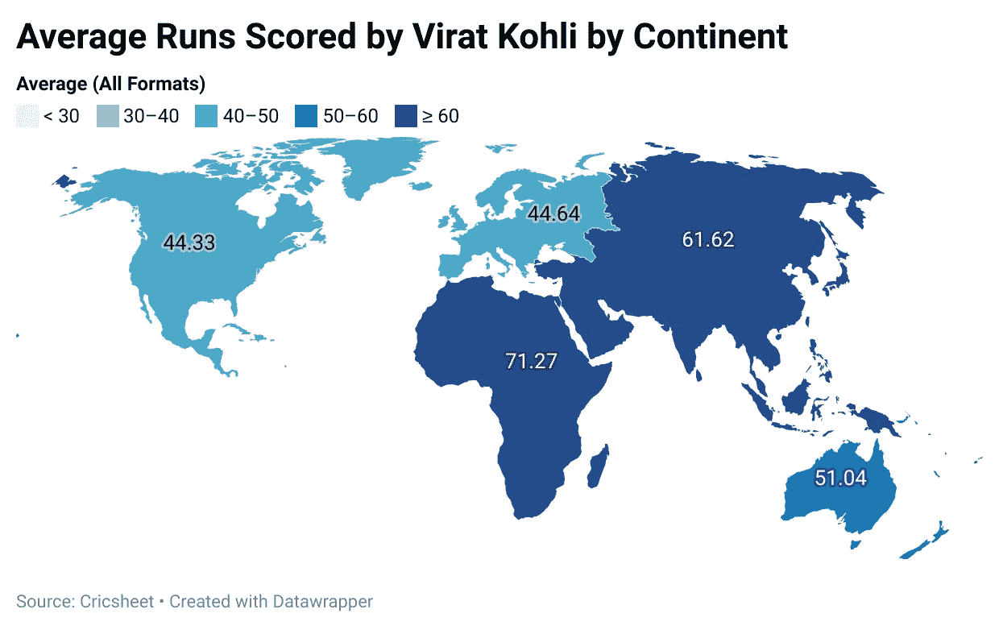

# 为什么 Kohli 是国王？

> 原文：<https://medium.com/analytics-vidhya/why-kohli-is-the-king-eab85bd96605?source=collection_archive---------13----------------------->

**截至 2021 年 6 月 8 日的正确数据*

如果你有空的话，可以分享这篇文章或者关注我的 [***推特***](https://twitter.com/luke_lockley)**(@ Luke _ lockley)**

**板球之夏终于全面展开了！！！！**

**今年，英格兰男子队的旗舰系列赛是对阵强大的印度队的五场测试赛。在人口超过 10 亿的情况下，你可能会被愚弄，认为锁定一颗恒星可能就像大海捞针一样。**

**在这一代人中，确实有一个球员会像其他体育偶像一样吸引大众的注意力，如穆罕默德·阿里、汤姆·布拉迪或莱昂内尔·梅西。**

****他的名字…维拉·科勒****

# ****事实:所有形式的优势****

**众所周知，统计数据可以被用来讲述作者想要创造的故事。无论你从哪个角度看，Virat Kohli 的数字都凸显了一位杰出的天才。自 2004 年以来，在所有形式的比赛中，Kohli 取得了 22，818 次得分，平均得分为 55.79 分，每 100 球略高于 80 分。如上图所示，Virat 远远优于前十名中的任何其他击球手，只有 Kumar Sangakkara 在此期间得分超过 20，000 分。另一个令人惊讶的因素是他对这些格式的一致性。正如下表所强调的，科勒是唯一一个在所有三种形式中都进入前十名的球员。他的“三重绿色”威胁向我暗示，他是一个超越同龄人的一代天才；我将在这篇文章中继续传达这一点。**

# ****追逐之王****

**在他堆积如山的跑步记录中，Kohli 的优势在于有限次数板球。特别是，他的一天国际(ODI)形式令人难以置信。在 254 场比赛中，他得了 12，169 分，平均得分超过 59 分。在他一贯的卓越表现中，Virat 以他在大压力时刻茁壮成长的能力而闻名，并在追逐总比分时看到自己的一方主场发挥了真正的“队长敲门”。数据明确支持这一理论。如果我们按局来分析科利在 ODI 板球比赛中的得分，我们可以看到在比赛的第二局，他的平均得分是惊人的 68.08 分。第一棒和追逐之间 37%的进步只有谢恩·沃森(见上图)能与之匹敌，他在第二局的平均成绩低于 53 分。随着当前在有限回合内追逐板球的趋势成为球队的首选路线，拥有一名拥有这些无与伦比的统计数据的球员是印度在这种形式下继续取得成功的原因。Kohli 的气质和对竞争的热爱使他成为世界板球界最受欢迎的三柱门选手；这让许多队长、教练和球队分析师绞尽脑汁试图找到一种方法来减少他对比赛的影响。**

# **无情的**

**板球测试赛是一项艰苦的比赛:**

**a)红色测试赛球比其白色一日赛球做得更多；无论是空中还是场外**

**b)地勤人员经常准备投球，为投球手提供更多的奖励**

**c)持续五天。这考验任何人的耐心和精神毅力**

**因此，当你玩得好的时候，你需要资本化！！作为击球手，这意味着得分跑，沉重的跑。在目前的精英击球手测试游戏中，没有人比 Virat Kohli 更擅长将 50 元变成 100 元。他比世界头号击球手凯恩·威廉姆森高出整整九个百分点。转换率超过一半，球队知道，如果他们不能尽快得到科利，他是最无情的得分沉重，赢得比赛的敲门。**

# ****斯托克的雨夜，有人吗？****

**在这篇文章中，我们已经确立了 Kohli 作为一个跑步机器、一个追逐大师和一个无情的操作者的资格，但还没有触及他在世界各地这样做的能力。该地图显示了各大洲所有格式的 Kohli 平均值。不出所料，他在主场友好赛中取得了令人难以置信的成功(61.62)。然而，可能令许多人惊讶的是，在澳大拉西亚和非洲有弹性的坚硬地面上，他已经超过了 50 岁，这与亚洲的情况形成了鲜明的对比。这突出了他在现代比赛中的多面性，在现代比赛中，趋势是在国内做得非常好，但在国外时遭受党派之争。**

**然而，有一件事值得深思，那就是他在英国(欧洲)的记录。虽然他的平均得分仍然在 40 多分，这是许多人无法比拟的壮举，但这并不能与 Virat 的高标准相提并论。当他最后一次在英格兰测试系列赛中以平均 59.30 分的成绩出场时，Kohli 会复制他 2018 年系列赛的表现吗？还是安德森等人会在绿茵宜人之地的摇摆友好条件中胜出？**

**有一点是肯定的，Kohli 将吸引观众，像昆汀·塔伦蒂诺惊悚片一样迷住板球界。**

**我会在那里…你会吗？？？**