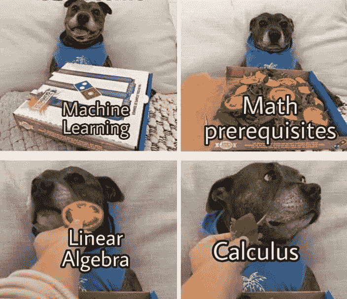
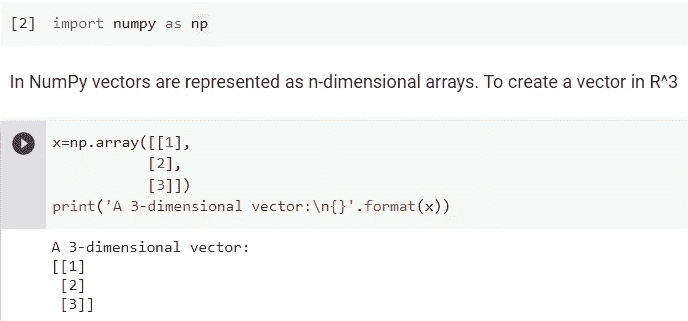
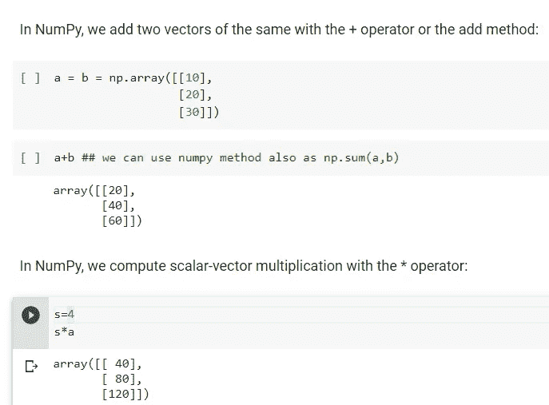
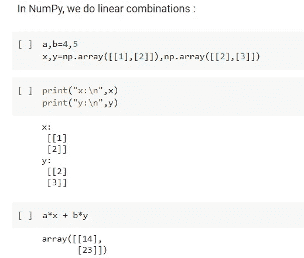
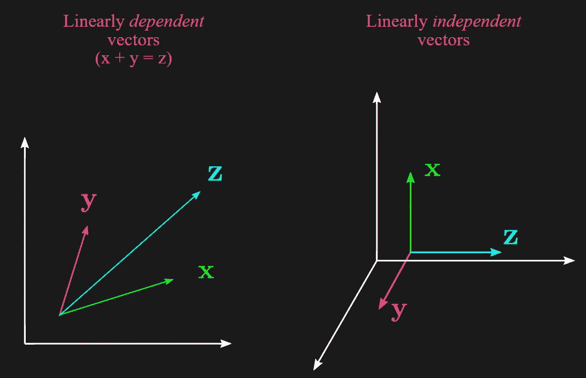
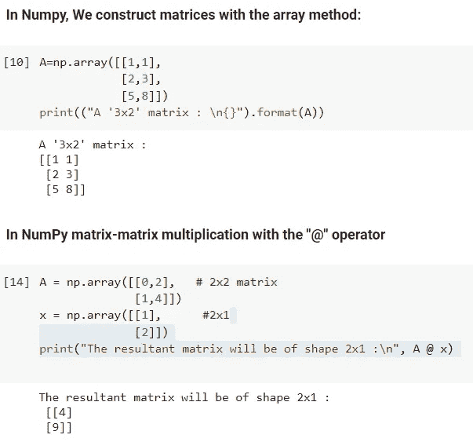
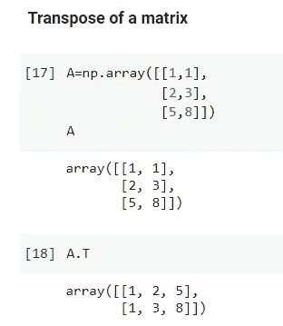

# 为什么《线性代数》很酷？？

> 原文：<https://medium.com/analytics-vidhya/why-linear-algebra-is-cool-3a07af267c?source=collection_archive---------6----------------------->

***线性代数*** 对于机器学习来说，就像面粉对于面包店一样:每个机器学习模型都是基于线性代数，就像每个蛋糕都是基于面粉一样(但 ML 模型不仅仅是线性代数，它们还需要微积分、概率和优化)。

## **为什么是线性代数？？**

线性代数通过使用矩阵和向量，允许我们以更有效的方式执行大量计算，同时在线性代数库(如 NumPy)的帮助下使用更简单的代码。线性代数通过数学关系将变量(因变量、自变量和目标变量)联系起来。

## 向量

向量是有序的有限数字列表。它是一种数学对象，我们可以在其中执行数学运算，以获得另一个同类对象(向量)。向量是矩阵的一种特殊情况，即只有 1 列，即**(m×1)**矩阵，也称为列向量。我们可以把一个 ***矩阵*** 想象成一组列向量或者行向量( **1 x n** 矩阵)。

我们可以用向量来表示实体的属性:年龄、平衡、性别、考试成绩等。按照惯例，我们用小写字母表示矢量。

这里，x 是一个 3 维向量，每个向量有 1 个元素，或者我们可以说它是一个 3×1 矩阵。因此，它是集合 **R^(3 x 1)** 或 **R** 的一个元素，因为它是一个向量。在 python 中，向量是 0 索引的，即向量中的第一个条目是第 0 个元素。

这个片段展示了我们如何从向量中获得乐趣(执行不同的操作)。例如 a+b 导致 a 和 b 向量的求和。这里的“*”(乘法运算符)产生标量与向量的乘积。

我们可以把线性组合看作是数学运算“加”和“乘”与向量的合成组合。即 ax+by=a[x1，x2]+b[y1，y2]=[[ax1+ax2 ] [by1+by2]]，其中 x 和 y 是具有相应元素的向量。

## 线性相关和线性独立

如果一个集合中至少有一个向量可以作为其他向量的线性组合来获得，那么这个集合就是线性相关的。换句话说，一组向量 **{v1，v2，...，vk}** 是 ***线性依赖*** 如果存在数 **x1，x2，x3，…xk，**不全等于 0，则在方程 **x1.v1+x2.v2+ +xk.vk=0** 。

如果没有一个向量可以作为其他向量的线性组合而获得，则称一个向量集是线性无关的。换句话说，如果向量方程 **x1.v1+x2.v2+ +xk.vk=0** 有一个平凡解即 **x1=x2=x3=…，那么向量集合 **{v1，v2，…，vk}** 就是 ***线性无关*** 。=xk**

线性相关向量包含**冗余信息**，而线性无关向量不包含。

## 矩阵

在机器学习中，矩阵和向量一样重要。矩阵是数字的矩形阵列。方括号中的数字。这是一个由行和列组成的二维数组。

有了向量，我们可以将单个变量表示为一组数字或对象。有了矩阵，我们可以表示变量或向量的集合。

使用矩阵-矩阵乘法，第一个矩阵**“A”**中的列数必须等于第二个矩阵**“x”**中的行数。合成矩阵的形状为**(矩阵“A”的行和矩阵“x”的列)。**

## **矩阵转置**

对矩阵进行转置意味着矩阵的行变成了列。这样，矩阵 a 的第一行变成了 **A^T** 的第一列(矩阵 a 的转置)，矩阵 a 的第二行变成了 A^T.的第二列这样，如果矩阵 a 是一个 **mxn** 矩阵，那么它的转置，或者说 A^T，就是一个 **nxm** 矩阵。

考虑一个矩阵 **A∈R *** 。a 的转置记为(A^T)∈R *。

换句话说，我们通过按 a 的行交换列来得到(A^T)

感谢阅读！！🙂

## 参考

为[3 蓝色 1 棕色 https://www.youtube.com/playlist?讲解线性代数的本质 list = plzhqobowt qd D3 mizm 2 xvfitgf 8 he _ ab](https://www.youtube.com/playlist?list=PLZHQObOWTQDPD3MizzM2xVFitgF8hE_ab)

应用线性代数导论——向量、矩阵和最小二乘法[http://vmls-book.stanford.edu/](http://vmls-book.stanford.edu/)