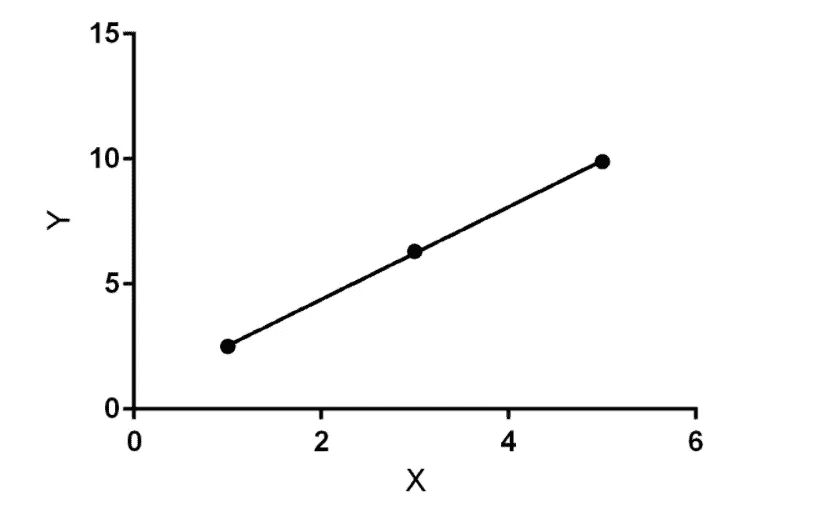
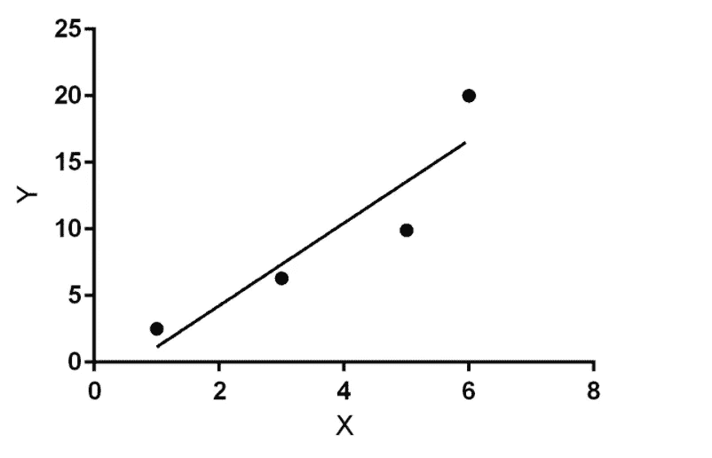

# 为什么线性回归不适合分类？

> 原文：<https://medium.com/analytics-vidhya/why-linear-regression-is-not-suitable-for-classification-cd724dd61cb8?source=collection_archive---------2----------------------->

你有没有想过为什么每个问题都有不同的算法？让我们考虑一个简单的线性回归和逻辑回归的例子。

有两点可以解释为什么线性回归不适合分类。第一个是线性回归处理连续值，而分类问题要求离散值。

第二个问题是关于当增加新的数据点时阈值的移动。让我们举一个简单的线性回归的例子，并拟合一条线。下图显示了最佳拟合线。为了使解释更加简单，让我们以医疗保健中的分类问题为例。基本上，我们这里的目的是对一个人是否生病进行分类。

从技术上讲，线性回归的假设函数也可以用于逻辑回归，但有一个问题。

*作者图片*

上图显示了给定点的最佳拟合线。这是一个简单的例子，真实世界的数据从来没有这么简单。因此，当我们向该数据集添加另一个点时，我们的最佳拟合线会移动以拟合该点。因此这条线变成了这样

*作者图片*

因此，根据我们的例子，如果我们必须对一个人是否生病进行分类，这种方法根本不可靠，因为我们在逻辑回归中使用了 sigmoid 函数。如果在线中有偏移，那么用于分类示例的最小阈值改变。因此，在开始时，阈值可能是 0.5，但是在增加几个数据点之后，该值可能是 0.8。所以模型的准确性在这里受到了打击。此外，在医疗保健等领域部署这种不稳定的模型并不太好，可能会产生可怕的后果。

因此，为了避免这种情况，我们使用一种称为逻辑回归的算法，这是一种二元分类算法，可以跳过这些阻碍线性回归分类的实际问题。

与线性回归不同，逻辑回归处理离散值，即使添加了新的数据点，也能保持阈值。