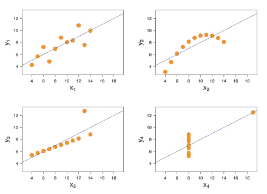

# 为什么线性回归有效？

> 原文：<https://medium.com/analytics-vidhya/why-linear-regression-works-ad52a9e3de6d?source=collection_archive---------21----------------------->

你有没有想过为什么梯度下降会达到一个最终的结果？看看下面！

如果你学过线性回归，你肯定已经见过梯度下降的概念，以及我们所说的成本函数。

嗯，最小化代价函数无非就是线性回归算法的**主要目标**而已。但是你有没有想过是什么让我们保证梯度下降会收敛？这是数学发挥作用的时刻！

首先，我们来看看我们想要最小化的(成本)函数:

成本函数定义。(h(x)这里是假设函数

现在，将我们的目标转化为数学语言，我们想要确定函数是否有一个**全局最小值**。换句话说，我们想回答我们的算法是否真的会收敛。

剧透:这个问题的答案是肯定的，它会收敛。原因是成本函数是一个非常特殊的函数，叫做凸函数

# 凸函数

让我们深入一下凸函数的定义。

尽管这看起来很复杂，而且有悖直觉，但我们可以粗略地说，凸函数是一个具有“钟形”图形的函数。看看旁边的例子:

**OBS:凸函数的一个重要性质是，凸函数的每个局部极小值也是全局极小值。**

也就是说，如果我们证明成本函数有一个局部最小值，我们知道它也有一个全局最小值

为了展示这个结果，让我们引入一个新的(简单的)概念和一个先前的命题:

# 仿射函数和凸性

在所有这些定义、命题和证明之后，我们将达到我们的最终目标

# **成本函数是凸的**

下面我们可以看到证明:

# **结论**

我们最终证明了成本函数实际上有一个全局最小值，这允许我们正确地运行梯度下降，以便找到线性回归问题的最佳拟合方程。