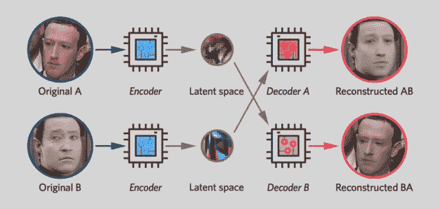
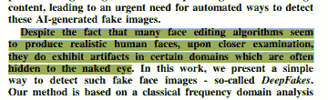
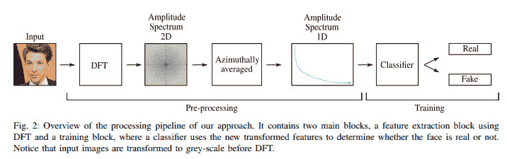

# 为什么我的 DeepFake 检测工作会远离深度学习

> 原文：<https://medium.com/analytics-vidhya/why-my-deepfake-detection-work-will-stay-away-from-deep-learning-151047d6419d?source=collection_archive---------8----------------------->

## 为什么我要做我正在做的事情

最近，我在 Deepfakes 检测方面有了新的研究成果。我对这个领域感兴趣有很多原因，其中一个主要原因是这里有很大的探索潜力。与客户细分、医疗系统分析或帕金森病检测(我之前的工作经验)等领域不同，参与规则非常混乱。

> 随着 DeepFakes 不断变化的性质，我们没有一个真正的代表性数据集可供我分析。

人们找到了制造 DeepFake 的新方法，这将摆脱检测算法。更多类型的视频(尤其是随着世界越来越数字化)和格式的增加进一步搅浑了水。因此，我需要我的研究能够扩展到大量发行版(DeepFakes 的类型)，即使它们是使用新技术创建的。我需要确保我的解决方案不是超级昂贵的，否则，我的解决方案将是无用的。*那么这些与避免深度伪造有什么关系呢*？为了理解这一点，首先让我们谈谈我的工作是什么，以及我如何看待人们使用我的解决方案。

它们被创造出来的方式之一。其他的包括 CNN 和 GANS

# 我的想法是什么？

一定要喜欢，评论和 sub。反馈确实帮助了❤

看左边的视频，深入了解想法(TL；如果你忙的话，就在下一段。这是关于我为验证我的直觉所做的研究。这是我对相关研究的介绍，也是对这个想法的一个非常简要的概述。我最初用这个汇编在我大学的 RIR(环内研究)讲座上发表演讲，在那里人们可以提出新的想法和发现。我现在的工作是那次演讲和我的幻灯片汇编的直接结果。幻灯片链接到[这里](https://docs.google.com/presentation/d/1GCyIGM_7KyjrEpRosMb0q-dHDjj5O5kQ4AvPRuHJ5ZE/edit#slide=id.p)。当有新的信息出现时，我会更新幻灯片。

对于那些没有兴趣看完整部电影的人，我会给你们一个 TL；博士简单来说，我的想法是拍摄一幅图像，并在其上运行各种取证分析/特征提取/下采样算法。其输出将是一组经过缩减采样的图像，其中某些特征会被突出显示。我们使用这些图像作为分类器的输入，来识别某个东西是否是可能的 DeepFake。使用缩减像素采样的图像要便宜得多(即使我们有更多的图像要运行),怀疑这是否可行？我们喘口气，因为

我的幻灯片中的许多宝石之一。

可以检测到伪像。因此，我们应该能够使用它们的组合来检查一个图像是否是一个深度伪造的。但是现在你点击这个视频的原因是:“ ***为什么反对深度学习？*** “简单来说，它太贵了，在很多情况下无法扩展。想要更多吗？请继续阅读。我们也有人用类似的方法取得了成果，例如:

# 你会在哪里看到 DeepFakes(最有可能)？

推特、脸书和其他社交媒体。所有这些网站每天都在以**数百张** **百万张图片的规模运营。仅 FB 每天就有 2.5 亿张图片上传。**

# 那又怎样？

如果我们对上传的每张图片运行昂贵的深度学习算法，我们将非常非常快地使服务器崩溃。虽然 90%以上的准确性很重要，但我们的解决方案需要在其应用的环境中有用，而不是孤立的实验室/笔记本电脑/云。那是我的目标。我打算建造一个高性价比的过滤器。可以检查出大多数图像的东西(这样我们就可以对需要它的图像运行更精确、更重的检测器)。同样重要的是，我们要减少假阴性的数量。下面的视频总结了这篇文章(以及为什么我将重点放在减少假阴性上)。这个视频更深入地探讨了我的方法的哲学，以及我在假阴性后的一些想法。

我这边大概就是这样。一如既往，请在下面的评论中分享你的想法。我很想获得更多关于我的研究和想法的观点。跟着我到这里来跟上我的工作。分享给任何可能感兴趣的人。以下是你可以联系到我的所有地方。和平。

# 向我伸出手

请在下面留下您对这篇文章的反馈。如果这对你有用，请分享并跟我来这里。

查看我在 Medium 上的其他文章。:[https://rb.gy/zn1aiu](https://rb.gy/oaojch)

我的 YouTube。这是一个正在进行中的工作哈哈:[https://rb.gy/88iwdd](https://rb.gy/88iwdd)

在 LinkedIn 上联系我。我们来连线:[https://rb.gy/m5ok2y](https://rb.gy/f7ltuj)

我的推特:[https://twitter.com/Machine01776819](https://twitter.com/Machine01776819)

我的子任务:[https://devanshacc.substack.com/](https://devanshacc.substack.com/)

如果你想和我一起工作，请发邮件给我:devanshverma425@gmail.com

twitch 现场对话:[https://rb.gy/zlhk9y](https://rb.gy/zlhk9y)

获取我的内容更新-insta gram:[https://rb.gy/gmvuy9](https://rb.gy/gmvuy9)

在罗宾汉上获得免费股票:【https://join.robinhood.com/fnud75 