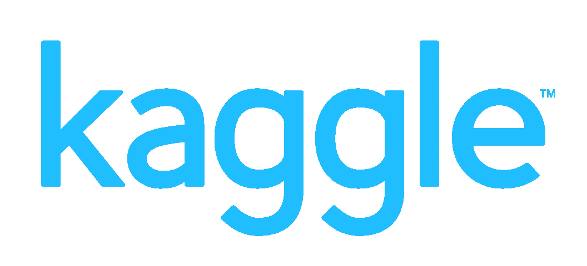
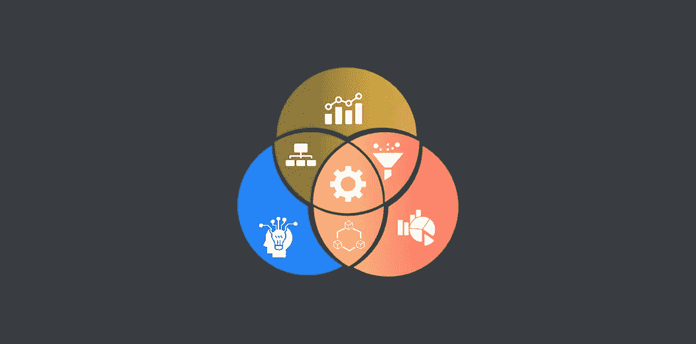
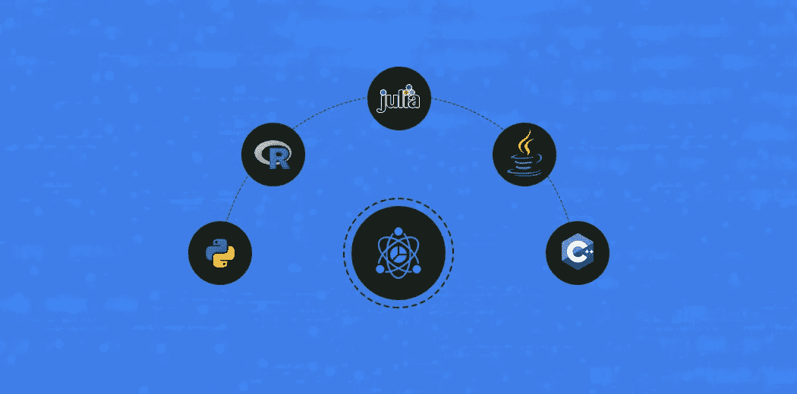

# 为什么编程对数据科学至关重要

> 原文：<https://medium.com/analytics-vidhya/why-programming-is-essential-for-data-science-e2e15c9f24ac?source=collection_archive---------30----------------------->

# 介绍

我毕业于德里大学，获得了商业学士学位，并决定以数据科学为职业。在我学习旅程的前三个月，我学习了基础编程，我很快就从那里跳了出来，没有注意到任何实践。称之为我的无知或学习算法和建立模型的兴奋，我对这个数据的决定感到遗憾。

从长远来看，我仅仅因为擅长基本编程而节省的时间可能是不可估量的。

是的。你完全没听错。要成为一名数据科学家，你不需要有核心的编程技能。真正擅长基本技能会在你可能没有想到的方面帮助你。

因此，在本文中，我们将详细探讨编程在数据科学中扮演的角色。如果你是从非编程背景过渡到数据科学的，就不要再搜索了。

***数据科学已经成为当今最著名和最受欢迎的职业选择之一。推荐你去看看我们的*** [***认证 AI & ML 黑带加速***](https://blackbelt.analyticsvidhya.com/accelerate?utm_source=the-valuable-role-of-programming-in-data-science&utm_medium=medium&utm_campaign=bb-accelerate) ***计划，开始你的数据科学之旅。***

# 目录

1.  现实生活场景
2.  Kaggle 竞赛代码解释
3.  数据科学学习之旅
4.  数据科学应该擅长编程的哪个方面？
5.  编程在数据科学生命周期中的作用
6.  数据科学编程语言

# 现实生活场景

让我们来看几个数据科学家经历的真实场景，在这些场景中，良好的编程技能可以为您节省大量时间。

## 场景 1 —纸牌比赛

假设你正在参加一个 Kaggle 竞赛，有一个非常大的数据集，需要 30 天的时间来完成。在这里，你的编程技能不仅将决定你是否完成并提交你的模型，而且你的工作质量也将取决于你的编程技能有多好。

通常，您需要学习、理解和实现一些新的代码，这些代码很复杂，但在清理如此庞大的数据时却很有效。现在，如果你没有能力理解代码语法，你要么错过最后期限，要么只能做基本的清理工作，创建一个低于标准的模型，这不会给你带来任何奖牌。

实践是超越编程技能的关键。

## 场景 2 —数据科学学习之旅

假设，像我一样，你跳过了初始阶段，开始学习使用像 SVM 这样的高级机器学习算法来创建模型。这些算法需要执行多次循环等等！

现在，如果您的编程技能在这个阶段还不太好，那么您很有可能无法理解每一步的含义，并且肯定会阻碍您的旅程。

# 数据科学应该擅长编程的哪个方面？

我之前说过，一个从非编程背景过渡到数据科学的人，应该擅长编程的基本任务。让我们来看看这些任务-

## 1.构造条件语句

这是数据科学家应该知道的最简单也是最基本的编程技巧之一。这个简单的陈述在破解和分析我们自己的数据时有巨大的应用价值。

使用条件语句的一个实际例子是，一位人力资源经理试图根据一名员工的年度绩效指标来确定他是否有资格获得晋升。假设基准分数是 75。因此，人力资源可以很容易地使用条件语句，将得分为 75+的员工分为符合晋升条件的员工和不符合晋升条件的员工。

## 2.循环结构

这些代码行帮助您命令您的语言执行重复的任务，而无需您在每次任务必须重复时手动键入代码。

例如，如果您想命令您的语言打印 1000 次“Larry 是一个好玩家”，您只需使用一个循环结构(确切地说是 loop)来打印该语句 1000 次。

## 3.功能

这是编程中最容易被忽视却又最重要的方面。尽管为了执行各种功能，有预定义的库来解决问题，但在许多情况下，您需要定义自己的函数来有效地执行该功能。

例如，假设在模型构建的多个步骤中，您需要添加一个数字(比如说— 5)，然后将它与前面代码行的结果相乘。您不必重复编写多行代码，只需每次传递一行函数。

## 4.数据结构

数据结构是你编程时所围绕的构造。不同的数据结构帮助您以特定的方式存储不同类型的数据。你需要很好理解的突出的数据结构包括

## 5.索引数据帧

一旦您将数据导入到您的编程语言中，您将被要求只对数据的某一部分进行切片和检查。否则，您将需要对具有特定变量值的数据进行索引。

例如，您在一家医院工作，您需要目前处于癌症第二阶段的所有患者的数据。

***我们的*** [***认证 AI & ML 黑带加速***](https://blackbelt.analyticsvidhya.com/accelerate?utm_source=the-valuable-role-of-programming-in-data-science&utm_medium=medium&utm_campaign=bb-accelerate) ***教你所有你需要的编程，每个阶段都需要必要的一对一指导。***

# 编程在数据科学生命周期中的作用

## 1.数据析取

一旦你确定了目标，你需要收集相关的数据。要么必须从本地系统导入数据，要么必须从组织的数据库中检索数据。在这两种情况下，您都需要编码。从数据库中提取数据所需的编程技巧比前一项活动更具技术性。

## 2.数据清理

干净的数据对于您的模型理解数据的规则和创建最好的模型是绝对必要的。识别和输入缺失值、变量转换、创建多个循环以及定义函数是一些需要您编写代码的常见活动。

## 3.数据可视化

在您创建模型之前，主要的工作是理解数据的每一个变量。你将被要求单独可视化它们以检查分布，另外你还需要比较 2 个变量以检查它们是否有关系。

此外，你经常需要做复杂的可视化，良好的编程技能会大有帮助。

# 数据科学编程语言

随着数据科学的发展越来越快，已经开发了无数的编程语言。让我们来看看最突出的几个。一些最著名的语言包括-

我推荐 Python 作为开始的语言。它是数据科学社区中最流行的编程语言。从课程到数据科学竞赛，数据科学领域的大部分活动都围绕 Python 展开。

Python 是一种通用的高级解释语言，在数据科学、web 开发、快速应用程序开发等应用领域发展迅速。它的易用性和易学性无疑使初学者很容易适应。

要了解其他语言并选择适合自己的编程语言，我建议您阅读下面的文章

[*5 种流行的数据科学语言——你应该为你的职业选择哪一种？*](https://www.analyticsvidhya.com/blog/2020/10/5-popular-data-science-languages-career/)

# 结束注释

我希望你能理解，对于一个数据科学家来说，高效地完成任务，编程的概念是多么重要。更好的编程技能肯定会提供像数据科学这样的多学科领域所需的必要优势。

***快来看看我们的*** [***认证 AI&ML BlackBelt Accelerate***](https://blackbelt.analyticsvidhya.com/accelerate?utm_source=the-valuable-role-of-programming-in-data-science&utm_medium=medium&utm_campaign=bb-accelerate)***不仅擅长编程，还能学习数据科学，为行业做好准备。***

请在下面的评论中联系我们，如果你有任何疑问，请告诉我们。

您也可以在我们的移动应用程序上阅读这篇文章

*原载于 2021 年 2 月 22 日 https://www.analyticsvidhya.com***。**