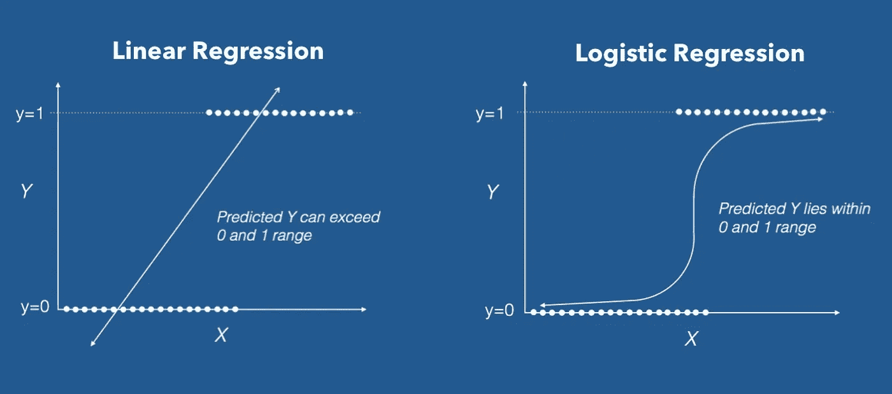
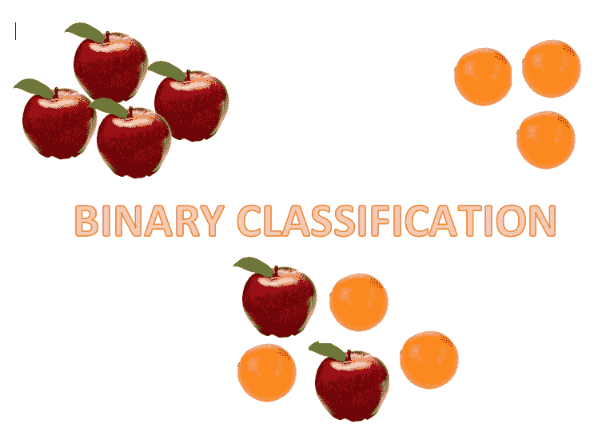
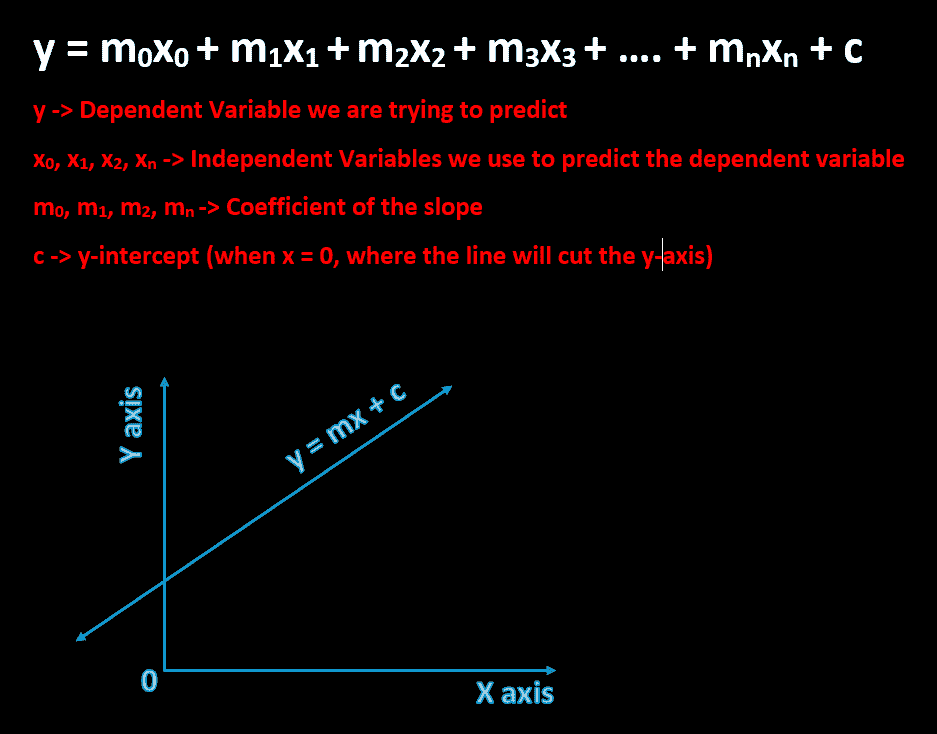
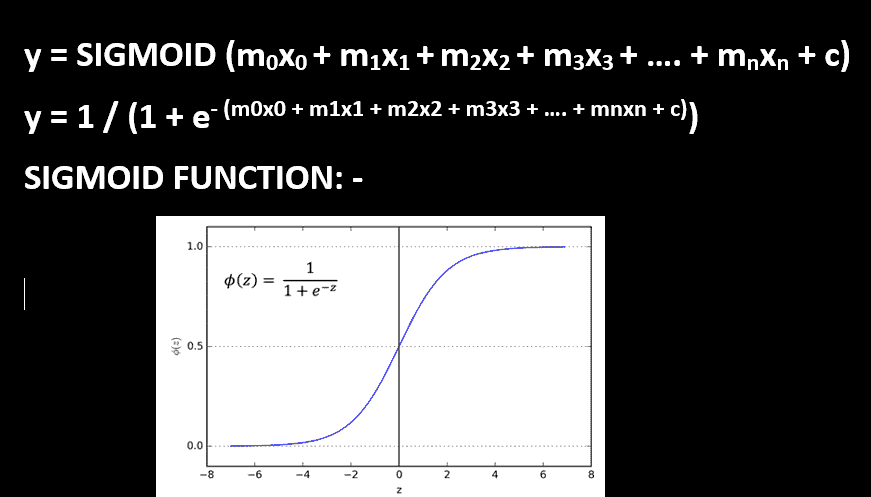

# 逻辑回归中为什么会出现“回归”？

> 原文：<https://medium.com/analytics-vidhya/why-regression-is-present-in-logistic-regression-8795755feb54?source=collection_archive---------2----------------------->

线性回归与逻辑回归([来源](https://rajputhimanshu.files.wordpress.com/2018/03/linear_vs_logistic_regression.jpg)

*我们大多数人都知道逻辑回归是一种* ***分类算法*** *！但是为什么里面会有'* ***回归*** *'这几个字呢？*

让我们从基础开始。

## 分类

它是将事物/项目归入一个类别的过程。当你端着水果盘时。你可以把所有的水果按名称、种类或大小分类。

分类可以是二元的，也可以是多类的。二元分类是只存在两个类别的地方。多类是指存在两个以上的类别。

二元分类

## 回归

回归有助于找出一个因变量与一个或多个自变量之间的关系。在回归中，值本质上是连续的。连续值的例子有身高、温度、体重等。

## 自变量对因变量

因变量是我们试图通过回归来预测的变量。自变量是我们用来预测因变量的变量。

使用自变量预测因变量

上图中显示的等式用于预测线性回归的结果。换句话说，应变量或目标值是使用独立变量或线性回归中的给定值来预测的。

现在我们知道，回归使用连续值(独立值或给定值)来预测一个连续变量(因变量或目标值)。**但是为什么在预测结果是离散的情况下，术语“回归”用于命名“分类算法”。**

## 为什么“回归”以逻辑回归的名义出现？

逻辑回归使用与线性回归相同的公式。公式是:-

*y = m0x0 + m1x1 +..+ c*

**不同的是，在预测最终结果之前，这个相同的公式通过逻辑回归中的 SIGMOID 函数。**

在逻辑回归中，sigmoid 函数提供概率[0，1]。现在，输出(y)是这样的，

如果 y >= 0.5，则 y = 1

如果 y <= 0.5，则 y = 0

逻辑回归中的 SIGMOID 函数

逻辑回归使用与线性回归相同的公式。但是，这个公式是通过逻辑回归中的 SIGMOID 函数传递的。如上图所示，sigmoid 函数使用连续值，并根据阈值条件预测输出。这就是我们如何在逻辑回归中得到一个离散值。

即使逻辑回归使用与线性回归相同的公式，它也是针对**确定结果**的概率。