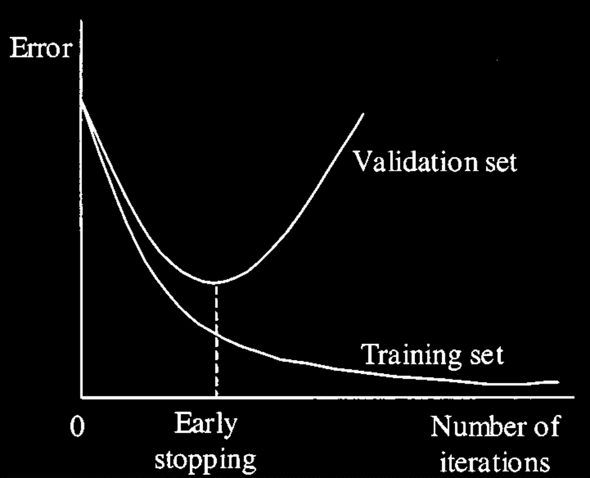

# 为什么要正规化？

> 原文：<https://medium.com/analytics-vidhya/why-regularization-a2ca00f8612c?source=collection_archive---------2----------------------->

本文将涵盖广泛使用的技术，以避免过度拟合。

深沉的风格

# 需要正规化？

深度神经网络由于其复杂性、大量的隐藏层而易于过度拟合，其中训练误差非常小，但是测试误差可能上升。

你可以参考这篇文章中的这个概念:

 [## 处理偏差和差异？

数字识别欠拟合和过拟合？](/analytics-vidhya/handle-bias-variance-ea01b9c166f3) 

正则化有助于模型更好地进行概化，从而更好地处理看不见的数据。正则化给学习算法引入了不确定性或随机性，它也简化了神经网络。一些正则化技术由于太大而惩罚权重度量，一些技术减少神经网络中隐藏单元的数量。

# 不同类型的正规化技术。

有不同类型的正则化技术对模型的影响非常不同。以下是其中的一些:

## L1 和 L2 正规化

使用 L1 正则化技术的回归模型被称为 ***套索回归*** ，使用 L2 的模型被称为 ***岭回归*** 。如果权重矩阵很大，L1 和 L2 正则化倾向于增加成本。我们将 L1 或 L2 的正则化部分添加到实际成本函数中。它惩罚大权重矩阵。

> ost =实际成本+调整项(L1 或 L2)。

> L1**或*拉索*或**

在这种情况下，正则化项将度量的绝对值添加到实际成本中(例如，二进制交叉熵)。

> *成本=实际成本+λ/2m*∫σ∨*W*∩

同样，如果*λ*为零，那么我们将得到实际成本，而一个非常大的值将使系数为零，因此它将欠拟合。压缩模型是有用的。它有助于将不太重要的功能推到零。它也有助于特征选择过程。

> L2 还是**死板**

这个正则化项将平方值添加到实际成本中，因为成本大而受到惩罚。

> 成本=实际成本+λ/2m∫σ∨W∸

这里，如果*λ*为零，那么你可以想象我们得到的是实际成本。然而，如果*λ*非常大，那么它将增加太多的重量，并且将导致装配不足。话虽如此，如何选择*λ*很重要。这种技术可以很好地避免过度拟合的问题。

## 拒绝传统社会的人

这是深度学习中使用最多的技术，并且产生了良好的结果。它减少了模型中隐藏层的数量，从而降低了模型的复杂性。

这背后的一般思想是，我们设置一些保留节点和删除节点的概率，让我们说 0.5 的保留和 0.5 的删除。这将从训练过程中随机排除节点。

随着每次迭代，基于保持节点的概率，一些不同的节点集被激活。这种技术给模型引入了随机性，从而减少了过度拟合的机会。

(a)不存在压差时,( b)实施压差时，防止过度拟合的压差。

当您认为某些层更容易过度拟合时，应该使用 Dropout。

## 提前停止

早期停止是一个监视验证错误以获得最适合数据的巧妙概念。在早期停止中，我们将训练数据分为训练和验证数据集，在每个时期我们交叉验证模型。每当模型向高方差移动时，它就停止进一步交互。这种停止取决于耐心变量(让我们假设耐心= 10)，也就是说，如果你想在 10 次类似的高方差迭代后停止。这种耐心是一个必须仔细选择的超参数。

可能会有这样的情况，模型在几个时期后开始执行得更好，但是我们将耐心设置为 10，所以它会停止，这就是为什么我们必须小心选择这个参数。

> 在计算机视觉这一跨学科的科学领域中，还有一种技术可以实现随机性，那就是数据扩充。在这种技术中，我们通过引入一些失真，如移动、翻转、缩放、旋转、亮度等，产生了与标记数据有些相似的图像。