# 为什么眼见为实？——贝叶斯观点！

> 原文：<https://medium.com/analytics-vidhya/why-seeing-is-not-believing-the-bayesian-perspective-c61876dc15fc?source=collection_archive---------7----------------------->

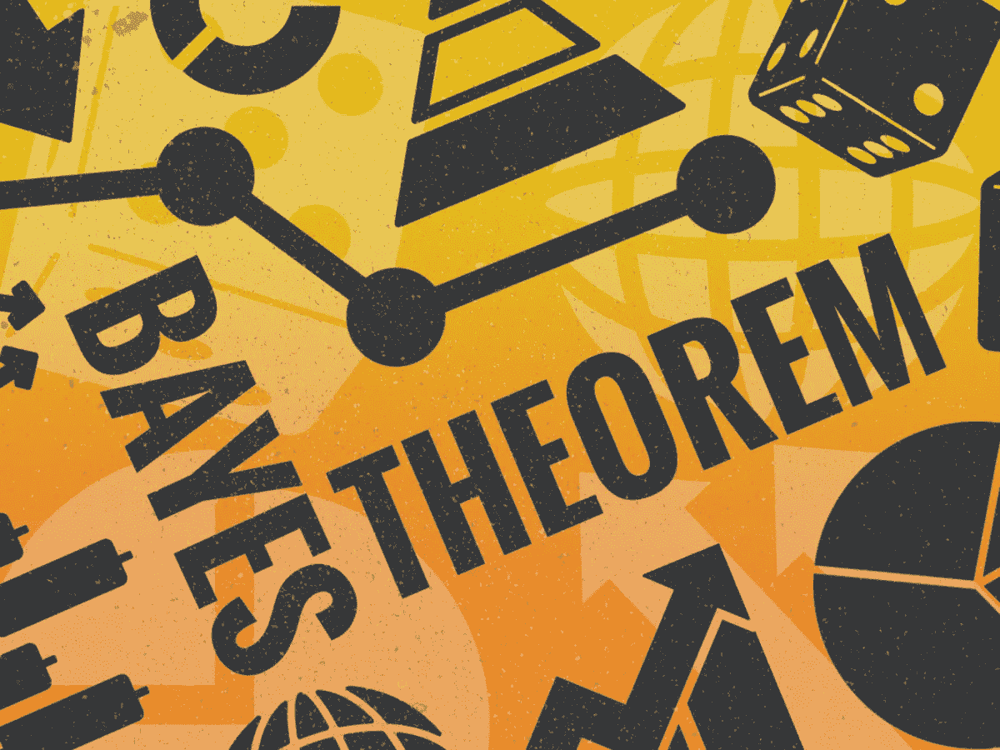

想象你在一个游戏节目中。你面前有三扇紧闭的门。一扇门后面有一辆车，另外两扇门有一只山羊。目标是尝试选择有车的门(当然！).你选一扇门。在揭示背后是什么之前，游戏节目主持人打开两扇紧闭的门之一，给你看一只山羊。他问你一个问题。

***“换还是留”？***

你可以选择留在你原来的选择或切换到另一个关闭的门。你会怎么做？

嗯，在我的脑海里，我在想，我已经选了一扇门，还有另一扇关着的门。汽车必须在这两扇门中的任何一扇门里。因此，不管我是换还是留，汽车在这两扇门中任何一扇门的概率是 50%。对吗？

不对！

你们大多数人可能都知道这一点，正如 ***天魔堂问题*** *(以游戏节目主持人命名)*。自己玩/模拟*《天魔堂游戏》*看看有什么管用的。[https://www.mathwarehouse.com/monty-hall-simulation-online/](https://www.mathwarehouse.com/monty-hall-simulation-online/)

你有没有注意到，改变原来的选择，实际上增加了你获胜的机会？这是为什么呢？保持这种想法！

在进入*&为什么*之前，让我们先了解一下*【什么】*。蒙蒂打开其中一扇紧闭的门后会发生什么？我们更新了我们对另外两扇门的看法，以现有的证据为基础。一个日常生活中的例子是，在我们找到证明/否定我们信念的证据后，改变我们先前对某事/某人的假设。这就是**贝叶斯定理**背后的直觉。

这是贝叶斯定理的公式

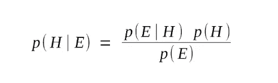

贝叶斯定理

假设 H 的 p(H|E) — **后验概率**，给定证据 E。这也可以被认为是“更新的信念”。

p(E|H) — **可能性**看证据 E，假设假设 H 为真。

p(H) — **在看到任何证据之前，假设 H 或原始信念的先验概率**。

p(E) —证据 E 的概率，不考虑假设是否成立。

让我们看一些例子。

***事件发生的概率***

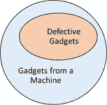

事件的概率

一些小玩意是从一台机器里生产出来的，其中有一些是次品。

*p(有缺陷)=有缺陷的小工具数量/生产的小工具总数*

那是直截了当的！

***某一事件的条件概率***

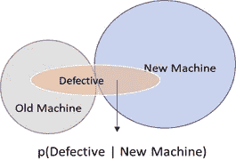

事件的条件概率

在上面的例子中，让我们假设这些小玩意是由两台不同的机器生产的，旧的和新的。

*p(次品|新机)=新机生产的次品数/新机生产的次品总数*

这也很直观。有两台机器，一台是旧的，另一台是新的，人们自然会认为新机器生产的产品缺陷较少。在生产线末端，如果随机发现一个有缺陷的小配件，它来自新机器的概率是多少？这可以使用贝叶斯定理来计算。

## ***贝叶斯定理***

从以前的实验中我们知道，旧机器和新机器的不良率分别是 20%和 8%。还有，让我们说新机器生产的小玩意比旧机器多三倍。假设新机器有缺陷，为了找出新机器生产随机配件的概率，我们应用了贝叶斯定理。

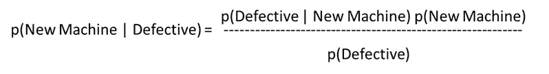

为了计算缺陷产品的概率，我们必须考虑新旧机器的缺陷产品。因此，我们将公式改写如下。

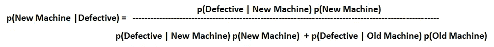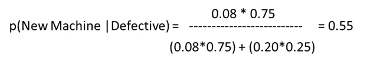

> 从新机器中随机生产出有缺陷的小配件的概率为 **55%** 。这说明了什么？根据给定的缺陷率，有可能超过一半的缺陷产品来自新机器，推翻了我们最初的假设，即新机器可能生产出缺陷较少的产品。

## ***贝叶斯定理的列联表***

如果真是那样，可能，只是有点混乱， ***应变表*** 就在这里为你解围。

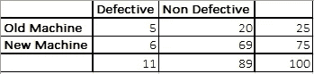

列联表——贝叶斯定理

让我们假设总共有 100 个小玩意由新旧机器一起生产。代入问题陈述中的值，我们将得到列联表(在左边)。

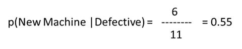

## 其他流行的例子——贝叶斯定理

*   收到的邮件是垃圾邮件的概率有多大？:- 如果我们知道 *p(垃圾邮件触发词)*， *p(垃圾邮件)*和 *p(垃圾邮件触发词|垃圾邮件)*，我们就可以求出一封新邮件是垃圾邮件的概率，给定一个垃圾邮件触发词的出现，即 ***p(垃圾邮件|垃圾邮件触发词)*** 。

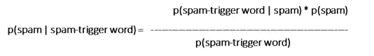

*   ***检测结果呈阳性就一定预示着癌症吗？:-*** 给定 *p(癌)*、 *p(阳性)*和 *p(阳性|癌)*，给定检测结果为阳性，或者 ***p(癌|阳性)*** ，可以求出某人患癌的概率。

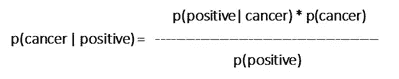

*   如果多云，会下雨吗？:- 在给定的季节/月份，知道了 *p(多云)*、 *p(雨)*和 *p(多云|雨)*，我们就可以计算出降雨的概率，给定天气是多云还是 ***p(雨|多云)*** 。

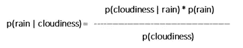

你明白了，对吗？

## ***回到天魔堂问题***

好吧！现在，我们知道什么是贝叶斯定理。这如何适用于我们最初的“蒙蒂霍尔问题”？我们一步一步来。

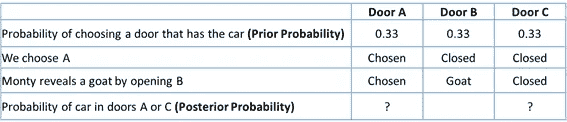

先验概率——贝叶斯定理

最初，所有的门都有相同的概率 0.33。在我们选择了门 A 之后，蒙蒂要做出选择。

1.  如果汽车在门 A 后面，蒙蒂选择门 B 或门 C 的概率相等，即 0.5。
2.  如果汽车在 B 后面，他只能选择 C，因为我们已经选择了 a。如果汽车在 C 后面，同样适用。因此，选择 B 或 C 的概率变为 1。

在这个例子中，我们假设 Monty 选择打开门 B。我们计算 Monty 打开门 B 的条件概率，假设每个门都有汽车。条件概率相加得出蒙蒂选择门 B 的概率或可能性。

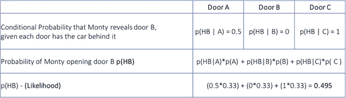

计算似然性——贝叶斯定理

有了新的证据或蒙蒂选择某一扇门的可能性，他改变了对另外两扇门的看法。门 A & C 的后验概率计算如下。

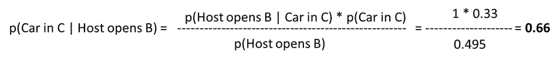

> 我们最初选择了门 a。在门 B 出现后，我们最初的假设是门 A&C 具有相同的概率 0.5。然而，在应用贝叶斯定理之后，利用关于主机选择特定门的概率的新信息，我们计算门 A 的后验概率为 0.33，门 C 的后验概率为 0.66。由此证明， ***切换更好！***

在这个场景中，蒙蒂知道汽车藏在哪个门的后面。如果蒙蒂不知道这些信息，会发生什么？这会改变后验概率吗？有什么想法吗？