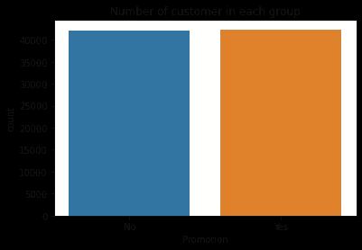
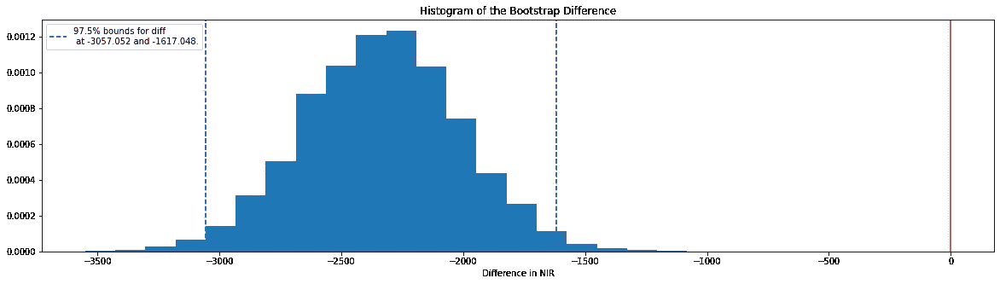

# 为什么你们公司要做 AB 测试？

> 原文：<https://medium.com/analytics-vidhya/why-should-your-company-do-an-ab-testing-88d42ec8337c?source=collection_archive---------2----------------------->

## 星巴克 A/B 逐步测试第一部分


照片由[赞·博伦](https://unsplash.com/@zanetb?utm_source=medium&utm_medium=referral)在 [Unsplash](https://unsplash.com?utm_source=medium&utm_medium=referral) 上拍摄

# **1。简介**

蓝色按钮在主页上效果更好还是橙色的更好？还是关于产品的图片多一点描述短一点还是图片少一点文字多一点好？新活动是否比旧活动吸引了更多的顾客，是否有利可图？这个问题和更多的其他问题将在这个项目中通过使用 AB 测试及其优势来解决。

A/B 测试(别名**分割测试**)是一种比较两个版本的方法，以找出哪个版本表现更好，例如广告文本、同一页面的两种布局、行动号召、两种不同的促销或营销渠道，以衡量行为/表现的差异。

## **A/B 测试对公司的优势**

I. A/B 测试对您的组织来说是一个有用的指导，可以规避不必要的风险，集中公司资源提高生产率和效率，无论是基于短期转换、长期客户忠诚度还是其他重要指标，都可以提高投资回报率。

二。A/B 测试收集的数据可用于更好地了解与客户相关的具体**特征**。这导致数据驱动的决策，因此将促销导向正确的公众将**优化预期收益**，而将它们发送给所有客户可能导致金钱损失。

三。A/B 测试可以增加销售额(例如，通过更多的客户转化)

四。导致跳出率降低

动词 （verb 的缩写）Betters 的客户参与度

不及物动词帮助组织为其客户生成更有意义的内容

七。推广/营销中的正确内容会为你的组织品牌培养信任和信心

# **2。任务描述**

在我们的星巴克用例任务中，我们想知道:

> 发送促销广告是否会增加销售额？

为此，我们将对两组进行 A/B 测试:控制组**和控制组**，我们将其命名为**组“A”**。这个对照组 A 不会得到任何提升/建议。**组“B”实验(治疗)组**将获得提升。这两组的唯一区别是我们想要测试的**变化**。

将客户分成两组并同时测试两个变量，确保两个变量在相同的条件下运行，并且没有其他因素(如假期或天气)对结果产生正面/负面影响。

AB 测试的另一个优点是，不仅可以识别想法是否可行，还可以根据度量标准检测这个想法是否有利可图。这种动态可以用星巴克的用例来说明，它表明星巴克在没有促销的情况下销售了 319 件商品，而在有促销的情况下，这个数字上升到 712 件。

问题是:

> "我们应该对所有顾客展开促销活动吗？"

第一个想法会是“是的，当然！该公司的销售额增加了一倍”。然而，如果我们考虑制作广告内容和发送广告的成本:我们会以同样的信念用“是”来回答同样的问题吗？因此，本项目的主要目的是用科学的方法回答上述问题，以得出贵公司提出的方法是否是增加销售额和销售量的正确方法的结论。

# **3。** **数据集**

该数据集由星巴克提供，最初用作求职者的带回家作业。该数据包含大约 120，000 个数据点，并且它被分成训练集和测试集(2:1)。

现在，让我们仔细看看我们拥有的数据集和列。


星巴克数据集

**ID** —客户 ID
**促销** —客户是否收到促销
**购买** —客户是否购买产品:1 或 0
**V1-V7** —关于客户的抽象特征。

实验背后的主要思想是检测广告促销是否对购买有显著影响。在我们的例子中，广告的目的是吸引更多的顾客以 10 美元的价格购买特定的产品。值得一提的是，发送促销信息需要花费 0.15 英镑。为此，顾客被分成两组，一组没有收到广告促销，另一组收到了。

总的来说，我们可以看到每组的客户数量几乎相同。



如果我们看一下柱状图，我们可以看到大约只有 1%的顾客进行了购买。


下一个问题是:促销对购买行为有积极影响吗？

事实上，下图显示，与非促销组相比，促销组的购买量更多。但是，这种差异有统计学意义吗？这个问题将在下一章回答。


每组的购买数量

# **4。**T21【不变性度量】

实验分析的第一步是检查*不变度量*。不变指标是指我们不期望统计显著性(组间无差异)的指标。检查不变性度量向我们显示，实验正在按照设置和预期运行。

在本实验中，衡量标准是非促销组(控制组)和促销组(治疗组)中的客户数量是否大致相同。如果我们检测到两组之间的统计差异，我们就不能进行评估。为什么？因为，在这种情况下，需要更深入的分析来检测组分配、偏差源或其他可能有影响的副作用的问题。

在本研究中，我将对分配到非促销组的客户比例做**双边假设**检验。治疗组没有必要重复测试，因为结果应该是一样的。

**分析法**

在我们的例子中，我们可以根据二项式分布计算 p 值:

-只有两个类别:晋升和非晋升
-观察的数量是固定的
-观察是独立的
-并且被分配到其中一个组的概率是相同的

但是，更常见的是根据大样本量(大于 30)和中心极限定理(即使原始分布不是正态分布，样本均值的抽样分布也将近似为正态分布)从正态分布计算 p 值。为了获得精确的 p 值，我们应用了“连续性校正”(在计算 z 值之前，将总计数减去或加上 0.5)。原因是我们用连续的正态分布来近似离散的二项式分布。更多信息见[此处](https://www.statisticshowto.com/what-is-the-continuity-correction-factor/)。

现在，我们可以看结果了。计算出的 p 值为 0.5。下一步是什么？定义统计显著性的阈值是至关重要的。如果我们的 p 值小于定义的显著性水平(α水平)，则该效应具有统计显著性(该效应不太可能是偶然发生的)，否则不是。按照惯例，统计水平的阈值是 5%或 0.05。但是，在某些情况下，该值可以/应该调整。我将在第 5 章“评估标准”中解释这个问题。

```
# get number of trials and number of promotions
n_obs = train_data.shape[0]
n_control = train_data.groupby('Promotion').size()[0]# Compute a z-score and p-value
p = 0.5
sd = np.sqrt(p * (1-p) * n_obs)
z = ((n_control + 0.5) - p * n_obs) / sd
print(z)
print(2 * stats.norm.cdf(z))
```

我们的 p 值是 0.5，大于α水平，我们不能拒绝零假设。通过这种方式，分配到每个组的客户数量几乎相同。以便我们可以继续评估指标。

# **5。** **评估指标**

与不变指标相比，**评估指标**的期望是我们可以看到组之间的差异。这样我们就能证明我们的操作是成功的。该项目的目标是最大化以下指标:增量响应率(IRR)和净增量收入(NIR)。

## **5.1 公制描述**

**增量回复率**

> IRR 描述了与未接受促销相比，通过促销购买产品的客户数量增加了多少。


计算的基础是*处理*组(促销组)的购买数量的比率除以处理中的客户总数减去*控制*组(非促销组)的购买数量的比率减去控制组的客户总数。

**净增量收入(NIR)描述**

> “发送促销信息赚了(或赔了)多少钱”。


它是治疗组总购买次数的 10 倍减去发出的促销次数的 0.15 倍减去对照组购买次数的 10 倍。

## **5.2 阿尔法水平/显著性水平**

正如第 4 章**“不变性度量”**中提到的，科学家发现的最常见的 p 值是 p 值 5%。这个α水平是 I 型错误(错误地拒绝真的零假设)和 II 型错误(不能拒绝假的零假设)之间的良好平衡。

然而，由于我们的测试是基于多个指标的，我们应该意识到第一类错误。在多指标的情况下，观察罕见事件的机会增加了拒绝零假设的可能性，从而导致第一类错误。例如，假设您同时有 50 个 alpha 级别为 0.05 的测试。偶然看到至少一个有统计学意义的结果的概率是


这意味着，92 %我们可以观察到至少一个重要的结果。为了补偿这一点，我们需要对单个测试错误率使用一个校正因子，以便将整体错误率保持在期望的水平。

在这个项目中，我将使用 Bonferroni 校正——将总错误率除以比较次数(在我们的项目中，我们必须度量(IRR 和 NIR))。


## **5.3 引导**

为了处理评估指标的最后步骤，我将使用自举技术以及计算 p 值。*带替换的自举*背后的一般思想是通过从原始数据集生成新样本来估计采样分布。在此过程中，我们会创建与原始数据长度一样多的数据点。


**替换引导**

至关重要的是，实际收集的数据被视为人口。此外，我们不做任何关于原始人口分布的假设。

```
def bootstrapping (data, metric=True, c = .975, n_trials = 10000):
    """
    Compute a confidence interval for a quantile of a 
    dataset using a bootstrap method

    Input parameters:
        data:  pandas dataframe
        metric: str name of metric to use irr or nir
        c: confidence interval width
        n_trials: number of bootstrap samples to perform

    Output value:
        ci: Tuple indicating lower and upper bounds of bootstrapped
            confidence interval
        sample_metrics list of samples 
    """

    # initialize storage of bootstrapped sample quantiles
    n_points = data.shape[0] 
    sample_metrics = []

    # For each trial...
    for _ in range(n_trials):
        # draw a random sample from the data with replacement...
        sample = data.sample(n_points, replace = True)

        # compute the desired metric...
        if metric =="irr":
            sample_metric = calculate_irr(sample)

        if metric == "nir":
            sample_metric = calculate_nir(sample)

        # and add the value to the list of sampled quantiles
        sample_metrics.append(sample_metric)

    # Compute the confidence interval bounds
    lower_limit = np.percentile(sample_metrics, (1 - c)/2 * 100)
    upper_limit = np.percentile(sample_metrics, (1 + c)/2 * 100)

    return sample_metrics, lower_limit, upper_limit
```

## **5.4 IRR 指标的评估**


增量反应率(IRR)假设

从下面的图可以看出，治疗组的比例高于对照组(分布在零值的右侧)。另外，零差不在中间 97.5 %之间。这一事实提供了统计学上的证据，证明差异不是零。更重要的是，p 值为零，小于 alpha 级别。总之，我们拒绝零假设，我们可以证明 IRR 度量的统计显著性


## **5.5 NIR 指标的评估**


净增量收入(NIR)假设

现在，我们对 NIR 指标重复同样的操作。该图显示 NIR 值为负值(分布在零值的左侧)。此外，p 值为 0.99，高于 alpha 级别。在这种情况下，我们无法拒绝零假设，并且 NIR 度量没有统计学意义。



# **6。结论**

在这个项目中，我强调了 A/B 测试的作用和优势。此外，我已经一步一步地展示了如何评估/解释 A/B 测试的结果。

尽管我们在 IRR 指标上取得了统计显著性，但我们无法检测到 NIR 指标的改善。基于最大化这两个指标的目标，测试揭示了这样一个事实，特别是关于这种广告促销，向所有客户推出广告促销以增加利润是不划算的(ROI)。

**对公司的建议**:接下来的步骤一方面是评估广告促销的内容，尝试改进，使其对客户更有吸引力。另一方面，基于所收集的关于顾客的信息并使用机器学习技术，公司应该集中精力将促销/广告发送给那些更容易接受而不是所有顾客的人。

在我项目的第二部分，我会给出答案

> "如何识别目标受众并使利润最大化？"

关于 A/B 测试的更多信息，请点击这里查看我在 GitHub 上的代码