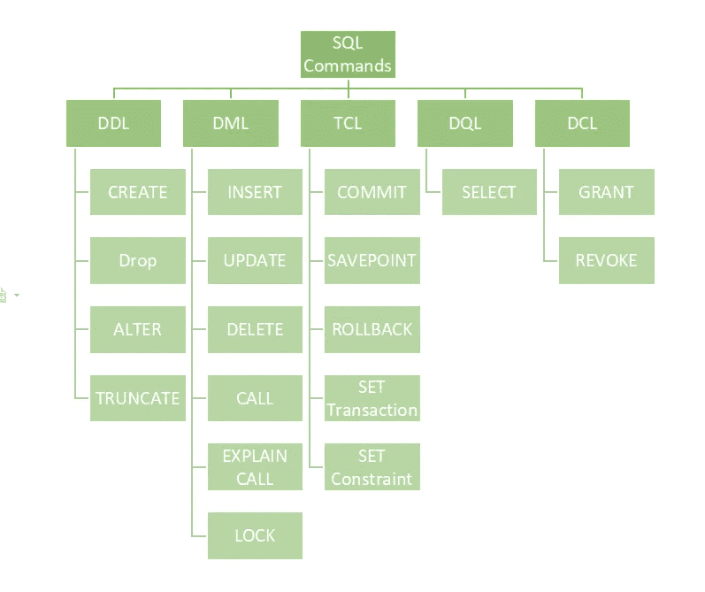
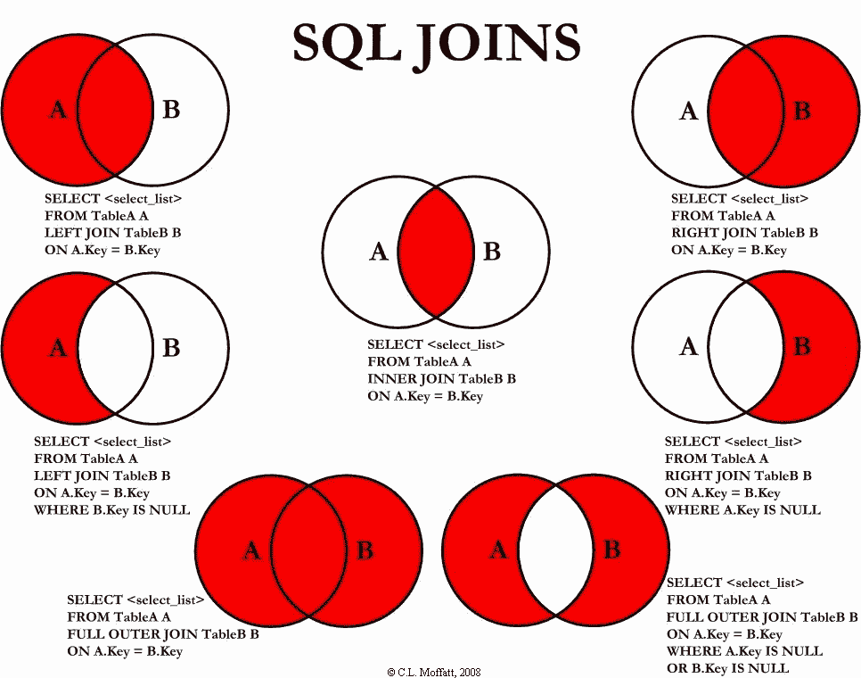

# 为什么使用 SQL，我们如何使用它？

> 原文：<https://medium.com/analytics-vidhya/why-sql-and-how-do-we-use-it-ec66f8f4338a?source=collection_archive---------2----------------------->

## SQL 在数据和业务专业人员中的重要性


安妮·斯普拉特在 [Unsplash](https://unsplash.com/?utm_source=unsplash&utm_medium=referral&utm_content=creditCopyText) 上的照片

SQL 或*结构化查询语言*是处理**关系数据库的标准语言。**大多数时候，SQL 被用来检索数据，更新表格，或者对数据库或表格的结构进行操作。

# 为什么重要？

世界上大部分的原始数据被组织在被称为关系数据库的表格集合中。这个世界的原始数据可以是网购记录、银行系统、图书管理系统、电子病历等等的数据。为了有效地从数据库中获取这些数据，需要知道如何使用 SQL。SQL 可以帮助从这些数据库中获取和提取数据。

几乎所有处理数据的专业人员都需要知道如何使用 SQL，例如数据库开发人员、数据工程师、数据分析师、商业智能、数据科学家以及其他在日常工作中与数据库交互的工作。

# **我们如何使用它？**

在跳到如何用 SQL 编写查询之前。最好了解一些 SQL 命令。

**命令描述**

**创建** - >在数据库中创建一个新表、一个表的视图或另一个对象。

**修改** - >修改一个现有的数据库对象，比如一个表。

**DROP** - >删除整个表格、表格的视图或数据库中的其他对象。

**选择** - >从一个或多个表格中检索某些记录。

**插入** - >创建记录。

**更新** - >修改一条记录。

**删除** - >删除一条记录。

这些 SQL 命令主要分为四类:

1.  数据定义语言
2.  DQl —数据查询语言
3.  DML —数据操作语言
4.  数据控制语言



图片由 [geeksforgeeks](https://www.geeksforgeeks.org/sql-ddl-dql-dml-dcl-tcl-commands/)

在这里，我将主要用 DDL 和 DML 解释一下 DQL，因为这些是我经常使用的命令类别。这些可能也是人们在开始学习 SQL 时最常用的命令类别。

**DDL** 用于**创建、修改和删除数据库结构，而不是数据。**数据库管理员和数据库开发人员可能会在日常工作中经常使用该命令类别。

**DML** 用于**存储、修改、检索、删除和更新数据库**中的数据。类似于 DDL，数据库管理员和数据库开发人员使用这个命令类别，但是不排除其他角色也可以使用这个命令，只要他们有权限这样做。

**DQL** 用于**对模式对象**内的数据执行查询。几乎所有的数据角色都使用这个命令类别——从数据库开发人员/工程师到商业智能和数据分析师。在 SELECT 语句中添加 FROM 或 WHERE 数据操纵器时， **DQL** 通常被视为 DML 的一部分。

如果你想知道更多关于这个和其他两个类别的信息，你可以访问 [SQL | DDL，DQL，DML，DCL 和 TCL 命令——GeeksforGeeks](https://www.geeksforgeeks.org/sql-ddl-dql-dml-dcl-tcl-commands/)！

在这里，我将向您解释在使用 SQL 查询数据时广泛使用的 DQL 子句。在此之前，让我们了解一下 **SQL 命令**和 **SQL 子句**的不同之处。假设一个查询作为一个语句。命令本身就是陈述。然而，为了有一个完整的陈述，我们需要有一个陈述的条件。这个条件就是子句。一旦语句完成，我们只需要执行这条语句就可以得到我们想要的东西。因此，我们应该使用 SQL 命令函数来实现这一点。在 DQL 的情况下，命令是 SELECT。

# DQL 和 DML 命令类别中的 SQL 子句:

以下是我个人在日常工作中使用的条款。

1.**截然不同的**

这用于仅从表中返回唯一值，因为一列通常包含许多重复值。

```
SELECT DISTINCT region_id, region_name
```

2.**来自**

这是 SELECT 语句中的一个**强制子句**，用于指定我们想要的数据表。例如，我们想知道数据中的区域列表。因此，我们需要使用 FROM 来指定国家表

```
SELECT DISTINCT region_id
**FROM** countries
```

2.**哪里有**

这允许您基于布尔表达式选择行。结果中只返回表达式计算结果为 TRUE 的行。以下面的例子为例，我们只需要回收百分比超过 50%的国家的数据。

```
SELECT country_id, recycling_percent
FROM treatment
**WHERE** recycling_percent > 50;
```

4.**分组依据**

这会将一个结果分组为子集，这些子集在一个或多个列中具有匹配值。我们通常将 GROUP BY 子句与聚合表达式结合使用。

```
SELECT years, item_category, sum(sales) as sales
FROM sales_store
WHERE order_status = "Finished" AND years = "2011"
**GROUP BY** years, item_category
--another way to write GROUP BY in here is ilke this GROUP BY 1,2
-- 1 and 2 is the selected column order in the SELECT statement
```

5.**拥有**

这限制了分组的结果。Having 子句实际上类似于 WHERE 子句，但是这个子句用于聚合列。

```
SELECT customer_id, customer_email, count(orders_id) AS num_orders
FROM orders
GROUP BY 1,2
**HAVING** count(orders_id) > 4
```

6.**排序依据**

这允许您指定行在结果集中出现的顺序。使用 Having 子句中的示例，我们希望首先看到订单数量最多的客户。

```
SELECT customer_id, customer_email, count(orders_id) AS num_orders
FROM orders
GROUP BY 1,2
HAVING count(orders_id) > 4
**ORDER BY** 3 DESC --use DESC so it is a descending order, ORDER BY default is an ascending order or ASC
```

7.**作**

这为每个列和表提供了一个别名。想象一下，如果你有一个很长的表名，或者你需要为聚集的列取一个新的名字，就像 Having 和 ORDER BY 中的例子一样，我们需要使用 AS 来使它简短易读。

```
SELECT customer_id, customer_email, count(orders_id) **AS** num_orders
FROM order_table_from_2011_updated_on_2019 **AS** orders
GROUP BY 1,2
HAVING count(orders_id) > 4
ORDER BY 3 DESC
```

8.**极限**

这用于设置我们将在结果中获得的最大行数的限制。例如，我们希望使用 ORDER BY 中的相同查询示例获得订单数量最多的前 5 名客户。

```
SELECT customer_id, customer_email, count(orders_id) AS num_orders
FROM orders
GROUP BY 1,2
HAVING count(orders_id) > 4
ORDER BY 3 DESC
**LIMIT** 5
```

9.**滤镜**

这是用于聚合函数的修饰符，用于限制聚合中使用的值。例如，我们想知道商店中每个类别的商品数量。

```
SELECT shop_id, 
       count(item_id) **FILTER** (category = 'Shoes') as num_shoes_item,      count(item_id) **FILTER** (category = 'Pants') as num_pants_item,
count(item_id) **FILTER** (category = 'T-shirt') as num_shirt_item
FROM orders
GROUP BY 1
HAVING count(orders_id) > 4
ORDER BY 3 DESC
LIMIT 5
```

10.**加入**

这用于根据两个或多个表之间的相关列来合并它们的行。我们可以在 SQL 中使用几种类型连接。



图片由谷歌提供

```
SELECT o.order_id, o.item_id. i.item_name, o.price, o.qty
FROM orders o
**LEFT JOIN** items i
**ON** o.item_id = i.item_id
LIMIT 10
```

11.**同**

这用于给子查询块命名。在 JOIN 子句中使用查询示例创建子查询的示例。

```
**WITH** items_info AS (SELECT item_id,item_name 
                    FROM items)SELECT order_id, o.item_id, i.item_name, price, qty
FROM orders
JOIN items_info
ON o.item_id = i.item_id
LIMIT 10
```

# 结论

如果你想从事数据领域的职业，了解并掌握 SQL 技能是必不可少的，因为你在工作场所要处理的数据不在电子表格中，就像你在 Kaggle 上参加比赛时得到的那样。所以，从现在开始学习吧！

我可能会在下一个故事中继续谈论 SQL，谈论当你还是学生或还没有找到工作时，你可以在哪里练习 SQL 技能。所以，敬请关注更多更新！！