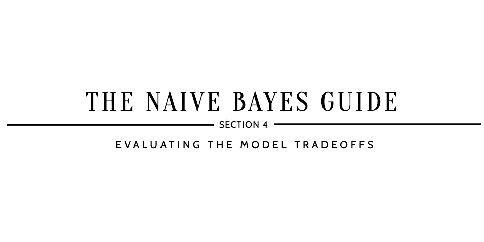

# 为什么要用朴素贝叶斯？

> 原文：<https://medium.com/analytics-vidhya/why-use-naive-bayes-a56cbae55181?source=collection_archive---------12----------------------->

## 朴素贝叶斯指南

## 第 4 部分:评估模型权衡

*参考* [***如何提高朴素贝叶斯？第 3 节:在继续…* 之前，在 Python**](https://kopaljain95.medium.com/how-to-improve-naive-bayes-9fa698e14cba) *中调优模型*

# A D V A N T A G E S

> Q1:朴素贝叶斯是一个简单的还是难以理解的分类器？

答案:简单

> Q2:朴素贝叶斯是一个可解释的分类器还是不是一个可解释的分类器？

答案:可解释

> ***Q3:朴素贝叶斯是快分类器还是慢分类器？***

答案:快

> ***Q4:朴素贝叶斯能否处理缺失数据或对缺失数据敏感？***

回答:处理缺失数据

> ***Q5:朴素贝叶斯的误差会随着特征数量的增加而增加吗？***

答案:没有维度的诅咒

> ***Q6:朴素贝叶斯是更容易过拟合还是不太容易过拟合？***

答案:不容易过度拟合

> ***Q7:朴素贝叶斯能否处理自变量之间的多重共线性或者对多重共线性敏感？***

回答:处理自变量中的多重共线性

# D I S A D V A N T A G E S

> ***Q8:朴素贝叶斯能解决线性问题还是非线性问题？***

答案:线性问题

> ***Q9:朴素贝叶斯能处理离群值还是对离群值敏感？***

回答:对异常值敏感

> ***Q10:朴素贝叶斯能否处理不平衡数据或者对不平衡数据敏感？***

答:对不平衡数据敏感