# 为什么我们以十为单位计数

> 原文：<https://medium.com/analytics-vidhya/why-we-count-in-tens-44a097141d8?source=collection_archive---------11----------------------->

# 以及理解数字计算的数字系统

Kolleen Gladden 在 [Unsplash](https://unsplash.com?utm_source=medium&utm_medium=referral) 上拍摄的照片

我们开始从 1 数到 10，然后大脑突然进入自动模式(当然是下意识的)，增加另一组 10 个数字的计数，即 11 到 20，21 到 30，等等。

如果你注意到，数字是一种普遍现象。他们不会改变。9 总是在 8 之后，13 总是在 14 之前，不管你用什么数字系统来表示它们。那为什么我们有这么多不同的数字系统？

仔细观察，你会发现不同的数系用不同的记法、符号或数字来表示相同的数字。所以所有的困惑都是关于如何表示一个特定的数字。数字本身总是不变的，与数字系统无关。

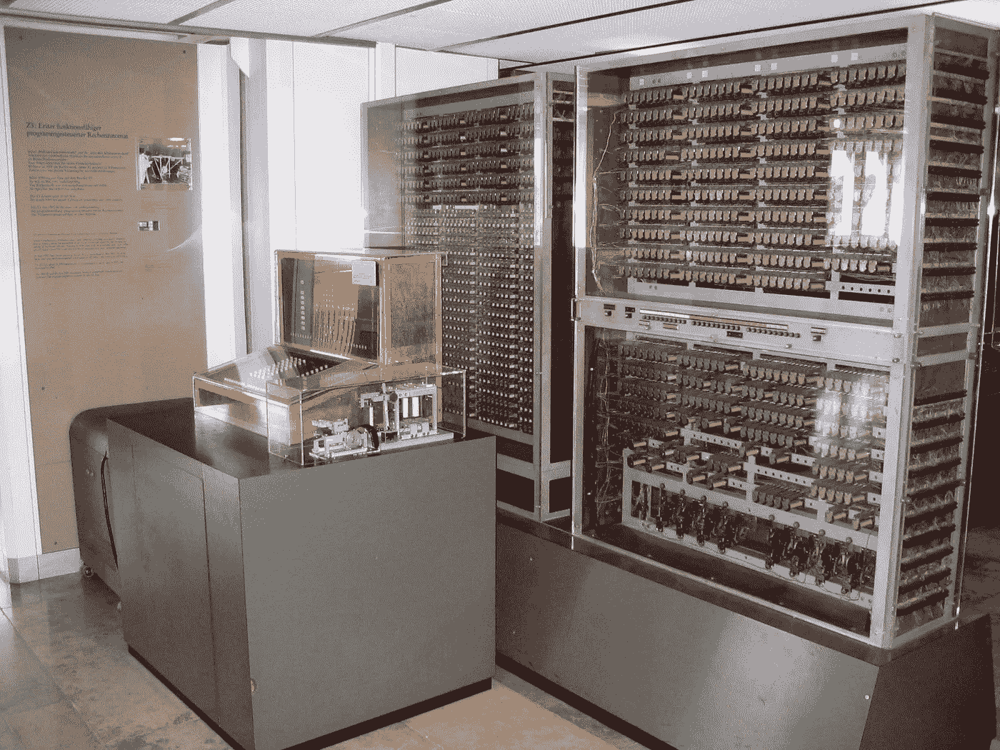

Zuse 的 Z3 的复制品，第一台全自动数字(机电)计算机。由金星人、CC BY-SA 3.0、【https://commons.wikimedia.org/w/index.php?curid=3632073 

自从电信号出现在计算机中，计算机就开始用 0 和 1 来思考。他们仅从这两个数字(0 和 1)的存储库中创建所有的数字。因此，他们有一个基于两位数的数字系统，所以基数是 2。由于计算现在是基于这两个**数字**，因此现在的计算机是**数字**计算机。

# 数字系统

最常用的数字系统是印度-阿拉伯数字系统。这是我们在日常生活中用于计数、计算和数学运算的数字系统。

印度第一颗卫星以阿耶波多命名。作者:[https://imagine . gsfc . NASA . gov/science/toolbox/missions/aryabhata . html，](https://imagine.gsfc.nasa.gov/science/toolbox/missions/aryabhata.html,)公共领域，[https://commons.wikimedia.org/w/index.php?curid=10082533](https://commons.wikimedia.org/w/index.php?curid=10082533)

相隔一个世纪的两位印度数学家，阿耶波多(公元 476-550 年)和布拉马古塔(公元 598 年-公元 668 年)。阿耶波多发展了位值记数系统，婆罗门教引入了零的符号。这个数字系统连同由印度教徒发展的零的概念通过商业和军事活动传播到附近地区。商人开始使用这个系统进行交易，因为它更简单、更科学、更稳定。它从阿拉伯传到欧洲，他们稍微修改了一下符号，开始称之为阿拉伯数字。它们非常类似于梵文-梵文数字符号，仍然在印度和尼泊尔使用。

但这并不是唯一在使用的数字系统。各种文明在这方面做出了贡献，并有自己的数字系统和不同的符号。他们都可以分为两大类。

1.  符号值符号
2.  位置值符号

## 符号值符号

顾名思义，这些数字有“符号”，那些符号有“值”。

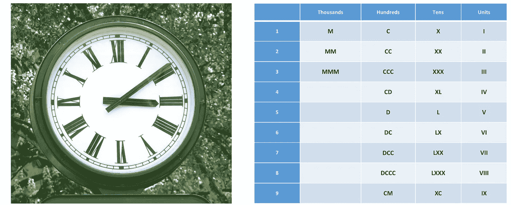

一个典型的钟面与罗马数字在德国巴德萨尔兹德特富特。BY juergen——由 juergen 制作，CC BY-SA 3.0，[https://commons.wikimedia.org/w/index.php?curid=832860](https://commons.wikimedia.org/w/index.php?curid=832860)

在符号值记法中，符号代表值，加在一起等于所代表的数。罗马数字就是这样一个例子。在罗马数字中，CCLVII 表示 257 (100+100+50+5+1+1)。

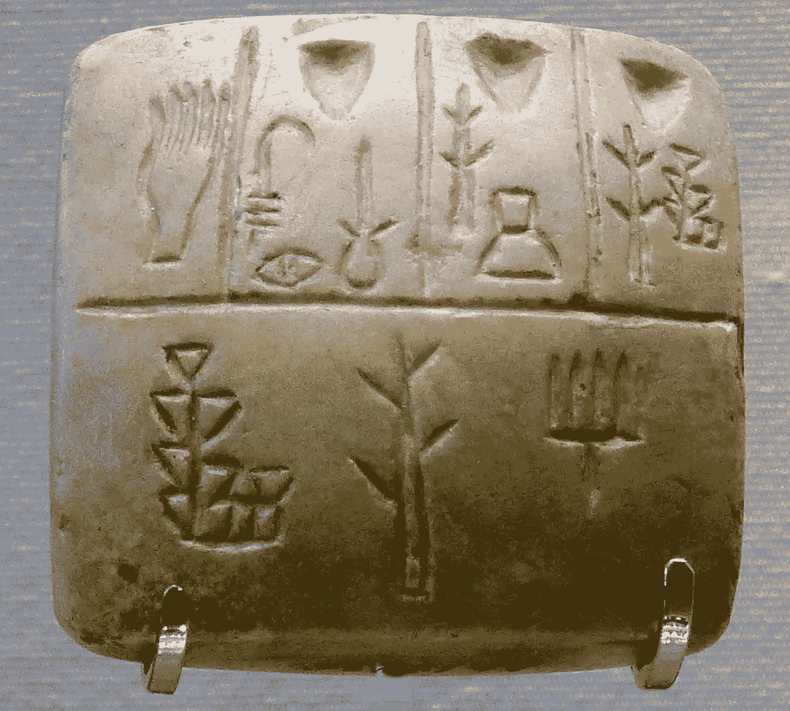

有原始楔形文字象形文字的石碑(公元前 4000 年底)，乌鲁克三世。由 MbztOwn 工作，CC 由 3.0，【https://commons.wikimedia.org/w/index.php?curid=25834613】T2

符号值系统现在可能看起来很麻烦，因为我们已经习惯了更有效的数字系统，但是它们是人类走向数字的第一步。让我们通过这个古老的故事来理解这一点。

部落想要数他们的羊，并且记录部落中不同人拥有的羊的数量。他们在一个泥板上做了一个像羊一样的雕像来展示一只羊，两个羊的形象展示了两只羊。但是后来有一个人带着 24 只羊来了，不可能像以前那样通过标记羊的数字来记录他的数量。所以他们创造了另一个代表 10 只羊的符号(为什么是 10 只？我们肯定会回答这个问题)。同样，当羊群的数量不断增加时，他们不断发明新的符号来代表 50 只羊、100 只羊等等。这可能是第一个用作数字的符号值符号，大约在公元前 4500 到 400 年的美索不达米亚文明(今天的伊拉克-叙利亚-伊朗地区)。

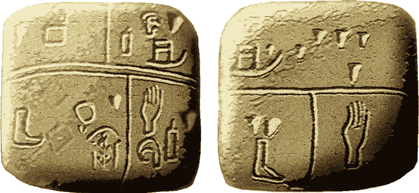

来自苏美尔的带有象形文字的石灰岩石板；可能是已知最早的文字，公元前 3500 年。阿什莫尔博物馆。作者 josé-Manuel Benito——自己的作品，公共领域，[https://commons.wikimedia.org/w/index.php?curid=944897](https://commons.wikimedia.org/w/index.php?curid=944897)

现在看完这个，有这样的做法听起来才合乎逻辑。但是随着全球人类的不断进化，他们的智力需求也在不断进化，数字系统也是如此。

## 位置值表示法(也称为位置表示法)

顾名思义，数字符号的“位置”决定了它的“值”。让我们看两个例子。

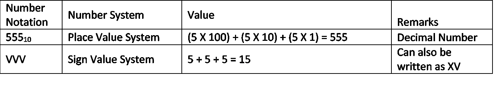

在位置值系统中，有不同基数的数字系统，我们将很快对此进行研究。但是让我们先了解一下**基地**是什么。**基数**只不过是一个特定数字系统拥有的“一些独特的符号”。所以对于以 10 为基数的数字系统，有十个唯一的符号(0，1，2，3，4，5，6，7，8，9)。并由此衍生出单词 Deca(意为 10)，这个系统被称为**十进制**系统。类似地，对于一个二进制系统来说，基数是 2，因此唯一的符号只有两个(0 和 1)。

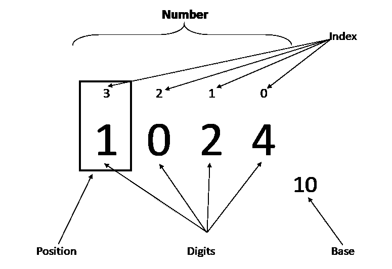

对基数为 10 的数字的描述，显示了索引、数字和基数等各个方面。来源:作者创作。

印度-阿拉伯数字系统(十进制)是最常用的基数为 10 的数字系统，但它不是最古老的。第一个位置数字系统是以 60 为基数的巴比伦数字系统。即使在今天，它的影响在许多方面都能感觉到。一个小时中的 60 分钟，一个圆中的 360 度角都来自于这个基数为 60 的系统。

这又把我们带回了最初的问题。为什么我们以十为单位计数？或者说为什么十进制数字系统的基数是 10？

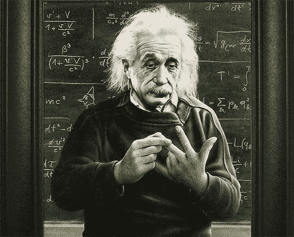

爱因斯坦用手指数着。[https://martinlakewriting . files . WordPress . com/2013/11/Einstein-counting-on-fingers . jpg](https://martinlakewriting.files.wordpress.com/2013/11/einstein-counting-on-fingers.jpg)

回想一下当我们没有其他仪器时，我们最常用的计数方法。我们的手指。我们手里有几根手指？

**十……**

现在你明白了。世界上大多数数字系统(其中许多是独立开发的)都以 10 为基数，这不是一件偶然的事情。

要读取位数值系统，可采用以下方法。它适用于以任何数为基数的数制。

计算任意基数的任意数的值的公式。来源:作者创作。

一旦我们很快看到不同数字系统的简单转换例子，这将变得更加清楚。

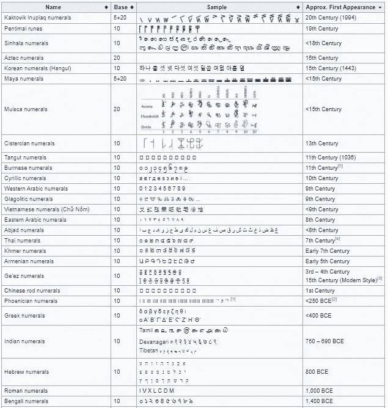

数字系统列表。在维基百科，免费的百科全书。2021 年 2 月 10 日 10 点 22 分从[https://en.wikipedia.org/w/index.php?检索 title = List _ of _ numeric _ systems&oldid = 1005801737](https://en.wikipedia.org/w/index.php?title=List_of_numeral_systems&oldid=1005801737)

对于数字计算，有四种主要的数字系统。它们都是位置数系或位值数系。他们是

1.二进制数字系统(基数为 2)

2.八进制数字系统(基数为 8)

3.十进制数字系统(基数为 10)

4.十六进制数字系统(以 16 为基数)

# 二进制数字系统(基数为 2)

在数字电子和数学中，以二为基数的数字系统称为二进制(bi 表示 2)数字系统。这是所有现代计算机中最常用的数字系统，因为它使用逻辑门简单地实现了数字电子电路。

这种以 2 为基数的数字系统是一种有两个符号的位置记数法，通常是“0”(零)和“1”(一)。每个数字被称为一位(是二进制数字的缩写)。

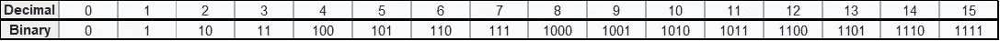

十进制数及其等价的二进制数。来源:作者创作。

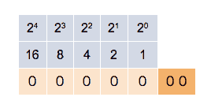

这个计数器显示了如何从 0 到 31 的二进制数。由 Ephert —自己的作品，CC BY-SA 4.0，【https://commons.wikimedia.org/w/index.php?curid=38752676 

二进制数可以转换成十进制数，反之亦然。左边的计数器展示了十进制数是如何以二进制格式表示的。慢慢来理解这一点。请注意，当第三行中相应的二进制数相加时，中间一行中的数字与十进制数的值是如何对应的。

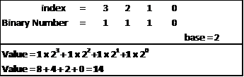

比如 14 在二进制中可以写成 1110。让我们看看它的值是如何使用上面看到的公式得出的。

## 为什么二进制在数字计算中很重要？

从机电计算机时代到今天的电子计算机，都是靠电信号运行的。电信号有两个参数，电压(伏特)和电流(安培)。这两个值可能有成千上万个，因此将数字分配给不同的伏特和安培值以便计算机理解将变得非常复杂。简单点说，电脑只用两个值，开和关。开是 1，关是 0。因此，二进制数字系统适合计算机或任何数字机器存储，交流和处理数据。

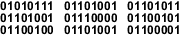

单词‘Wikipedia’用 ASCII 二进制代码表示，由 9 个字节(72 位)组成。作者:Atyndall(见英文维基百科上的账号)——自己的作品，CC BY-SA 3.0，【https://commons.wikimedia.org/w/index.php?curid=3904637 

不仅数字，文本和特殊字符也用二进制表示，以便计算机理解。

# 八进制数字系统(基数为 8)

因为它是以 8 为基数的数字系统，所以它有 8 个数字或符号(0、1、2、3、4、5、6 和 7)。八进制数通常用于计算机应用中。在计算机的早期，八进制计数系统在计算输入和输出时非常流行，因为它以八为计数单位，输入和输出以八为计数单位，每次一个字节(一个字节= 8 位)。

八进制数字系统提供了一种方便的方法来将很长的二进制数字串转换成更紧凑和更小的组。然而，如今八进制数字系统几乎已经消失，让位于更有效的十六进制数字系统。

# 十六进制数字系统(以 16 为基数)

现在你已经熟悉了基地。十六进制是以 16 为基数的数字系统。与我们日常生活中习惯的十进制不同，它有 16 个不同的符号或数字。

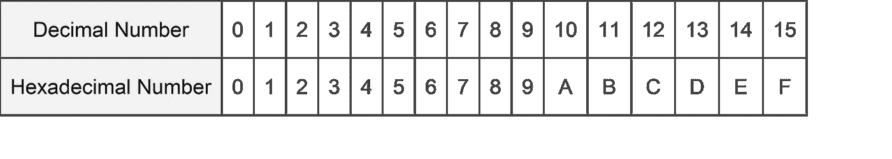

十六进制数在普通数学中使用得不那么频繁，但它们绝对是计算机系统设计者和程序员的宠儿。这仅仅是因为它们提供了一种人类友好的方式来表示繁琐的二进制数。每个十六进制数字代表四位(二进制数字)。这 4 位称为半字节，8 位组成一个字节。让我们看看二进制到十六进制是如何使事情变得简单的。

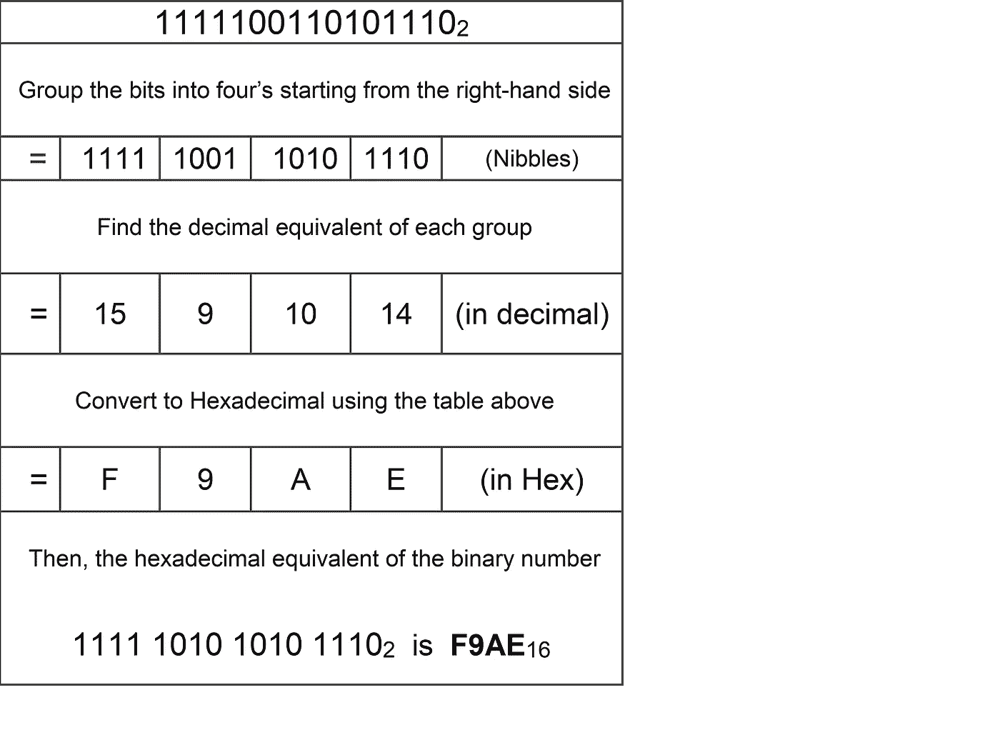

# 结论

数学是一种通用语言，它独立于使用的数字系统。这在原理上听起来很棒，但是如果没有“零”(0)，人类不可能在物理学和其他应用科学上变得如此先进。今天，我们认为零是理所当然的，但情况并非总是如此。符号数值系统没有零。即使是基于价值的数字系统也存在了几个世纪而没有零。

对于数字计算机，二进制是首选的数字系统。它非常适合，虽然计算机系统在所有其他方面都发生了变化，从机电到电气(基于真空管)到电子(基于半导体)，但对于计算机的基本语言。几十年前第一台数字计算机理解的基本语言仍然是一样的，二进制数字系统。因此，学习和认识二进制变得势在必行。十进制是人类选择的语言，因为它的简单和稳定，加上零，它比所有其他的数字系统都长寿(有很多我们没有在这里讨论)。现在它被广泛使用，已经成为“数字”的代名词，大多数人没有意识到它只是众多数字系统中的一个。

那么八进制和十六进制在哪里呢？

八进制和十六进制都是计算机使用的数字系统(二进制)和人类使用的数字系统(十进制)之间的桥梁。对于十进制系统中的大数，二进制表示变得太大而不被人类记住或复制。因此，为了将它们缩短一半，八进制系统就派上了用场。更进一步，十六进制系统将四位减少到十六进制的一位，将大小减少到二进制数的四分之一。有趣的是，所有的数字系统都有算术运算，就像我们习惯于十进制一样。但是让我们用这种想法来总结，我们需要理解为什么除了十进制之外还有其他的数字系统，以及它们是如何有用的，就像我们刚才看到的。

最后一个想法，我在想，如果我们只有八个手指会怎么样？那么八进制应该是最常用的数字系统。有趣的是，生物进化如何塑造了如此不相关的领域的方向，人类的发明以及数学和数字的进步。

可能有一些外星种族，聪明到足以理解自然的秘密，比如数学和物理。如果他们只有两根手指呢？

他们能够用他们最常用的语言和电脑交流吗？

我留给你那个想法…