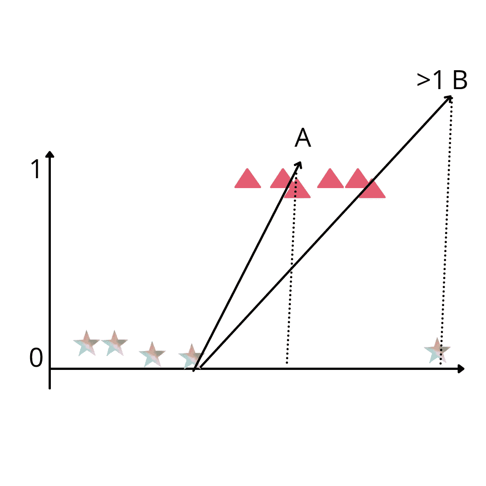
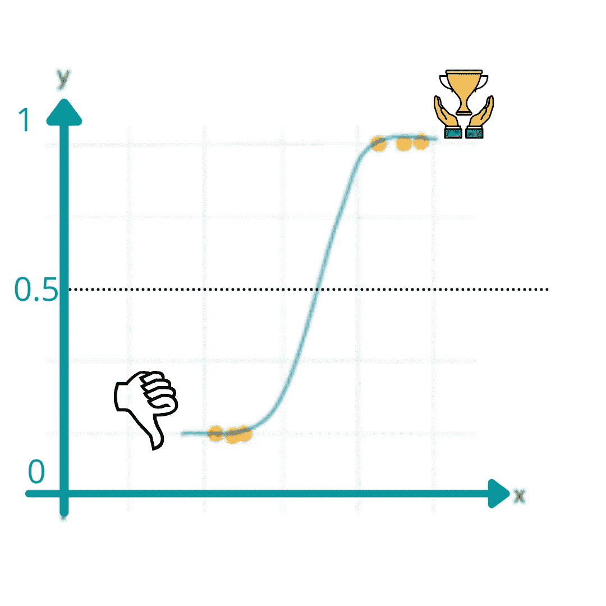
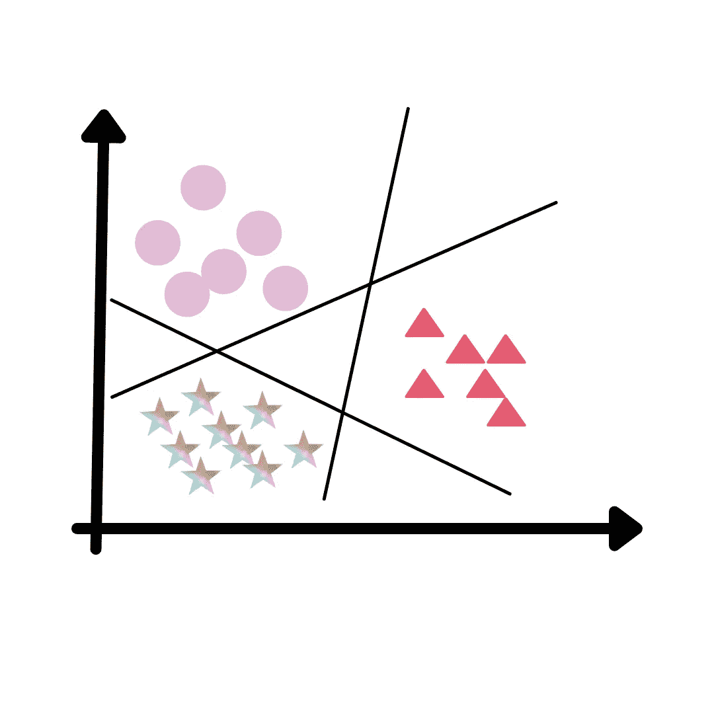

# 为什么我们需要逻辑回归？

> 原文：<https://medium.com/analytics-vidhya/why-we-need-logistic-regression-78f7ee286a3f?source=collection_archive---------4----------------------->

为什么我们需要逻辑回归？采访者肯定会问，如果我们可以使用线性回归，那么为什么要使用逻辑回归呢？因为有时我们的数据中会有异常值，所以在线性回归中，我们必须根据会错误预测输出值的数据点做出最佳拟合线，所以在这种情况下，我们的线性回归会失败。

因此，线性回归不应用于二元分类的两个原因是:

1.  每当我有很多异常值时，我们的最佳拟合线就会完全偏离。
2.  无论我得到什么样的输出，大多数时候我得到的都是大于 1 小于 0，所以要解决这个问题，我们必须使用逻辑回归。

在回归中，我们预测连续值，但如果我们想要预测分类值，如真或假，对或错，是或否，那么在这种情况下，我们的线性回归模型不起作用，因此为了解决这种类型的问题，我们必须使用逻辑回归。在逻辑回归中，我们在玩概率(我们的产出变量的机会)。

***Logistic 回归是一种用于预测目标变量概率的监督学习分类算法。通过逻辑推理我们试图解决二元分类(真或假)和多类分类(类 1、类 2、类 3 等等)***

# 它是如何工作的？

因为我们的目标是通过使用一些独立变量找到是或否，所以你可以想象只有两种情况 0 和 1，我们可以说如果我得到 0，那么没有或失败，如果我得到 1，那么是或成功，在这个算法中，我们已经设置了一个栏，这个栏将帮助我们分类这个是或否变量。

如图所示，我们将阈值设置为 0.5，如果该值大于 0.5，则表示成功，如果小于 0.5，则表示失败。所以在逻辑回归中，我们的值总是在 0 和 1 之间。因此，您必须考虑，如果数据点值精确定位在阈值 0.5，那么在这种情况下，数据点是不可分类的，这是非常罕见的情况。

需要注意的另一点是，如果我们的数据点位于直线之上，那么它被认为是+ve，如果它在斜率之下，那么它被认为是-ve。

逻辑回归的主要目的是找出成本函数的最大值。

成本函数由 Y=wx+c(直线方程)导出。如果你想了解这个等式的更多信息，请阅读我之前的文章[https://medium.com/@Monikarajput./facts-behind-linear-regression-42b 100 fa 2c D3](/@Monikarajput./facts-behind-linear-regression-42b100fa2cd3)

并且该成本函数值基于权重“w”的更新，权重“w”给出了将用于创建最佳拟合线的最大值。

下一步，我们将使用 sigmoid 函数。什么是 sigmoid 函数？

sigmoid 函数会将所有求和值从 0 转换到 1，这样可以消除异常值的影响，这就是 sigmoid 函数的用途。不管有多少异常值，它都会直接将这些值转换成 0 到 1 之间的小值

因此，主 funda 正在执行乘法 y*wx，并应用这个特定的激活函数来更新“m”，除非或直到您获得可以对点进行分类的最佳拟合线，并将该值放入 sigmoid 函数中。

# 两种类型的逻辑回归

*   二元逻辑回归
*   多类逻辑回归

**二元逻辑回归**

最简单的逻辑回归形式是二元或二项式逻辑回归，其中目标或因变量只能有两种可能的类型，要么是 1，要么是 0。

**多类逻辑回归**

假设我们有三个类别，A 型、B 型和 C 型，那么这里逻辑回归所做的是将多类别分类问题分解为多个二元分类问题，并在每个子问题上拟合标准逻辑回归模型。我们称这种技术为 one vs rest。

如图所示，我们有三个类，因此在应用这种方法后，我们现在有 3 个模型，当我们输入测试数据时，每个模型都会给出输出，然后我们选择概率最高的模型，我们会将其视为我们的输出。

# 履行

关闭

我们已经讨论了逻辑回归背后的数学，逻辑回归的类型和实现。

请随时联系我，祝您愉快:)

与我联系:😉

电子邮件-rajputmonika953@gmail.com

领英:【http://linkedin.com/in/monika0104 

github:[https://github.com/monika0123](https://github.com/monika0123)

推特:[https://twitter.com/monikarajput99](https://twitter.com/monikarajput99)