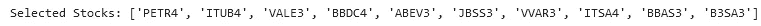
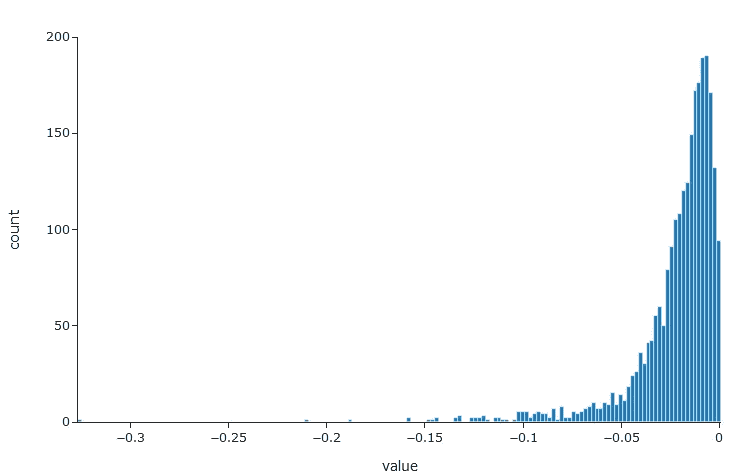
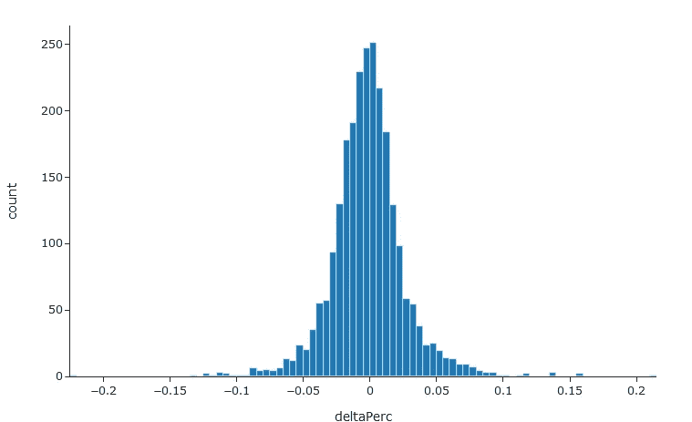
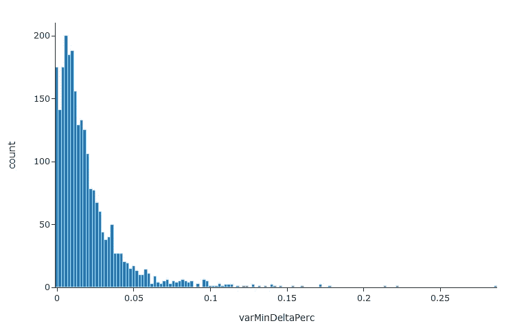
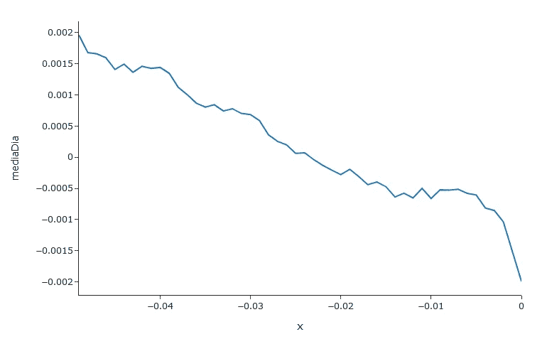
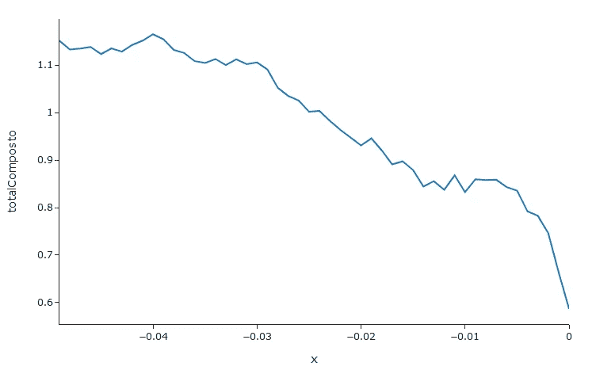
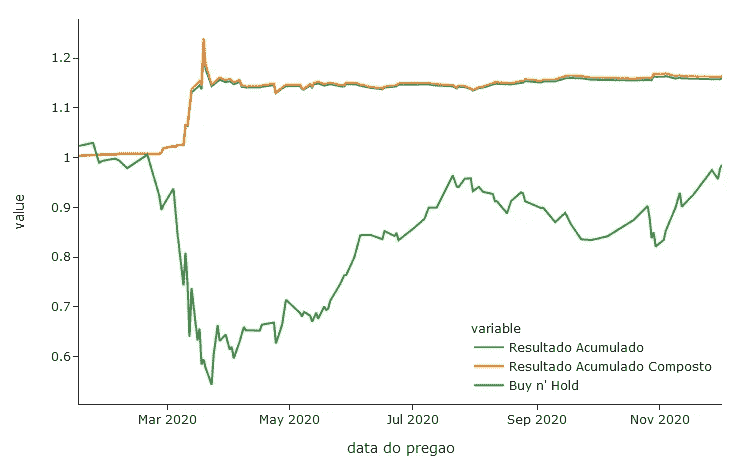

# 为什么你需要数据科学来做日内交易:一个圣保罗的例子。

> 原文：<https://medium.com/analytics-vidhya/why-you-need-data-science-to-do-day-trading-a-bovespa-example-8a39a40f0da2?source=collection_archive---------0----------------------->

2020 年 1 月，我决定用机器学习来建立一个日内交易操作的支持系统。尽管时间紧迫，但在这个项目上工作了将近一年之后，我才获得了一些相关的收获。因此，本文的目的是展示数据科学在支持日内交易操作或任何其他方面的重要性。


# 日间贸易业

人类的一个重要特征是享受轻易获得的机会，而不管追求这种收益可能带来的风险。这就是为什么有彩票，赌博，庄家，以及日间交易。然而，毫无疑问，日内交易的分析内容比其他所有例子加起来都多，但这是为什么呢？原因很明显:有道理！

但是想象一下，如果所有有意义的事情都是真的呢？我们能想到并整合成一个假设的一切将自动正确…这将是美妙的，不是吗？我不这么认为，但事实是，搞清楚是漫长的调查之旅的第一步，以达到被认为是“最先进”的概念，也就是说，尽可能接近历史上某个时期的真相。例如，预防各种疾病的“最新技术”是开发疫苗和大规模免疫，正如几项研究表明的那样，与其他替代方法相比，这些疾病导致的病例和死亡数量尽可能少。所以，只讲道理很少会和道理扯上关系，但几乎没人会给你解释那个。

现在，当我们对轻松赚钱有强烈兴趣，并相信任何有意义的事情时，会发生什么？没错。我们变得更穷。更具体地说，除了在日内交易操作中赔钱，我们仍然可以从有意义的分析中消费内容，但不给出任何它们可以工作的迹象。这就是驱动日内交易分析行业的上瘾循环。缺乏方法验证的一个很好的例子是猴子股票。他们每周随机抽取 5 只股票，评估它们的表现，将这只钱包与其他经纪人的表现进行比较。这些抽彩的股票往往是每周甚至每年表现最好的股票！这表明用于推荐的方法可能未经验证，因为最基本的测试之一是将特定方法与随机策略(如猴子股票)进行比较。

但是，如果我在没有提供任何证据的情况下做出这些声明，我又有什么关系呢？因此，我借此机会引用来自圣保罗 FGV 的 Fernando Chague 和 Bruno Giovannetti 的工作。他们跟踪了 2013 年到 2016 年开始的所有交易者，一直交易到 2018 年。这也许是我们理解巴西日内交易者情景的最相关的证据，我们将在下一节更好地描述它。

# 巴西有人用日内交易赚钱吗？

几乎没人！更准确地说，在评估期内试图从日内交易中获利的所有人中，有 99.43%的人直到 2018 年才继续运营。此外，在那些继续(0.57%)的人中，平均总结果(不含所得税)是负的，也就是说，他们在此期间平均亏损。

令人惊讶的是，这些数据已经让我们无需过多讨论就能理解这么多。一个实际的例子是，为什么有这么多关于日内交易分析的内容，却没有暗示它们能起作用:事实上，每个日内交易的人都在一段时间后退出了。因此，这里的目标就变成了出售用日内交易收入生活的梦想，而不考虑活动的内在风险。所以，在使用了从未被评估过的技术后,“有抱负的”日内交易者很自然地在损失和费用后放弃了梦想，因为几乎没有可复制的“分析”内容…

重要的是要记住，这种行为对那些寻求日内交易的人来说是很自然的。任何成功的战略最难的部分是将你的行动限制在计划之内，如果必要的话，在正确的时间改变。尽管一开始我没有寻找分析内容，但我认识到，与研究和操作所花费的时间成反比，很难将操作限制在一个先验概述的策略上。这一假设也可以得到上述研究的支持。具体来说，交易者的一个自然趋势是损失随着时间的推移而增加，这可以通过以前没有计划的新操作来纠正损失。

# 但毕竟，用日内交易赚钱有那么难吗？

毫无疑问，这是我有兴趣解决的最困难的任务，但我不知道是否只有 0.53%对日内交易感兴趣的人能够解决它。具体来说，我认为如果我们使用数据科学，这个难度会降低很多。所以，在这篇文章中，我将解释一些测试简单日内交易策略的方法。因此，从长远来看，将有可能验证某些策略是否能够提供回报。我们走吧…

# 下载和导入数据

B3 的每日数据可以在交易所的官方网站上找到([链接](http://www.b3.com.br/pt_br/market-data-e-indices/servicos-de-dados/market-data/historico/mercado-a-vista/series-historicas/))，在那里可以下载整年的. txt 格式的数据。txt 转换成数据帧。

```
from bovespa2csv.BovespaParser import BovespaParser as bp
# Import example of data from 2019 to 2020.
p = bp.BovespaParser()
p.read_txt('../input/b3-daily1920/COTAHIST_A2019.TXT')
p.read_txt('../input/b3-daily1920/COTAHIST_A2020.TXT')
# Final dataframe
df = p.df
```

最后，我们有一个数据框，每行对应一篇论文一天的数据。此外，26 根柱子构成了底座。

# 组织数据

B3 上可用的数据库包含所有现货市场股票，所以我们只需要选择我们要使用的数据。因此，我们选择了 BDI 代码为“02”的所有股票，这与标准批次相对应。此外，还需要将交易日期值转换为日期时间。最后，我们只选择了 B3 10 只最具流动性的股票。

```
# String to datetime
df['data do pregao'] = [datetime.datetime.strptime(dt, '%Y%m%d') for dt in df['data do pregao']]
# Sort data by the trading day and update index
df = df.loc[df['data do pregao'].sort_values(ascending=True).index, :]
df.index = range(0, len(df))# Removing excess spaces from stock names
df['codigo de negociação do papel'] = [cod.replace(' ', '') for cod in df['codigo de negociação do papel']]
# Get only the stocks with BDI "02" code
df = df.loc[df['codigo bdi'].isin(['02']), :]
# Get the 10 most liquid stocks
df = df.loc[-df['codigo de negociação do papel'].isin(['BOVA11', 'FIBR3', 'KROT3']), :] # Removing stocks that were not negotiated in 2020
selVar = 'numero de negocios efetuados com o papel mercado no pregao'
selectedStocks = list(df.loc[df['data do pregao'] <= np.datetime64('2019-12-31T00:00:00')].groupby('codigo de negociação do papel')[[selVar]].median().sort_values(by=selVar, ascending=False).iloc[:10, :].index)
df = df.loc[df['codigo de negociação do papel'].isin(selectedStocks) & (df['data do pregao'] >= np.datetime64('2020-01-01T00:00:00')), :]
print("Selected Stocks:", selectedStocks)
```



# 特征工程

在这篇文章中，我们将尝试提出和测试一些基本的日内交易策略。为此，我们需要记住，在我们的日内交易策略中，我们需要以尽可能低的价格买入股票，以尽可能高的价格卖出。因此，我们需要用当天的最大值和最小值以及交易时段结束时的值(取决于开盘价)来标准化这些特性。我们还将制作一个数据集，其中包含买入并持有策略(Buy and Hold)的结果，以便与我们的策略结果进行比较。

```
# Absolute maximum variation from the paper opening value
df['varMax'] = df['preco maximo do papel-mercado no pregao'] - df[
    'preco de abertura do papel-mercado no pregao']
# Minimum variation in relation to the paper opening value
df['varMin'] = df['preco minimo do papel-mercado no pregao'] - df[
    'preco de abertura do papel-mercado no pregao']
# Variation between the opening price and the price of the last trade in the trading session
df['delta'] = df['preco do ultimo negocio do papel-mercado no pregao'] - df['preco de abertura do papel-mercado no pregao']
# Here, we normalize the maximum, minimum and delta variations in relation to the paper's opening value
df['varMaxPerc'] = df['varMax'] / df['preco de abertura do papel-mercado no pregao']
df['varMinPerc'] = df['varMin'] / df['preco de abertura do papel-mercado no pregao']
df['deltaPerc'] = (df['delta'])/df['preco de abertura do papel-mercado no pregao']# Stocks performance
bnhRes = pd.DataFrame()
for s in selectedStocks:
    dfStock = df.loc[df['codigo de negociação do papel'] == s,:]
    dfStock[s] = (dfStock['preco do ultimo negocio do papel-mercado no pregao'] - dfStock.iloc[0].loc['preco de abertura do papel-mercado no pregao'])/dfStock.iloc[0].loc['preco de abertura do papel-mercado no pregao']    
    bnhRes = bnhRes.append(dfStock.set_index('data do pregao')[s])
bnhRes = bnhRes.T
```

这样，就有可能比较不同的股票，考虑一天中的变化，从而比较最终以任何价值购买的结果。

# 确定可能的战略

现在我们需要确定有趣的策略。我总是喜欢尽可能简单地开始任何分析，所以在目前的情况下，让我们考虑股票价值在一天内的变化。

首先，我们来尝试优化购买价值。所以我们需要调查变量 varMinPerc。为此，我们使用 plotly 软件包绘制了一个直方图。

```
import plotly.express as exfig = ex.histogram(df['varMinPerc'], template='simple_white')
fig.update_layout(showlegend=False)
fig.show()
```



可以观察到绝大多数值非常接近于 0，并且出现低于-5%的值，但是很少。因此，由于当天的变化很重要，当天最后一笔交易的价值是否也遵循这种分布？让我们绘制直方图来验证…

```
fig = ex.histogram(df['deltaPerc'], template='simple_white', labels={'value': 'deltaPerc'})
fig.update_layout(showlegend=False)
fig.show()
```



哎呀，deltaPerc 分布类似于平均值为 0(或更低但非常接近)和一些异常值的正态分布。似乎有一种趋势是当天最后一笔交易的价值非常接近开盘价(deltaPerc = 0%)。因此，总是在一个特定的最小范围内购买股票会有好的结果。为了研究这个假设，我们可以减去当天变化的最小变化的值，因此，我们将得到从最终值到当天最小变化的距离。

```
# New feature creation
varMinDeltaPerc = (df['deltaPerc'] - df['varMinPerc'])
# Histogram plot
fig = ex.histogram(varMinDeltaPerc, template='simple_white', labels={'value': 'varMinDeltaPerc'})
fig.update_layout(showlegend=False)
fig.show()
```



在这种情况下，似乎最常见的值都大于 0。这是我们先前假设的重要证据。所以我们理解，一只股票的价值往往收在当天的最小值之上，非常接近开盘，这可能就是机会。因此，预测一天中纸张的最小值应该会给出重要的结果！然而，由于本文的目的是提供简单的解决方案，让我们考虑一个简单的策略，跟踪我们选择的 10 只股票，并在它们具有特定的最小方差时买入。然后我们在交易时段结束时以固定价格卖出。这个策略是否有一个理想的最小变化值？

# 模拟日间交易场景

为了测试我们的策略，我们可以简单地用我们拥有的数据集模拟一个日间交易场景，并改变购买值参数，以在某些条件下寻找一些利润。因此，我们首先需要创建一个函数，根据 open 的 x %买入方差来评估结果。

```
def analyse(df, x):
    res = df.loc[df.varMinPerc < x, ['data do pregao', 'codigo de negociação do papel', 'varMinPerc', 'deltaPerc']]
    res['result'] = (res['deltaPerc'] - x)
    return res[['data do pregao', 'codigo de negociação do papel', 'varMinPerc', 'result']]
```

接下来，我们需要定义一个供我们测试的 x 值列表。为此，我们将使用从 0 到-0.049 的值，这将对应于从 0 到-5%的开盘价变化。在每次测试结束时，我们在 resDict 数据框架中保存一个新行，其中包含日平均、累计总收益和综合收益的结果。

```
resDict = pd.DataFrame()
for v in range(50):
    x = -(v / 10 ** 3)
    res = analisar(df, x)
    res = res.loc[(res.varMinPerc < x), :]
    mediaDia = (res.groupby('data do pregao')['result'].sum()/10).mean()
    total = (res.groupby('data do pregao')['result'].sum() / 10).sum()
    totalAc = ((res.groupby('data do pregao')['result'].sum() / 10)+1).cumprod().iloc[-1]
    resDict = resDict.append({'x': x, 'mediaDia': mediaDia, 'totalAcumulado': total, 'totalComposto': totalAc}, ignore_index=True)
# Finally, we plot the results of resDict
ex.line(resDict, x='x', y='mediaDia', template='simple_white').show()
ex.line(resDict, x='x', y='totalAcumulado', template='simple_white').show()
ex.line(resDict, x='x', y='totalComposto', template='simple_white').show()
```



从图中可以清楚地看出，小于-2.5%的 x 值表示模拟中的增益。再者，我们看到 x 的值越小，日收益越大。然而，考虑到我们之前看到的最小每日变化的分布图，值-5%不是很常见，从长期来看可能不会产生相同的回报，因为股票比更低的值更少被购买。但是多亏了数据科学，我们也可以通过绘制总的综合结果来检验这个假设。



现在我们可以看到，尽管 x 值很低，但有一个有趣的增益，最大增益为-4%。此外，低于-2.5%的值提供很少的回报或大量损失。

# 绘制结果

现在我们有一个有趣的策略要考虑。然而，这些结果还有一个我们没有测试的特征:在建议的时间段内结果的可变性。具体来说，我们需要知道这在大多数情况下是不是一个好策略，或者结果是否过于极端，这可能会导致巨大的收益，但也会造成巨大的损失。为此，我们绘制了 2020 年每天的结果。

```
x = -0.04
serieRes = analisar(df, x)
dfPlot = serieRes.groupby(‘data do pregao’)[[‘result’]].sum()/10
dfPlot[‘Resultado Acumulado’] = dfPlot[‘result’].cumsum() + 1
dfPlot[‘Resultado Acumulado Composto’] = (dfPlot[‘result’] + 1).cumprod()
dfPlot[“Buy n’ Hold”] = bnhRes.mean(axis=1) + 1
fig = ex.line(dfPlot, y=[‘Resultado Acumulado’, ‘Resultado Acumulado Composto’, “Buy n’ Hold”], template=’simple_white’)
fig.update_layout(legend=dict(
 yanchor=”bottom”,
 y=0.01,
 xanchor=”right”,
 x=1
))
fig.show()
```



如果我们在所有交易时段购买所有选定的股票，这些股票的价值与 2017 年至今的开盘价相比下跌 4%或更少，我们今年将获得 11%至 12%的正回报，这比购买所有股票并在今年最后一天卖出(买入 n' Hold)损失 1.5%要好得多。这不会让我们变得富有，但毫无疑问，它有很好的机会带来积极的结果，因为在几次模拟中，我们都获得了不错的回报。此外，由于这是一个非常简单的策略，有很多可以改进的地方，例如测试其他选股标准(价值、成交量的标准差)，选择流动性最强的股票的其他频率(月、日)，不同数量的角色等等。使用机器学习和 LSTM 或自回归等统计技术仍然是很有帮助的选择。在我的情况下，我开发了一个基于随机森林的系统，我已经测试了其他回归变量，如 SVM 和线性回归，以预测第二天的最小值并建议购买哪些股票，但由于我打算写一篇科学论文解释这些方法，在这里发表它们将使任何期刊发表都不可行。

# 结论

到目前为止，没有什么比对结果进行广泛的分析更能验证日内交易技术了。因此，当我们用数据来验证技术时，我们可以看到，在日内交易中取得好的结果可能并没有那么难。永远记住，当谈到日内交易时(几乎每个主题)，仅仅有意义是没有任何意义的。

通过下面的[链接](https://www.kaggle.com/lucasgiutavares/simple-day-trade-in-brazilian-stock-market)，可以在 Kaggle 上找到包含这些实验的 Jupyter 笔记本。