# 为什么你应该考虑作为数据科学家学习线性代数:奇异值分解

> 原文：<https://medium.com/analytics-vidhya/why-you-should-consider-studying-linear-algebra-as-a-data-scientist-part-1-svd-9d0ba3189a3e?source=collection_archive---------17----------------------->


照片由[在](https://unsplash.com/@comparefibre?utm_source=medium&utm_medium=referral) [Unsplash](https://unsplash.com?utm_source=medium&utm_medium=referral) 上对比纤维

*这篇文章是为了让读者更深入地探索这个话题，自己使用结尾提到的资源。*

无论你是在做最小二乘近似，还是在阅读深度学习的新论文，对线性代数的基本理解对于内化关键概念至关重要。

# **线性代数的要诀**

首先，一些我们都应该知道的定义

列空间:你可以把矩阵的每一列想象成空间中的一个向量。现在，矩阵中所有独立向量的线性组合所形成的空间构成了列空间。

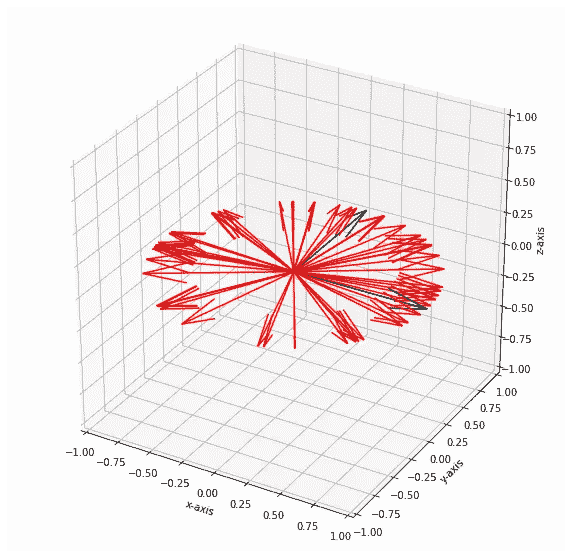

红色向量是黑色向量的线性组合

```
import matplotlib.pyplot as plt
from mpl_toolkits.mplot3d import Axes3Dfig = plt.figure(figsize=(10,10))
ax = fig.gca(projection='3d')
ax.set_xlim3d(-1, 1)
ax.set_xlabel('x-axis')
ax.set_ylabel('y-axis')
ax.set_zlabel('z-axis')
ax.set_ylim3d(-1, 1)
ax.set_zlim3d(-1, 1)
A=np.array([[1,0],[0,1],[0,0]]) # Initial Column vectors
C=np.copy(A)
ax.quiver(0, 0, 0,*C[:,0],normalize=True,color='k')
ax.quiver(0, 0, 0,*C[:,1],normalize=True,color='k')
for i in range(50): # Taking 50 random linear combinations   x1=np.random.uniform(-100,100,1)
 x2=np.random.uniform(-100,100,1)
 ax.quiver(0, 0, 0,*(C[:,0]*x1 + [:,1]*x2),normalize=True,color='r')plt.show()
```

示例中所示的矩阵的每一列([1，0，0] & [0，1，0])由黑色向量表示。红色向量是这两列的线性组合。看起来是不是所有的红色向量都在同一平面上？因为他们有！所有这些向量构成了矩阵的列空间。在这种情况下，列空间是一个平面(因为有两个独立的列)。但是，如果独立列的数量更多，则空间可以存在于更高维度中。

**秩:**矩阵中独立列(或行)的数量。矩阵中的列条目不能是彼此的线性组合。本质上，您不能使用其他列来构成矩阵中的特定列。

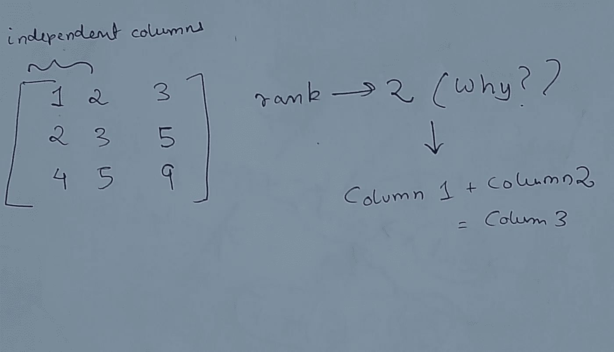

一个很小的 3x3 矩阵，其中秩为 2，因为第 3 列依赖于其他两列。

```
**from** **numpy.linalg** **import** matrix_rank
matrix_rank(np.eye(3)) An identinty matrix with rank 3, since all the columns are independent of each other.
```

在很高的层次上，我们可以将矩阵的秩视为“信息量”。例如，如果有一个 1000x1000 像素值的图像，如果我可以用一半的值获得足够的信息，我为什么要存储所有这些值呢？

为了得到这样一个低阶近似，我们可以使用几种方法，如奇异值分解，或 NMF。下面的图片向我们展示了一个低秩近似可能并不总是那么糟糕。


差别不大，是吗？

**线性变换**

任何矩阵都可以被认为是线性变换*(相对于固定基*)。每当我们将一个向量乘以一个矩阵时，我们可以想到应用于该向量的缩放、剪切或旋转效果。

让我们看一个简单的例子:

我们形成一个 2 x (N*N)矩阵，并用散点图来表示。然后我们对矩阵进行变换，看看结果。

```
def build_array(startx,endx,starty,endy,N):''' Build an array of 2 x (N*N) '''xvals = np.array(np.linspace(startx, endx, N))
yvals = np.array(np.linspace(starty, endy, N))
arr=np.vstack(np.meshgrid(xvals,yvals)).reshape(2,N*N)return arrdef visualize_array(arr):''' scatterplot to visualize array '''plt.figure(figsize=(7, 7))
plt.xlim([0,30 ])
plt.ylim([0,20])
plt.scatter(arr[0],arr[1])arr_1=build_array(0,10,0,10,11) # array
visualize_array(arr_1)
transformation=np.array([[1,1],[0,1]]) # transformation
final_array=np.dot(transformation,arr_1)# Applied the trasnformation
visualize_array(final_array)
```

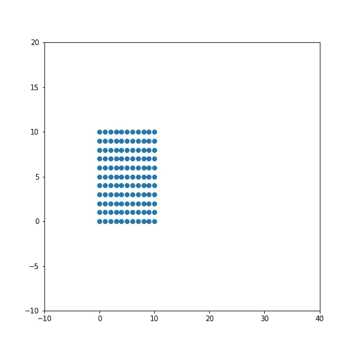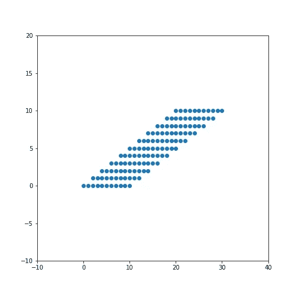

原始空间在右边，转换后在左边

我们可以看到，由于矩阵第一列中的***【1，0】***(类似于恒等式)，x 轴保持在它的位置，我们可以看到由于第二列中的***【1，1】***发生了剪切。我强烈建议您亲自尝试代码，应用各种转换，并查看矩阵的最终形状。

**特征值和特征向量:**

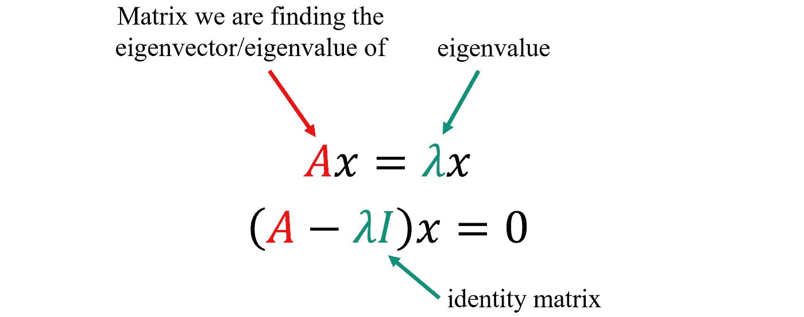

这是我们在高中学到的方程式。但不清楚的是(至少当时对我来说)，它们背后的视觉直觉。继续我们将矩阵视为线性变换的思路，特征向量是当我们对它们应用变换 A 时*不受*影响的向量，特征值只是一个比例因子(方向保持不变)。让我们快速看一个例子。

```
def transform(A,B):''' plot the transformation of a 2x1 vector, given a 2x2 matrix '''fig = plt.figure(figsize=(7,7))
param=np.amax(A)*np.amax(B)
plt.xlim([-1,param])
plt.ylim([-1,param])
plt.quiver(0, 0, B[0],B[1],color='k',scale=1,units='xy',label='original_vector')
C= A[:,0]*B[0]  + A[:,1]*B[1]  # Expressing as a linear combination 
plt.quiver(0, 0, C[0],C[1],color='B',scale=1,units='xy',label='post
transformation_vector')
plt.legend()A=np.array([[2,4],[0,2]]) #Transformation
B=[[1],[0]] #Eigenvector
transform(A,B)B=[[2],[1]] # Other vector
transform(A,B)
```

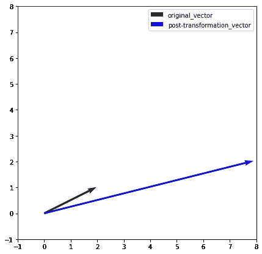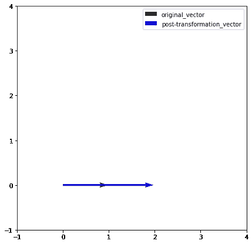

不受变换 A 影响的特征向量

我们可以看到，特征向量只是被变换“拉伸”了。比例因子就是特征值。

当我们有 ***对称矩阵(Transpose(A) = A)*** 时，这些特征向量出现了一个有趣的性质。这些情况下的特征向量看起来是**正交** 或者换句话说是垂直的。我们使用上面相同的函数来说明一个例子。

```
A=np.array([[2,1],[1,2]]) # Symmetric Matrix
B=[[1],[1]] #Eigenvector
transform(A,B)
A=np.array([[2,1],[1,2]]) # Symmetric Matrix
B=[[-1],[1]] #Eigenvector
transform(A,B)
```

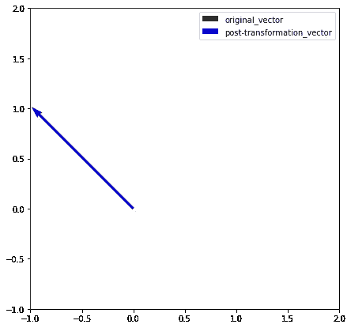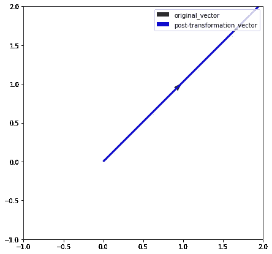

特征向量是正交的(彼此成 90 度)

现在，为什么我们会关心特征向量是正交的，想象一下，如果你能把一个矩阵分解成它的特征向量和特征值的因子，并且这个矩阵是对称的，你会得到彼此正交的列。这将表明该特定矩阵的每一列彼此完全不同**。*在无监督学习的背景下，这就是你如何对来自原始矩阵的条目进行“分类”。***

但是有一个问题，所有的矩阵都不是对称的，也绝对不是正方形的(非正方形矩阵不存在特征向量)。你能想象一个具有相同行数和列数的数据集吗？在现实世界中，这几乎不会发生。那我们该怎么办？

我们强行使其对称，将矩阵的转置与自身相乘得到我们想要的对称。这就是奇异值和奇异值分解的全部概念。

# **奇异值分解:**

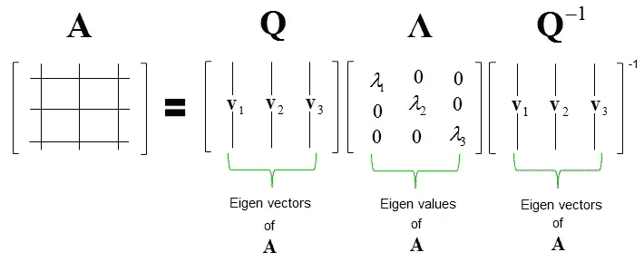

特征分解

对于对称矩阵,“特征分解”如上，但对于其他矩阵，我们使用:

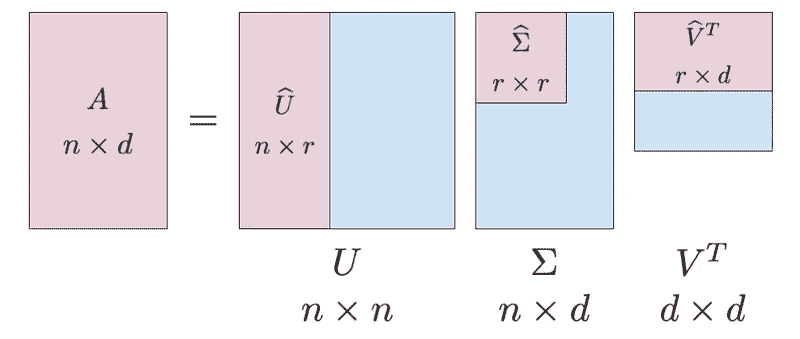

一般 n×d 矩阵的奇异值分解

向量 U 和转置(V)具有正交列。在中间，我们有我们的‘奇异值’(特征值的替代品)，但重要的因素是它们是有序的(按照惯例)。取前“n”个奇异值，我们将得到 a 的最佳 n 阶近似值。这很重要，因为我们的大部分信息将从前几个“奇异值”中重建。如果矩阵的秩是 r，我们可以想象 ***矩阵 V 在 A 的列空间，U 在 A 的行空间，我没解释行空间？只是 Transpose(A)的列空间。*** 列空间中除了‘r’之外的向量(n-r)的其余部分是什么？那么，这就进入了零空间(这是另一天)

让我们来看一个小例子，看看我们如何将它用于主题建模。我们将使用来自 sci-kit-learn 的 fetch_20newsgroups 数据集。这给了我们大约 13000 个我们的模型不知道的各种类别的文档。为了构建我们的初始矩阵，我们使用 Tf-Idf，因此我们的矩阵是以 ***文档 x 单词的形式。W***

同样，行是文档，列是单词，条目是特定单词的 tf-idf 分数。

```
**#### BUILDING UP DATAFRAME**from sklearn.datasets import fetch_20newsgroups
dataset = fetch_20newsgroups(shuffle=True, random_state=1, remove=('headers', 'footers', 'quotes'))
documents = dataset.data
vectorizer = TfidfVectorizer(stop_words='english',max_features= 1000,max_df = 0.5,smooth_idf=True) #picking 1000 wordsdf = pd.DataFrame({'document':documents})
df['docs'] = df['document'].str.replace("[^a-zA-Z#]", " ") #cleaning
vectors = vectorizer.fit_transform(df['docs']).todense() tf_dict={}
for i,k in enumerate(vectors):
 a=np.squeeze(np.array(k))
 tf_dict[f'Doc{i}']= adocuments=pd.DataFrame.from_dict(tf_dict)
documents.index=words
documents.T #Final DataFrame
```

之后，我们会得到一个稀疏矩阵，看起来像这样。

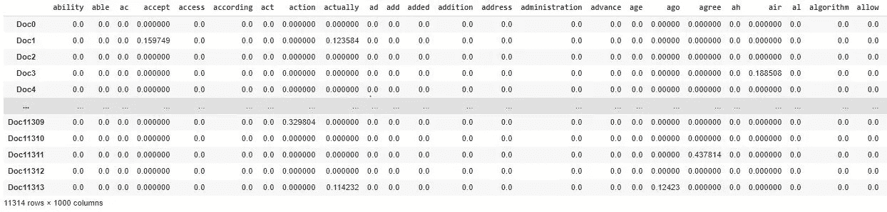

奇异值分解的数据帧

```
**### SVD AND VIEWING TOPICS**from scipy.linalg import svdU, s, VT = svd(vectors)def display_topics(model, feature_names, no_top_words):
 topic_dict = {}for topic_idx, topic in enumerate(model): topic_dict["Topic %d words" % (topic_idx)]=      ['{}'.format(feature_names[i])for i in topic.argsort()[:-no_top_words - 1:-1]] topic_dict["Topic %d weights" % (topic_idx)]= ['{:.1f}'.format(topic[i]) for i in topic.argsort()[:-no_top_words - 1:-1]]return pd.DataFrame(topic_dict)
```

VT 将包含我们的 ***右奇异向量*** *。*


Transpose(A) x A *(原来是对称的)*的 ***特征向量给了我们正交的右奇异向量。回想一下我们文档的形状，13000 x 1000。你能猜出变形战斗机的形状吗？***

如果检查 VT，并根据权重将它们按顶部单词排序，我们会得到对主题最重要的单词。

```
#Examining the top 10 words
display_topics(VT[1:3],words,10) 
```

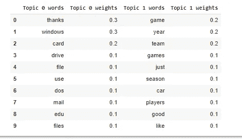

我们可以看到，第一个话题似乎是关于计算机，第二个话题似乎是关于体育。

让我们检查一下主题是否像我们期望的那样是正交的。

```
np.dot(VT[2:3],VT[:1].T) Multiplying two columnsOutput: array([[-1.73472348e-17]])
```

很难在一篇博文中清楚地表达出幕后发生了什么。如果你是线性代数的新手，这大部分对你来说可能听起来很奇怪。因此，我将推荐一条线性代数的学习途径，帮助你深入这个主题。

# **资源**

有三个主要的资源来实现这一点，我建议这样的顺序:

1.  [3Blue1Brown 线性代数系列](https://www.youtube.com/watch?v=e50Bj7jn9IQ):对我在这里提到的概念的一种视觉直觉，也是一个很好的起点。
2.  吉尔伯特·斯特朗线性代数讲座:这门课程旨在帮助数据科学家理解线性代数。你也可以得到与讲座配套的书。这里讨论的概念是理论上的，从长远来看，它们肯定会有所帮助。
3.  [快速人工智能计算线性代数:](https://www.youtube.com/watch?v=8iGzBMboA0I&list=PLtmWHNX-gukIc92m1K0P6bIOnZb-mg0hY)与 Gilbert Strang 视频不同，这侧重于概念的实际应用。一旦你从吉尔伯特·斯特朗的视频中学到了所有的理论概念，这些讲座就很容易理解了。

你可以在这里找到帖子[中提到的所有代码。](https://github.com/ArnabPushilal/LinAlg/tree/main)