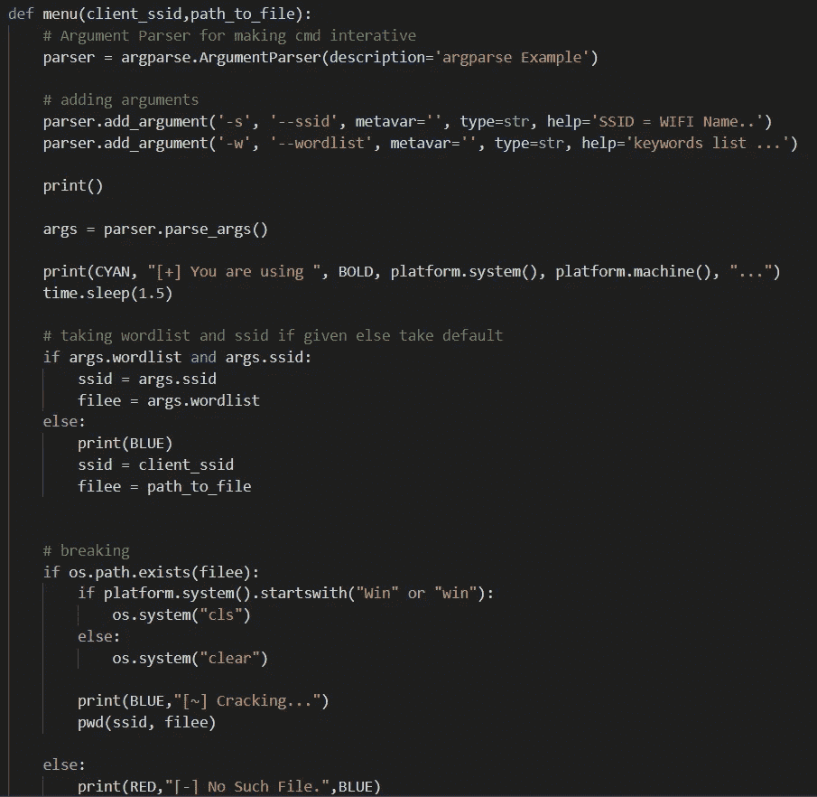

# wifi-使用 PyWifi 进行黑客攻击🔐

> 原文：<https://medium.com/analytics-vidhya/wifi-hacking-using-pywifi-4f90ed9b1a2?source=collection_archive---------0----------------------->


.

你好介，
希望你一切都好。让我们尝试一些危险的东西。
📢再次声明，本博客仅用于教育目的。

**系紧安全带🤘**

让我们从一点理论和模块开始→

你的电脑必须安装 python3.6 或 python3.7。

**Pywifi →** 这个模块提供了一个**跨平台** Python 模块，用于操作无线接口。
你可以通过→ pip 安装 pywifi
来安装，并在这里阅读→[https://github.com/awkman/pywifi/blob/master/DOC.md](https://github.com/awkman/pywifi/blob/master/DOC.md)

Wifi **配置文件**以 **xml** 格式保存在我们的计算机中，这也是我们需要遵循的程序，以便添加新的配置文件并连接到任何配置文件。
这里的配置文件是指您的 wifi 配置文件，即→ ssid 和您的计算机连接到 wifi 所需的其他信息。

这是一个**蛮力**方法，所以它需要大量的时间，这取决于你有多少关于密钥和密码字表长度的信息。

**让我们开始编码部分→**

代码概述→

让我们开始解释→


**client_ssid →** 您想要入侵的 wifi 网络的名称
**path_to_file →** 包含密码的 python 单词表的路径
您可以根据您所掌握的密码信息使用自己的 python 单词表。
如果你不知道如何创建跟随→[https://RSA jal . medium . com/python-word list-for-brute-force-password-cracking-9a8c 62170 BD 2](https://rsajal.medium.com/python-wordlist-for-brute-force-password-cracking-9a8c62170bd2)


这些是颜色变量，你不需要改变它们，它们被初始化是为了让命令提示符看起来更漂亮，更有交互性，我们将在后面看到。


在这一部分中，我们正在初始化 piwifi 模块，以便我们可以从计算机与 wifi 接口进行交互



**argparse →** 该模块用于使命令行交互。
你可以从官方教程这里读到→
[**https://docs.python.org/3/howto/argparse.html**](https://docs.python.org/3/howto/argparse.html)

因此，基本上我们试图通过硬编码或命令行(取决于用途)来传递两个重要的变量 client_ssid 和 path_to_file。

如果你想通过命令行传递，你的语法应该是→

```
python3 pywifi_medium.py -s NAME_OF_WIFI -w PATH_TO_PASSWORD_LIST
```

如果你想硬编码它→通过改变 client_ssid 和 wordlist 路径变量。

在这一部分中，我们在 args 中从命令行获取参数，并检查用户是否从命令行给定了它们。如果不是，就从硬代码中选择一个

然后我们试图找到文件并破解 wifi 密码


这个部分打开文件，取出写在文件中的每一个单词，并发送给 main 函数。


主要功能→

顾名思义，这个函数是这个过程的罪魁祸首。主函数需要三样东西→密码、数字、ssid，它们是从 pwd 函数发送的。然后，我们创建与我们的操作系统兼容的概要文件，看起来像→

```
<?xml version="1.0"?>
<WLANProfile ae jo" href="http://www.microsoft.com/networking/WLAN/profile/v1" rel="noopener ugc nofollow" target="_blank">http://www.microsoft.com/networking/WLAN/profile/v1">
 <name>Dfone</name>
 <SSIDConfig>
  <SSID>
   <hex>ssid_in_hexadecimal_form</hex>
   <name>ssid_in_english</name>
  </SSID>
 </SSIDConfig>
 <connectionType>ESS</connectionType>
 <connectionMode>auto</connectionMode>
 <MSM>
  <security>
   <authEncryption>
    <authentication>Mode_of_cipher</authentication>
    <encryption>AES</encryption>
    <useOneX>false</useOneX>
   </authEncryption>
   <sharedKey>
    <keyType>passPhrase</keyType>
    <protected>true</protected>
    <keyMaterial>F175B32D4D10562D19715079CE9E1FE7E18BCA5E5586E43EC69B3B5F42ACAD000000000E80000000020000200000000EB3E8631D76E5B4E1219C15</keyMaterial>
   </sharedKey>
  </security>
 </MSM>
 <MacRandomization ae jo" href="http://www.microsoft.com/networking/WLAN/profile/v3" rel="noopener ugc nofollow" target="_blank">http://www.microsoft.com/networking/WLAN/profile/v3">
  <enableRandomization>false</enableRandomization>
  <randomizationSeed>285113171</randomizationSeed>
 </MacRandomization>
</WLANProfile>
```

这是模块创建的概要文件。你不必为此担心。
密钥材料会随着密码的改变而改变，它会尝试将您连接到 wifi。

这就是文章的结尾。
你真是一个耐心的观众。

谢谢大家！

# **请向上投票，表达你的爱！！！🙇‍♂️🙇‍♂️**

[](https://github.com/r-sajal/Ethical-Hacking) [## r-sajal/道德黑客

### 在 GitHub 上创建一个帐户，为 r-sajal/Ethical-Hacking 的发展做出贡献。

github.com](https://github.com/r-sajal/Ethical-Hacking) [](https://www.linkedin.com/in/rsajal/) [## Sajal Rastogi -印度信息技术学院 Kota -斋浦尔，拉贾斯坦邦，印度|…

### 查看 Sajal Rastogi 在全球最大的职业社区 LinkedIn 上的个人资料。萨加尔的教育列在…

www.linkedin.com](https://www.linkedin.com/in/rsajal/)