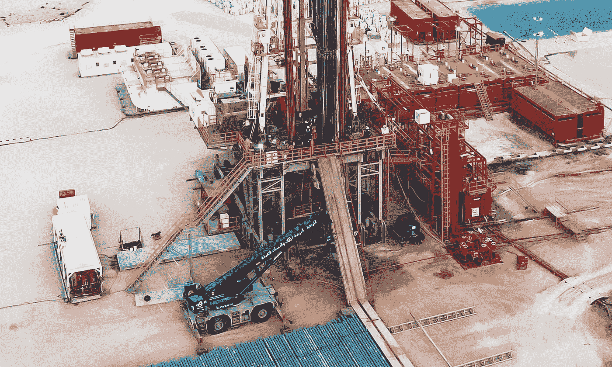
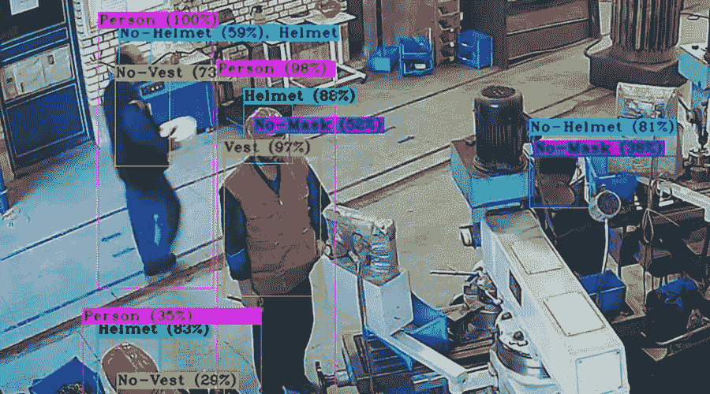
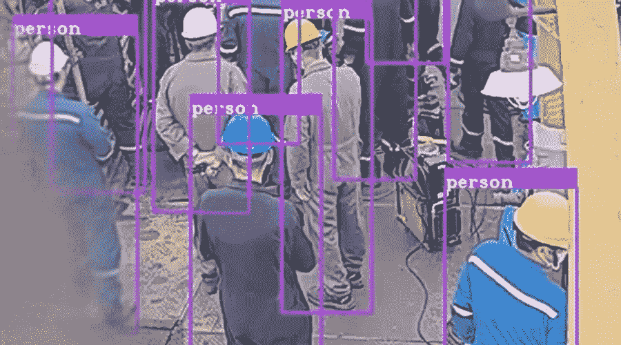
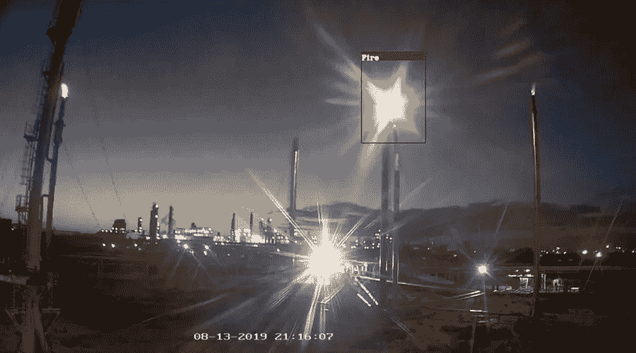

# 人工智能会提高钻机的安全性吗？

> 原文：<https://medium.com/analytics-vidhya/will-ai-improve-safety-in-drilling-rigs-3aa251dc0c16?source=collection_archive---------6----------------------->

钻机安全挑战和新的解决方案

尽管有各种规定，石油和天然气行业的事故率仍然很高。因此，在技术发展的同时，开发了新的解决方案来提高钻机的安全性，还有什么新技术比人工智能更有趣呢？将人工智能技术集成到目前安装在几乎每个工作场所的监控摄像头中，使安全人员能够检测到任何异常情况，如违反 PPE、不良的内务管理或泄漏。这项技术主要用于检测新冠肺炎疫情期间是否佩戴面罩并保持安全距离，但如何将其用于石油钻井平台以提高安全性？
尽管石油场所包含许多危险，传统上采用的基本安全措施是安全监督和改善安全文化，尽管人性具有不服从、无知和过度自信的特点。因此，人为错误总是会发生，正如几份报告所显示的，石油钻塔事故仍然会造成严重伤害。
因此，像将人工智能与闭路电视摄像头相结合这样的新解决方案声称，它们可以降低钻机的风险概率，并为减少人为错误和增强安全管理提供新的机会。在下文中，您可以看到其中的一些新功能:

# **在钻台上:**

大约 40%的石油钻井事故发生在钻台上。被撞击、夹在中间、滑倒、绊倒和坠落是造成钻台事故的主要危险。另一方面，当未经授权的人出现在钻台上时，当工人行走或站在红区时，或当常规监督受到干扰时，事故经常发生。
当前集成到闭路电视摄像机中的基于人工智能的技术可以检测这些危险并向安全人员发出警告:

◆ **常规监督** : AI 能**识别人**。它可以判断监管人员是否及时检查设备；否则，它会警告安全管理器。该功能减少了与钻台上使用的不同设备相关的危险，如绞车、吊卡或大钳。

◆ **红区**:基于人工智能的安全软件**可以检测区域**并警告人们保持安全距离:
o **V 门**:当管子被带到钻台时，V 门开口必须畅通。
o **转盘**:钻井过程中，转盘上不得有人。
o **大钳摆动区域**:断管时，大钳摆动半径内不得站人。

这种新功能可以避免人员出现在上述红色区域，从而降低钻台上的撞击或夹在中间的风险。

◆ **个人防护设备**:将深度学习和机器学习与 CCTV 相结合，使新的安全解决方案能够**检测违反 PPE 的行为**。因此，尽管 IADC 的报告显示手指和头部受伤分别占 31.12%和 12.75%，但在石油钻井平台上最常见，采用基于人工智能的安全解决方案至少降低了伤害的严重程度。

人工智能技术:个人防护设备检测

◆ **禁止的行为**:人工智能技术可以检测到禁止的活动，比如在钻台上吸烟。所以虽然人们的过度自信或无知导致了事故，但人工智能可以防止事故的发生。

◆ **清点人数:**这项技术可以识别钻台上有多少**人**。因此，它避免了仅由一个人完成的起下钻作业或控制钻台上不超过三个人。这些场景也降低了被冲击的风险。

◆ **HSE 官员在场:**目前的人工智能技术可以识别不同的物体和人。这种能力提供了一种新的解决方案来检查 HSE 官员或带班队长是否在钻台上。由于 HSE 官员的存在可以避免安全违规，这种情况也可以减少事故。

人工智能技术:清点人数

# **在猴台上:**

在跳板上工作太危险了。坠落、拉伤和扭伤、被坠物击中是经常在二层台工作的德里克曼通常面临的主要危险。尽管有所有的安全条例，大约 12%的钻井平台事故发生在井架工身上。基于人工智能的安全软件也可以有效地减少猴台上的事故和伤害严重性:

◆ **监控摄像头:** Monkeyboard 是井架工起下钻杆时独自站立的小平台。因此，监控摄像头必须正确工作，基于人工智能的安全软件可以**控制摄像头的功能**。因此，伤害严重程度和死亡率都降低了。

◆ **坠落保护:**井架工除了安全手套外，还必须穿戴所有坠落保护设备，如安全带和头盔。**个人防护装备检测**功能也降低了跌倒风险和相关伤害的严重程度。

◆ **身体动作:**德里克曼独自站在猴台上。新技术可以检测他的**身体状况**。因此，如果他因为任何原因摔倒在猴台上，基于人工智能的安全软件会发出警告，要求立即救助。

# **在管架/猫道上:**

7%的钻机事故发生在管架周围或管架上，12%的事故发生在处理涉及管材的材料过程中。人工智能技术在这里也可以是高效的:

◆ **管架红色区域:** AI 识别预先确定的红色区域，在该区域不得有人。因此，当有人在管架上或周围走动时，它会检测到危险。这种能力减少了在石油钻井现场风险最高的被打击/对抗和夹在中间的威胁。

◆ **猫道红区**:这项技术也避免了在处理管子时猫道底部有人。

◆ **吊车红区**:汽车吊摆动半径必须清晰，工人必须与之保持安全距离。AI 识别这个红色区域，并检测进入该区域的人；因此，雷击风险降低。

# **其他能力:**

这些新的基于人工智能的解决方案具有其他功能，可以在很大程度上降低钻机现场的风险:

◆人工智能技术可以**在早期检测火灾、烟雾和泄漏**。因此，类似的风险，如汽油泄漏或柴油发动机燃料不完全燃烧产生的烟雾，可以及早发现，以防止可能发生的事故。

◆该技术可**控制照明水平**，有效降低夜间或装卸区作业的风险。

◆ **内务管理不善**是石油钻机中的另一个螺纹，它导致打滑、跳闸、同级坠落，甚至爆炸。基于人工智能的安全解决方案可以通过将 CCTV 摄像机捕捉的当前区域图片与参考布局进行比较来检测类似的危险，并针对违规和异常发出警报。

# **结论**

由于其劳动密集的性质，在石油钻塔领域的工作涉及许多危险，导致死亡和每天轻微和严重的伤害。因此，人工智能技术为降低钻机的风险概率提供了新的解决方案，可以得到广泛应用。

在一个创新的解决方案中，基于人工智能的安全软件集成到闭路电视摄像头中，并利用其实时图像来检测危险。这种能力使安全官员能够告知违反 PPE、不良内务管理、火灾、烟雾、泄漏、跌倒的人、某个区域的工人数量、定期监督的延迟以及未经授权的访问。因此，基于人工智能的安全解决方案似乎可以显著降低石油钻井平台的风险。最终，很快，当更多的公司使用这项新技术时，我们将看到他们的实际效率，以决定人工智能是否可以降低石油钻井平台的风险。