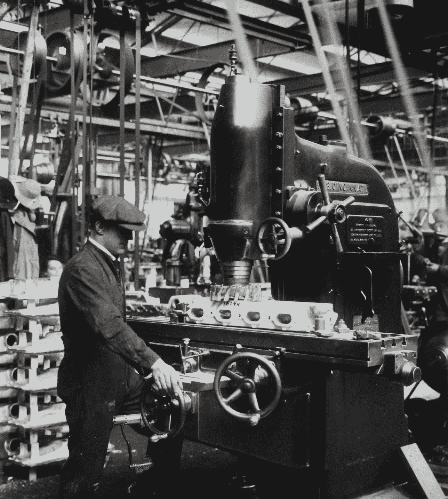
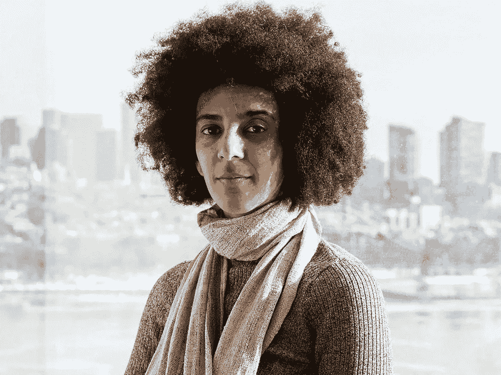

# 人工智能会成为新的“塑料”吗？

> 原文：<https://medium.com/analytics-vidhya/will-artificial-intelligence-become-the-new-plastic-8a1a41fae41f?source=collection_archive---------14----------------------->

仔细想想，人工智能和我们使用的塑料都是现代人类生活中无处不在的部分，因为它们对我们很有用。

我是说，你能想象一个没有他们的世界吗？

现在，为了让你完全理解这两件事之间的相似之处，我们将深入了解塑料的简史，以及它是如何成为我们生活方式中如此重要的一部分的。

维多利亚博物馆在 [Unsplash](https://unsplash.com?utm_source=medium&utm_medium=referral) 拍摄的照片

**塑料简史**

自从引入塑料以来，其产量已飙升至 2015 年的 3.8 亿吨，所有塑料的一半都是在 2005 年生产的。尽管大肆宣传，但我们看到回收的塑料比你想象的要少得多。美国产生的塑料中约有 8.7%被回收，其中绝大部分最终进入垃圾填埋场或环境中。事实上，我们周围的许多塑料是不可回收的，其余的通常最终会进入环境，被人类消费掉。研究表明，全球范围内，人们每周消耗大约 5 克塑料，相当于一张信用卡，但事实是，事情并不总是这么糟糕。事实上，当塑料生产在 20 世纪 50 年代开始增长时，塑料垃圾也在增长，随之而来的还有公众的强烈反对。

照片由 [Gayatri Malhotra](https://unsplash.com/@gmalhotra?utm_source=medium&utm_medium=referral) 在 [Unsplash](https://unsplash.com?utm_source=medium&utm_medium=referral) 上拍摄

到了 20 世纪 60 年代和 70 年代，各种组织开始通过像这样的广告来吸引人们对所有乱扔在景观中的包装废物的注意，但具有讽刺意味的是，制作这些广告(如[、【保持美国美丽】](https://www.youtube.com/watch?v=hr9_ejs_yiM)的组织是由塑料行业贸易团体和领先的包装公司资助的。到现在为止，你可能会感到困惑，并问自己，为什么生产塑料垃圾的公司会首先向它传播意识，直到你意识到广告背后的原因。

你看，这些公司认为解决问题的最好方法是让公众认为塑料污染问题是公众的错。这样看来，处理公共垃圾的责任在于公众，而不是塑料制造商。这种策略今天仍然有效，也是我们仍然认为污染是由我们这些最终用户造成的主要原因。根据研究，如果这些趋势继续下去，预计到 2050 年，海洋中的塑料含量将超过鱼类。

照片由[纳里曼·迈沙拉法](https://unsplash.com/@narimanmesharrafa?utm_source=medium&utm_medium=referral)在 [Unsplash](https://unsplash.com?utm_source=medium&utm_medium=referral) 拍摄

**塑料和人工智能的并行**

你可能会问自己这与人工智能有什么关系只要塑料一直存在，就一直存在如何最好地处理它们使用后产生的废物的问题，最近一个类似的问题开始出现，即训练和部署深度学习模型所需的高水平碳排放。在一项受到广泛讨论的 2019 年研究中，由 Emma Strubell 领导的一组研究人员估计，训练一个单一的深度学习模型可以产生高达 626，155 磅的二氧化碳排放——大约相当于五辆汽车的总碳足迹。

五辆汽车的插图

相比之下，普通人一年产生 36156 磅的二氧化碳排放量。

根据斯特鲁贝尔的估计，训练谷歌语言模型的一个版本，支撑该公司搜索引擎的[，产生了 1438 磅二氧化碳当量——几乎相当于纽约市和旧金山之间的往返航班。这些数字应被视为最小值，即一次训练一个模型的成本。在实践中，模型在研发过程中被训练和再训练多次。](https://blog.google/products/search/search-language-understanding-bert/)

如果你熟悉上面引用的论文，那么你可能已经知道 Timnit Gebru，他是谷歌的前研究员，仍然是人工智能伦理研究领域广受尊敬的领导者，因合著了一篇开创性的论文而闻名，该论文表明面部识别在识别女性和有色人种方面不太准确。“她是人工智能领域黑人研究人员社区 Black in AI 的联合创始人。

蒂姆尼特·格布鲁

她和她的合著者写了一篇论文，引用了 Strubell 关于大型语言模型的碳排放和财务成本的论文。发现自 2017 年以来，随着这些模型被输入越来越多的数据，它们的能耗和碳足迹一直在爆炸式增长。本文介绍了自然语言处理的历史，概述了大型语言模型的四个主要风险，并提出了进一步研究的建议。该论文指出，建立和维持如此大型的人工智能模型所需的纯粹资源意味着它们往往有利于富裕的组织，而气候变化对边缘化社区的打击最大。“研究人员早就应该优先考虑能源效率和成本，以减少对环境的负面影响和对资源的不公平获取，”该论文指出。

**为什么这篇论文很重要**

蒂姆尼特的论文有六位合著者，其中四位是谷歌的研究人员，但这篇论文不是由谷歌发表的，因为根据谷歌人工智能负责人杰夫·迪恩(Jeff Dean)在一封内部电子邮件中的说法，这篇论文“没有达到发表的标准，忽略了太多的相关研究。具体来说，他说这篇文章没有提到最近关于如何让大型语言模型更加节能和减轻偏见问题的工作。然而，这六位合作者吸收了广泛的学术知识。这篇论文的引用列表非常长，有 128 篇参考文献。“这是那种任何个人甚至两个作者都无法完成的工作，”艾米丽·m·本德(其他合著者之一)说。这真的需要这种合作。“然而，令我不安的是，我所读论文的在线版本确实提到了谷歌在减少大型语言模型的规模和计算成本以及衡量模型嵌入偏差方面的研究努力，尽管它认为这些努力还不够。

在论文撰写并提交发表后不久，蒂姆尼特收到了谷歌高管梅根·卡乔利亚(Megan Kacholia)的最后通牒，命令她撤回最新的研究论文，否则就把她的名字从作者名单中删除，同时删除的还有她的团队中的其他几名成员。她回答说，如果谷歌提供一份谁审查了这项工作以及如何审查的报告，并为未来的研究建立一个更加透明的审查程序，她就会这样做。蒂姆尼特写道，如果这些条件没有得到满足，一旦她有时间确保她的团队不会太不稳定，她就会离开谷歌。谷歌的回应是解雇她。

**这一切意味着什么？**

谷歌开创了许多基础性研究，这些研究导致了最近大型语言模型的爆发。谷歌人工智能在 2017 年率先发明了变形金刚语言模型，该模型是该公司后来的模型 BERT 以及 OpenAI 的 GPT-2 和 GPT-3 的基础。如上所述，伯特现在还负责谷歌搜索，这是该公司的摇钱树。谷歌有责任致力于人工智能的新范式，不需要指数级增长的数据集，也不需要惊人的巨额能源支出。像[少量学习](/quick-code/understanding-few-shot-learning-in-machine-learning-bede251a0f67)这样的新兴研究领域是有前途的途径。谷歌和其他大型科技公司有责任找到创新的无碳方式来创造更好的模式，因为他们有资源和人才来提出解决方案。本德还担心谷歌的行为可能会对未来的人工智能伦理研究产生“寒蝉效应”。许多人工智能伦理领域的顶级专家都在大型科技公司工作，因为那里有钱赚。“这在很多方面都是有益的，”她说。“但我们最终得到的是一个生态系统，它可能有一些激励措施，但这些措施对世界科学进步来说并不是最好的。”

照片由[米卡·鲍梅斯特](https://unsplash.com/@mbaumi?utm_source=medium&utm_medium=referral)在 [Unsplash](https://unsplash.com?utm_source=medium&utm_medium=referral) 上拍摄

这篇文章的重点是强调如果大公司不听从早期的警告信号，可能会发生的破坏性趋势，我在人工智能的案例中看到了同样的事情。我们需要后退一步，承认简单地建立越来越大的神经网络不是通往广义智能的正确道路。从基本原则出发，我们需要推动自己发现更优雅、更有效的方法来模拟机器智能。我们与气候变化的持续斗争，以及我们星球的未来，都取决于此。现在，我们正在努力寻找拯救环境免受塑料污染的最佳方式。我们不必在人工智能上犯同样的错误，我们必须作为一个社区共同努力，以确保我们不会走上同样的道路。

伊恩·施耐德在 [Unsplash](https://unsplash.com?utm_source=medium&utm_medium=referral) 上拍摄的照片

在最近一次对马克斯·布朗利的采访中(你可以在下面找到)，在时间戳 [12:54](https://www.youtube.com/watch?v=n2RNcPRtAiY) 马克斯问桑德尔·皮帅(谷歌首席执行官)，他希望他在未来 50 年的科技世界中留下什么。他的答案之一是负责任地推动人工智能向前发展。我真心希望五十年后这个愿望会实现。