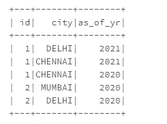
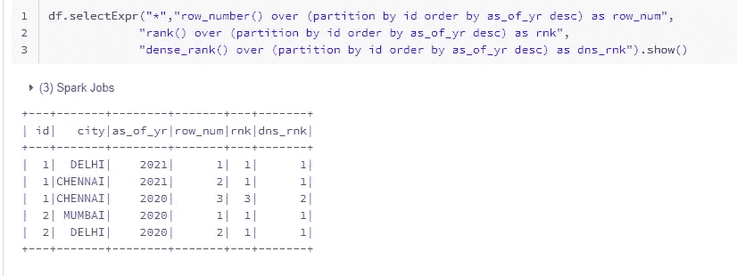
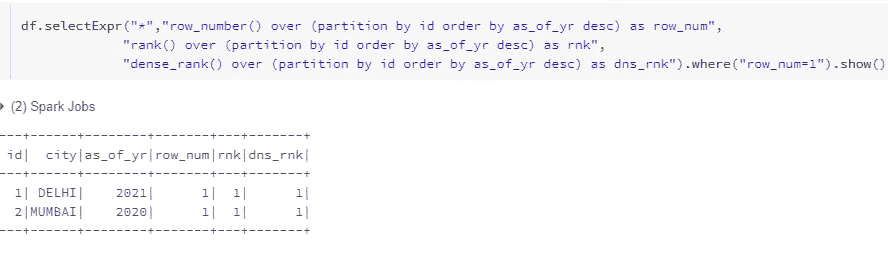
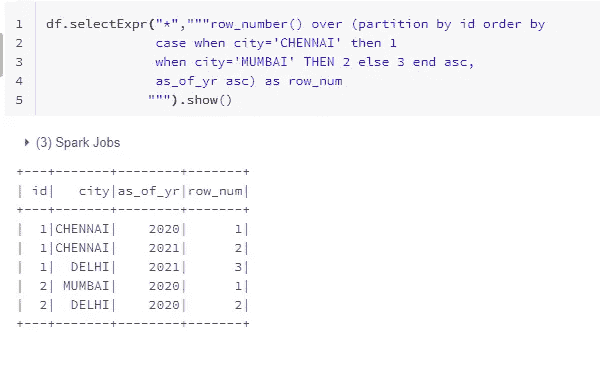
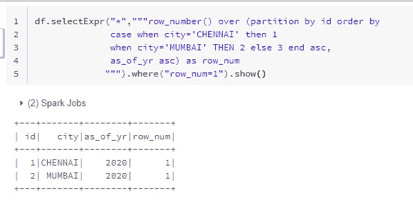
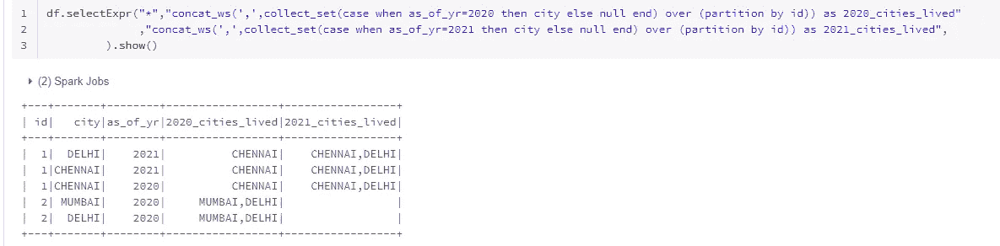
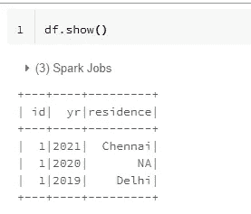
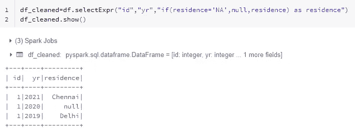
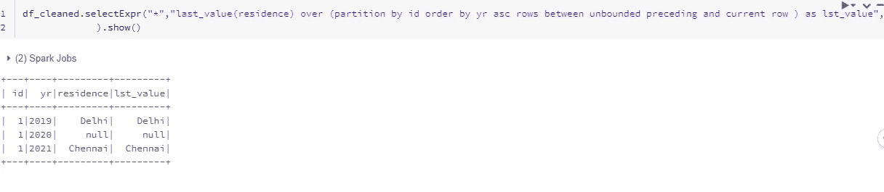
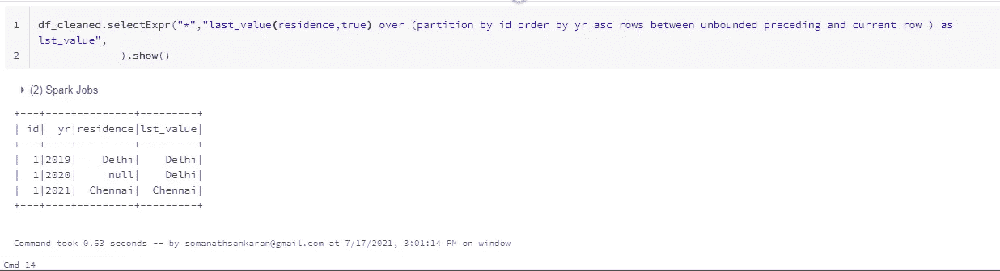

# 窗口功能深度潜水

> 原文：<https://medium.com/analytics-vidhya/window-functions-deep-dive-4aeffebf81e1?source=collection_archive---------6----------------------->

这是我在《火花深潜》中的一个故事

# [https://medium.com/@somanathsankaran](/@somanathsankaran)

在这篇博客中，我们将看到窗口函数如何拯救各种分析用例。

我仍然记得当我启动窗口函数的时候，我只记得它被用于行号排序。

在这篇博客中，我将尝试提供一些我们可以利用窗口功能的用例

1.  删除重复项
2.  基于优先级的拣选
3.  部分选择
4.  Excel 拖动相似功能

注意:这不是对窗口函数的介绍，有很多相关的资料。

## 窗口功能关键组件

在编写任何窗口函数之前，我们需要记住下面的逻辑

> **函数 over (partition by group 子句 order by 子句)**

函数→最小值、最大行数等函数

分区依据→数据分组所依据的字段

order by →选择组中的最新值

## 删除重复项

让我们考虑下面的数据。

获取 id 的最新记录是最常见的用例。

有几个选项可用，如[等级](https://spark.apache.org/docs/latest/api/python/reference/api/pyspark.sql.functions.rank.html#pyspark-sql-functions-rank)、[密集 _ 等级](https://spark.apache.org/docs/latest/api/python/reference/api/pyspark.sql.functions.rank.html#pyspark-sql-functions-rank)、[行 _ 编号](https://spark.apache.org/docs/latest/api/python/reference/api/pyspark.sql.functions.rank.html#pyspark-sql-functions-rank)

> **但是最适合的是行号，因为在其他函数的情况下，如果我们在 order by 子句中获得相同的值，则两者都将被赋予相同的值**

参照我们的上述标准

函数→行数

partition by →id(因为我们需要为每个 id 选取 1 行)

订购依据→(自 _ 年 _ 月 _ 日起，desc，因为我们需要获取最新数据)

我们看到两个行的 rank 和 dense rank 都返回 1，因为按年份排序是相同的(2021 年)。大多数情况下，人们错误地认为第二条记录会发生跳跃(即 2020 年分配 3，dense rank 分配 2)

最终查询:

## 基于优先级的拣选

下一个挑战是当我们拾取相同的数据而不是最新的数据时，我们可能需要优先考虑某个字段。例如，对于这个数据，我们假设如果钦奈可用，我们必须接钦奈，即使它不是最新的。如果我们在同一个城市中有多行，那么“截止年份”应该是最小的一行，因为我们需要知道此人居住在钦奈的时间

参照我们的上述标准

函数→行数

partition by →id(因为我们需要为每个 id 选取 1 行)

order by→我们使用 case 语句在 order by 子句中指定优先级，也按年份排序，因为我们需要知道一个人从什么时候开始生活

我们使用 case 语句按优先级排序，如上所示

最终查询:

3.部分选择

让我们考虑下面的场景

让我们假设我们需要得到城市生活(即我们需要创建列 2021 _ 城市生活，2020 _ 城市生活的每个 id)

参照我们的上述标准

function →concat_ws("，"，collect_Set(city)因为我们需要得到 2020 年、2021 年居住的所有城市

partition by →id(因为我们需要为每个 id 选取 1 行)

order by→不需要

因为我们只需要考虑 2020 年为 020 个城市居住的年份

> **我们将通过使用 case** 将其他行转换为 null 来创造奇迹

> df.selectExpr("* "，" concat_ws('，')，collect_set( **case 当 as _ of _ yr = 2020 then city else null end)over(partition by id)**)as 2020 _ cities _ lived "
> ，" concat_ws('，'，collect_set(case 当 as _ of _ yr = 2021 then city else null end))over(partition by id)as 2021 _ cities _ lived "，
> )。显示()
> 
> **这里的关键是带有 null 的 case 语句，它会将不需要的行 with 转换为 null。例如，当我们需要 2020 年的列表时，id 1 在 2021 年居住的德里被跳过**

## **Excel 拖动类似功能**

> 最后一个用例是当我们可能需要用以前的可用数据填充空白数据时，类似于 excel 拖动加号图标。

让我们考虑下面的数据

在这种情况下，由于我们不知道 2020 年的 id 居住地，我们可以使用 2019 年的数据进行 ffill 或使用 2021 年的数据进行回填。

参照我们的上述标准

partition by →id(因为我们需要为每个 id 选取 1 行)

order by →asc 因为我们要回填 2019 年的数据

函数→最后一个值，将选取组中最后一个有效值(2019 年到 2021 年的数据)

步骤 2:因为我们需要填充 NA 行的最后一个值。

我们需要将 Na 行转换为 null(这样做的原因将在后面讨论)

> 第三步:我们将把 partition by 与未绑定的前一行和当前行之间的行结合起来，这将限制我们选择的行
> 
> ***前无界后无界—填写所有行***
> 
> ***未绑定的前一行和当前行—从组*** 中的所有前一行到当前行进行检查
> 
> ***当前行和无界后续——从当前行检查到组*** 下面的所有行

如果我们只使用最后一个值和当前行之前的所有行，我们知道最后一个值是行的相应值。这里的技巧是让 ignore null 变为 true

这将获得最后一个非空值并解决我们的问题

> **这就是我们将 NA 或垃圾值改为 null 的原因**

今天就到这里吧！！快乐阅读

学习并让别人学习干杯！！

***请把我在 spark 中必须涉及的话题发给我，并给我提供改进写作的建议:)***