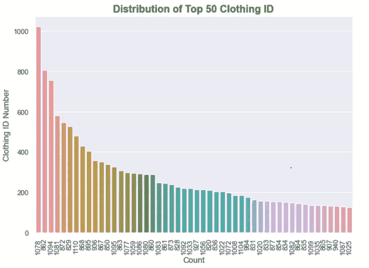
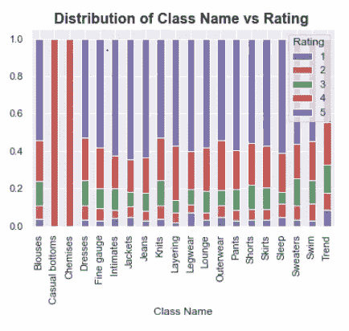
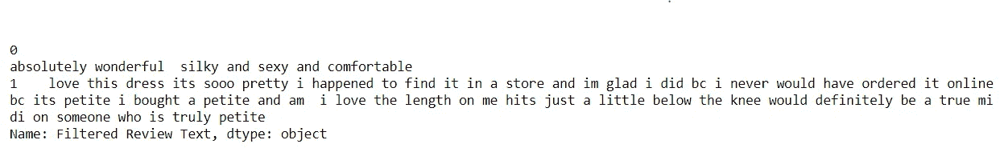
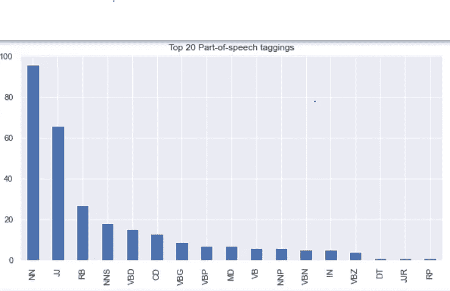

# EDA 自动化和文本处理

> 原文：<https://medium.com/analytics-vidhya/women-ecommerce-clothing-part-1-86b1acd19ffa?source=collection_archive---------4----------------------->

通过情感分析探索数据和可视化


在 [Unsplash](https://unsplash.com?utm_source=medium&utm_medium=referral) 上 [Cam Morin](https://unsplash.com/@camorin13?utm_source=medium&utm_medium=referral) 拍摄的照片

在这篇文章中，我将分析女装电子商务数据集，该数据集包含数字数据、客户撰写的文本评论(此处[可用](https://www.kaggle.com/nicapotato/womens-ecommerce-clothing-reviews/version/1#))。

下面列出了我们将要遵循的步骤

*   数据描述
*   数据清理
*   数据预处理
*   数据分析
*   数据可视化
*   数据建模

让我们从第一步数据描述开始吧

该数据集包括 23486 行和 10 个特征变量。每行对应一个客户评论，包括变量:

*   服装 ID:整数分类变量，指的是正在审核的特定服装。
*   年龄:评论者年龄的年龄。
*   标题:评论的标题。
*   评论文本:客户对产品的描述。
*   评级:客户对不同的产品进行评级，从最差 1 到最佳 5
*   推荐的 IND:二进制变量，说明客户推荐产品的位置，其中 1 表示推荐，0 表示不推荐。
*   积极反馈计数:正整数，记录认为此评论积极的其他客户的数量。
*   分部名称:产品高级分部的分类名称。
*   部门名称:产品部门名称的分类名称。
*   类名:产品类名的分类名称。

所以让我们来获得一些见解。我们如何做到这一点？不用担心，我们有熊猫图书馆。

```
# Library for data manipulation and data exploration
import pandas as pd
import numpy as npdf = pd.read_csv('Womens Clothing E-Commerce Reviews.csv')
df.head()
```


```
#Droping Unnamed: 0 col as it doesn't have any role in data
df.drop('Unnamed: 0',axis=1)
```


找出列数据类型，每列中有多少空值，最后但同样重要的是，我们还可以找到行数和列数。

```
df.info()
```


描述函数很好地帮助我们了解一些基本的统计细节，如

1.  数据帧的百分位数、平均值、标准差、分位数范围

2.找出偏斜度和异常值。为了更好的可视化，我们可以绘制异常值的箱线图。

**如何从 describe()中求偏度？**

让我们来看一个特征**年龄**我们可以看到，我们 50%的数据位于 18 至 41 岁之间。所以我们可以说我们的年龄特征是右偏的。

```
df.describe()
```


```
df.describe(include='o')
```


从所有列中查找唯一值。数据中有 77 个不同的年龄。

```
df.nunique()
```


在数据中查找空值(nan)。如我们所见，标题、评论文本、部门名称、部门名称、班级名称有 nan 值，因此我们将删除它们。

```
df.isnull().sum()
```


计算唯一值和缺失值，并嵌入到一个表中以便更好地理解。

```
unique_count = []
for x in df.columns:
    unique_count.append([x,len(df[x].unique()),df[x].isnull().sum()])

pd.DataFrame(unique_count, columns=["Column","Unique","Missing"]).set_index("Column")
```


删除空值，然后检查数据集的形状。删除空值之前，数据集有 23486 行和 10 列，删除之后，我们有 19662 行和 10 列。

```
df = df.dropna()
df.shape
```

通过为数值数据和对象数据创建单独的数据框，您将了解我们何时使用可视化。

```
df_numerical = df.select_dtypes(include=['int64'])
df_categorical = df.select_dtypes(include=['object'])
df_cat = df[['Division Name', 'Department Name','Class Name']]print("Numerical col: ", df_numerical.columns)
print()
print("Object col: ", df_cat.columns)
```


到目前为止，我们已经对不同的功能做了一些探索，但我们没有在标题和评论文本中做探索。稍后，我们将了解这两个特性。现在让我们关注其他专栏。

让我们在热图的帮助下检查每个特征的**相关性**。

```
#annot will help us to present int in heatmap
sns.heatmap(df.corr(), annot=True) 
plt.title('Heatmap for Whole Data', fontsize = 16, fontweight = 'bold')
```


**解读关联:**

`corr()`方法计算数据集中每一列之间的关系。

让我们来看看评级和推荐指数之间的相关性。它是 0.79，这意味着它们彼此高度相关，因为它们的相关性接近 1。

简单来说，评分越高的服装越容易被推荐给人们。

使用 **pairplot** 函数查找不同的图形，以便于分析。

让我们解释一下服装标识和正面反馈数的图表。我们可以看到，大多数服装标识都是推荐给顾客的。

```
sns.pairplot(df, hue='Recommended IND')
```


```
# Import library for Data Visualization
import matplotlib.pyplot as plt
import seaborn as sns#setting the theme for seaborn
sns.set_theme(style="darkgrid")
%matplotlib inline
```

让我们做一些有趣的事情，准备好一些视觉化的东西。

可视化将分为以下格式:

1.  单变量可视化

2.双壁可视化

3.平凡的视觉化

# 单变量可视化

如何选择哪个图表最适合数值型或分类型数据？

对于分类数据:饼图、条形图

对于数值数据:直方图、散点图

我们将从目标变量开始

```
# Converting 0 & 1 in Not Recommended & Recommended
df.loc[df['Recommended IND'] == 0, 'Recommended IND'] = "Not Recommended" 
df.loc[df['Recommended IND'] == 1, 'Recommended IND'] = "Recommended"plt.figure(figsize = (6,4))
x = df['Recommended IND'].value_counts()
labels = 'Recommended','Not Recommended'
plt.pie(x = x,  labels = labels,
        autopct = '%.2f%%', 
        textprops = {'size' : 'x-large',
                   'fontweight' : 'bold'})
plt.title('Distribution of Recomended ID', fontsize = 14, fontweight = 'bold')
plt.legend(labels, loc="upper left", bbox_to_anchor = (1,1))
plt.tight_layout()
plt.show()
```


目标变量可视化

**解读**

我们向客户推荐的 82%的数据意味着数据质量良好。

## 数值数据的单变量可视化。

```
df.hist(bins=10, color='steelblue', edgecolor='black', linewidth=1.0,
           xlabelsize=8, ylabelsize=8, grid=False)    
plt.tight_layout(rect=(0, 0, 2, 2))
```


**解读:**

正如我们在图表**中看到的，服装 Id** 有更多的偏斜。

**年龄**有偏态，99 岁的人怎么给评分。所以我可能认为他们虚报了年龄。

**评级**我们的确有一款产品评级较少，但大部分数据都在 5 个评级中。

**推荐指标**主要是向客户推荐产品

## 分类数据的单变量可视化

```
plt.figure(figsize=[14,10])
n=1
for x in df_cat:
    plt.subplot(2,2,n)
    sns.countplot(x=df[x],data=df)
    sns.despine()
    plt.title("Distribution of {} ".format(x), fontsize=16, fontweight='bold')
    plt.xticks(rotation=55)
    n=n+1
plt.tight_layout()
plt.show()
```


**释义:**

**部门名称:**一般产品比私密产品更受欢迎

**部门名称:**选择最多的产品是上衣&连衣裙

连衣裙、针织衫和衬衫是最受欢迎的

## 服装 ID 的单变量分布

```
plt.figure(figsize=(8,6))
ax = sns.countplot(x='Clothing ID', data = df, 
                   order = df['Clothing ID'].value_counts().index[:50])
plt.title(' Distribution of Top 50 Clothing ID ', fontsize = 16, fontweight = 'bold')
plt.xlabel('Count', fontsize = 13)
plt.xticks(rotation=90)
plt.ylabel('Clothing ID Number', fontsize = 13)
plt.tight_layout()
plt.show()
```



**释义:**

绘制前 50 名服装标识，这样我们就可以知道哪种类型的服装是受欢迎的

# 二元可视化

## 分部、部门和类别名称与推荐的 IND

```
for x in df_cat:
    y = pd.crosstab(df[x],df['Recommended IND'])
    y.div(y.sum(1).astype(float), axis=0)
    y.plot(kind='bar', stacked=True)
    plt.title("Distribution of {} vs Recommended IND".format(x), fontsize=16, fontweight='bold')
    plt.xticks(rotation=55)
```


**释义:**

**分部名称:**推荐服装多为一般产品

**部门名称:**与其他服装相比，夹克是唯一不太被推荐的产品。

**班级名称:**有趣的结果是潮流服饰只被推荐我们没有任何差评。

## 年龄、正反馈计数与推荐的 IND

```
plt.figure(figsize=[17,10])
n=1
label = df[['Age', 'Positive Feedback Count']]
for x in label:
    plt.subplot(2,1,n)
    sns.countplot(x=df[x], hue='Recommended IND',data=df)
    sns.despine()
    plt.title("Frequency count of {} ".format(x), fontsize=16, fontweight='bold')
    plt.xticks(rotation=90)
    n=n+1
plt.tight_layout()
plt.show()
```


**释义:**

在 39 岁时，推荐该产品的人最多。30 岁到 50 岁之间的年龄段推荐该产品的人数最多。

正反馈计数不能提供太多信息。

## **分部、部门&班级名称与等级**

```
for x in df_cat:
    y = pd.crosstab(df[x],df['Rating'])
    y.div(y.sum(1).astype(float), axis=0).plot(kind='bar', stacked=True)
    plt.title("Distribution of {} vs Rating ".format(x), fontsize=16, fontweight='bold')
```



**释义:**

*   最低的 1 级和 2 级给一般产品，而最高的 5 级给亲密产品
*   与另一个不同的部门名称相比，潮流服饰的评分最低，为 5 分
*   休闲的下装和衬衫给出了最高的 4 星评级，没有其他奇怪的评级。

## 年龄与评级

```
df1=df.copy()
bins = np.arange(0,100,10)
df1['Age group'] = pd.cut(df1['Age'], bins)
df1.columnsdf1 = df1.groupby(['Rating', df1['Age group']]).size().reset_index(name='n')
df1.columnsratings_count_df_pivot = pd.pivot_table(df1,index=["Age group"],
               values=["n"],
               columns=["Rating"],
               aggfunc=[np.sum])ratings_count_df_pivot.plot(kind = 'bar', stacked=True, fontsize = 14)
plt.title('Age vs Rating', fontweight='bold', fontsize = 16)
```


## 分部、部门和班级名称与年龄

```
plt.figure(figsize=[8,10])
n=1
for x in df_cat:
    plt.subplot(3,1,n)
    sns.boxplot(x=df[x], y='Age',data=df)
    sns.despine()
    plt.title("Frequency count of {} Vs Age".format(x), fontsize=16, fontweight='bold')
    plt.xticks(rotation=55)
    n=n+1
plt.tight_layout()
plt.show()
```


**释义:**

30-40 岁的人经常购买产品。

上衣是由 60-70 岁的人带来的。老年人不喜欢时髦的衣服。

泳装是在 90 岁左右的时候带来的，这是非常罕见的。

## 分部、部门和类别名称与分部、部门和类别名称

```
f, ax = plt.subplots(1,2,figsize=(16, 2), sharey=True)
sns.heatmap(pd.crosstab(df['Division Name'], df["Department Name"]),
            annot=True, linewidths=.5, ax = ax[0],fmt='g', cmap="Blues",
                cbar_kws={'label': 'Count'})
ax[0].set_title('Division Name Count by Department Name (Count Distribution)', fontsize=16, fontweight='bold')sns.heatmap(pd.crosstab(df['Division Name'], df["Department Name"], normalize=True).mul(100).round(0),
            annot=True, linewidths=.5, ax=ax[1],fmt='g', cmap="Blues",
                cbar_kws={'label': 'Percentage %'})
ax[1].set_title('Division Name Count by Department Name (Percentage Distribution)', fontsize=16, fontweight='bold')
ax[1].set_ylabel('')plt.tight_layout(pad=0)
plt.show()
```

cgar_kws =用于标注 y 标签。

normalize = True 表示对整体值进行规范化。

更多信息请访问熊猫官方网站。

 [## pandas.crosstab - pandas 1.2.3 文档

### 编辑描述

pandas.pydata.org](https://pandas.pydata.org/docs/reference/api/pandas.crosstab.html) 

**释义:**

**总体规模**的优势更多地存在于**部门名称**内的各个类别中。一般娇小型和部门型之间有显著的总体差异。

```
f, ax = plt.subplots(1,2,figsize=(16, 7), sharey=True)
sns.heatmap(pd.crosstab(df['Class Name'], df["Division Name"], normalize=True).mul(100).round(0),
            annot=True, linewidths=.5, ax = ax[0],fmt='g', cmap="Blues",
                cbar_kws={'label': 'Percentage %'})
ax[0].set_title('Class Name Count by Division Name (Percentage %)')sns.heatmap(pd.crosstab(df['Class Name'], df["Department Name"], normalize=True).mul(100).round(0),
            annot=True, linewidths=.5, ax=ax[1],fmt='g', cmap="Blues",
                cbar_kws={'label': 'Percentage %'})
ax[1].set_title('Class Name Count by Department Name (Percentage %)')
ax[1].set_ylabel('')plt.tight_layout(pad=0)
plt.show()
```


**释义:**

我们已经看到，连衣裙的受欢迎程度远远超过针织衫。

到目前为止，我们已经看到了一些基本的操作和单方向和双方向可视化。保持下去！

这篇博客将会很长，所以如果你想的话，就休息一下，然后重新加入下一步的程序。我知道有时候一口气做完所有事情会很忙，所以休息一下，吃点小点心。


[费尔南达·罗德里格斯](https://unsplash.com/@ferrgc112?utm_source=medium&utm_medium=referral)在 [Unsplash](https://unsplash.com?utm_source=medium&utm_medium=referral) 上的照片

所以让我们跳到我们最后保留的非常激动人心的部分。我最喜欢的部分 **NLP。**

让我们来看看特写**标题，评论文字**

```
pd.set_option(‘max_colwidth’, 500)
 df[[‘Title’,’Review Text’]].head(3)
```


自然语言处理专家可以很容易地通过删除标点符号、停用词等来判断文本是否需要清理。

## 干净的文本

```
# improt nltk library for cleaning the text
import nltk
nltk.download('wordnet')
nltk.download('stopwords')
nltk.download('all')
nltk.download('punkt')# for stopwords removal
from nltk.corpus import stopwords#for word tokenizing
from nltk import word_tokenize#for stemming
from nltk.stem import PorterStemmer#for making wordcloud
from wordcloud import WordCloud, STOPWORDS
```

文本需要干净，所以我们将开始转换成小写所有的文本。

**制作清理功能，用于清理文本并保存到不同的数据框中。**

```
def clean_text(text):

    # Make lowercase
    text = text.apply(lambda x: " ".join(x.lower() for x in x.split()))# Remove special characters
    text = text.apply(lambda x: "".join(["" if ord(i) < 32 or ord(i) > 126 else i for i in x]))# Remove whitespaces
    text = text.apply(lambda x: " ".join(x.strip() for x in x.split()))

    # Remove punctuation
    text = text.str.replace('[^\w\s]', '')

    # Remove numbers
    text = text.str.replace('\d+', '')
    # Convert to string
    text = text.astype(str)

    return text# Applying clean_text function to data
df['Filtered Review Text'] = clean_text(df['Review Text'])
df['Filtered Review Text'].head(2)
```



## 问:为什么我们需要将文本转换成小写？

**答:**举个例子，比如一个男孩正在吃一个**苹果**。一天一个苹果，医生远离我。

这里苹果有相同的意思，但一个是小写，另一个是大写。为了消除这样的错误，我们将文本转换成小写。

## 问:删除特殊字符和数字。重要吗？

**Ans:** 我们不必一直删除数字，这取决于使用情况。像这里，我们不需要它，这就是为什么我们要删除特殊字符。

删除不必要的空格和标点符号，以便更好地理解数据。

## 删除停用词。**我们为什么需要这么做？**

**Ans** :停用词是任何自然语言中最常见的词。为了从分析文本数据和构建 NLP 模型的数据中获得更多的洞察力，这些停用词可能不会给文档的含义增加太多价值。

停用词有 I，and，you，are，When 等。

我们并不总是需要删除停用词，这取决于机器翻译或文本摘要等不建议删除的用例。在我们的例子中，我们正在清理文本并找出文本的情绪(积极的、消极的或中性的)

```
# Removing stop words
stop = stopwords.words('english')df['Filtered Review Text'] = df['Filtered Review Text'].apply(lambda x: ' '.join([word for word in x.split() if word not in (stop)]))
df['Filtered Review Text'][:2]
```


现在我们要找到文本的情感。简要了解评级或推荐的 IND 与客户给出的评论之间的关系会有所帮助。

# 情感分析

```
# library for Sentiment Analysis
from nltk.sentiment.vader import SentimentIntensityAnalyzer
from nltk.sentiment.util import *# Sentiment Analysis
SIA = SentimentIntensityAnalyzer()
df["Review Text"]= df["Review Text"].astype(str)# Applying Model, Variable Creation
df['Polarity Score']=df["Review Text"].apply(lambda x:SIA.polarity_scores(x)['compound'])
df['Neutral Score']=df["Review Text"].apply(lambda x:SIA.polarity_scores(x)['neu'])
df['Negative Score']=df["Review Text"].apply(lambda x:SIA.polarity_scores(x)['neg'])
df['Positive Score']=df["Review Text"].apply(lambda x:SIA.polarity_scores(x)['pos'])# Converting 0 to 1 Decimal Score to a Positive, Negative, Neutral Variable
df['Sentiment']=''
df.loc[df['Polarity Score']>0,'Sentiment']='Positive'
df.loc[df['Polarity Score']==0,'Sentiment']='Neutral'
df.loc[df['Polarity Score']<0,'Sentiment']='Negative'
df[['Polarity Score', 'Neutral Score', 'Negative Score', 'Positive Score', 'Sentiment']][:3]
```


## 解释:

我们使用 NLTK 情感强度分析器模块进行情感分析。在这里，我们将文本分为三个维度:正面、中性和负面，总体情绪存储在情绪列中。

*   **中性/阴性/阳性分数:**表示这些类别的效力在 0 和 1 之间。
*   **极性评分:**测量正/中性/负值之间的差异，其中接近 1 的正数表示阳性，接近-1 的负数表示阴性。

我们来做一些分析吧！！

```
sns.countplot(x='Sentiment', hue='Recommended IND', data=df)
plt.title("Distribution of Sentiment vs Recommended IND".format(x), fontsize=16, fontweight='bold')
```


```
sns.countplot(x='Sentiment', hue='Rating',data=df)   
plt.title("Distribution of Sentiment vs Rating".format(x), fontsize=16, fontweight='bold')
```


```
sns.countplot(x='Rating', hue='Sentiment',data=df)   
plt.title("Distribution of Sentiment vs Rating".format(x), fontsize=16, fontweight='bold')
```


**释义:**

大多数评论文章都有积极的回应，并推荐给客户。

与负面部分的其他评级相比，评级 3 的负面情绪更多。

```
pd.crosstab(df['Sentiment'], df['Division Name']).plot(kind='bar')
plt.title('Distribution of Sentiment vs Division Name', fontweight='bold', fontsize=16)
```


```
pd.crosstab(df['Sentiment'], df['Department Name']).plot(kind='bar')
plt.title('Distribution of Sentiment vs Department Name', fontweight='bold', fontsize=16)
```


```
x = pd.crosstab(df['Class Name'], df['Sentiment'])
x.plot(kind='bar',stacked=True)
plt.title('Distribution of Sentiment vs Class Name', fontweight='bold', fontsize=16)
```


消极情绪更多地出现在服装上。

# Wordcloud

```
# Library for wordcloud
from wordcloud import WordCloud, STOPWORDS# Creating a function cloud
def cloud(text,stopwords=stopwords): # title,
    wordcloud = WordCloud(width=1600, height=800,
                          background_color='black',
                          stopwords=stopwords,
                         ).generate(str(text))

    # Output Visualization
    fig = plt.figure(dpi=80, facecolor='k',edgecolor='k')
    plt.imshow(wordcloud,interpolation='bilinear')
    plt.axis('off')
    #plt.title(fontsize=50,color='y')
    plt.tight_layout(pad=0)
    plt.show()
```

**低评文本中出现频率最高的单词为类名。**

这有助于我们直观地看到评价低的常用词

```
print('Most Frequent Words in Low Review Text for Class Name')
temp = df['Filtered Review Text'][df.Rating.astype(int) < 3]# Modify Stopwords to Exclude Class types, suchs as "dress"
new_stop = set(STOPWORDS)
new_stop.update([x.lower() for x in list(df["Class Name"][df["Class Name"].notnull()].unique())])# Cloud
cloud(temp.values,  stopwords = STOPWORDS)
```


类别名称的高评级评论文本中最常见的单词

```
print('Most Frequent Words in High Ratied Review Text for Class Name')
temp = df['Filtered Review Text'][df.Rating.astype(int) >= 3]# Modify Stopwords to Exclude Class types, suchs as "dress"
new_stop = set(STOPWORDS)
new_stop.update([x.lower() for x in list(df["Class Name"][df["Class Name"].notnull()].unique())]
                + ["dress", "petite", "skirt","shirt"])# Cloud
cloud(temp.values,  stopwords = STOPWORDS) #title= title,
```


我们可以像对部门名称和分部名称的低&高审查文本的类名那样进行同样的操作。

# 可视化顶部 n-gram

```
#library
from sklearn.feature_extraction.text import CountVectorizer#top_n_gram function
def top_n_ngram(corpus,n = None,ngram = 1):
    vec = CountVectorizer(stop_words = 'english',ngram_range=(ngram,ngram)).fit(corpus)
    # Have the count of  all the words for each review text
    bag_of_words = vec.transform(corpus) 
    # Calculates the count of all the word in the whole review text
    sum_words = bag_of_words.sum(axis =0) 
    words_freq = [(word,sum_words[0,idx]) for word,idx in vec.vocabulary_.items()]
    words_freq = sorted(words_freq,key = lambda x:x[1],reverse = True)
    return words_freq[:n]
```

## 评论文本中的前 20 个单字

```
common_words = top_n_ngram(df['Filtered Review Text'], 20,1)
df1 = pd.DataFrame(common_words, columns = ['Review Text' , 'count'])
plt.figure(figsize =(10,4))
df1.groupby('Review Text').sum()['count'].sort_values(ascending=False).plot(
kind='bar', title='Top 20 unigrams in Filtered Review Text')
```


## 评论文本中的前 20 个二元模型

```
common_words = top_n_ngram(df['Filtered Review Text'], 20,2)
df2 = pd.DataFrame(common_words, columns = ['Filtered Review Text' , 'count'])
plt.figure(figsize =(10,5))
df2.groupby('Filtered Review Text').sum()['count'].sort_values(ascending=False).plot(
kind='bar', title='Top 20 bigrams in Filtered Review Text')
```


# 评论文本中的前 20 个三元模型

```
common_words = top_n_ngram(df['Filtered Review Text'], 20,3)
df2 = pd.DataFrame(common_words, columns = ['Filtered Review Text' , 'count'])
plt.figure(figsize =(10,5))
df2.groupby('Filtered Review Text').sum()['count'].sort_values(ascending=False).plot(
kind='bar', title='Top 20 trigrams in Filtered Review Text')
```


## 前 20 个词性标注

```
# library for POS
!pip install TextBlob
from textblob import *blob= TextBlob(str(df['Filtered Review Text']))
pos = pd.DataFrame(blob.tags,columns =['word','pos'])
pos1 = pos.pos.value_counts()[:20]
plt.figure(figsize = (10,5))
pos1.plot(kind='bar',title ='Top 20 Part-of-speech taggings')
```



什么是 POS？

将一个句子转换成单词列表的过程，用于构建词干分析/词干分析，用于将单词简化为其词根形式

想了解更多信息，我推荐阅读这个博客。

[](https://www.quora.com/What-is-a-POS-tag-and-why-do-we-need-this) [## 什么是 POS 标签，我们为什么需要它？

### 答:词性标签是表示一个词的词性的标签(让我们不要担心词性和词性之间的细微差别)

www.quora.com](https://www.quora.com/What-is-a-POS-tag-and-why-do-we-need-this) [](/analytics-vidhya/pos-tagging-using-conditional-random-fields-92077e5eaa31) [## NLP 指南:使用条件随机字段识别词性标签

### 词性标注是根据上下文将语料库中的单词标注到相应的词性标签的过程

medium.com](/analytics-vidhya/pos-tagging-using-conditional-random-fields-92077e5eaa31) 

所以现在我们已经完成了

*   数据清理
*   数据预处理
*   数据分析(情感分析)
*   数据可视化(单变量/双变量/三变量，Worcloud)

在我的下一篇文章中，我们将讨论数据建模及其步骤。

如果你发现我的帖子内容丰富，请喜欢它，并随时欢迎评论！