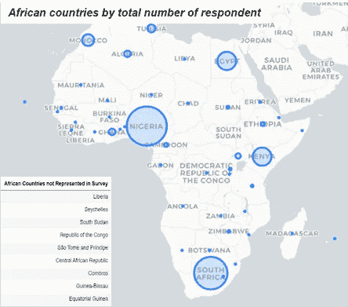
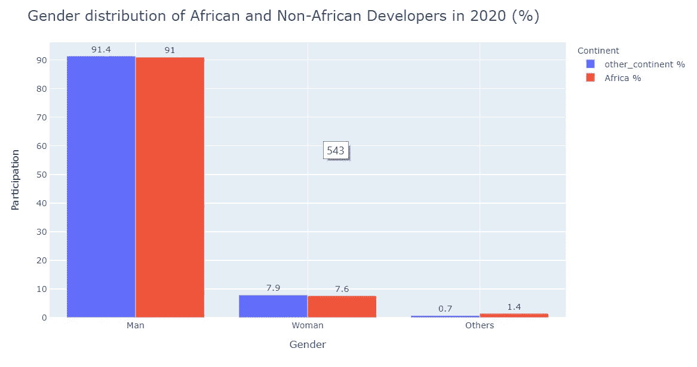
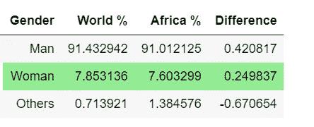
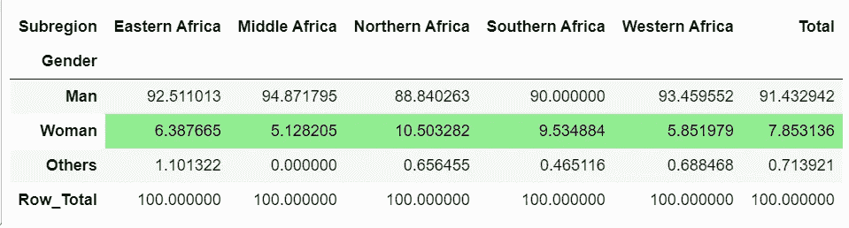

# 非洲妇女参与软件开发

> 原文：<https://medium.com/analytics-vidhya/women-participation-in-software-development-in-africa-995964319ce7?source=collection_archive---------32----------------------->

## ***在非洲，每 1 名女性开发者，至少有 10 名男性***

照片由[克里斯蒂娜](https://unsplash.com/@wocintechchat)在 [Unsplash](https://unsplash.com/) 拍摄

我相信你已经多次听说过“越来越多的女性参与 STEM”(科学、技术、工程和数学)，并想知道有什么事实可以支持这一观点。这个短语在大多数非洲国家几乎是通用的，政府和政策制定者都把它作为口头禅，你会想“它有多糟糕，值得如此关注？”

这篇文章的目的是展示妇女参与软件开发的事实，并让读者得出结论“增加妇女参与 STEM”是否确实是非洲国家必要的政策方向。

对于本文，我将依靠 2020 年栈溢出开发者调查数据。Stack Overflow 是一个问答论坛，开发者在这里提出问题，并从世界各地的开发者伙伴那里获得答案。Stack Overflow 每年进行一次调查，最近一次调查于 2020 年 2 月发表。

# **关于 2020 年的小调查:**

该调查收集了来自世界各地(共 184 个国家)开发者的 64，461 份有效回复，其中包括 45 个非洲国家，共有 1961 份回复。

作者照片|非洲国家受访者人数

# 在整个非洲及其次区域，妇女在软件开发中的代表性如何？

我们通过查看所有 49 个非洲国家和每个地区参与这项研究的妇女人数来回答这个问题。只有 7.6%的非洲受访者认为自己是女性。这意味着每有一名女性开发人员，就有至少 10 名男性开发人员。这一结果与关于测试者的报告一致，埃及和南非(来自非洲的前 2 名)平均有 7.4%的女性参与软件开发。

> 7.6%的非洲受访者认为自己是女性。这意味着每有一名女性开发人员，就有至少 10 名男性开发人员。

作者照片|按性别分列的非洲软件开发者分布(%)

# 与世界其他地方相比，非洲怎么样？

软件开发中的性别差异不仅限于非洲。除了欧洲和亚洲的一些国家，世界其他地区加起来几乎和非洲处于同一水平。乍一看下面的图表，模式看起来很相似。

作者照片|妇女参与软件开发与世界其他地区的妇女参与

作者照片|妇女参与软件开发与世界其他地区的妇女参与

# 就地区而言，是否存在合理的地区差异？

除了南部和北部非洲有 9.5%到 10.5%的妇女参与软件开发外，所有其他地区的妇女参与率都在 5%到 6%之间。

作者照片|女性与男性参与软件开发

# 结论

这篇文章主要展示了女性在非洲软件开发中的表现。这些统计数字很吓人，表明在非洲国家，女性在软件开发中的代表性不足。对大多数非洲国家来说，在科学、技术、工程和数学领域为女性制定平权行动似乎是一个不错的选择，鼓励年轻女孩参与科学、技术、工程和数学将有助于弥合这一鸿沟。

详见 [Github](https://github.com/raymonbell01/StackOverflow-Survey-2020) 上的详细分析