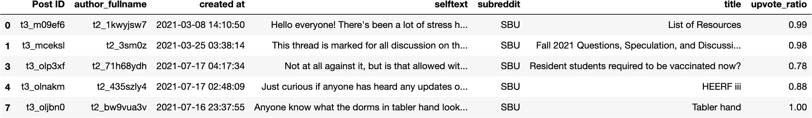
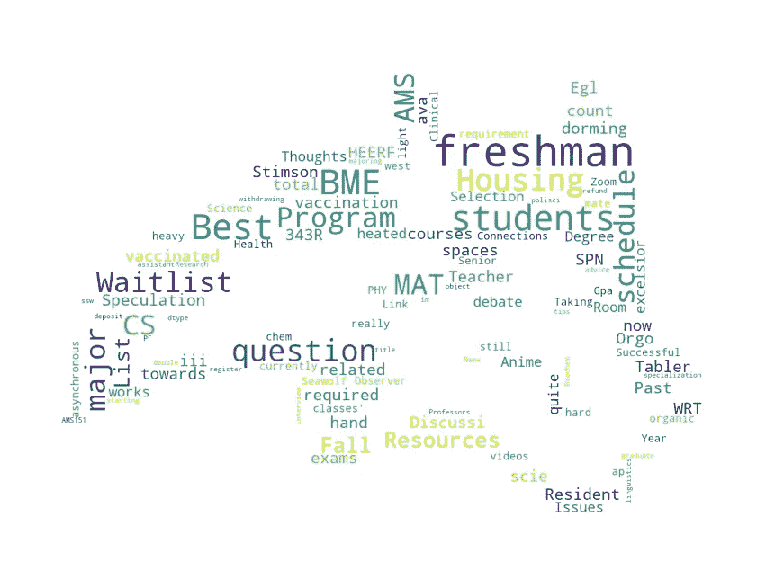
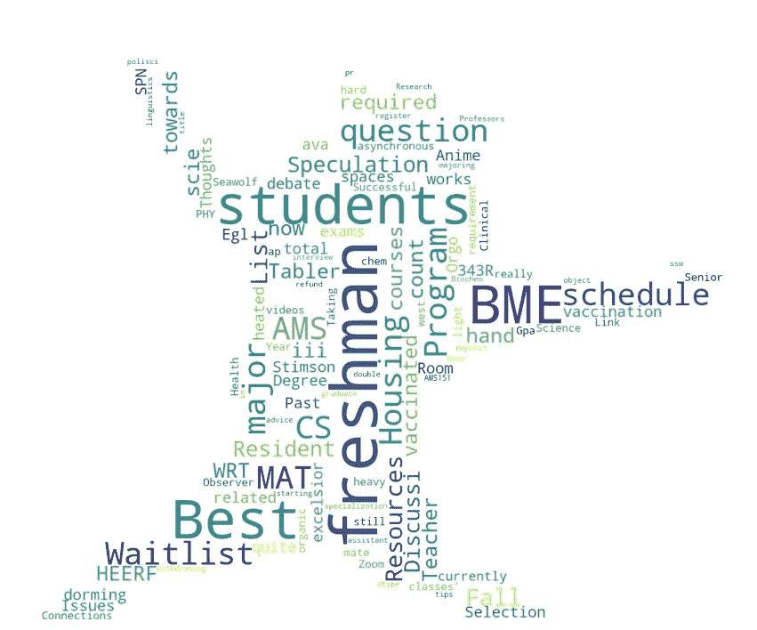

# python 中的 Word 云教程

> 原文：<https://medium.com/analytics-vidhya/word-cloud-tutorial-in-python-b045e9d1e1b2?source=collection_archive---------9----------------------->


Thimo Pedersen

单词云是在不同形状中显示的不同大小的单词的集合。如果频率(单词出现的次数)较高，单词会显得更大更粗。

💡词云也称为标签云或文本云。

在本文中，我们将:

*   创建一个基本的单词云。
*   将单词 cloud 设计成我们想要的任何形状。

**步骤 1:** 安装&导入必要的库和包

```
# pip install numpy
# pip install pandas
# pip install Pillow
# pip install matplotlib
# pip install wordcloudimport numpy as np 
import pandas as pd 
from PIL import Image
import matplotlib as mpl
import matplotlib.pyplot as plt
from wordcloud import WordCloud
```

**第二步:**加载文本数据，并根据需要进行一些处理

```
df = pd.read_csv("./data/sbu_hot_post.csv", index_col=[0])
df = df.dropna()
df.head()
```



**第三步:**为所需类别绘制词云

```
# SBU hot news titles word cloud

mpl.rcParams['figure.figsize']=(15,15) 
mpl.rcParams['font.size']=20  

wordcloud = WordCloud(    background_color='white',
                          max_words=500,
                          max_font_size=100, 
                          random_state=1
                         ).generate(str(df['title']))

fig1 = plt.figure(1)
plt.imshow(wordcloud)
plt.axis('off')
plt.show()
```


```
# SBU hot news details word cloud

wordcloud = WordCloud(    background_color='white',
                          max_words=500,
                          max_font_size=100, 
                          random_state=1
                         ).generate(str(df['selftext']))

fig2 = plt.figure(2)
plt.imshow(wordcloud)
plt.axis('off')
plt.show()
```


**第四步:**保存图像

```
fig1.savefig("/Users/nilsonchapagain/Desktop/Blogs/images/sbuHotNews.png")
```

**干得漂亮！现在为了让云这个词变得漂亮，你可以查看文档**

## 运筹学

**按“shift + tab”并调整可用参数。**

# 下一步:把单词 could 做成任何想要的形状！！！

这需要我们向前一步，找到一个图像作为遮罩。搜索具有白色背景的图像。对于本教程，我在 python 文件所在的路径下创建了“images”文件夹，并存储了所有的蒙版图像。

```
pwd()'/Users/nilsonchapagain/Desktop/Blogs'# trying over SBU mascot

mask = np.array(Image.open("/Users/nilsonchapagain/Desktop/Blogs/images/mascot.jpg"))

wordcloud = WordCloud(    background_color='white',
                          max_words=500,
                          max_font_size=100, 
                          random_state=1,
                          mask=mask
                         ).generate(str(df['title']))

fig1 = plt.figure(1)
plt.imshow(wordcloud)
plt.axis('off')
plt.show()
```



```
# trying over wolfie at SBU 

mask = np.array(Image.open("/Users/nilsonchapagain/Desktop/Blogs/images/wolfiepic.png"))

wordcloud = WordCloud(    background_color='white',
                          max_words=500,
                          max_font_size=100, 
                          random_state=1,
                          mask=mask
                         ).generate(str(df['title']))

fig1 = plt.figure(1)
plt.imshow(wordcloud)
plt.axis('off')
plt.show()
```



```
# trying over Nepal's national flag

mask = np.array(Image.open("/Users/nilsonchapagain/Desktop/Blogs/images/nepalFlag.png"))

wordcloud = WordCloud(    background_color='white',
                          max_words=500,
                          max_font_size=100, 
                          random_state=1,
                          mask=mask
                         ).generate(str(df['title']))

fig1 = plt.figure(1)
plt.imshow(wordcloud)
plt.axis('off')
plt.show()
```


## 谢谢你看我的帖子。我希望你学到了一些有用的东西🙌 🎉。