# 在 Hadoop 上使用 MapReduce 进行字数统计

> 原文：<https://medium.com/analytics-vidhya/word-count-using-mapreduce-on-hadoop-6eaefe127502?source=collection_archive---------0----------------------->

您是否有大量的文本数据需要他们统计每个单词的出现次数？如果是的话，你已经有了 Hadoop 来处理你的“大数据”。

在本文中，我们将尝试在 Hadoop 上运行 MapReduce 来解决字数问题。所以不再浪费时间，让我们开始吧。

开始前我们需要关心的事情？

**1。Oracle VM VirtualBox:** 在本地安装 Hadoop 可能会很痛苦，而且大多数时候，如果不小心安装，很可能会出错。因此，我们将使用预先安装了 Hadoop 的 Cloudera Quickstart 虚拟机实例，然后*睡个安稳觉。*

如果你已经安装了 VirtualBox，你就可以开始下一步了。如果没有，从这里的 [**下载。**](https://www.virtualbox.org/wiki/Downloads)

**注意:**最好安装 VirtualBox 6 . 1 . 18 版，以免出现任何问题。这个程序在这个版本上进行了测试，运行得非常完美。

**2。Cloudera Quickstart VM 5.4.2:** 从 [**此**](https://cutt.ly/UxYeKku) 链接下载 cloud era quick start VM 5 . 4 . 2。它是一个预装了 Hadoop 的虚拟机实例。

下载完成后，解压。zip 文件，并将**cloud era-quick start-VM-5 . 4 . 2–0-virtualbox . OVF**文件作为“设备”导入 VirtualBox。

为此，请打开 VirtualBox 单击菜单栏上的文件，并选择导入设备选项。浏览至提取 Cloudera Quickstart 虚拟机的位置。

根据您的需要配置设置，或者保持默认设置不变。

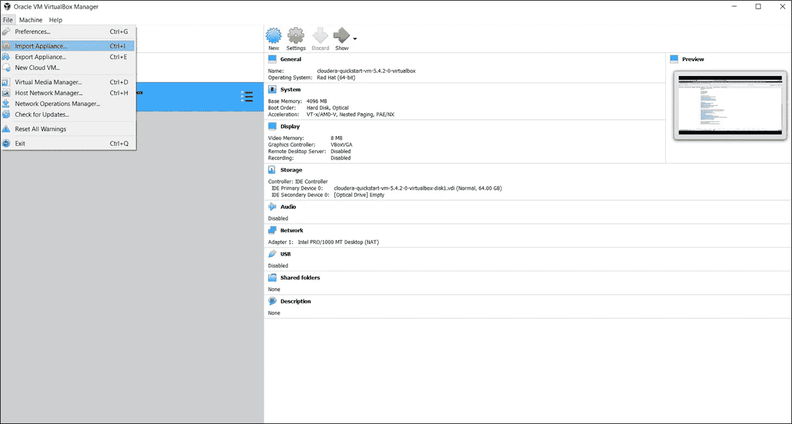

Oracle VM VirtualBox

如果一切都配置和设置成功，我们现在可以玩实际的游戏了。

**第一步:**在 VirtualBox 上打开 Cloudera Quickstart VM。

Cloudera 快速启动虚拟机

**步骤 2:** 在 **/home/cloudera** 目录下创建一个. txt 数据文件，该文件将作为输入传递给 MapReduce 程序。为简单起见，我们将其命名为 **word_count_data.txt.**

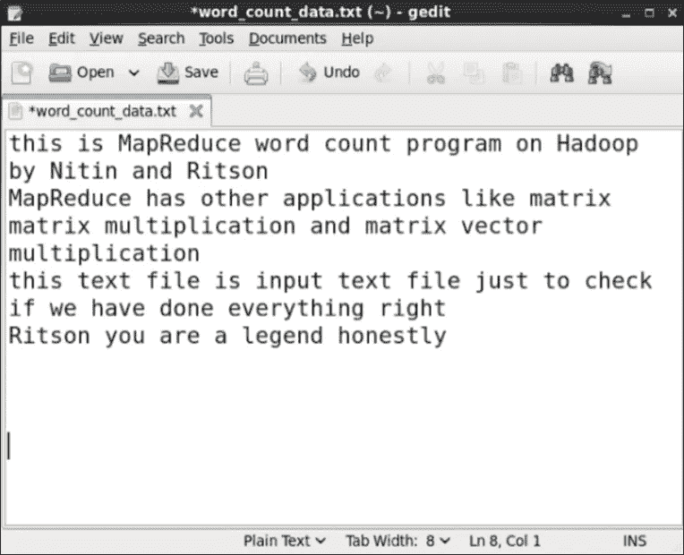

文本数据文件

Ritson 是我的朋友。:)

**第三步:**在 **/home/cloudera** 目录下创建映射器和缩减器文件。

您可以从下面的 GitHub 库中获得它们。
a)[mapper . py](https://github.com/NSTiwari/Hadoop-MapReduce-Programs/blob/main/WordCount/mapper.py)
b)[reducer . py](https://github.com/NSTiwari/Hadoop-MapReduce-Programs/blob/main/WordCount/reducer.py)

**第四步:**在 Hadoop 上运行之前，在本地测试 MapReduce 程序，检查一切是否正常。

在 Cloudera Quickstart VM 实例上打开终端并运行以下命令:
**cat word _ count _ data . txt | python mapper . py | sort-k 1，1 | python reducer.py**

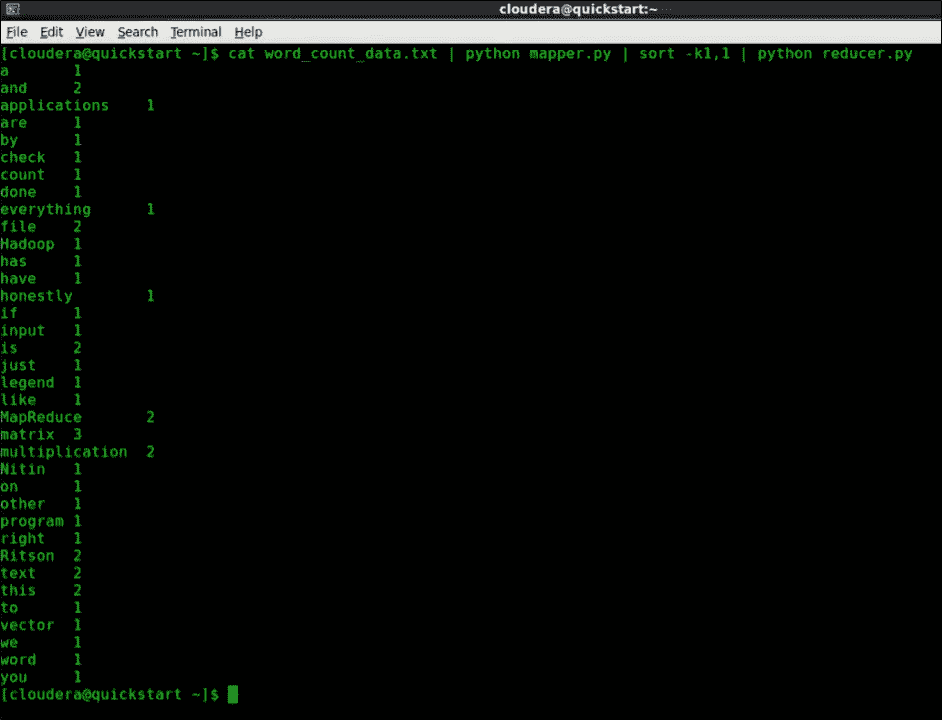

MapReduce 的本地检查

对于上面的例子，获得的输出与预期的完全一样。
如果你看到所有的单词都被正确地映射、排序并减少到各自的数量，那么你的程序就可以在 Hadoop 上测试了。

**第五步:**配置 Hadoop 服务和设置。

现在，在运行 MapReduce 程序进行字数统计之前，我们需要在 Hadoop 上配置某些设置。

**5a:登录 Cloudera Manager** 在 Cloudera Quickstart VM 上打开浏览器，并通过输入用户名和密码作为 *cloudera* 的凭证打开**quickstart.cloudera:7180/cmf/login.**登录。

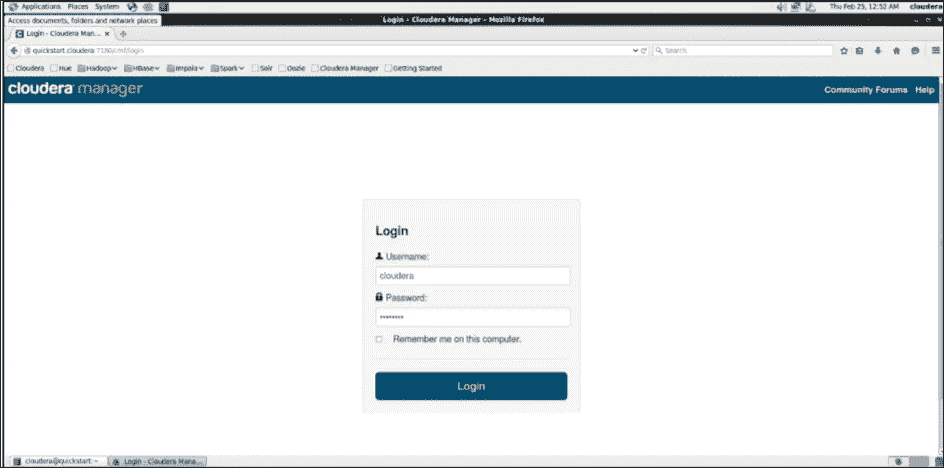

**注意:**如果您在登录**quickstart.cloudera:7180/cmf/login**时看到错误*“无法连接”*，请尝试重启 CDH 服务。

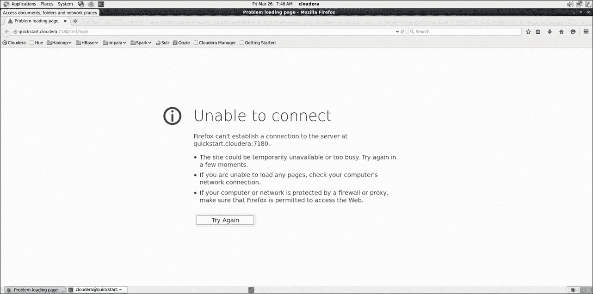

通过键入以下命令重新启动 CDH 服务:
**sudo/home/cloud era/cloud era-manager-express-force**

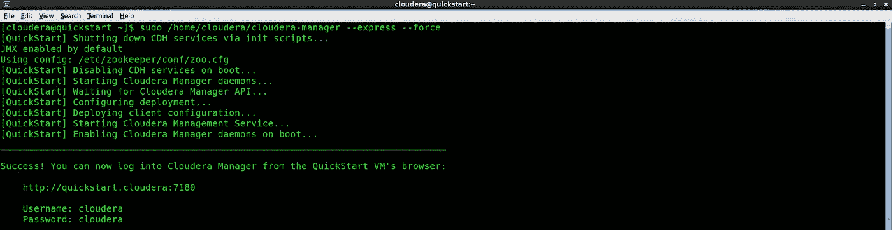

**5b:开始 HDFS 和纱线服务。** 点击下拉箭头，选择*开始*选项，用于 HDFS 和纱线服务。

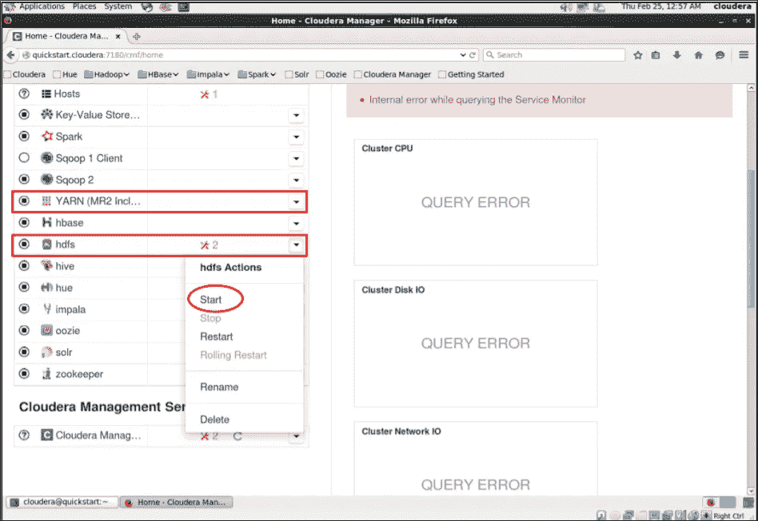

开始 HDFS 和纱线服务

如果两者都有，您将看到以下内容；HDFS 和纱线服务成功启动。

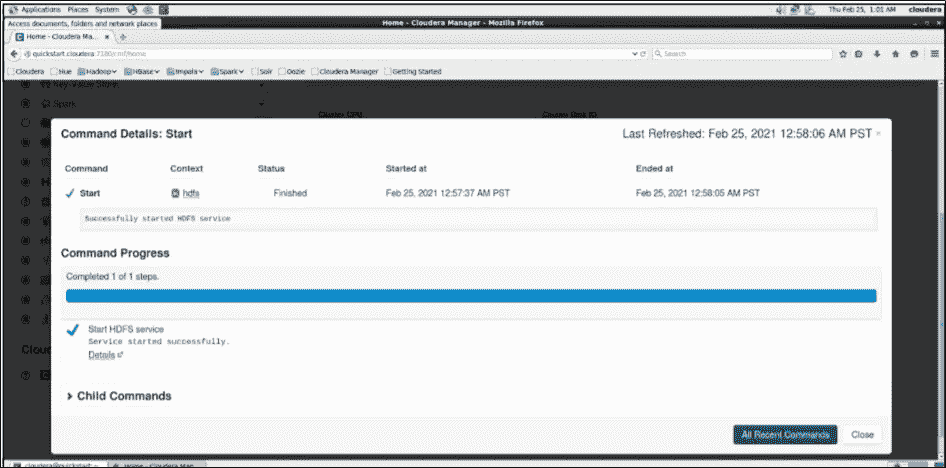

HDFS 服务成功启动

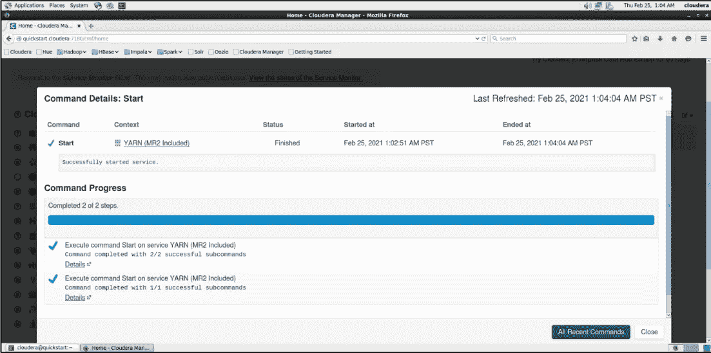

纱线服务成功启动

第六步:在 HDFS 上创建一个目录

现在，我们在 HDFS 上创建一个名为 **word_count_map_reduce** 的目录，我们的输入数据及其结果输出将存储在这里。

使用下面的命令。
**sudo-u HDFS Hadoop fs-mkdir/word _ count _ map _ reduce**

**注意:**如果目录已经存在，则使用以下命令创建一个新目录或删除现有目录。

**导出 HADOOP _ USER _ NAME = HDFS
HDFS DFS-rmr/word _ count _ map _ reduce**

使用以下命令列出 HDFS 目录项。
**hdfs dfs -ls /**

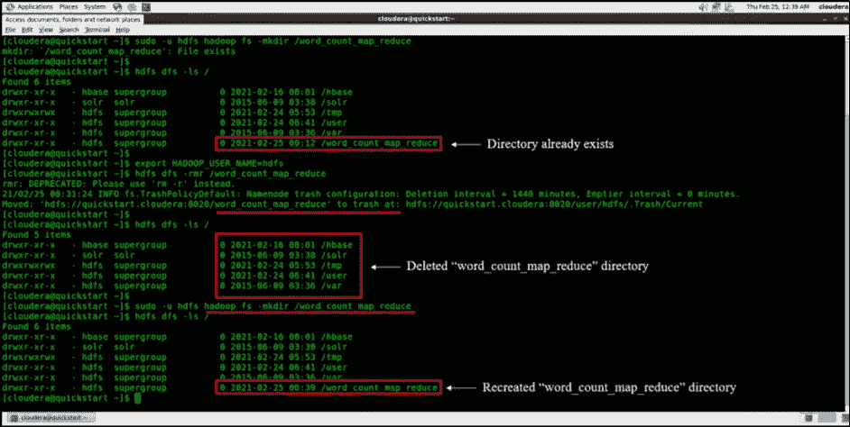

删除/创建 HDFS 上的目录

**步骤 7:** 将输入的数据文件复制到 HDFS 上。

使用以下命令将 word_count_data.txt 文件复制到 HDFS 上的 **word_count_map_reduce** 目录。

**sudo-u HDFS Hadoop fs-put/home/cloud era/word _ count _ data . txt/word _ count _ map _ reduce**

检查文件是否成功复制到所需位置。
**HDFS DFS-ls/word _ count _ map _ reduce**

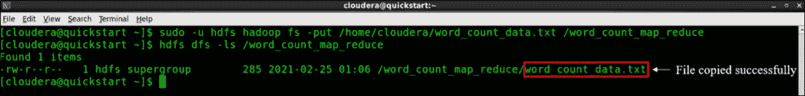

HDFS 上的输入文件复制成功

**第八步:**下载 hadoop-streaming JAR 2.7.3。

在虚拟机上打开浏览器，进入 [**这个**](https://jar-download.com/artifacts/org.apache.hadoop/hadoopstreaming/2.7.3/source-code) 链接，下载 hadoop-streaming JAR 2.7.3 文件。

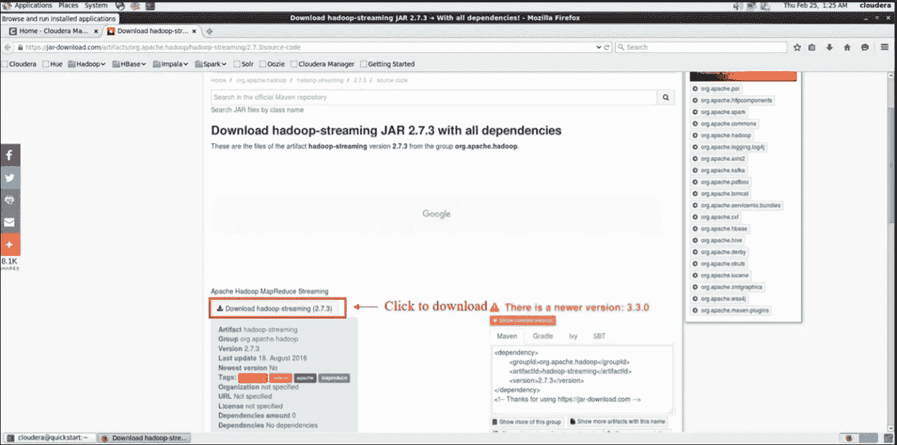

下载 Hadoop-流 JAR 2.7.3

文件下载完成后，将其解压到 **/home/cloudera** 目录下。仔细检查 JAR 文件是否解压成功，是否存在于
**/home/cloudera** 目录中。

**ls**

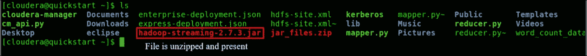

hadoop-streaming-2.7.3.jar 下载成功

**第 9 步:**在 Hadoop 上配置运行 MapReduce 的权限。

我们几乎已经准备好在 Hadoop 上运行 MapReduce 作业，但在此之前，我们需要授予在 Hadoop 上读取、写入和执行 Mapper 和 Reducer 程序的权限。

我们还需要为默认用户(cloudera)提供在 HDFS 内部编写输出文件的权限。

为此，请运行以下命令:

**chmod 777 mapper . py reducer . py
sudo-u HDFS Hadoop fs-chown cloud era/word _ count _ map _ reduce**

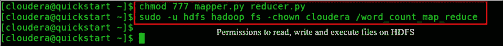

授予在 HDFS 上读取、写入和执行文件的权限

**第十步:**在 Hadoop 上运行 MapReduce。

我们正处于这个项目的最后一步。使用以下命令在 Hadoop 上运行 MapReduce 作业。

**Hadoop jar/home/cloud era/Hadoop-streaming-2 . 7 . 3 . jar \
>-input/word _ count _ map _ reduce/word _ count _ data . txt \
>-output/word _ count _ map _ reduce/output \
>-mapper/home/cloud era/mapper . py \
>-reducer/home/cloud era/reducer . py**

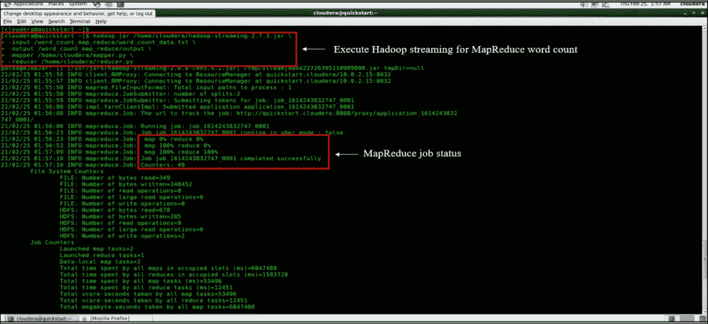

为 MapReduce 执行 Hadoop 流

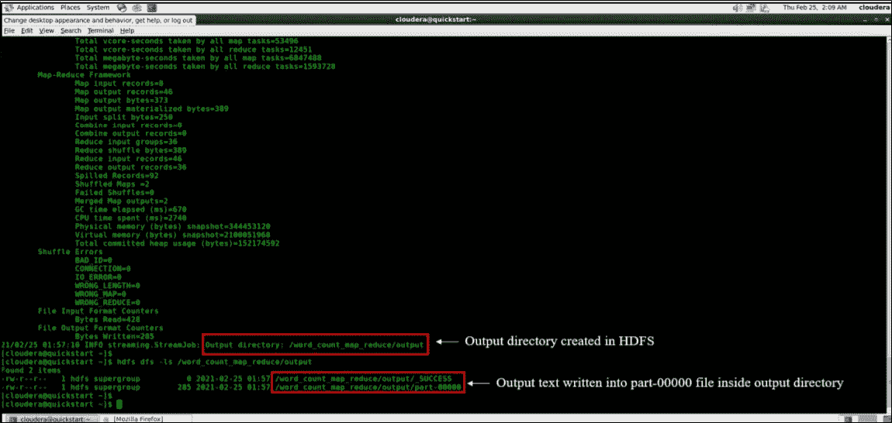

MapReduce 作业已执行

如果您在终端上看到如上两幅图所示的输出，那么 MapReduce 作业执行成功。

**步骤 11:** 读取 MapReduce 输出。

现在，最后运行下面的命令来读取 MapReduce 的输出，以计算您创建的输入数据文件的字数。

**HDFS DFS-cat/word _ count _ map _ reduce/output/part-00000**

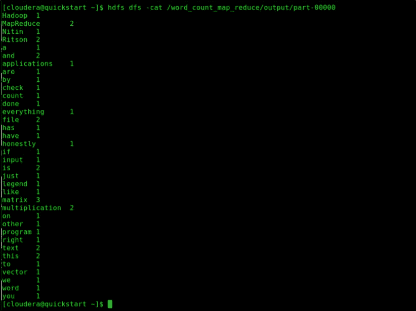

Hadoop 上的 MapReduce 输出

恭喜您，Hadoop 上 MapReduce 的输出完全符合预期。输入数据文件中的所有单词已经被映射、排序并减少到它们各自的计数。

如果你想在这方面谈得更多，请随时通过 LinkedIn 与我联系。到那时，再见。