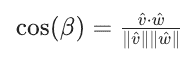
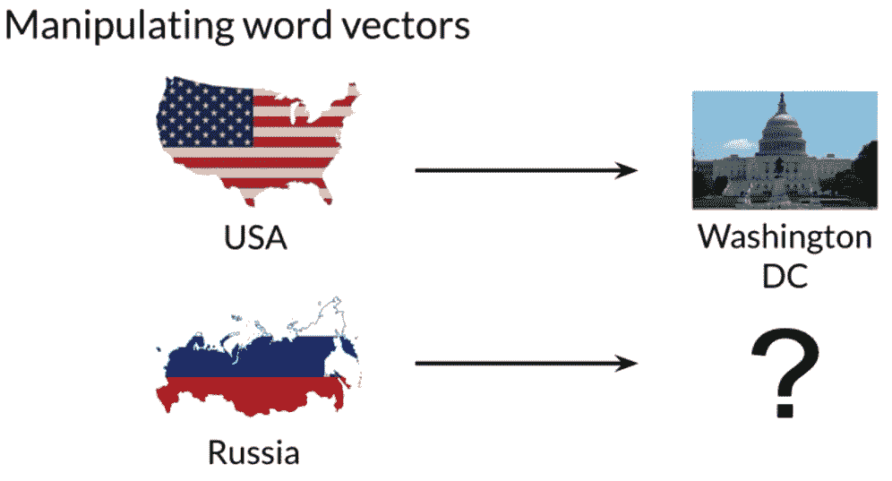
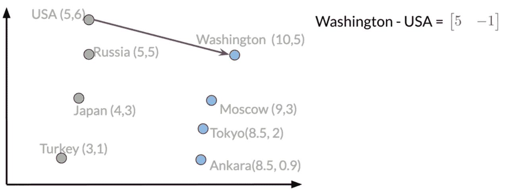

# 单词嵌入和向量空间模型

> 原文：<https://medium.com/analytics-vidhya/word-embedding-and-vector-space-models-11c9b76f58e?source=collection_archive---------1----------------------->

向量空间模型捕捉语义和单词之间的关系。在这篇文章中，我将讨论如何创建单词向量来捕捉单词之间的依赖关系，然后使用 PCA 在二维空间中可视化它们的关系。

对于这个话题，我将要谈论的是:

*   介绍向量空间模型
*   逐字逐句和逐字逐句的文档设计
*   欧几里得距离
*   余弦相似性
*   可视化和 PCA

*免责声明:本文基于 Coursera 上* ***自然语言处理与分类和向量空间*** *课程的第 3 周。学分以下的大部分数字归课程版权所有。*

**点击这里查看我的最终项目** *:* [*点击这里*](https://github.com/KarenJF/deeplearing_nlp/blob/master/c1_nlp_classification_vec_spaces/week3/C1_W3_Assignment.ipynb)

# 1.**向量空间模型**

我们想学习向量空间模型的原因有很多。对于一个明显的例子来说，**它们可以用于识别问题回答、解释和总结的相似性**。例如，在下面的例子中，左边的两个问题具有不同的含义，而右边的两个问题具有相似的含义。

图片来自自然语言处理第 3 周的分类和向量空间课程

向量空间模型也可以让你捕捉单词之间的依赖关系。在下面的两个例子中，你可以看到单词*【麦片】*和单词*【碗】*是有联系的。同样，你可以看到*【卖出】*取决于*【买入】*。使用向量空间模型，您将能够捕捉不同单词集之间的这种和许多其他类型的关系。

*   你用 ***碗*** 吃 ***麦片***
*   你 ***买*** 的东西，别人 ***卖*** 的东西

向量空间模型可以有许多应用，例如:

*   信息提取——以何人、何事、何处、如何等方式回答问题。
*   机器翻译
*   聊天机器人编程
*   更多

图片来自自然语言处理第 3 周的分类和向量空间课程

当使用向量空间模型时，表示的方式是通过识别文本中每个单词周围的上下文，这捕获了相对的含义。**总之，向量空间模型允许你用向量来表示单词和文档。这抓住了相对意义。**

图片来自自然语言处理第 3 周的分类和向量空间课程

# 2.一个字一个字地，一个字一个文件地

## a.逐字设计

**概念:**两个不同的词的共现是它们在某个词距 k 内一起出现在语料库中的次数。

例如，我们在你的语料库中有两个句子:

*   我喜欢简单的数据
*   我更喜欢简单的原始数据

让我们为在一定距离 k = 2 内一起出现的单词建立一个共现矩阵。则同现中的“数据”行可以是:

图片来自自然语言处理第 3 周的分类和向量空间课程

通过一个单词接一个单词的设计，我们可以得到一个有 n 个条目的表示，n 介于 1 和你的整个词汇量之间。

**b. Word by 文档设计**

**概念:**统计我们的词汇表中的单词在属于特定类别的文档中出现的次数。

举个例子，

1.  我们可以有一个由不同主题的文档组成的语料库，如娱乐、经济和机器学习。
2.  然后，我们计算属于这三个类别的单词在文档中出现的次数。

图片来自自然语言处理第 3 周的分类和向量空间课程

**c .向量空间**

一旦我们使用一个单词接一个单词或一个单词接一个文档的设计为多组文档或单词构建了表示，我们将得到我们的向量空间。

图片来自自然语言处理第 3 周的分类和向量空间课程

在我们构造了向量空间之后，很容易看到经济和机器学习文档比娱乐类别更相似。

我们可以使用余弦相似度和欧几里德距离来比较矢量表示，以便获得它们之间的角度和距离。

# 3.欧几里得距离

**概念:**欧氏距离是连接它们的直线段的长度。

图片来自自然语言处理第 3 周的分类和向量空间课程

**N 维向量的欧几里德距离**

计算 n 维向量的欧几里德距离的方法类似于二维计算，如上例所示。

*   首先得到每个维度之间的差异。
*   求差的平方，然后求和，然后得到结果的平方根。
*   这个公式就是我们正在比较的向量之间的差的范数。

图片来自自然语言处理第 3 周的分类和向量空间课程

总而言之:

*   欧几里得距离是两点之间的直线
*   为了计算欧几里得距离，我们计算我们正在比较的向量之间的差的范数。
*   通过使用这个度量，我们可以了解两个文档或单词有多相似。

# 4.**余弦相似度**

欧几里德距离的一个问题是，它并不总是准确的，有时我们并不寻找那种类型的相似性度量。例如，当使用欧几里德距离将大文档与小文档进行比较时，可能会得到不准确的结果。在下面的例子中，语料库中的单词 totals 彼此不同。例如，农业和历史语料库的字数相近，而食品语料库的字数相对较少。

*   如果我们使用欧几里得距离作为度量来寻找相似性，我们会说农业类似于历史，但不类似于食物。
*   通常情况下，农业和食品比农业和历史更相似。然而，食品主体比农业主体小得多。为了进一步阐明，虽然历史语料库和农业语料库不同，但它们具有更小的欧几里德距离。

图片来自自然语言处理第 3 周的分类和向量空间课程

为了解决这个问题，我们看看向量之间的余弦。余弦相似性度量相对于欧几里德距离的主要优势在于**它不会因表示之间的大小差异而有所偏差。**

**余弦相似公式**

在我们进入余弦相似性之前，我们想回顾两个函数:

*   向量的范数定义为:

*   doc 产品定义为:

*   余弦相似性方程为:

图片来自自然语言处理第 3 周的分类和向量空间课程

**余弦相似度解释:**

*   两个向量越相似，就越接近 1
*   如果两个向量正交，余弦为 0

图片来自自然语言处理第 3 周的分类和向量空间课程

**总之:**

*   余弦相似性度量与您正在比较的向量的方向之间的相似性成比例。
*   余弦相似度取 0 到 1 之间的值。

**在向量空间中操作单词**

现在我们讨论了如何构建向量空间来表示文本，以及我们可以使用什么度量来查找文本相似性。我们可以使用单词向量来提取模式，并识别文本中的某些结构。

**例子:**假设我们有一个向量空间，里面有国家及其首都城市。我们知道美国的首都是华盛顿 DC，我们不知道俄国的首都。但是我们想利用华盛顿、DC 和美国之间已知的关系来搞清楚。

图片来自自然语言处理第 3 周的分类和向量空间课程

**第一步:建立向量空间。**

对于这个例子，我们在一个假设的二维向量空间中，它对不同的国家和首都有不同的表示。

图片来自自然语言处理第 3 周的分类和向量空间课程

第二步:找出华盛顿 DC 和美国矢量表示之间的关系。

换句话说，是什么向量连接了华盛顿、DC 和美国？要做到这一点，得到两个向量之间的差异。由此得出的值将告诉我们，为了在向量空间中找到一个国家的首都，我们应该在每个维度上移动多少个单位。

图片来自自然语言处理第 3 周的分类和向量空间课程

**第三步:获取俄国首都的矢量表示。**在本例中，它是[10，4]

图片来自自然语言处理第 3 周的分类和向量空间课程

**第四步:在我们的数据中找到与我们刚刚从第三步推导出的向量最相似的向量。**

我们可以通过比较每个向量与欧几里德距离或余弦相似性来做到这一点。在这个例子中，最相似的向量是莫斯科。

图片来自自然语言处理第 3 周的分类和向量空间课程

这里唯一的问题是，您需要一个向量空间，其中的表示捕捉单词的相对含义。

# 5.**可视化和 PCA**

直觉:通常情况下，我们最终会得到非常非常高维的向量。如果我们想找到一种方法将这些向量的维数降低到二维，这样我们就可以在 XY 轴上绘制它，主成分分析(PCA)可以帮助我们做到这一点。

**定义:**主成分分析是一种无监督的学习算法，可以用来降低我们数据的维度。因此，它允许我们将数据可视化。它试图合并不同特征之间的差异。

**单词向量的可视化**

*   假设我们想在下面的向量空间中用下面的表达式来表示我们的单词。
*   向量空间维数大于 2。
*   我们知道石油和天然气、城市和城镇这几个词是相似的，我们想知道这种关系是否被我们的词汇表达所捕捉。

PCA 是这项任务的完美选择。

图片来自自然语言处理第 3 周的分类和向量空间课程

当我们在一个高维空间中有一个单词的表示时，我们可以使用 PCA 这样的算法在一个维数较少的向量空间中得到一个表示。如果我们想要可视化我们的数据，我们可以得到一个包含三个或更少特征的简化表示。

图片来自自然语言处理第 3 周的分类和向量空间课程

例如，在我们将维数减少到 d = 2 并绘制单词之后。我们可能会得到如下图。我们可以想象城市和城镇聚集在一起，而天然气和石油聚集在一起。我们甚至可以在我们的词中找到其他我们没有预料到的关系。

请注意，具有相似词性(POS)标签的单词彼此相邻。这是因为许多训练算法通过识别相邻单词来学习单词。因此，具有相似词性标签的单词往往出现在相似的位置。一个有趣的发现是，同义词和反义词在情节中往往是挨着出现的。

图片来自自然语言处理第 3 周的分类和向量空间课程

**总之:**

*   PCA 是一种用于降维的算法，可以发现数据中不相关的特征。
*   这非常有助于可视化我们的数据，以检查我们的表示是否捕捉到了单词之间的关系。

**PCA 算法**

**主成分分析—高级汇总**

在高层次上，假设我们有一个二维向量空间，我们想用一个特征来表示它。使用 PCA:

*   从我们最初的向量空间开始
*   找到一组不相关的特征
*   将数据投影到保留最多信息的多个所需要素。

图片来自自然语言处理第 3 周的分类和向量空间课程

在我们详细讨论 PCA 算法之前，我们需要介绍两个定义:

*   **特征向量** —我们数据的不相关特征。来自我们数据的协方差矩阵的特征向量给出了不相关特征的方向。
*   **特征值** —每个特征保留的信息量。特征值是每个新特征中数据集的方差

**详细 PCA 算法**

**第一步:获取一组不相关的特征。**

*   均值归一化数据
*   获取协方差矩阵
*   执行奇异值分解以获得一组三个矩阵。第一个矩阵是特征向量，第二个矩阵是特征值

图片来自自然语言处理第 3 周的分类和向量空间课程

**步骤 2:将数据投影到一组新的特征。**为此，我们将使用特征向量(U)和特征值(S)

*   在包含单词嵌入的矩阵和特征向量 U 矩阵的前 n 列之间执行点积，其中 n 等于我们希望最终得到的维数。这是我们在 n 向量空间中的新数据。
*   获取新向量空间中保留的方差百分比。

作为一个重要的旁注，特征向量和特征值应该按照特征值降序排列。这个条件将确保我们从原始嵌入中保留尽可能多的信息。

图片来自自然语言处理第 3 周的分类和向量空间课程

**总之:**

*   归一化数据协方差矩阵的特征向量给出了不相关特征的方向。
*   与这些特征向量相关的特征值告诉我们关于这些特征的数据的方差。
*   我们的单词嵌入和特征向量矩阵之间的点积将我们的数据投影到我们选择的维度的新向量空间上。

就是这样！我们已经介绍了向量空间模型如何捕捉语义和单词之间的关系。您还将学习如何创建单词向量来捕捉单词之间的依赖关系，然后使用 PCA 技术在较低的维度中可视化单词关系。

一如既往，请随时检查我的最终项目，如何把所有这些代码( [*)点击链接*](https://github.com/KarenJF/deeplearing_nlp/blob/master/c1_nlp_classification_vec_spaces/week3/C1_W3_Assignment.ipynb) *)*

希望你喜欢这个阅读！:)