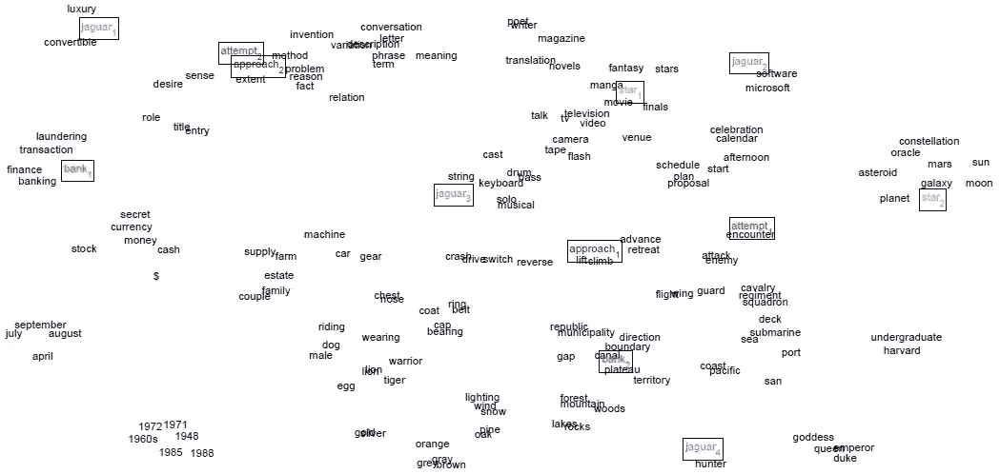
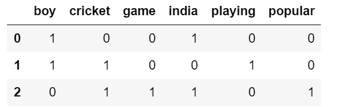
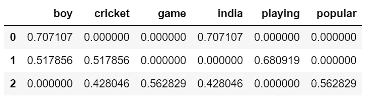
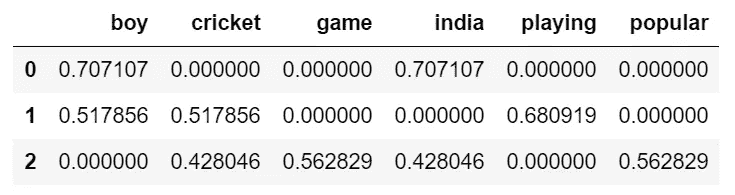

# 单词嵌入:文本分析:NLP:第 1 部分

> 原文：<https://medium.com/analytics-vidhya/word-embedding-text-analysis-nlp-part-1-c6c3f161e69f?source=collection_archive---------10----------------------->



图片取自[此处](https://www.google.co.in/url?sa=i&url=https%3A%2F%2Fwww.socher.org%2Findex.php%2FMain%2FImprovingWordRepresentationsViaGlobalContextAndMultipleWordPrototypes&psig=AOvVaw3-fLyF-MMpkCZFBinRitGj&ust=1614160655352000&source=images&cd=vfe&ved=0CAIQjRxqFwoTCPD1kJjf_-4CFQAAAAAdAAAAABAm)。

*写这篇文章是为了理解不同的单词嵌入技术，这些技术是解决任何自然语言处理问题所必需的。*

# **简介**

我们都被不同种类的数据所包围，这些数据可能是文本、图像、语音或任何其他格式的。在这里，我们将讨论报纸、电子邮件、书籍甚至任何产品评论形式的文本数据。为了理解这些文本数据，我们必须深入了解它，为此我们需要以容易理解的方式处理数据。如今，自然语言处理(NLP)使得理解这些文本数据和开发各种应用变得更加容易，如语言翻译、文本分类、文本摘要等。

所有上述 NLP 技术都需要将文本数据转换成机器可以学习的数字数据。将文本数据转换成数字数据的技术称为单词嵌入。

# **文字嵌入**

单词嵌入将文本数据转换成数字，这对于学习单词的语义和句法上下文是有用的。同样，任何单词的相似性都可以用这个数字数据来检查。一些重要的嵌入技术有。

1.  一个热编码(BOW)
2.  TF-IDF
3.  Word2Vec
4.  手套
5.  快速文本

*本教程将分为两部分，第一部分将介绍一种热编码，第二部分将介绍 Word2Vec 和 GloVe。*

**一个热编码(弓形/计数矢量器)**

顾名思义，一种热编码将文本数据转换为 0 和 1 表示。它只是简单地计算语料库中的字数，并将数据转换成二进制形式，这就是为什么它也被称为二进制嵌入。文本数据的最终表示将是矩阵，并且它将是数据的向量表示。下面列出了我们可以用来转换数据的步骤。

*   将文本标记成单词
*   将数据转换为更低
*   预处理数据，去除标点符号和停用词
*   使用计数矢量器创建单词的频率分布

考虑具有 Y 个文档的语料库 X。首先，我们将提取 N 个唯一的单词，它将形成一个 Y×N 维的矩阵。

**代码表示**

在这段代码中，我们将使用 sklearn 库中的 ***CountVectorizer、*** it 对文本文档进行标记，构建 word 包并转换一个热编码数据。

```
from sklearn.feature_extraction.text import CountVectorizer
from nltk.tokenize import sent_tokenize
from nltk.tokenize import word_tokenize
import pandas as pd
from nltk.corpus import stopwords
stopwords = set(stopwords.words('english'))
text = ['He is a boy and he is from India.','The boy is Playing The Cricket.','The Cricket is the most popular game in India.']
vectorizer = CountVectorizer(text,stop_words=stopwords)
sentence_vectors = vectorizer.fit_transform(text)
feature_names = vectorizer.get_feature_names()
dense = sentence_vectors.todense()
denselist = dense.tolist()
df = pd.DataFrame(denselist, columns=feature_names)
```



测向输出

我们可以看到，删除停用词后，唯一单词列表长度为 6。所以我们的矩阵输出是 3x6。我们还可以看到，在每个 raw =句子中，哪些单词出现在唯一列表中，用一个热编码值表示。在第一句中，唯一的单词 take 是 boy 和 india，因此这些单词以值 1 显示在 first raw 中。我们使用单词袋模型从文本中提取特征，将文本转换成文档中单词出现的矩阵。

**计数矢量化的问题**

这里我们可以看到生成的矩阵是稀疏矩阵。此外，它不能迎合语义信息。句子中使用的所有单词的值都是 1，因此我们无法从句子中找到有意义的单词。此外，矩阵具有高维数，因此计算量很大。为了解决这个问题，我们将研究另一种叫做 TF-IDF 的方法

# **TF-IDF**

TF-IDF 是词频的缩写——逆文档频率。

术语频率，定义为术语在文档中出现的次数。该公式如下所示，其计算方式为术语在文档中出现的次数除以文档中的总术语数。

> **TF(t) =(术语 t 在文档中出现的次数)/(文档中的总术语数)**

通过这种方式，我们可以了解文档中特定术语的重要性。然而，当我们处理一些停用词时，如 a，an，the 等。被频繁使用，因此实际单词的重要性没有被发现。为了处理这类单词，我们使用内置的 python 库来删除停用词。然而，我们已经删除了停用词，但如果这个词在句子中频繁使用，我们仍然无法了解它的重要性。为了解决这个问题，我们检查下一个术语逆文档频率。

逆文档频率用下面的公式计算。其中我们将文档总数除以具有特定单词的文档数，并记录该值的对数。因此，如果频繁使用该词，IDF 值将向 0 移动，否则将向正无穷大移动。

> **IDF(t) = log_e(文档总数/其中包含术语 t 的文档数+1)***(+1 在此公式中取值，以避免此公式中分母为 0 的值)*

最后，为了得到 TF 的字乘法的 TF-IDF 表示，采用 IDF。最后，我们可以针对句子中的重要单词获得一些值。如果这个词在所有的句子中被默认使用，它将被表示为 0 值。因此，用这种方法我们可以得到一个词在句子中的一些语义信息。

***TF-IDF(t)= TF(t)* IDF(t)***

例如，考虑包含 100 个单词的文档，其中单词 *cat* 出现了 3 次。那么*猫*的项频率(即 tf)就是(3 / 100) = 0.03。现在，假设我们有 1000 万个文档，单词 *cat* 出现在其中的 1000 个文档中。然后，逆文档频率(即 idf)计算为 log(10，000，000 / 1，000) = 4。因此，Tf-idf 重量是这些量的乘积:0.03 * 4 = 0.12。

**代码表示**

```
from sklearn.feature_extraction.text import TfidfVectorizer,TfidfTransformer
from nltk.tokenize import sent_tokenize
from nltk.tokenize import word_tokenize
from nltk.corpus import stopwords
stopwords = set(stopwords.words(‘english’))
text = [‘He is a boy and he is from India.’,’The boy is Playing The Cricket.’,’The Cricket is the most popular game in India.’]
vectorizer = TfidfVectorizer(text,stop_words=stopwords)
vectors = vectorizer.fit_transform(text)
feature_names = vectorizer.get_feature_names()
dense = vectors.todense()
denselist = dense.tolist()
df = pd.DataFrame(denselist, columns=feature_names)
```



测向输出

我们可以看到普通 countvectorizer 和 TF-IDF 的区别。例如，在第二个句子中，playing 的值为 0.68，这个值在这个句子中较高，这意味着它在这个句子中有一些重要的信息。而在 countvectorizer 中，playing 的值为 1，与本句中的其他单词相同，因此我们没有本句的语义信息。

这里我们也导入了 TfidfTransformer，它与 TfidfVectorizer 相同，唯一的区别是 TfidfTransformer 与 countvectorizer 一起使用。下面是它的代码实现。

```
from sklearn.feature_extraction.text import TfidfVectorizer,TfidfTransformer
from nltk.tokenize import sent_tokenize
from nltk.tokenize import word_tokenize
from nltk.corpus import stopwords
stopwords = set(stopwords.words(‘english’))
text = [‘He is a boy and he is from India.’,’The boy is Playing The Cricket.’,’The Cricket is the most popular game in India.’]
tfIdfTransformer = TfidfTransformer()
countVectorizer = CountVectorizer(text,stop_words=stopwords)
wordCount = countVectorizer.fit_transform(text)
newTfIdf = tfIdfTransformer.fit_transform(wordCount)
feature_names = countVectorizer.get_feature_names()
dense = newTfIdf.todense()
denselist = dense.tolist()
df = pd.DataFrame(denselist, columns=feature_names)
```



与 tfidf 矢量化结果相同

# **总结**

在上面的博客中，我们讨论了单词嵌入的热编码和 TFIDF。在接下来的第 2 部分中，我们将讨论另一种嵌入 Word2Vec、GloVe 和 FastText 的方法。希望我在这个博客中涵盖了所有需要的信息。建议是非常必要的，如果有的话。

**参考文献**

1.  [http://www . tfi df . com/#:~:text = TF(t)% 20% 3D % 20(Number，how % 20 important % 20a % 20 term % 20 is。& text=IDF(t)%20%3D%20log_e(，with%20term%20t%20in%20it)。](http://www.tfidf.com/#:~:text=TF(t)%20%3D%20(Number,how%20important%20a%20term%20is.&text=IDF(t)%20%3D%20log_e(,with%20term%20t%20in%20it).)
2.  [https://medium . com/sfu-cspmp/NLP-word-embedding-techniques-for-text-analysis-ec4e 91 bb 886 f](/sfu-cspmp/nlp-word-embedding-techniques-for-text-analysis-ec4e91bb886f)