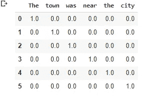
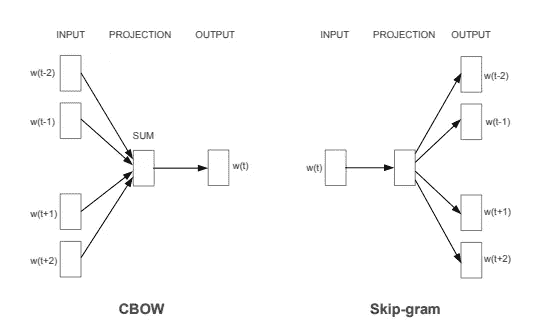
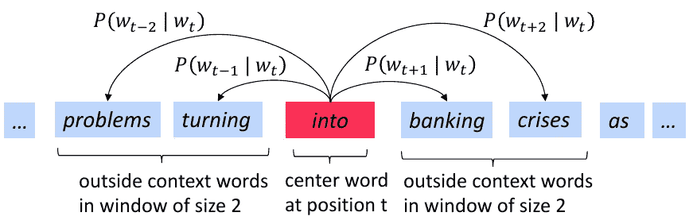
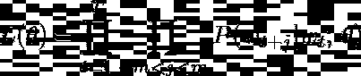
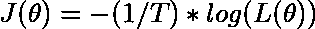
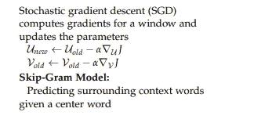
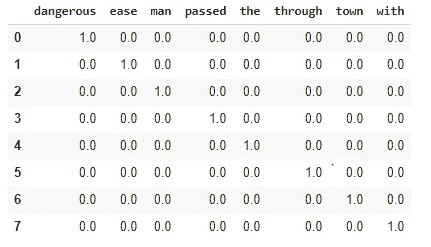
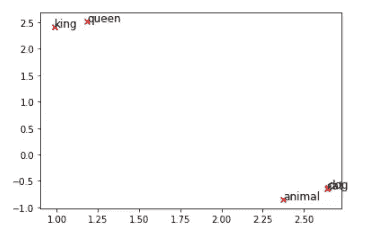

# 单词嵌入

> 原文：<https://medium.com/analytics-vidhya/word-embeddings-aaef8c6bd04a?source=collection_archive---------15----------------------->

本文旨在使用该领域一些最著名的论文中的信息，为单词嵌入提供直觉。


马库斯·斯皮斯克在 [Unsplash](https://unsplash.com?utm_source=medium&utm_medium=referral) 上的照片

# **我们为什么需要单词向量？**

另一种选择是将文档中的每个单词表示为一个独热编码向量。我们试着用这个来思考一些问题。

1.  词汇量:每个单词都可以用一个和你的词汇量一样长的形状来表示。这可能是数百万的数量级。



one_hot_encode 的输出示例(“该城镇靠近城市”)

2.**语义**:现在，除了规模问题，我们失去了“应该靠近的单词之间的相似性”。换句话说，用这种表示法，所有的单词都是相互正交的。在高维空间中，它们都指向不同的方向。

理想情况下，在上面给出的例子中,“城镇”和“城市”应该有相似的向量表示。但在这种情况下，它们的余弦相似度为 0(它们彼此成 90 度角)。

因此，理想情况下，我们想要的是用一个比词汇表的大小小得多的向量来表示每个单词。此外，我们还希望这些向量本身能为单词提供一些“意义”。有趣的是，在实践中，增加或减少两个或更多这样的单词会产生有趣的结果。例如，vector(德国)+ vector(首都)可能导致 vector(柏林)。

# **我们如何构建这些词向量？**

虽然有几种方法，但其中一个需要理解的关键概念是 ***上下文*** & ***中心词*** 。

直觉(被称为**分布语义**)是文档中接近特定单词的单词传达了该单词的意思。例如，如果我们有一个像**‘老师经常骂学生’**这样的句子。对于一个**中心单词 student** 和一个大小为 5 的窗口(取单词的两边)，我们将在它的**上下文中有单词**‘老师’，‘责骂’，‘相当地’，‘经常’**。现在，如果我们有一个足够大的语料库，我们可以通过在每个单词的上下文中查看所有单词来找到这个单词的表示。**

现在有两种方法可以做到这一点，我们可以只是**统计一个单词在上下文**中出现的频率，并为每个单词找出一个表示，或者我们可以训练一个神经网络，通过**预测给定我们的中心单词**的上下文向量来找出哪些向量最适合。在本文中，我将讨论后者。

# **Word2vec:**

最初，这个想法是由 Tomas Mikolov 于 2013 年在这篇名为“[向量空间中单词表示的有效估计](https://medium.com/r?url=https%3A%2F%2Farxiv.org%2Fpdf%2F1301.3781.pdf)的[论文](https://arxiv.org/pdf/1301.3781.pdf)中提出的，他在“[单词和短语的分布式表示及其组合性](https://papers.nips.cc/paper/2013/file/9aa42b31882ec039965f3c4923ce901b-Paper.pdf)中对其进行了进一步改进。第一篇论文介绍了两种方法。

1.  连续单词包:根据上下文单词预测中心单词。
2.  跳跃式语法:给定一个中心词，预测上下文词。



论文中描述的模型。



**跳过图**插图

如图所示，使用跳格模型，我们需要找到 P ( context | center)。但是我们最初的目标是找出单词向量，对吗？下面是我们对目标函数的构建。



似然函数

在这种情况下，参数 theta 指的是我们的单词向量。我们必须**在给定中心词的情况下，最大化我们的模型预测上下文词的可能性。**内积是针对特定中心词的，并且似然函数是作为中心词的全部词(T 个总词)。


’

对于 skip-gram 和 CBOW 模型，我们需要两个向量来表示每个单词。一个用于当单词在上下文中时，另一个用于当单词在中心时。我们称这些向量为 **U & V** 。为了将它表示为一个分布，我们采用**这两个向量**的点积，使用指数使点积为正，并用词汇表中的所有向量对其进行归一化。**我们的目标应该是找到向量 U & V，它最大化正确单词出现在给定中心单词的上下文中的概率。**定义概率， **Vcenter** 通过将我们的 **V 矩阵(N x V)** 乘以一位热码编码输入向量来给出，其中 N 是嵌入维数，V 是 vocab 的大小。其本身乘以大小为(V×N)的 **U 矩阵中的所有上下文向量。最终，我们得到词汇表中每个单词的“分数”，这些分数又被传递给 softmax 函数。在某种程度上，这就像多类分类，在给定中心词的情况下，我们预测哪个“词”在上下文中。**



最终目标

为了让我们更容易求导，我们在概率前面贴一个对数。此外，我们添加了一个负号，这样我们就必须“最小化”函数，而不是取最大值。我们还添加了(1/T ),使事情的规模不变，不依赖于语料库的大小。

为了训练这个模型，我们需要使用梯度下降来更新向量。



使用梯度下降更新权重

让我们举一个具体的例子，来看一下我们必须采取的每一个步骤，以通过模型的正向传递。

softmax 的定义函数

最初，文本被热编码&其中一个单词被传递到网络。在这种情况下，**‘Ease’**作为中心词传递(按词汇排序，第二个词)，从句子中我们可以看到，Ease(带有一个**大小为 2** 的窗口)的上下文词是**‘with’&‘town’**。



我们随机初始化上下文和中心词矩阵 V & U。

同样，**V**的每一列包含每个单词在**中心**时的嵌入，**每行**包含每个单词在**上下文**时的嵌入。例如，这是矩阵 u 的初始化。

```
#### U matrix as a dict with vocab as the key{'dangerous': array([ 1.2398147 , -0.87909626,  0.38028566]),  'ease':       array([0.08540021, 0.18544306, 0.07096524]), 
'man':        array([ 0.14981179, -1.40251029,  1.02452393]),  
'passed':     array([0.10055589, 1.09979612, 1.63213385]),  
'the':        array([-0.22917658,  1.32505777, -0.74246023]), 
'through':    array([0.21855831, 1.05448857, 0.71948246]),  
'town':       array([-0.17041045, -1.60960955, -0.56273196]),  
'with':       array([-1.52561797,  0.00701094, -0.46619808])}
```

在我们向前传递一个单词到网络之后，我们接收预测每个上下文单词的 softmax 概率。

```
##Predicted probability distribution{'dangerous': 0.0006688799877958782,  
'ease':       0.024971817920074583,  
'man':        0.004299169023935694,  
'passed':     **0.9438920599330834**, 
 'the':       0.004081941089464888,  
'through':    0.0027767995527184113,  
'town':       0.009752776322407003,  
'with':       0.009556556170520179}
```

通过我们的胡言乱语正常初始化，网络以 0.94 的概率预测**通过**为上下文中概率最高的单词，中心为“ease”。但是真正的分布，对于中间的单词 ease，对于 with 和 town，概率为 1，而对于其他任何地方，概率为 0。

```
###True Distribution{'dangerous': 0,
 'ease': 0,
 'man': 0,
 'passed': 0,
 'the': 0,
 'through': 0,
 **'town': 1,
 'with': 1**}
```

所以我们比较并训练我们的单词向量 U & V，直到我们的输出最终看起来像真实的分布。我将忽略向后传递的细节，因为我相信在我们目前拥有的框架中自动微分是可用的，它真的没有那么重要。但是如果你感兴趣，你可以在这里查看它是如何工作的[。](https://aegis4048.github.io/demystifying_neural_network_in_skip_gram_language_modeling)

对于 word2vec，这种方法还有另一个问题，每次我们都必须遍历整个 vocab，正如前面讨论的那样，这在计算上不是很大。如果你考虑复杂性，它的数量级是 O( V + V ),其中 V 是你词汇量的大小。

我们用所谓的***负采样*** 来解决这个问题，这在上面提到的 ***的第二篇[论文中有介绍。](https://papers.nips.cc/paper/2013/file/9aa42b31882ec039965f3c4923ce901b-Paper.pdf)*** 我们不使用 softmax 函数，而是使用 sigmoid 函数，将其转化为二项式分类问题(2 类，正&负)。

我们从不在上下文中的单词中取样，并把它们作为否定类别。在我们运行的中心词“ease”的例子中，我们采样了其他一些词，如“the ”,并将其用作否定类。我们从这些类中抽取 K 个样本。因此，我们得到的复杂度不是更新整个词汇表，而是~ O (K)。

# **结果**

如果你想在自己的语料库上训练它们，在深度学习框架上相当简单。最初的 word2vec 论文的模型是根据谷歌的新闻数据训练的。后来，多年来，人们在维基百科数据集上训练他们的模型，并显示出更好的结果。这可能是因为维基百科中的单个文档有更多与某个主题相关的单词，而在新闻中，我们可能有更多不同的单词。尽管如此，我将在本节中使用原始的单词向量。

我们查看训练过的单词向量，例如国王、王后、猫、狗和动物。然后我们用奇异值分解对向量进行二阶近似。(您可以从我以前的文章[这里](/analytics-vidhya/why-you-should-consider-studying-linear-algebra-as-a-data-scientist-part-1-svd-9d0ba3189a3e)了解更多关于 SVD 的信息)



我们可以看到，即使是第二等级的近似词，如动物、狗和猫聚集在一起，而国王和王后更接近。尽管向量(最初是 300 维)到 2 维的投影使我们失去了很多信息，但我们可以多少想象出一些向量是如何相似的。

我们可以使用完整的向量来找出一些单词的类比和相似之处。

得出的一些相似之处如下:

```
#Analogy
similarity(w['king']-w['man']+ w['woman'],w['queen']) ---> 0.73 #Dissimilar words
similarity(w['king'], w['car'])  ---> 0.03#Similar words
similarity(w['man'], w['woman']) ---> 0.76
```