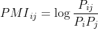
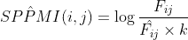
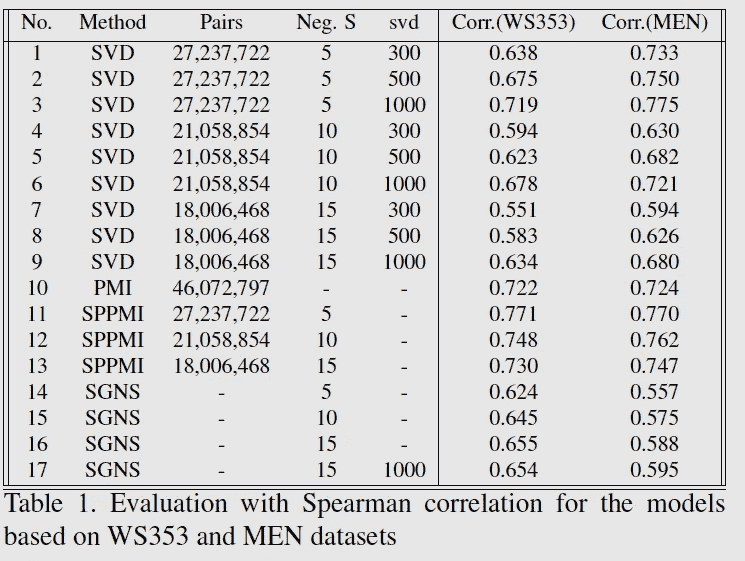

# 基于共现矩阵和词 2Vec 的词相似度

> 原文：<https://medium.com/analytics-vidhya/word-similarity-with-co-occurrence-matrix-and-word2vec-skip-gram-c7052d6993a8?source=collection_archive---------13----------------------->

自然语言处理中最重要的领域之一是语义分析。识别两个词之间的相似性可以在这方面帮助我们。但首先，我们需要将每个单词转换成机器可以计算的向量。我们可以通过共生矩阵或神经网络来获得向量。在本实验中，我们使用了共现矩阵和跳跃图来显示结果，然后对它们进行比较。

# 介绍

单词嵌入是一种表示，意思相同的单词有相似的表示。这种表示单词的类型将是自然语言处理中的要点之一。单词嵌入是一种将单个单词表示为数字向量的技术。每个单词将被映射到一个向量，向量值在一些模型中计算，如神经网络或共生矩阵。计算单词嵌入向量有两种常用方法:共生矩阵和神经网络。

# 共生矩阵

共现矩阵展示了单词之间的关系，并描述了单词如何一起出现。转换单词的最简单方法是统计每个单词在每个语料库中的出现次数。

除了简单的计数，还有一些其他的方法来计算共生矩阵。在这个实验中，我们使用了 *PMI* (逐点互信息)和 *SPPMI* (移正 PMI)。

*PMI* 的想法是，我们想要量化两个单词共现的可能性，考虑到它可能是由单个单词的频率引起的。在现实中，根据语料库中的单词计数来计算 *PMI* 是有问题的，因此我们需要根据一个单词在任何目标单词的窗口中出现的次数来估计 *PMI* 。其思路是，语料库中的任何一个词，大部分都是通过邻近词来实现的，而不是全部的语料库。当语料库不太长时，估计量的方差变高，因此我们使用移位正方法而不是 *PMI* :

# 神经网络

使用神经网络创建嵌入是有帮助的，因为它们在大型语料库上工作得更好，并且还降低了变量的维度，并在转换的空间中表示变量。神经网络嵌入可以克服一键编码的局限性。

# 资料组

为了训练模型，丰富的文本是很重要的。数据集应该几乎覆盖其他著名测试集评估的每个领域，这些测试集主要由人工评分。在几个数据集当中，我们选择了一个定制的 Wiki-Dump(build 2021–04–01 ),其中包含用于构建模型的页面和文章。有不同类型的维基转储文件(。xml。txt。sql 和…)包含了大量的文本，似乎是这方面最好的数据集之一。Wiki-Dump 的优点是它包括正式和非正式文本，因此它可以更好地显示两个单词之间的相似性。

# 结果

# *参考文献*

奥马尔·利维和约夫·戈德堡。神经单词嵌入作为隐式矩阵分解。神经信息处理系统进展，27:2177–2185，2014。