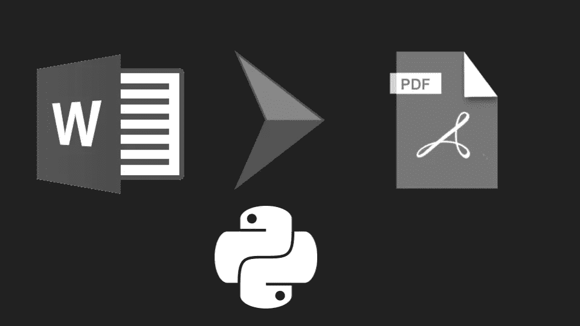
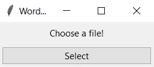
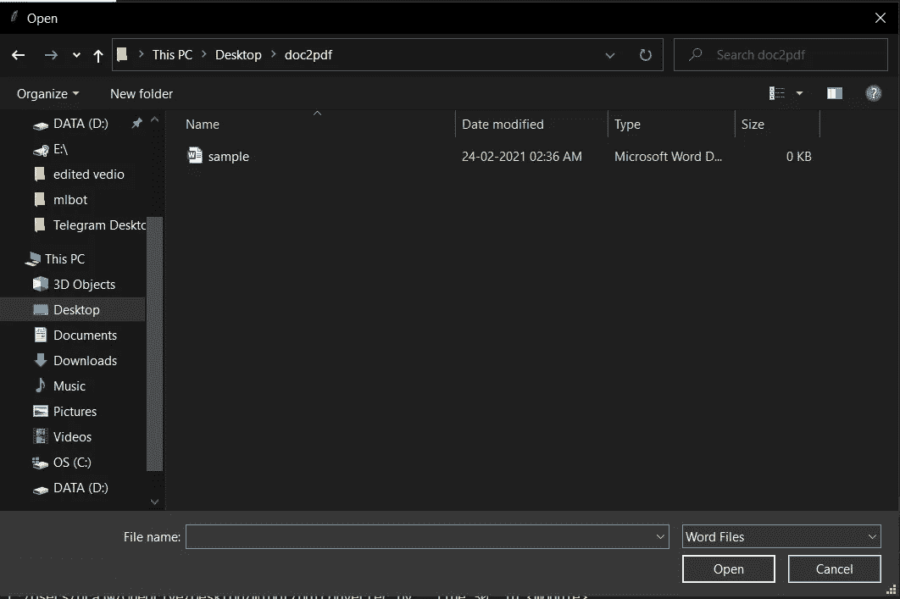
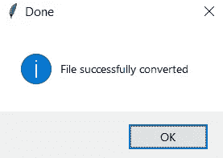
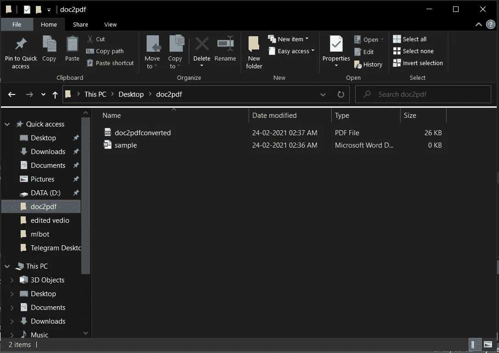

# 使用 Python 的 Word 到 PDF 转换器应用程序

> 原文：<https://medium.com/analytics-vidhya/word-to-pdf-converter-app-using-python-ca06cedbed7c?source=collection_archive---------7----------------------->



嘿，希望你今天过得愉快！

在一些第三方应用程序的帮助下，比如 smallpdf.com 或 ilovepdf.com 的 T2，我们已经将很多文档转换成了 Pdf 格式。我想为什么不借助 python 健壮的库来构建我们自己的应用程序呢。

我们将为此使用的模块是

*   **tkinter**:python GUI 工具包，作为 python 的内置模块，这意味着我们不必使用 pip 命令进行安装
*   docx2pdf :帮助我们将 word 转换成 pdf 的 python 模块

要安装 docx2pdf

```
pip install docx2pdf
```

你可以使用任何你喜欢的 IDE，但是不要忘记打开黑暗模式来保护你的眼睛！

现在我们已经有了我们需要的所有模块

## 让我们导入模块

```
import tkinter as tk
import tkinter.ttk as ttk
from tkinter.filedialog import askopenfile
from tkinter.messagebox import showinfo
from docx2pdf import convert
```

*   tkinter :我们的 GUI python 模块
*   **tkinter.tkk** :访问 tkinter 模块的 widget 集合
*   **tkinter.filedialog** :创建一个简单的对话框
*   **tkinter.messagebox** :创建一个消息框

## 我们将为我们的窗口设置一个 tkinter 窗口对象和标题

```
win=tk.Tk()
win.title("Word to Pdf Converter App")
```

让我们处理一些基本的文件操作，比如

*   只接受 word 文件作为输入
*   转换成 pdf 格式
*   保存 pdf 文件

## 我们将在一个函数中定义所有这 3 个步骤

```
def openfile():
  file = askopenfile(filetypes=[('Word Files', '*.docx')])
  convert(
  file.name,   
  r'C:\Users\prajw\OneDrive\Desktop\doc2pdf\doc2pdfconverted.pdf' 
  )   
  showinfo("Done", "File successfully converted ")
```

为了打开文件浏览器界面，我们使用来自 **tkinter 的 **askopenfile()** 。filedialog** 并传递一个参数 filetypes，这是一个列表，我们在其中指定文件的类型以及我们希望接受的所有文件扩展名作为我们的输入，现在对于这个特定的实例，我们只需要一个 word 文件。docx 扩展

*之前”。docx”告诉文件资源管理器文件名可以是任何名称，但应该是 doc 文件

我们得到了文件，现在让我们把它转换成 pdf 并保存它

在 docx2pdf 模块的帮助下，我们有了 **convert()** 来完成我们的工作，我们必须为它传递两个参数

1.  **文件名** : file.name(我们用 askopenfile()选择的文件名)
2.  **文件路径**:我们在这里指定保存转换后文件的位置。你可以给出任何你需要的文件路径，但是不要忘记“r ”,它只是告诉 python 把文件路径当作一个原始字符串

完成所有操作后，我们将弹出一个成功对话框，告诉用户该文件已经使用 **showinfo()** 成功转换

我们刚刚完成了逻辑部分，现在让我们创建一个简单的 GUI

在这里，我们只是将组件添加到我们之前创建的主窗口对象中

## 我们将添加一些文本和一个按钮

```
label=tk.Label(win,text="Choose a file!")
label.grid(row=10,column=5,padx=5,pady=5)
```

对于 **tk。我们有两个参数，一个是窗口对象，另一个是我们想要显示的文本**

**grid()** 充当一个小部件组织者，在父小部件上有一个类似表格的结构

我们将使用的网格参数是

*   **行和列**:这允许我们将对象放置在我们想要的位置。例如:如果我们想把我们的文本放在第二行第三列，我们应该这样初始化值，行=2，列=3
*   **padx 和 pady** :用于小工具周围的填充

## 接下来，我们将添加一个调用 openfile()的按钮

```
button=ttk.Button(win,text="Select",width=30,command=openfile())
button.grid(row=20,column=5,padx=5,pady=5)
```

**按钮()**有 4 个参数两个与标签组件相似，新增的是宽度和命令

*   **width** :告诉按钮应该有多宽
*   **命令**:按钮后我们要它执行一些任务，我们为按钮执行的任务是调用 openfile()

下一行是我们已经知道的网格。该死，我们学得真快！！

# 最后一行是..

```
win.mainloop()
```

这一行通知 python 运行 tkinter 事件循环，以便这些方法监听按钮被按下或鼠标被拖动等事件以及更多事件

现在让我们看一些**快照**

# 主窗口



# 让我们选择文件



**成功消息对话框**



检查文件是否被转换并保存在我们的文件浏览器中



我们的档案安然无恙！！

这就是我们刚刚用 Python 创建了一个 **Word 到 Pdf 的转换应用程序**只用了 **16 行代码**

希望你能从这篇文章中学到一些东西，感谢你花几分钟写这篇文章。

如果你有任何疑问，请在下面评论，我很乐意帮助你！

# 谢谢大家！

# -马尼