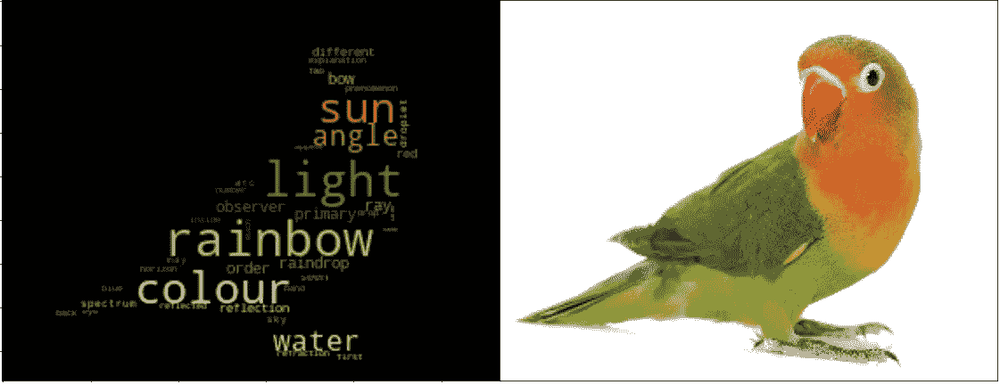

# 基于图像的文字云

> 原文：<https://medium.com/analytics-vidhya/wordcloud-based-on-image-27afacb7cf44?source=collection_archive---------20----------------------->

## 使用不同的图像创建 wordcloud

Wordcloud(来源:[作者](https://www.linkedin.com/in/himanshusharmads/)

Wordcloud 是根据单词在数据集中出现的时间，不同大小的单词簇的可视化表示。单词越大，它在单词云中的大小就越大。它有助于理解情绪或数据集中特定单词的出现。