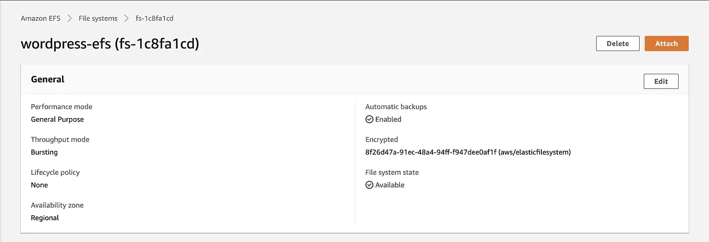

# 具有高可用性的 AWS 上的 WordPress

> 原文：<https://medium.com/analytics-vidhya/wordpress-on-aws-with-high-availability-35ec5732f1f6?source=collection_archive---------2----------------------->

高可用性和容错解决方案

# 概观

每当您在云上运行基础架构时，您都希望确保它高度可用，这样，如果由于某种原因出现问题，它不会影响最终用户。WordPress 是一个非常流行的内容管理系统(CMS)。它最常用于博客，但也可以用于运行电子商务网站、留言板和许多其他流行的用例。


# 问题陈述

每当你在机器上安装 WordPress 时，你都有与 WP 相关的配置文件。现在，如果你在多台机器上安装 WordPress，每台机器都有自己的文件，如果你在一些负载平衡器后面运行这些机器，那么你会遇到一个问题。还有一件事是你的 WordPress 站点的数据库维护是至关重要的。你的数据库实例为你的 WordPress 站点保存了所有重要的数据。如果数据库宕机，你的网站可能会随之宕机，你甚至可能会丢失数据。

# AWS 服务

1.  关系数据库服务—我们将使用 AWS RDS MySQL，这是由 AWS 提供的完全托管的 MySQL 数据库服务
2.  应用程序负载平衡器—我们将使用 AWS ALB 作为我们网站的单一入口点。ALB 会将请求路由到 ALB 后面的多个 EC2
3.  弹性文件系统——AWS EFS 是完全管理的网络文件系统，我们将使用它来存储我们所有的 WordPress 配置文件，插件，网页。EFS 的另一个优势是，我们可以将 EFS 安装到多个 EC2 实例，这样每个 EC2 实例都指向相同的文件，我们可以运行多个 EC2 来实现高可用性和容错。

# 我们开始吧

1.  **创建您的 MySQL 数据库**

*   首先，请在 AWS 控制台中访问 Amazon RDS。单击橙色的“创建数据库”按钮开始。


*   第一步是选择要使用的数据库引擎。WordPress 使用 MySQL，所以我们会选择 MySQL


*   向下滚动并选择您想要的模板(我选择了生产)
*   输入数据库实例标识符的名称
*   为您的数据库输入**主用户名**和**密码**(确保记下并安全保存)
*   选择所需的实例类
*   向下滚动选择您是否希望您的数据库是 MultiAZ(如果您在 Prod 中使用它，我建议将其创建为 MultiAZ)
*   为您的 RDS 选择 VPC 和合适的安全组
*   向下滚动并在**附加配置**中写入**初始数据库名称** (RDS 将为我们创建数据库)
*   向下滚动并点击**创建数据库**

记下主用户名，密码和初始数据库，我们将在配置可湿性粉剂需要这些信息

2.**创建 EC2 实例**

*   在您创建 RDS 的 VPC 用 **Amazon Linux 2 AMI (HVM)** 创建 EC2 实例
*   在 RDS 的安全组中，打开入站规则中的端口 3306，并添加 EC2 实例安全组 Id，以便 EC2 可以连接到 RDS MySQL。

3.**创造 EFS**

*   转到 EFS 控制台，点击**创建文件系统**
*   输入 EFS 的名字
*   选择已启动 RDS 和 EC2 的 VPC
*   在**可用性和耐用性**中选择**区域**并点击创建


AWS EFS

*   一旦文件系统可用，单击它并在**生命周期管理**中单击“编辑”选择**无**，单击“保存更改”。这样做的原因是，默认情况下，如果您不从文件系统访问对象，它会将该对象移动到**标准—不频繁访问存储类**
*   将**吞吐量模式**更改为 Provisioned，并输入所需值。这将有助于我们在高流量时快速读取文件系统


4.将 EFS 连接到 EC2

*   一旦您完成了对 SSH 到 EC2 实例的更改，我们将把这个文件系统附加到 EC2 实例，以便它可以将数据存储到文件系统中
*   使用以下命令创建`/var/www/html`目录。我们将把所有内容存储在 Apache Web 服务器使用的这个目录下

```
sudo mkdir -p /var/www/html/
```

*   使用以下命令挂载文件系统

```
sudo mount -t nfs4 -o nfsvers=4.1,rsize=1048576,wsize=1048576,hard,timeo=600,retrans=2,noresvport <file_system_id>.efs.<region>.amazonaws.com:/ /var/www/html/
```

您也可以从文件系统控制台获得该命令。您只需单击“file system ”,您将看到“Attach”按钮，单击该按钮，您将获得命令。



**注意:**确保用`/var/www/html`替换`efs`

*   使用以下命令检查文件系统是否挂载到 EC2

```
df -T -h
```

现在我们的文件系统挂载成功了，我们可以继续了，但是在此之前，我们将配置我们的 EC2 实例来自动挂载文件系统

*   安装以下软件包

```
sudo yum install -y amazon-efs-utils
```

*   在您最喜欢的文本编辑器中打开文件`/etc/fstab`,添加下面一行

```
<file_system_id>.efs.<region>.amazonaws.com:/ /var/www/html/ efs defaults,_netdev 0 0
```

现在，每当您的 EC2 实例由于某种原因重新启动时，它将自动挂载文件系统。

5.**安装阿帕奇网络服务器**

*   要运行 WordPress，您需要在 EC2 实例上运行一个 web 服务器。开源的 Apache web 服务器是 WordPress 使用的最流行的 web 服务器。
*   要在 EC2 实例上安装 Apache，请在终端中运行以下命令:

```
sudo yum install -y httpd
```

*   启动 apache web 服务器

```
sudo systemctl start httpd
```

*   允许 apache web 服务器在引导时自动启动

```
sudo systemctl enable httpd
```

*   检查 httpd 的状态

```
sudo systemctl status httpd
```

现在你可以进入浏览器点击 **< ec2_public_DNS >** 你会看到 apache 测试页面。确保您已经在 EC2 的 SG 中打开了端口 80


Apache 服务器测试页面

6.**在目标组中创建应用程序 ALB 并注册 EC2**

*   转到 EC2 控制台，点击左侧导航面板中的**负载平衡器**
*   点击**创建负载平衡器**按钮
*   选择**应用负载平衡器**
*   输入负载平衡器的名称
*   向下滚动并选择已经启动 RDS 和 EC2 的 VPC，选择可用性区域(我建议选择 2 个或更多 az 以获得高可用性)，并选择适当的子网
*   单击 Next 并选择 ALB 的安全组(确保您的 SG 打开了端口 80)
*   在配置路由中

a.选择创建新目标组

b.输入 TG 的名称

c.选择**目标类型**->-**实例**

d.选择 **HTTP** 协议

e.将 **80** 写入端口

f.向下滚动到**高级健康检查设置**

g.在**成功代码**中输入 **200，301** (安装 WordPress 后，当我们在内部向 ALB 端点发出请求时，Apache Web 服务器会将我们的流量重定向到 WordPress，并给出 301 状态代码。请求的流程将是 ALB 端点上的请求->Apache web server->WordPress。所以基本上我们的 Apache 服务器正在重定向流量，所以 TG 的成功代码将是 301)。如果在创建 TG 时没有在**成功代码**中添加 301，您的目标健康检查可能会失败，并出现错误**获取 301 状态代码**


**注意:**添加 200 和 301 两个状态代码，因为直到现在当我们点击请求时，成功代码将是 200，但是在安装和配置 WordPress 之后，成功代码将是 301。不要忘记将 ALB Sg 的 ID 添加到 EC2 SG 的入站规则中。

7.下载并配置 WordPress

*   在这一步，我们将下载 WordPress 软件并设置配置。
*   首先，通过在终端中运行以下命令下载并解压缩软件:

```
cd /home/ec2-user/wget [https://wordpress.org/latest.tar.gz](https://wordpress.org/latest.tar.gz)tar -xzf latest.tar.gz
```

*   进入 wordpress 目录，使用以下命令创建默认配置文件的副本:

```
cd wordpresscp wp-config-sample.php wp-config.php
```

*   使用您最喜欢的文本编辑器打开**wp-config.php**文件，我们需要编辑两个配置区域。

a.首先，通过更改以下几行来编辑数据库配置:

```
// ** MySQL settings - You can get this info from your web host ** //
/** The name of the database for WordPress */
define( 'DB_NAME', 'database_name_here' );/** MySQL database username */
define( 'DB_USER', 'username_here' );/** MySQL database password */
define( 'DB_PASSWORD', 'password_here' );/** MySQL hostname */
define( 'DB_HOST', 'localhost' );
```

**DB_NAME** :创建 RDS MySQL 时创建的 DB 的名称

**DB _ USER**:RDS MySQL 主用户名

**DB _ PASSWORD**:RDS MySQL 密码

**DB _ HOST**:RDS MySQL 主机，您可以从 RDS 控制台获得它，单击您的数据库实例，您将看到连接端点

b.我们需要配置的第二个配置部分是身份验证唯一密钥和 Salts。它在配置文件中如下所示:

```
/**#@+
 * Authentication Unique Keys and Salts.
 *
 * Change these to different unique phrases!
 * You can generate these using the {[@link](http://twitter.com/link) [https://api.wordpress.org/secret-key/1.1/salt/](https://api.wordpress.org/secret-key/1.1/salt/) WordPress.org secret-key service}
 * You can change these at any point in time to invalidate all existing cookies. This will force all users to have to log in again.
 *
 * [@since](http://twitter.com/since) 2.6.0
 */
define( 'AUTH_KEY',         'put your unique phrase here' );
define( 'SECURE_AUTH_KEY',  'put your unique phrase here' );
define( 'LOGGED_IN_KEY',    'put your unique phrase here' );
define( 'NONCE_KEY',        'put your unique phrase here' );
define( 'AUTH_SALT',        'put your unique phrase here' );
define( 'SECURE_AUTH_SALT', 'put your unique phrase here' );
define( 'LOGGED_IN_SALT',   'put your unique phrase here' );
define( 'NONCE_SALT',       'put your unique phrase here' );
```

转到[该链接](https://api.wordpress.org/secret-key/1.1/salt/)以生成该配置部分的值。您可以用链接中的内容替换该部分中的全部内容。

*   完成以上几行后，在配置中添加以下几行

```
define('FS_METHOD', 'direct');
```

随着配置的更新，我们几乎准备好部署我们的 WordPress 站点了。

8.**部署 WordPress**

*   在这一步，我们将让您的 Apache web 服务器处理对 WordPress 的请求。
*   首先，安装 WordPress 所需的应用程序依赖项。在您的终端中，运行以下命令。

```
sudo amazon-linux-extras install -y lamp-mariadb10.2-php7.2 php7.2
```

*   将你的 WordPress 应用文件复制到 Apache 使用的 **/var/www/html** 目录中。

```
# make sure you are at the the location where the wordpress directory is presentcd /home/ec2-userls#output of ls should be: latest.tar.gz  wordpress# copy the filessudo cp -r wordpress/* /var/www/html/
```

*   更改 user:group of **/var/www/** 以便 apache(httpd)可以访问文件

```
sudo chown -R apache:apache /var/www/
```

*   打开**/etc/httpd/conf/httpd . conf**文件，进行以下更改

a.替换以下几行

```
<Directory />
    AllowOverride none
    Require all denied
</Directory>
```

与

```
<Directory />
    Options FollowSymLinks
    AllowOverride All
</Directory>
```

b.向下滚动到**第 129 行**并将`AllowOverride None`更改为`AllowOverride All`

c.向下滚动到**第 155 行**，将`AllowOverride None`改为`AllowOverride All`

*   最后一步，重启 Apache Web 服务器

```
sudo systemctl restart httpd
```

**恭喜！！！🥳你已经成功地在 AWS 云上安装了 WordPress。**

打开你的网络浏览器，点击**<ec2 _ public _ DNS>**你会看到 WordPress 配置页面。按照简单的步骤按照说明来配置 WordPress，并确保你为 **WordPress Admin** 安全地存储了你的**用户名**和**密码**

9.**使其高度可用**

*   现在，正如我已经告诉您的，我们将使这个设置成为高度可用的，这样，如果我们的 EC2 实例因为任何原因关闭，那么另一个实例应该可以为请求提供服务
*   我们已经创建了 AWS 弹性文件系统，这样我们就可以将它挂载到多个 EC2 实例上，并且我们已经将所有代码转移到了 EFS，它挂载在`/var/www/html`目录下
*   转到 AWS 控制台，选择已经完成上述配置的 EC2
*   点击操作，点击`Image and Templates`并点击`Create Image`按钮
*   输入图像的名称和描述**最重要的是**你必须选择`No Reboot` **启用**复选框。


*   向下滚动并点击创建图像
*   您将获得图像 id，并等待它变得可用
*   一旦映像可用，**从您已经创建映像启动新的 EC2 实例**
*   您可以从该映像启动任意数量的实例。它将包含我们到目前为止完成的所有配置。
*   启动新实例后，验证一切就绪

a.通过运行`df -T -h`命令检查 EFS 是否已安装

b.检查 httpd 服务是否正在运行

c.运行`ls /var/www/html`命令，你会看到所有的文件都在那个目录下，因为我们已经挂载了文件系统。

*   一旦验证了上述内容，就转到您在创建 ALB 时创建的目标组，并在该目标组中注册新的 EC2 实例

# 恭喜你！！

您已经成功地在 AWS 实例上安装并配置了 WordPress，并且具有高可用性。

如果你有 WordPress 备份文件，你也可以上传那个备份文件，它会顺利运行。WordPress 有许多插件可用于导出和导入备份。

谢谢大家！