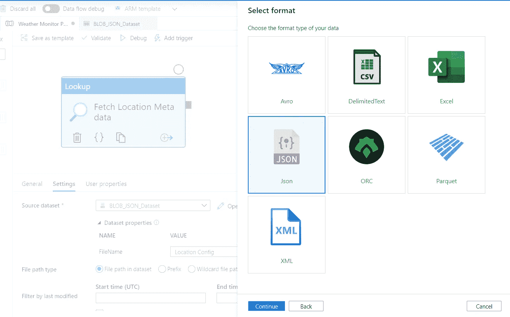

# 使用 Azure DataFactory 和 LogicApp 实现工作流自动化

> 原文：<https://medium.com/analytics-vidhya/workflow-automation-using-azure-datafactory-and-logicapp-98a365aeed90?source=collection_archive---------14----------------------->


Azure 数据工厂

> Data Factory 是最流行的基于云的编排、ETL 和集成服务之一，适用于各种数据驱动的工作流。

作为一名数据工程师，我的工作围绕着为商业智能和分析设计和部署基于云的解决方案和数据处理框架。在开发端到端解决方案时，Azure data factory 是我最喜欢的服务之一。它非常通用，有多个数据连接器，git repo 集成，还提供监控功能。

我创建了一个非常简单的 adf 管道来解决下面描述的业务问题。

**业务用例:**假设你是一个全球 B2B 企业主，在多个地点拥有业务。您需要跟踪所有相关地点的天气状况，因为它们可能会影响您关于产品库存或供应链问题处理、能源消耗、工作现场状态等方面的决策或计划。拥有一个可以监控整个流程并定期发送所需警报的自动化工作流，将会提高生产率和效率，并为客户增加丰富的业务价值。

我将使用 Azure 服务实现上述工作流:-
1。**数据工厂** —建立端到端的管道
2。 **LogicApp** —向客户发送电子邮件通知
3。**存储账户** —将天气信息作为 JSON 存储在容器中

我使用 **AccuWeather API** 服务通过位置 id 获取天气信息。

# 先决条件

1.  Azure 云、HTTP 和 ETL 基础知识
2.  Azure 订阅(您可以创建一个新帐户并获得初始免费试用点数)
3.  AccuWeather 开发者帐户

# 创建 Azure 数据工厂

转到您的资源组并创建一个数据工厂资源(如果您没有现有的资源)。单击“作者和监控”并创建一个新管道“天气监控管道”。

**我的管道流:-**
提取配置文件- >调用 WebAPI 获取配置文件中每个位置/城市的天气详情- >过滤出预测有雨的位置- >发送电子邮件通知


数据工厂管道

**变量**:在整个流水线执行过程中使用。
1。Api 密钥-从您的 AccuWeather 开发者帐户获取(MyApps - >添加新应用- >密钥- > API 密钥
2。天气数据-存储 Web API 响应的数组。多雨城市-存储过滤后的数据以发送到 LogicApp 的数组

**存储账户:**包含一个容器**【天气监视器】**和一个**【位置配置. JSON】**文件，用于存储所有位置的元数据。


Azure 存储帐户

# 步骤 1:添加“查找”活动

我们首先需要从上面的容器中获取 **'Location config.json'** 文件。添加一个“**查找**活动，并创建一个“ **Azure** **Blob 存储”**源数据集，具有 **JSON** 格式。



我们需要一个**‘linked service’**来连接上述数据集和存储帐户。我已经使用了**Azure Key****vault**来管理存储账户的**Key**和 **secrets** 。
**文件路径** —存储配置文件的位置。


*注意:记住在保存数据集之前测试连接。*

# 步骤 2:添加“ForEach”活动


这将遍历我们想要获取天气信息的城市列表。

```
[**@activity**](http://twitter.com/activity)**(‘Fetch Location Meta data’).output.value**
```

**我们将在“ForEach”活动中添加 3 个活动。**


1.  **“复制”活动—** 从 Web API 获取天气数据，并将结果作为 blob 文件存储在容器
    **源—** HTTP Web API 中


活动 1 来源:HTTP

创建源' **HTTP'** 数据集和链接服务。添加一个数据集参数来传递来自先前复制活动的相对 URL(包含特定的 **locationID** )。

```
[@concat](http://twitter.com/concat)(item().locationId,’?apikey=’,variables(‘Api Key’))
```


源数据集 HTTP API

**水槽**——“Azure Blob 存储”


活动 1 接收器:Blob 存储

类似地，创建接收器' **BLOB 存储'**数据集和链接服务。

```
[@concat](http://twitter.com/concat)(item().locationId,’?apikey=’,variables(‘Api Key’))
```

*我们正在使用“Api 密钥”变量的值。*


接收器数据集 Blob 存储

**输出:-**


生成的 Blob 文件

**2。“查找”活动—** 从容器**“天气监视器”**中读取创建的 JSON blob 文件的内容。我们将使用之前创建的现有 Blob 存储数据集(尽可能重用数据集和链接服务)。


活动 2:从容器中提取 JSON 文件

输出如下所示:-

**3。如果' condition activity —** 将从先前的 activity 中读取文件内容，如果关键字'**类别**是' **rain** '，它将使用**' Append Variable '**activity 将输出追加到'**rain city**'数组变量中。

```
# If Condition [@equals](http://twitter.com/equals)(activity('Extract from BLOB').output.value[0].Headline.Category,'rain')# Add JSON output to array
Rainy Cities = [@activity](http://twitter.com/activity)('Extract from BLOB').output.value[0].headline
```


活动 3:过滤掉“类别”为“雨”的数据

# 步骤 3:添加“如果”条件活动

我们将检查“多雨的城市”变量是否包含数据，因为我们希望避免用空数据触发 LogicApp。


检查最终输出是否包含数据

# 步骤 4:添加“Web”活动以调用 LogicApp


通过网络活动呼叫 LogicApp

URL:从 LogicApp
Body 中提取:要发送到 LogicApp 的数据

```
{
  "EmailTo": "[shefali.bisht@gmail.com](mailto:shefali.bisht@gmail.com)",
  "EmailBody": 
   @{variables('Rainy Cities')}
}
```

如果正文格式不正确，活动将失败，并显示无法解析 JSON 错误。


LogicApp 发送电子邮件

# 步骤 5:验证和调试管道


初始管道运行


管道成功


LogicApp 触发的电子邮件

# 步骤 6:验证存储容器的输出


具有已创建输出文件的存储帐户

如您所见，容器中创建了包含天气信息的所有 5 个位置的 blob(' location name _ location id . JSON ')。由于这 5 个城市中只有 3 个预报有“雨”，我们在电子邮件通知中只看到 3 个城市的名称。

**进一步改进:-** 1。我们可以在天气监视容器中创建一个**目录**结构。每当管道运行时，它将为当前日期创建一个文件夹，并在该文件夹中创建所有的 JSON 文件。对**历史**数据存储和**分析**有用。
2。如果需要对数据进行复杂的处理或操作，我们可以使用 **databricks** ,因为仅使用 adf 进行转换是有限且昂贵的。
3。可以使用粒度级安全性，如 **RBAC** 或 **AAD** ，但这完全取决于组织和业务用例。

*****注:我们使用的服务越多，我们需要支付的费用就越多。当涉及到结构化或非结构化数据、日志存储或数据归档时，Azure blob storage 等廉价服务总是一个明智的选择。***

我决定不在文章中包括所有细节，因为我想保持它的最佳阅读目的。我将在另一篇文章中介绍 **LogicApps** 和 **Key Vault** 安全基础知识，因为这些主题也有点冗长。

如果您对以上设计的工作流程、数据工程或 Azure cloud 有任何疑问或问题，请随时通过 [LinkedIn](https://www.linkedin.com/in/shefali-bisht/) 联系我。