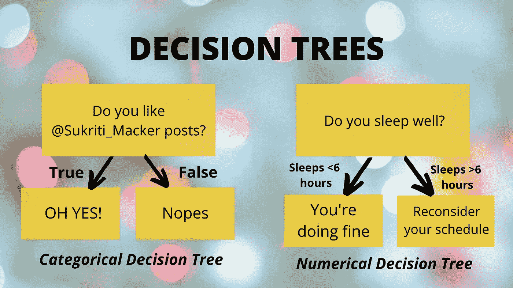
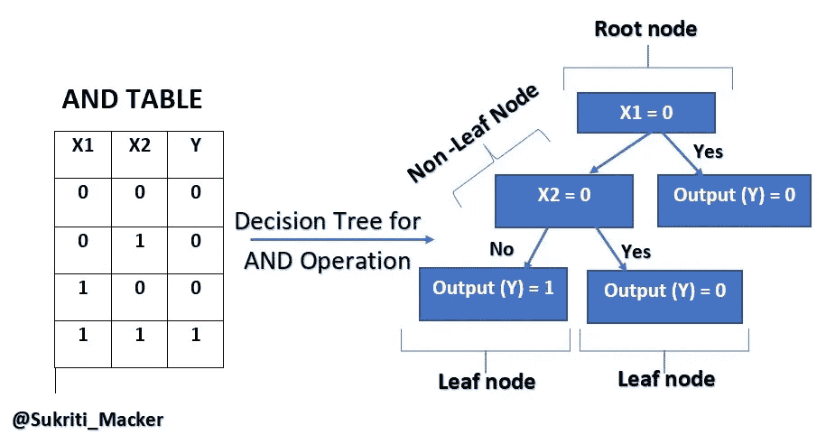
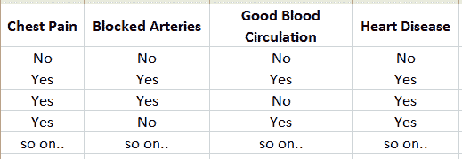
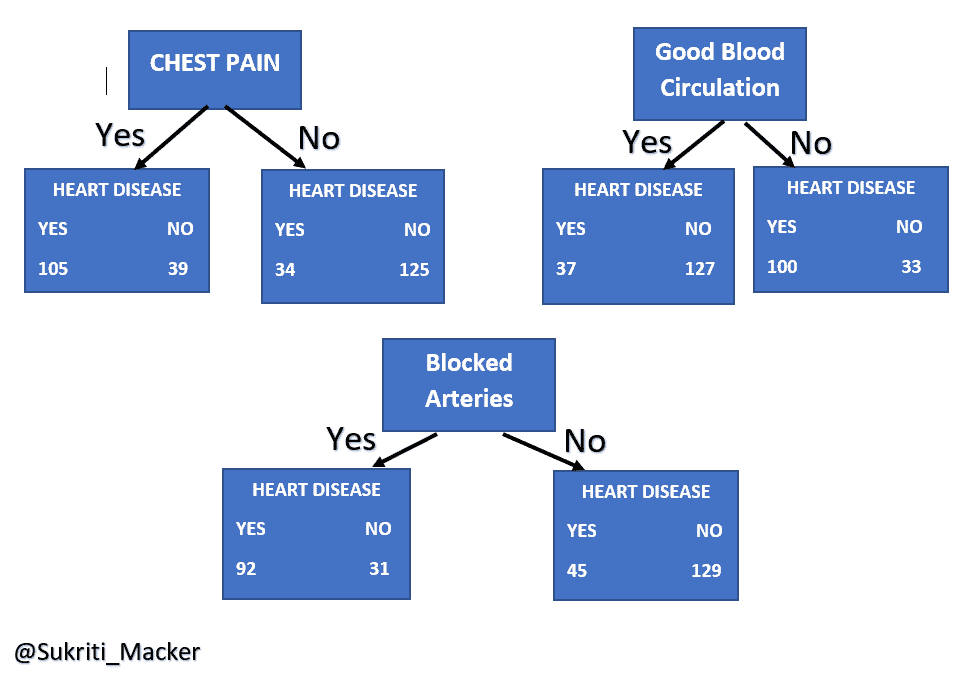

# 决策树背后的工作——简单解释

> 原文：<https://medium.com/analytics-vidhya/working-behind-decision-trees-easy-explanation-729d3864866d?source=collection_archive---------2----------------------->

关于决策树你需要知道的一切！

**决策树是机器学习中使用的一种分类算法**。它足够通用，因为它也可以用来解决回归问题。它是具有根节点、非叶节点、叶节点和分支的树或类似图形的结构。

下面是一个使用 AND 运算的决策树示例

使用 AND 操作创建的决策树

在围绕决策树工作时，有一些**重要术语**必须知道

1.  **根节点**:根节点是决策树的起点。它表示决策树的总体。人口是我们用来解决问题的数据。根节点在特征(列/属性)值上被分割。
2.  **非叶节点**:当一个节点分裂成子部分(在一个特征值上)时，分裂形成的节点称为非叶节点。
3.  **叶节点**:不能再分割(任何特征值)的节点称为叶节点。
4.  **分裂**:分裂是根据结果将节点分成两个或两个以上的子节点。在“是”或“否”的情况下，一个节点将分成两个子节点，一个指向来自“是”的结果&，另一个指向来自“否”的结果
5.  **杂质**:当一个节点没有明确的结果或者不属于一个单一的目标类/输出类时，无论是 Yes 还是 No 类，0 还是 1 类，该节点都被认为是不纯的。如果节点具有单个类的所有值，则称为纯节点。

# 节点如何&我们如何知道在哪个特性上分割节点？

为了选择分裂的特征，我们计算节点的杂质。我们想要**选择给我们** **最低杂质**的特征。

**最低杂质**表示分割将产生“较少”不纯节点。

目标是到达纯节点，其中每个节点属于一个输出类。

## 我们如何计算杂质？

最常用的方法是 GINI 指数。用于**二进制分割，即只有两类的输出**。其他措施包括

1.  准确(性)
2.  信息增益
3.  增益比

***让我们关注 GINI 指数，以理解使用特征分割节点的概念。***

## 我们如何计算基尼指数？

基尼指数= 1 的平方(肯定的概率)-否定的概率的平方

基尼指数公式

## **现在让我们拿一个数据集来理解如何选择分割结点的特征？**

我们有一个独立变量或特征的数据集，如胸痛、良好的血液循环和阻塞的动脉，确定这个人是否患有心脏病。心脏病是我们的目标类别或因变量。因此，数据集的目标类为 Yes 或 No。

样本数据集

在上面的数据集中，我们有四个特征:胸痛，良好的血液循环和阻塞的动脉。在这四个特征中，我们可以将任何一个作为根节点。为了决定哪个节点做根，我们计算基尼指数并挑选最低杂质特征。

假设，我们选择胸痛作为根节点特征:-

*   如果胸痛是肯定的-> 105 个人有心脏病，39 个人没有心脏病。
*   如果胸痛没有-> 34 人有心脏病，125 人没有心脏病。

根节点位置的可能候选者(特征)。

**现在，计算胸痛特征的基尼指数:-**

胸痛为是时的基尼指数= 1-心脏病为是的概率的平方-心脏病为否的概率的平方

= 1 的平方(105/105+39)-的平方(39/105+39)

**= 0.395**

使用相同的公式，当胸痛为否时，基尼指数= 0.336

**现在，我们计算有无胸痛的总基尼指数。**

**总基尼指数** =叶节点基尼系数的加权平均值

胸痛结节的总胃肠道指数= [(胸痛是/胸痛患者总数)x 胸痛是] + [(胸痛否/胸痛患者总数)x 胸痛否的胃肠道指数]

=[(144/144+159)x 0.395]+[(159/144+159)x 0.336)]

= 0.364

使用基尼指数计算的胸痛特征的杂质是 0.364

在像我们对胸痛特征所做的那样计算每个特征的基尼指数之后，我们会发现良好的血液循环特征具有最低的杂质。因此，我们选择良好的血液循环特征作为根节点。

类似地，我们继续寻找下一个节点并完成我们的决策树。