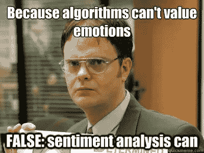
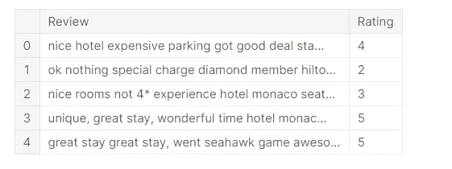
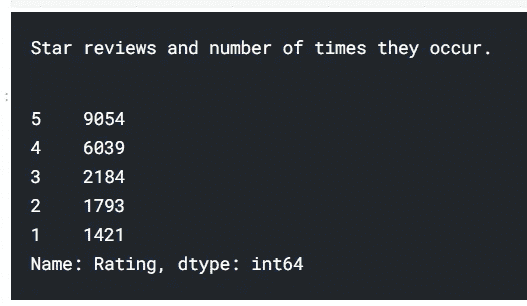
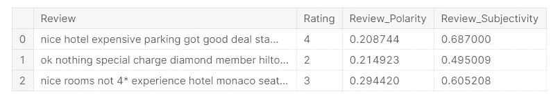
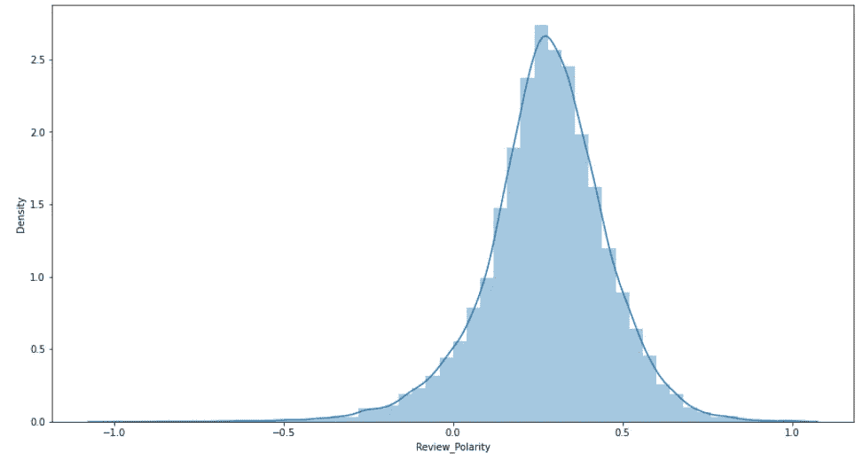
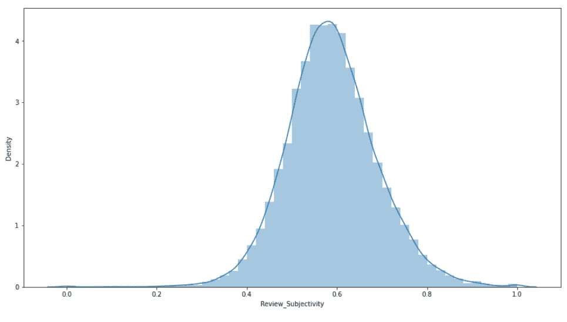
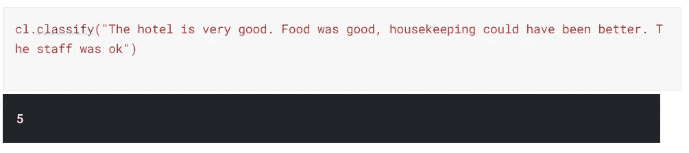
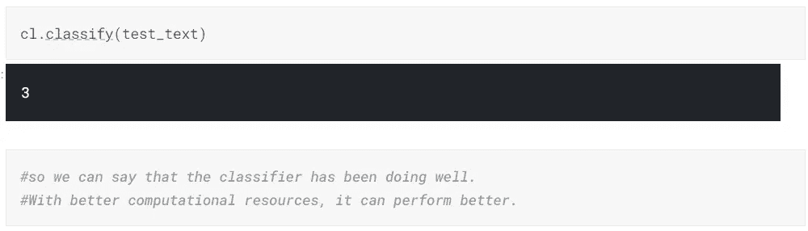

# 使用 TextBlob 处理 NLP

> 原文：<https://medium.com/analytics-vidhya/working-on-nlp-with-textblob-56d0344bb648?source=collection_archive---------2----------------------->

TextBlob 是一个用于处理文本数据的 Python 库。它提供了简单的 API 来执行各种自然语言处理任务。

[](https://textblob.readthedocs.io/en/dev/index.html) [## TextBlob:简化的文本处理- TextBlob 0.16.0 文档

### 版本 0.16.0\. () TextBlob 是一个用于处理文本数据的 Python (2 和 3)库。它为…提供了一个简单的 API

textblob.readthedocs.io](https://textblob.readthedocs.io/en/dev/index.html) 

让我们使用 TextBlob 完成一些 NLP 任务。我们将进行一些情感分析。



NLP 迷因。

我们使用 Trip Advisor 点评数据集，它有大约 20，000 条 1-5 星级的点评。

[](https://www.kaggle.com/andrewmvd/trip-advisor-hotel-reviews) [## 旅行顾问酒店评论

### 从 Tripadvisor 提取的 20k 条酒店评论。

www.kaggle.com](https://www.kaggle.com/andrewmvd/trip-advisor-hotel-reviews) 

```
*#importing the libraries*

import os
import numpy as np *# linear algebra*
import pandas as pd *# data processing, CSV file I/O (e.g. pd.read_csv)*
from textblob import TextBlob
import nltk
from nltk.stem import WordNetLemmatizer
import matplotlib.pyplot as plt
%matplotlib inline*#reading the data*
df = pd.read_csv("/kaggle/input/trip-advisor-hotel-reviews/tripadvisor_hotel_reviews.csv")
```

我们从导入库和数据开始。

```
df.head()
```



数据是这样的。

现在，我们来看看每个数据点出现了多少次。

```
print("Star reviews and number of times they occur.")
df["Rating"].value_counts()
```



酒店主要分为 5 级或 4 级。

然后有很多正常 NLTK 的东西，创建频率表，wordcloud 等等。看看 Kaggle 笔记本上的全部代码。(下面会给出链接。)

## 使用 TextBlob

我们将使用 TextBlob 中的内置方法来生成评论极性和主观性。

```
df_arr = df.to_numpy()
```

但是，在创建分类器之前，我们需要将数据传递给 Textblob 函数，因此我们将数据传递给 python 2D 列表。

```
for a **in** df_arr:
    text=a[0]
    testimonial = TextBlob(text)
    testimonial.sentiment
    polarity_arr.append(testimonial.sentiment.polarity)
    subjectivity_arr.append(testimonial.sentiment.subjectivity)
```

因此，我们得到了极性和主观性的值。为了合并数据，我们也将它们传递给我们的数据框架。

```
df["Review_Polarity"]=polarity_arr
df["Review_Subjectivity"]=subjectivity_arr
df.head(3)
```



新数据已添加。

理解新数据的特征。为此我们将使用分布图。

```
plt.figure(figsize=(15,8))
sns.distplot(df["Review_Polarity"])
```



极性分布图。

```
plt.figure(figsize=(15,8))
sns.distplot(df["Review_Subjectivity"])
```



复习主观性分布。

现在，在我们开始研究这个模型之前，先说几句话。TextBlob 库有许多预定义的函数，这使得工作非常容易。但这也意味着，处理 TextBlob 需要大量的计算资源。我无法在所有 20，000 个数据点上训练模型。所以，只有 1000 个数据点。

```
from textblob.classifiers import NaiveBayesClassifierdf_model=df_arr[0:1000]cl = NaiveBayesClassifier(df_model)
```

现在，模型已经训练好了，我们可以去测试一些样本文本。

```
cl.classify("The hotel is very good. Food was good, housekeeping could have been better. The staff was ok")
```



5 星评论。

```
test_text=".before stay hotel arrange car service price 53 tip reasonable driver waiting arrival.checkin easy downside room picked 2 person jacuzi tub no bath accessories salts bubble bath did n't stay, night got 12/1a checked voucher bottle champagne nice gesture fish waiting room, impression room huge open space felt room big, tv far away bed chore change channel, ipod dock broken disappointing.in morning way asked desk check thermostat said 65f "cl.classify(test_text)
```



3 星评论。

所以我们可以说分类器一直做得很好。有了更好的计算资源，模型可以做得更好。

看看整个代码。

[](https://www.kaggle.com/prateekmaj21/hotel-reviews-nlp-using-textblob) [## 使用 TextBlob 的酒店评论 NLP

### 使用 Kaggle 笔记本探索和运行机器学习代码|使用来自 Trip Advisor 酒店点评的数据

www.kaggle.com](https://www.kaggle.com/prateekmaj21/hotel-reviews-nlp-using-textblob) 

谢谢你。

我的 Linkedin 个人资料-

[](https://www.linkedin.com/in/prateek-majumder/) [## Prateek Majumder -分析师- applex.in | LinkedIn

### IEM 加尔各答大学的本科生。我一直是微软学生合作伙伴计划的一部分，这是一个…

www.linkedin.com](https://www.linkedin.com/in/prateek-majumder/) 

我的 Github 个人资料-

 [## prateekma 21-概述

### applex.in 首席分析师| apple x . in 营销和业务运营|数据科学和分析|数字…

github.com](https://github.com/prateekmaj21) 

谢谢你。