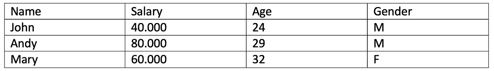
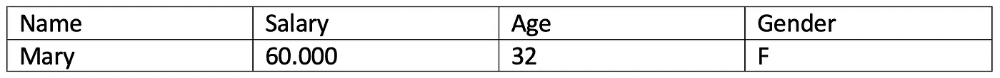

# 使用大型数据集:SQL 介绍。

> 原文：<https://medium.com/analytics-vidhya/working-with-large-datasets-an-introduction-to-sql-fcf8ab9cadc8?source=collection_archive---------3----------------------->


卡斯帕·卡米尔·鲁宾在 [Unsplash](https://unsplash.com?utm_source=medium&utm_medium=referral) 上的照片

**SQL** 结构化查询语言:访问数据库和操作数据的语言。在本文中，我们将讨论 SQL 是如何工作的，以及如何快速开始我们的第一个查询。但是首先:

**什么是 SQL？SQL 是关系数据库的标准编程语言，准确地说，不仅仅是一种，因为 SQL 语言有几种不同的版本。然而，主要的语法是相同的，知道它是有用的。**

1969 年，IBM 员工 Edgar F. Codd 定义了关系数据库模型，这成为几年后开发的著名编程语言的基础。SQL 用于管理数据，尤其是来自关系数据库的数据，关系数据库由几个链接在一起的表组成。SQL 设计用于处理比 Excel 常见的大量数据，并且可以很好地处理这些数据。例如，一个项目曾经收集的所有数据都可以存储在数据库中，并用于将来的特定搜索。而且几乎所有在网页和程序中提供给用户的搜索都可以在后台使用 SQL 实现。

我们如何开始？首先，值得一提的是，SQL 是一种简单的语言，因此比 Java 或 PHP 学起来更快。可能最流行的变体，也是开源的，是 Oracle 的 MySQL。为了便于理解:关系数据库描述了数据库中的几个表，这些表通过某些 id 连接起来。SQL 关键字可以用大写和小写来写，但是为了用户的一致性和概览，它们总是用大写来写。

何时以及如何使用 SQL 一个实际例子:

1.确定任务:需要某些信息，这些信息存在于一个数据库中，其中包含了所有可用的信息。现在必须对这个大数据集进行过滤，以获得所需的结果。现实世界的例子:一家公司希望只查看某个时间间隔内的销售数据，包括某个国家和某个年龄段的 ar 客户的销售情况，以便识别该客户的大部分购买时间，并优化这些客户的销售。
2。执行查询:编写 SQL 查询——应该从数据库中提取哪些数据，之后应该过滤哪些数据？
3。分析结果:我们得到一个结果列表或表格，然后我们可以用图表的形式展示出来，以证明营销策略等方面的变化是合理的。


[M. B. M.](https://unsplash.com/@m_b_m?utm_source=medium&utm_medium=referral) 在 [Unsplash](https://unsplash.com?utm_source=medium&utm_medium=referral) 上拍摄的照片

**我们如何编写一个 SQL 查询？**在接下来的部分，我将介绍这方面的工具(主要的 SQL 命令),并展示一些例子来说明。一些通用命令及其功能:

选择—让我们从数据库中提取数据
创建数据库—创建新数据库
更改数据库—修改现有数据库
删除表—删除表
更新—更新数据库中的数据
删除—从数据库中删除数据
插入—将新数据插入数据库

**基础知识开始:**

1.  **选择**

显示我们使用的表中的所有数据

```
SELECT *FROM your_table
```

SELECT 用于从表
中提取数据，“*”代表“一切”，这意味着您想要输出该表中的一切。可以通用。如果我们想输出所有以“A00”开始的数据，我们写“A00*”。FROM 是指我们从中提取数据的位置。

通常我们不想拥有整张桌子，而只想拥有其中的一部分。为此，我们可以只选择我们需要的部分。举个例子:

```
SELECT Name, Country FROM Your_Table;
```

现在，我们只从表“Your_Table”中获取名称和国家。

**2。独特的**

DISTINCT 用于检查某些列的冗余并删除它们。为了执行这样的功能，我们必须选择应该检查冗余的列。结果看起来像这样:

```
SELECT DISTINCT columnX FROM tableY;
```

因此，我们获得了所选 columnX 的内容，而没有重复的值。

**3。其中**

该命令可用于根据特定标准过滤 SQL 查询的结果。

```
SELECT columnX FROM tableY WHERE columnX = specific value;
```

因此，我们指定必须满足哪个条件，才能获得所需的结果。在这种情况下，columnX 中的值必须正好是特定值。除了“=”之外，还可以使用运算符大于(>)、小于( =)、小于或等于(<=), or not equal to (<>)。这种查询的一个例子可以是，例如，按销售数字过滤:

```
SELECT Price FROM Sales Where Price > 2000
```

**4。和&或**

这些运算符在 SQL-WHERE 条件中用于包含或排除某些结果。它们的用法如下:

```
SELECT columnX
FROM table
Where columnname1 = value 1
AND columnname2 = value 2
```

现在两个标准都必须满足。或者，可以用或替换和。在这种情况下，只需满足这两个指定标准中的一个。为了稍微说明一下功能，下面是一个我命名为“SalaryInfo”的表的例子:



表格“工资信息”

使用以下查询:

```
SELECT Name, Salary, Age, Gender
FROM SalaryInfo
WHERE Salary > 50000
AND GENDER = ‘f’
```

让我们得到正确的结果:



结果:工资高于 50.000，女性

**5。**与**之间**

要仅提取一个区域中的数据，我们可以使用 BETWEEN。

```
SELECT columnX
FROM tableX
WHERE columnX
BETWEEN ‚1‘ AND ‚100‘
```

这样我们只能得到 1 到 100 之间的值。

您想更深入地研究这个问题并执行更复杂的查询吗？对此，我可以推荐 [w3schools](https://www.w3schools.com/sql/) 和他们很棒的教程。