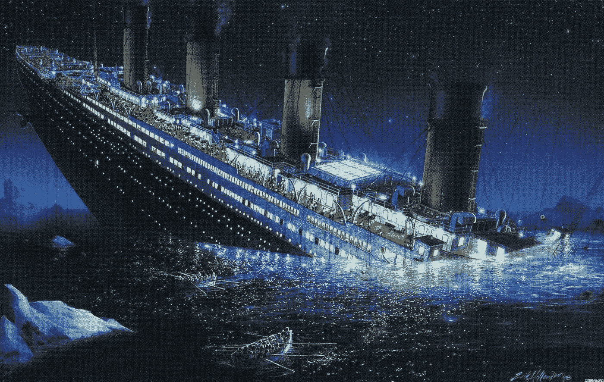
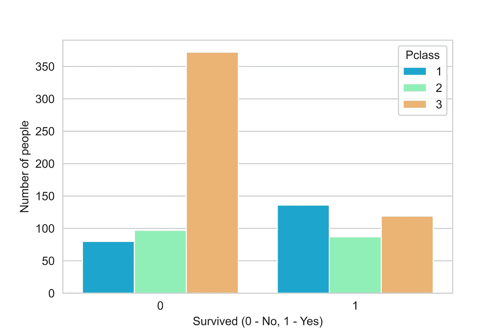
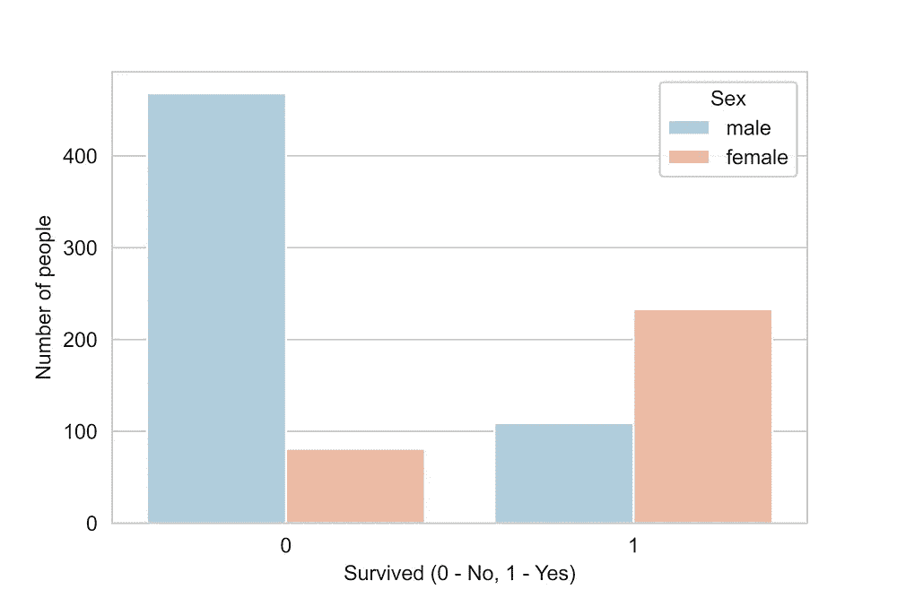
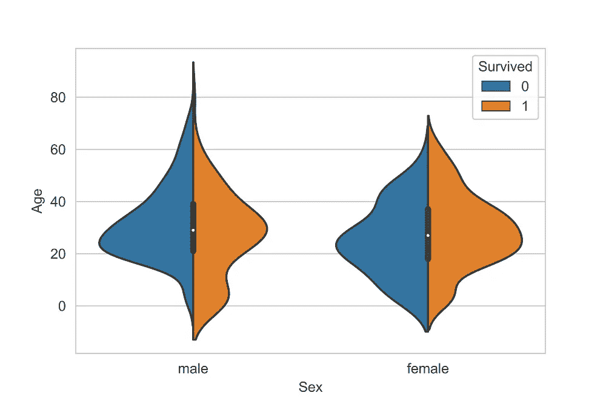
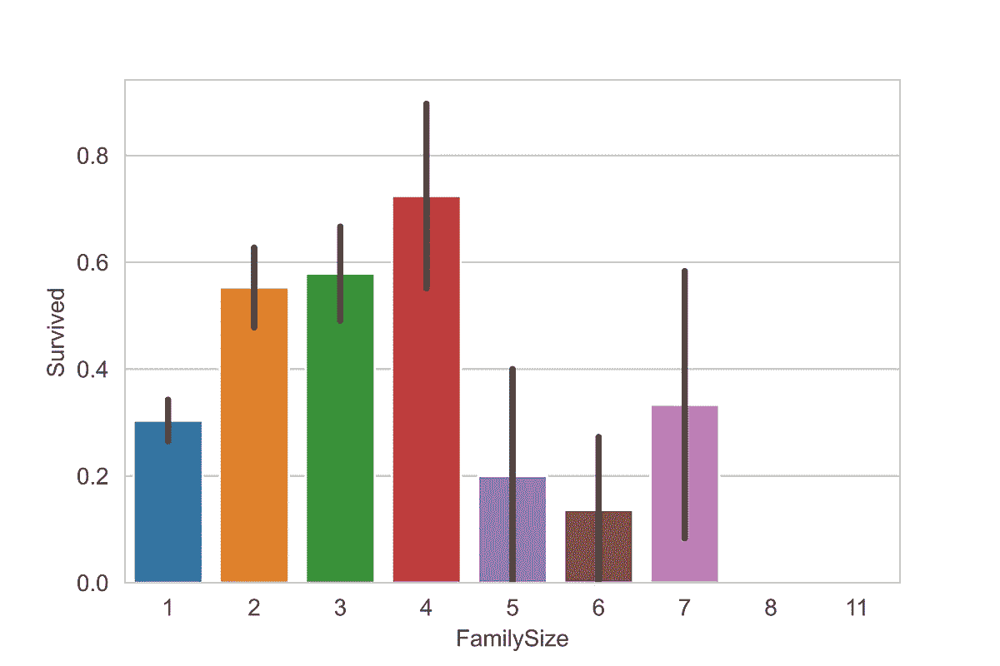
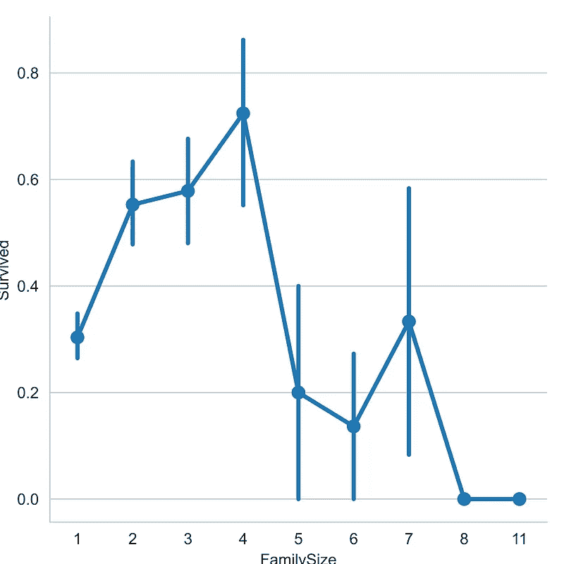
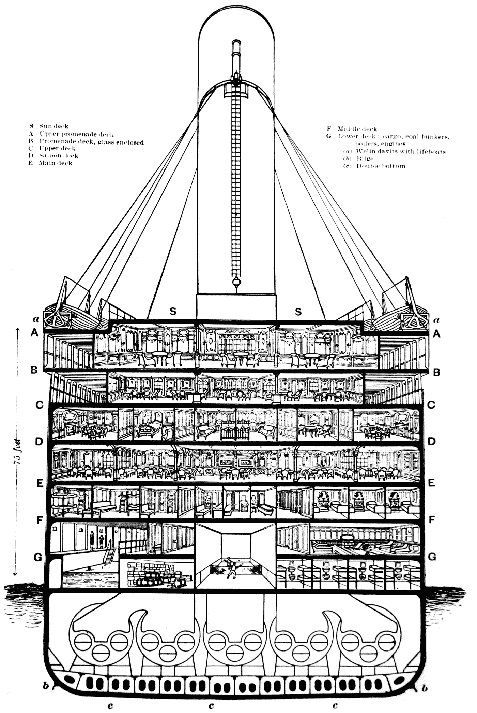
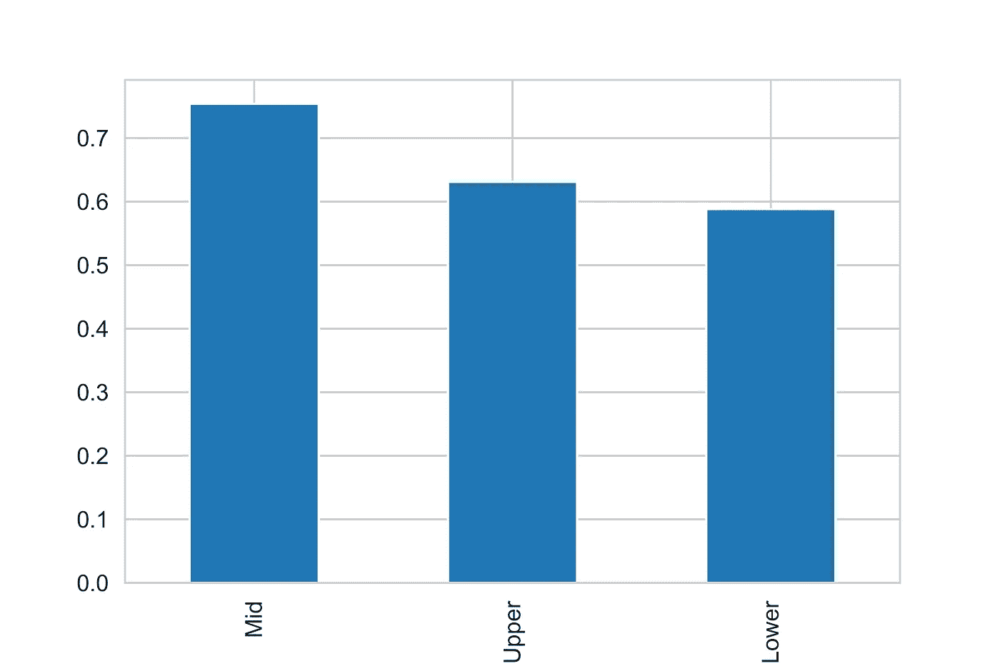
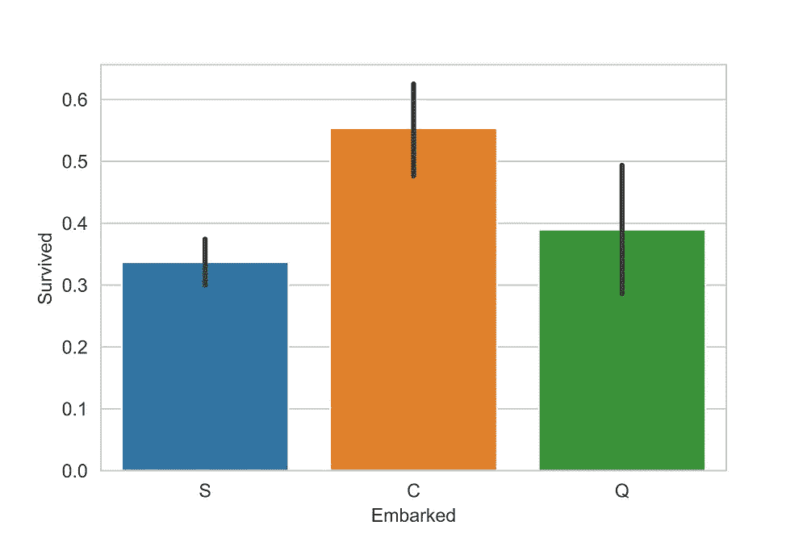
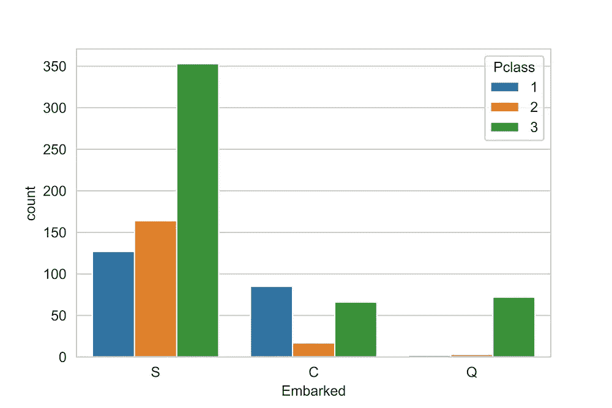

# 你会在泰坦尼克号沉没时幸存吗？

> 原文：<https://medium.com/analytics-vidhya/would-you-have-survived-on-sinking-titanic-e534d4acef33?source=collection_archive---------28----------------------->

## 一种基于数据的方法来揭示什么样的人更有可能在最臭名昭著的海难中幸存。

## 介绍

1912 年，在她的处女航中，被广泛认为是“不沉”的泰坦尼克号在与冰山相撞后沉没。不幸的是，没有足够的救生艇容纳船上的每个人，导致 2224 名乘客和船员中的 1502 人死亡。

你可能听说过“富人行贿后幸存”或者“那些从最后一个地点上船的人幸存”这样的说法。

人们对此有不同的观点，甚至幸存者也有不同的故事。但是数据说明了什么呢？也许，从这场悲剧中得到的关键信息会帮助你更好地计划你的下一次航行。

我将使用可在 [Kaggle](https://www.kaggle.com/c/titanic/overview) 获得的泰坦尼克号数据集来深入研究数据并得出一些见解。该数据集包含登船的 1309 名乘客的信息。它包括乘客信息的 12 个属性，如姓名、年龄、性别、社会经济阶层。利用这一点，我们将发现各个领域之间的相互关系，解释它如何与生存的可能性相关联，并在回答几个问题时可视化趋势。

# 第一部分:疏散的优先顺序是怎样的？

## 富人在分配救生艇时有优先权吗？

有三种等级的票:一等、二等和三等。头等票是最贵的，大约是三等票的十倍。因此，通常只有超级富豪才会选择头等舱机票。

在这里，您可以看到在条形图的左半部分，有一个死亡乘客类别 3 的峰值。与 1、2 等舱的富裕乘客不同，3 等舱的大部分乘客可能无法进入救生艇，这导致了如此显著的生存差异。只有 24%的三等舱乘客幸存，相比之下，一等舱的乘客有 65%幸存。

图 1:在疏散过程中，富人被优先考虑了吗？

## 女人是最先被疏散的吗？

经常听到的一句话“妇女和儿童优先”可以追溯到 19 世纪。尽管船上有 314 名女性和 577 名男性，但从下图可以推断，幸存女性的比例要高得多。74%的女性幸存下来，但只有 19%的男性存活下来。此外，由于大多数幸存的妇女年龄在 20 岁至 40 岁之间(参见右边的小提琴情节)，许多人可能因这一灾难性事件而失去了丈夫。

男性与女性幸存者

这一部分有两大要点:

1.  在疏散过程中，头等舱乘客享有优先权
2.  在分配救生艇时，女性优先于男性。

# 第二部分:家庭规模如何影响生存机会？

在我们的数据集中有两个有趣的变量告诉我们一些关于家庭规模的事情。SibSp 定义了一个乘客有多少兄弟姐妹和配偶，以及多少父母和子女。我们可以将这些变量汇总，并(为每个路人)加 1，得到家庭规模。

一方面，我们可以说，没有任何家庭成员的人有更高的生存机会，因为他们不必担心拯救他们的亲人。另一个论点认为，家庭比单身有更高的生存机会，因为他们更有能力养活自己，并优先得到救助。然而，如果家庭太大，在特殊情况下协调可能会非常困难。

家庭规模与生存概率

在上面的图表中，我感兴趣的是分解生存的最佳家庭规模。柱状图和因子图显示，如果乘客独自一人，没有兄弟姐妹或孩子，有超过 30%的生存机会。最初，存活率随着家庭成员数量的增加而增加，但在某个点(4 个成员)之后，存活率急剧下降。这可能是因为大家庭可能难以管理。在 8 人或 11 人的更大的家庭中，没有一个成员幸存，这进一步支持了这一说法。

# 第三部分:登机点和客舱位置有多重要？

## 客舱位置

尽管有许多缺少的客舱号码值，但省略该字段并且不考虑它将不是一个明智的选择。舱室位置可以是救生艇可达性的重要预测指标，并可以进一步优化结果。正如你在左图中看到的，一等舱在甲板 A、B 或 C 上，混合舱在 D 或 E 上，三等舱主要在 F 或 g 上。我们可以通过第一个字母来识别甲板。

所以，这里 A、B、C 可以认为是上块；d 和 E 是中间块；f 和 G 是较低的块。

上层区域大多有一等舱，由于位置优势和更靠近甲板，有更大的机会接近救生艇。因此，有 75%的机会获救。在船的较低区域，主要是 E、F 和 G 区附近，只有三等舱。因此，由于距离甲板较近，优先级降低，在泰坦尼克号的较低区域只有 58%的生还机会。

不同舱室区域的存活率

## 登机点

下面左边的柱状图代表了登船地点和从这些区域幸存下来的人的比例。右边的条形图代表登机点、每个登机区的人数以及他们各自的机票等级。三个登船区是 C =瑟堡，Q =皇后镇，S =南安普敦。大多数乘客是从南安普敦上船的，其中大多数来自三等舱。来自瑟堡的大部分乘客幸存了下来，可能是因为大部分乘客属于头等舱和二等舱。

登船位置分析

大多数有钱人都是从南安普敦登船的(头等票持有者)，然而，在这里生存的总体机会很低。这是因为属于第三等级的人数要多得多，他们在救生艇上没有优先权。南安普顿的 Pclass 3 有 81%的人没有活下来。

## 结论

在这篇文章中，我们着眼于一种基于数据的方法来揭示什么样的人更有可能在最臭名昭著的海难之一——泰坦尼克号悲剧中幸存下来。

1.  在疏散过程中，妇女和儿童得到了优先考虑，他们生还的机会更大。
2.  富裕的一流人士有很好的机会生存下来，不管他们的寄宿地点。
3.  中型家庭比孤独的个人和大家庭有更高的生存机会。
4.  最后，我们调查了泰坦尼克号上房间的位置，发现靠近甲板的上层街区的人比中层和下层街区(靠近船底，远离甲板)的人更富裕。

这里的发现是观察性的，不是正式研究的结果。所以真正的问题仍然是:

> 你会在泰坦尼克号沉没时幸存吗？

要了解更多关于这个分析的信息，请点击这里的链接。