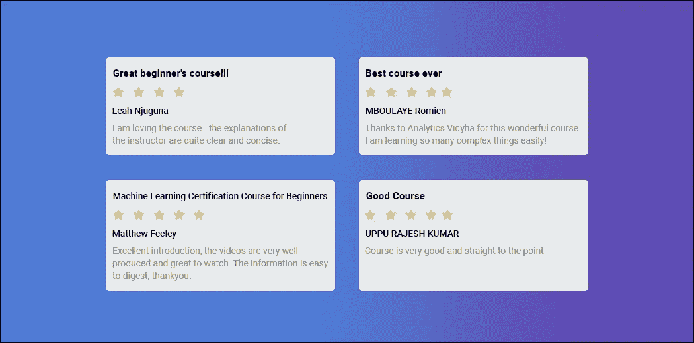
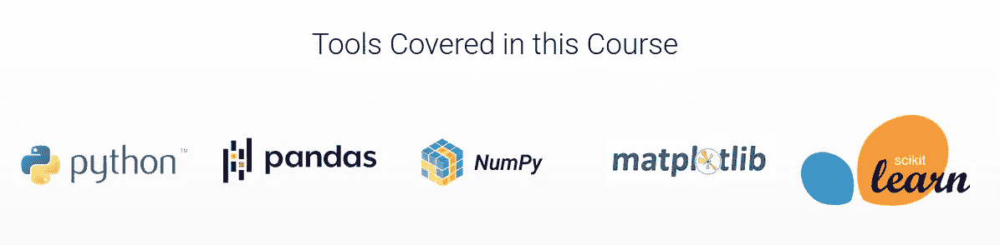
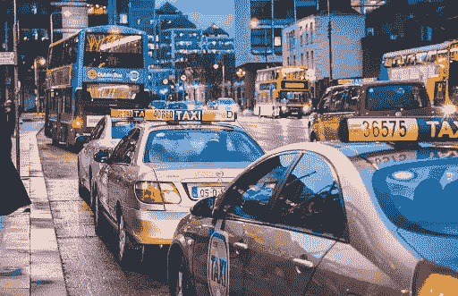

# 你愿意免费开始你的机器学习之旅吗？

> 原文：<https://medium.com/analytics-vidhya/would-you-like-to-start-your-machine-learning-journey-for-free-bea0b8330195?source=collection_archive---------0----------------------->

我们生活在一个选择无穷无尽的时代。尤其是在教育方面！网上有太多的数据科学课程，很难确定从哪里开始你的旅程。

# 免费开始你的机器学习之旅怎么样？

自成立以来，Analytics Vidhya 一直努力以尽可能简单的方式解释数据科学。上个月，我们已经帮助了成千上万没有任何 Python 和 ML 知识的人开始了他们的机器学习之旅，而且是免费的！

目前，机器学习就像那个金色的梦，每个人都想要但不知道如何获得。这正是分析 Vidhya 的魔杖发挥作用的地方。我们的课程为高质量的内容设定了基准，我们还为初学者设计了另一门课程**，那也是免费的**。****

****所以，如果你也是这样问自己的人，“我应该从哪里开始我的机器学习之旅？”，答案是 [**初学机器学习认证课程**](https://courses.analyticsvidhya.com/courses/Machine-Learning-Certification-Course-for-Beginners?utm_source=medium&utm_medium=announcement_article2) **！******

********

# ****初学者机器学习认证课程回顾****

********

****听起来很诱人吧！****

****让我们深入研究一下，了解一下这门课程是为谁开设的。****

# ****初学者的机器学习认证课程是什么？****

****面向初学者的机器学习认证课程是一个**免费的**循序渐进的在线入门课程，旨在学习机器学习的基础知识，听取行业专家和数据科学专业人士的意见，并在机器学习黑客马拉松中应用您的知识！****

****我们将涵盖 Python 对于数据科学、统计学和 EDA 的重要性、几种机器学习算法背后的潜在直觉，然后使用 Python 中的机器学习概念解决案例研究/项目。****

> *****所以，如果你每周投资****8–10 个小时*** *参加这个课程，你就可以在****6–8 周*** *内完成整个课程。*****

****这是点燃你羽翼未丰的机器学习事业的完美起点，并朝着你梦想的数据科学家角色迈出了一大步。我们相信整体学习方法，除了综合课程之外，还有什么更好的学习方法呢？这就是为什么我们为初学者策划了 [**机器学习认证课程**](https://courses.analyticsvidhya.com/courses/Machine-Learning-Certification-Course-for-Beginners?utm_source=medium&utm_medium=announcement_article2) **！******

# ****我将从本课程中学到什么？****

*   ****像 **Numpy，Pandas，**等 Python 库。高效地分析您的数据。****
*   ******统计和探索性数据分析** (EDA)在数据科学领域的重要性。****
*   ******线性回归、逻辑回归和决策树**用于构建机器学习模型。****
*   ****了解如何使用机器学习解决**分类和回归**问题****
*   ****如何使用正确的评估指标来评估您的**机器学习模型**？****
*   ****通过**特征工程**改善和增强您的机器学习模型的准确性****

****大奖:成功完成课程后，您将获得由 Analytics Vidhya 提供的**区块链认证证书**，终身有效。****

********

# ****机器学习认证课程涵盖的项目****

*   ******客户流失预测******

****这个项目要求你预测每个客户的流失倾向。****

********

*   ******纽约市出租车出行时长预测******

****该项目将涵盖提取重要特征的技术，并使用纽约 TLC 委员会的数据准确预测纽约出租车出行的持续时间。****

********

# ****机器学习认证课程是给谁上的？****

****机器学习认证课程面向以下任何人:****

*   ****是机器学习的初学者****
*   ****想要开始他们的机器学习之旅****
*   ****想了解核心机器学习算法****
*   ****对实用的学习环境感兴趣****
*   ****想要练习和增强他们现有的机器学习知识****

****但是等等，前提条件是什么？****

******本课程不需要任何关于数据科学或任何工具的先验知识。******

****那么，你还在等什么？报名参加[初学者机器学习认证课程](https://courses.analyticsvidhya.com/courses/Machine-Learning-Certification-Course-for-Beginners?utm_source=medium&utm_medium=announcement_article2)！免费，今天就开始您的学习之旅！****

*****原载于 2021 年 10 月 8 日*[*【https://www.analyticsvidhya.com】*](https://www.analyticsvidhya.com/blog/2021/10/free-machine-learning-certification-course/)*。*****