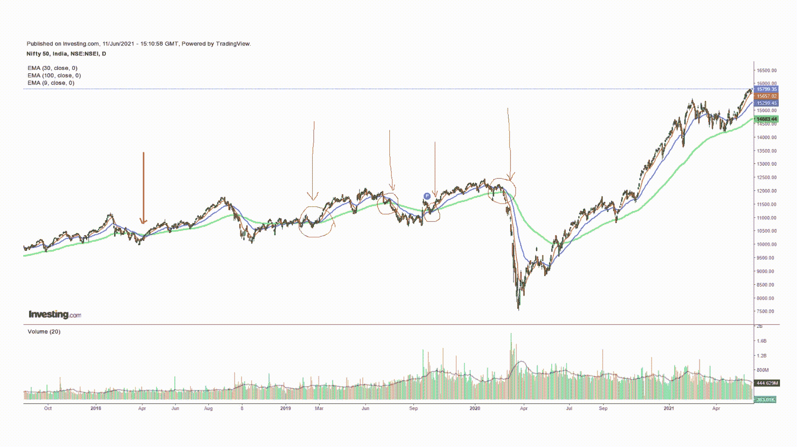

# 哇！用移动平均线预测股市几乎是如此容易…..

> 原文：<https://medium.com/analytics-vidhya/wow-it-is-almost-so-easy-to-predict-stock-market-using-moving-average-58ee811f59fa?source=collection_archive---------9----------------------->

**什么是均线&指数均线(EMA)？**

移动平均法是一种统计计算方法，用于分析基于前一时期或历史时期原始数据集子集的一系列平均值的数据。均线是一种加权移动平均线，它给最近的数据更高的权重。EMA 主要用于预测某一特定时间点的数据的未来趋势。为了前任。Nifty 或 Reliance、Infosys 等任何股票的收盘价。

股票价格是基于随机游走原理，并受到极端波动。移动平均线有助于平滑这些波动，并显示数据的趋势。

移动平均线的进一步阅读:

[移动平均线——维基百科](https://en.wikipedia.org/wiki/Moving_average)

[指数移动平均线(EMA)是如何计算的？](https://www.investopedia.com/ask/answers/122314/what-exponential-moving-average-ema-formula-and-how-ema-calculated.asp)(investopedia.com)

**如何使用指数移动平均线预测股价突破？**

移动平均线的概念是基于精确的，它根据前一时期数据点的平均值来平滑数据点的波动。因此，移动平均线的周期越长，趋势就越平稳。这一点在最近 3 年的漂亮图表的实时例子中会更加清楚。

漂亮图表上的移动平均线

上图是 Nifty 自 2018 年 1 月以来的每日收盘价。

红色趋势线(不是箭头)是 Nifty 收盘价的 9 天移动平均线，因此非常接近 Nifty 的收盘价

蓝线是漂亮的收盘价的 30 天移动平均线，因此比 9 天移动平均线平滑一点

绿线是漂亮的收盘价的 100 天移动平均线，平滑了最近的大部分波动。

为了预测突破，我们可以遵循一条经验法则，即只要所有 3 条移动平均线(即 9 天、30 天和 100 天移动平均线)出现收敛，股票价格就已经巩固，现在是突破的时候了。在上面的示例图表中，左侧第一个红色箭头表示 2018 年 4 月所有 3 毫安的收敛，我们可以清楚地看到从该点的突破。2020 年 4 月出现了类似的趋同，此后出现了明显的突破。在这两者之间还有更多这样的突破，可以很容易地识别出来，并据此制定策略。

**在股市交易中如何利用均线进行更好的决策？**

我们已经了解了不同时期的移动平均线如何帮助我们识别盘整和突破。同样，这些移动平均线可以用来得出进一步的见解。

较高周期移动平均线与较低周期移动平均线的交叉表明趋势反转。

如果较低周期移动平均线从下方与较高周期移动平均线相交，这是买入信号，如果从上方相交，这是卖出信号。在上面的例子中，在 2020 年 7 月初，第一个指示是 9DMA(红线)与下方的 30DMA(蓝线)相交，这是第一个买入信号，然后 9DMA 与下方的 100DMA 相交，这是第二个买入信号，最后 30DMA 与下方的 100DMA 相交，这是最终的买入信号。

股票价格交易高于或低于移动平均线也表明买入或卖出信号。在交易时间内，当股价在移动平均线上方向上突破时，总是买入的好时机，反之亦然。

短期而言，总是在 30 均线以上买入股票，当突破时退出。长期购买 100 DMA 以上。在上面的图表中，我们可以清楚地看到这样的趋势。

移动平均线也可以用于任何类型的交易决策，如日内交易、短期交易或长期交易。我们只需要调整图表数据的周期。对于日内，最好采用 1 分钟图。短期小时图和长期日线图或周线图。其余所有的分析和推论都将是类似的。

**使用均线的期权交易策略？**

除了根据各种级别的股票及其移动平均线做出买入、卖出和持有决定之外，它还可以用于创建有利可图的期权交易策略。

当我们看到 9DMA、30DMA 和 100 DMA 正在收敛时，我们可以清楚地看到股价正在盘整，预计将出现突破。在此期间，波动性通常较低，因此期权价格较低。由于突破的方向无法准确预测，最佳策略是买入看涨和看跌期权，然后在突破发生时卖出。

2019 年 1 月 30 日，Nifty 收于 10650 点，所有 3 条移动平均线在此期间收敛。执行价 10650 的收盘价为 195 卢比/nifty，看涨期权为 222 卢比/nifty，因此总投资为 417 卢比。在突破后的下周末，多空价格在 485 到 515 之间交易，即利润约为。15%-20%.类似的利润也可能在 2019 年 3 月到期时实现。

另一个策略是，如果预期会出现正面突破，就设计一个看涨期权价差。比如买入行权价 10651 的看涨期权，卖出行权价 10750 的看涨期权。这种策略损失有限，收益有限。在我们上面的例子中，Nifty 10750 执行价格在 2019 年 1 月 30 日以 166 成交。因此，投资卢比(222–166)= 56，当 nifty 在突破后上涨时，最大利润为 44，最大损失仅为 56。如果预期会出现负面突破，也可以使用看跌期权建立类似的策略。

如需更多此类文章，请关注我的[https://manishbansal3003.blogspot.com/](https://manishbansal3003.blogspot.com/)

**免责声明:本博客上的信息仅供参考。它不构成对任何人进行任何交易或采取任何对冲、交易或投资策略的任何要约、建议或邀约，也不构成对利率或价格未来可能变动的任何预测。**