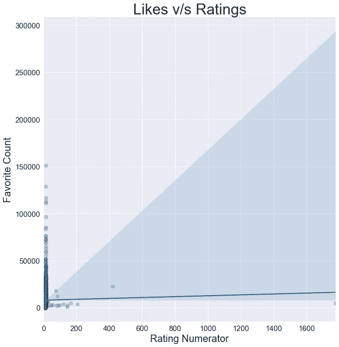
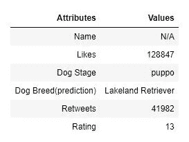
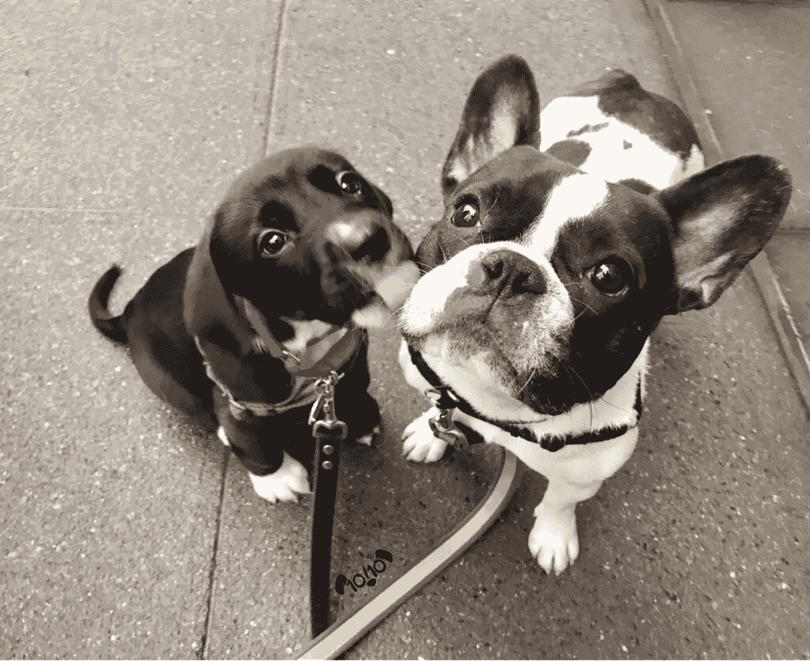

# 争论和分析 WeRateDogs Twitter 数据

> 原文：<https://medium.com/analytics-vidhya/wrangle-analyze-weratedogs-twitter-data-4fcdd5b4bb2c?source=collection_archive---------3----------------------->

# 介绍

我将讨论、分析和可视化的数据集是 Twitter 用户@dog_rates 的推文档案，也称为 WeRateDogs。WeRateDogs 是一个 Twitter 帐户，它用一个关于狗的幽默评论给人们的狗打分。这些评级的分母几乎都是 10。但是分子识别器呢？几乎总是大于 10。11/10、12/10、13/10 等。为什么？因为“它们是好狗，布伦特。”WeRateDogs 拥有 400 多万粉丝，并获得了国际媒体的报道。

# 收集数据

*   我通过下载 Udacity 通过链接提供给我的文件来收集 WeRateDogs twitter 存档数据，然后以 csv 格式加载存档数据。
*   我通过使用*请求*库以编程方式下载文件，收集了 Udacity 服务器上托管的 WeRateDogs tweet 图像预测(tsv 格式)。
*   我通过 Twitter API 和 python *tweepy* 库收集了 WeRateDogs twitter 账户的附加数据(转发数和收藏数)。使用 WeRateDogs Twitter 档案中的 tweet IDs，我使用 tweepy 库在 Twitter API 中查询每条 tweet 的 JSON 数据，并将每条 tweet 的完整 JSON 数据集存储在一个名为 tweet_json.txt 文件的文件中。最后，我从 tweet_json.txt 文件中读取 twitter json 数据，方法是将每个 json 字符串转换成 python 字典，并将它们附加到一个列表中(逐行)，这个字典列表最终被转换成 python pandas 数据帧。

# 资料组

1.`**Table/Dataframe 1: wrd_archive containing twitter archive data of WeRateDogs**`

> *数据帧的尺寸:(2356 行，17 列)*
> 
> *栏目:* tweet_id、in_reply_to_status_id、in_reply_to_user_id、时间戳、来源、文本、retweeted _ status _ id、retweeted _ status _ user _ id、retweeted _ status _ timestamp、expanded_urls、rating _ 分子、rating _ 分母、狗名、doggo(狗阶段)、floofer(狗阶段)、pupper(狗阶段)、puppo(狗阶段)

2.`**Table/Dataframe 2: wrd_archive_add contains twitter api data (retweets and likes) of WeRateDogs**`

> *数据帧的尺寸:(2331 行，3 列)*
> 
> *栏目:*推文 id，转发次数，收藏次数

3.`**Table/Dataframe 3: wrd_image_prediction contains tweet image prediction data**`

> *数据帧的尺寸:(2075 行，12 列)*
> 
> *列:* tweet_id，jpg_url(狗预测图片)，img _ number(tweet 的图片编号)，p1 (p1 是前 3 个图片预测中的预测顺序 1)，p1_conf(预测置信度)，p1_dog(预测是否为狗品种)，p2，p2_conf，p2_dog，p 3，p3_conf，p3_dog

# 评估数据

在对数据集进行可视化和程序化评估后，我发现了以下质量和整洁性问题。

**质量问题**

`**Dimension**`**:**

`**Table 1: wrd_archive (twitter archive data of WeRateDogs)**`

1.  **完整性:**缺少狗阶段和狗名的值**(无法清理)**
2.  **准确性:**在“名称”和“狗阶段”列中，用 NaN 替换名为“无”的缺失值
3.  **有效性:**tweet id 的数据类型错误，应该是字符串而不是整数
4.  **准确性:**调查名字栏中不正确的名字，因为一些狗的名字似乎不准确(所有、我的、不是、一个、一个、这个、由、这样)
5.  **一致性:**只有那些在图像预测表中有图像预测的 tweet ids
6.  **准确性:**评分分母值不准确
7.  **准确性:**评级分子的值不准确
8.  **有效性:**时间戳，转发状态时间戳数据类型为字符串，应为日期时间
9.  **一致性:**我们想要原始评级，所以删除被转发的推文 id

`**Table 2: wrd_archive_add contains twitter api data (retweets and likes) of WeRateDogs**`

1.  **有效性:**推文 id 的数据类型错误，应该是字符串而不是整数

`**Table 3: wrd_image_prediction contains tweet image prediction data**`

1.  **有效性:**推文 id 的数据类型错误，应该是字符串而不是整数

**整洁问题**

`**Tidy Data: Each variable forms a column**`

1.  融合列 doggo、floofer、pupper 和 puppo，因为这些列标题是值而不是变量名，在存档表(wrd_archive)中变量名是 dog stage
2.  将存档表的文本列分成两个单独的列(tweet text 和 tweet_url)

`**Tidy Data: Each type of observational unit forms a table**`

1.  合并存档(wrd_archive)、附加存档(wrd_archive_add)和图像预测(wrd_image_prediction)表

# 干净的数据

> `***Creating copies of all the three tables to perform cleaning tasks***`

```
wrd_archive_clean = wrd_archive.copy()
wrd_archive_add_clean = wrd_archive_add.copy()
wrd_image_prediction_clean = wrd_image_prediction.copy()
```

# 缺失数据

> ***发布:*** *处理缺失值*
> 
> ***解:*** *使用熊猫替换函数将 wrd_archive_clean 表的 name 和 dog stages 列中缺少的名为 None 的值替换为 NaN。*
> 
> ***发布:*** *处理转发的收视率*
> 
> ***解决方案:*** *我们想要原始评级，因此删除转发，即在 wrd_archive_clean 表中具有 retweeted _ status _ id 的推文 id，方法是使用 pandas 查询功能选择这些 id，然后通过 pandas drop 功能删除它们。*
> 
> ***问题:*** *处理图像预测表中没有图像预测的推文 id*
> 
> ***解决方案:*** *使用 pandas isin 函数找到 wrd_image_prediction 表中 wrd_archive_clean 表的 tweet ids，然后用 wrd_image_prediction 表中存在的这些 id 更新 wrd_archive_clean 表。*

# 整齐

> ***问题:*** *多个变量(文本和 url)存储在一列(文本)*
> 
> *****问题:*** *列标题是值，不是变量名，因此熔化列 doggo、floofer、pupper 和 puppo***
> 
> *****解决方案:*** *使用 pandas melt 函数来融化列:doggo、floofer、pupper 和 puppo，在这个用例中会产生大量重复值。因此，我们将为每个狗阶段类别创建数据帧，并为丢失的狗阶段创建一个数据帧。然后我们将使用 append 函数添加 doggo，floofer，pupper，puppo 的数据帧。现在，我们将把 null_stage(无 dog 阶段)数据帧附加到 doggo、floofer、pupper、puppo (df3)的附加数据帧，最后，我们将把这个附加数据帧存储到具有列的最终数据帧中:doggo、floofer、pupper 和 puppo 成为一个单独的列:* dog_stage *。***
> 
> *****发布:*** *归档附加表(wrd_archive_add)应该是归档表(wrd_archive)* 的一部分**
> 
> *****解决方案:*** *通过使用 pandas merge 函数对* tweet_id *列执行左连接来合并 wrd_archive_cleaned 和 wrd_archive_add_clean。***

# **质量**

> *****问题:*** *调查姓名栏中的错误姓名，因为有些狗的姓名似乎不准确(all、my、not、a、an、the、by、such)***
> 
> *****解决方案:*** *使用视觉评估比较 wrd_archive_cleaned* 表的文本和名称列，以识别不正确的名称，然后使用*iloc、loc、np.r **函数将识别出的不正确名称替换为文本列中的实际名称，还将文本列中没有实际名称的剩余名称替换为 NaN。***
> 
> *****问题:*** *评级分子*数值不准确**
> 
> *****解决方案:*** *使用视觉评估比较 wrd_archive_cleaned* 表的文本和 rating _ molecule 列，以识别评级分子的错误值，然后使用*iloc、loc、np.r **函数将识别出的错误值替换为文本列中的实际值。***
> 
> *****问题:*** *评分分母的值不准确***
> 
> *****解决方案:*** *使用目测比较 wrd_archive_cleaned 表的文本和 rating_denominator 列，识别 rating_denominator* 的错误值，然后使用*iloc，loc，np.r **函数将识别出的错误值替换为文本列中的实际值。***
> 
> *****问题:*** *无效数据类型***
> 
> *****解决方案一:*** *使用 astype 函数将 wrd_archive_master 中 tweet_id 的数据类型从 int 改为 string (str)。***
> 
> *****解决方案二:*** *使用 to_datetime 函数将 wrd_archive_master 中时间戳的数据类型从 string (str)改为 datetime，其他错误数据类型(retweet_count)使用 to_numeric 函数。***
> 
> *****解决方案三:*** *使用 astype 函数将 wrd_image_prediction 中 tweet_id 的数据类型从 int 改为 string (str)。***
> 
> **`***Merging twitter archive and image prediction dataframes***`**

```
wrd_archive_master_final = pd.merge(wrd_archive_master, wrd_image_prediction, how = 'left', on = 'tweet_id')
```

> **`***Renaming the final cleaned dataframe***`**

```
twitter_archive_master = wrd_archive_master_final
```

> **`***Dimensions of the final cleaned dataframe***`**
> 
> ***尺寸:(2005 行，25 列)***
> 
> **`***Saving the cleaned dataframe to csv***`**

```
twitter_archive_master.to_csv('twitter_archive_master.csv', index = False)
```

> **`***Saving the cleaned dataframe to a SQLite database file***`**

*   **通过创建 SQLAlchemy 引擎和空的 weratedogs 数据库连接到数据库**

**`engine = create_engine('sqlite:///weratedogs.db')`**

*   **通过其各自的 df 名称将清理的数据帧存储在新创建的 weratedogs 数据库中**

```
twitter_archive_master.to_sql('twitter_archive_master', engine, index=False, if_exists='replace')
```

# **洞察力和可视化**

> **`***Loading the cleaned data from the recently stored csv file***`**

```
df **=** pd**.**read_csv('twitter_archive_master.csv')
```

# **转发计数分布(转发)**

****

**与第三个四分位数(75%)相比，中位数(50%)更接近第一个四分位数(25%)。**

****

**从上图中可以明显看出，转发次数(retweets)的分布是正偏态的(右偏态),因为它在末端有很少的大输入，并且基于以上中值(50%)的计算，与第三个四分位数(75%)相比，更接近第一个四分位数(25%)。此外，转发次数分布的偏斜度似乎很强。大多数数据累积起来有 20000 次转发。因此，我们将限制设置到 20000 年，以进一步调查这种分布是否有任何隐藏的趋势。**

**`**Zooming In**`**

****

**放大后，很明显，转发的分布仍然是正偏的(右偏)，因为最后很少有大的输入。此外，转发次数分布的偏态强度仍然很强。此外，值得注意的是，上面计算的平均转发数是 2394，但峰值(最常见的转发数)低于 1250。这是因为平均值受到极值存在的影响，这就是为什么在这种情况下它不是最准确的集中趋势度量。因此，中值(即 **1162** 转发量)应被视为集中趋势的衡量标准。**

# **收藏计数(喜欢)的分布**

****

**与第三个四分位数(75%)相比，中位数(50%)更接近第一个四分位数(25%)。**

****

**从上图中可以明显看出，收藏计数(喜欢)的分布是正偏态的(右偏态)，因为它在末端有很少的大输入，并且基于以上中值(50%)的计算，与第三个四分位数(75%)相比，更接近第一个四分位数(25%)。此外，最喜欢的计数分布的偏态强度似乎很强。大部分数据累积到 50000 个最喜欢的计数。因此，我们将限制设置为 50000，以进一步研究该分布中是否存在隐藏的趋势。**

**`**Zooming In**`**

****

**放大后，很明显，喜欢的分布仍然是正偏(右偏)的，因为最后很少有大的输入。此外，最喜欢的计数分布的偏态强度仍然很强。此外，重要的是要注意，上面计算的平均收藏计数是 8052，但峰值(最常见的收藏计数)低于 5000。这是因为平均值受到极值存在的影响，这就是为什么在这种情况下它不是最准确的集中趋势度量。因此，T2 喜欢的中位数应该被认为是集中趋势的量度。**

# **评级分子分布(评级)**

****

**中位数(50%)与两个四分位数距离相等，即第一个四分位数(25%)和第三个四分位数(75%)。**

****

**从上图中可以看出，评级分子(评级)的分布是正偏的(右偏)，因为它在末端有很少的大输入，但根据上述计算，中位数(50%)与两个四分位数(即第一个四分位数(25%)和第三个四分位数(75%)距离相等。此外，大多数数据都是累积到 50 个评级。因此，我们将限制设置为 50，以进一步调查该分布中是否存在隐藏的趋势。**

**`**Zooming In**`**

****

**放大后，评级的分布似乎不是正偏的，有证据支持这一说法，因为上面计算的中值评级分子 11 与上面计算的第一个四分位数(25%)和第三个四分位数(75%)分别为 10 和 12。此外，收视率分布的偏斜度很低。此外，峰值(最常见的评级分子)也在平均值和中值的相同范围内观察到。因此，可以说放大后的收视率分布接近正态分布，均值约为。 **12** 和中位数 **11** 都可以被认为是集中趋势的量度。**

# **狗的阶段分析**

****

**从上图可以明显看出，在 WeRateDogs 的推文中，pupper dog 阶段是最受欢迎的狗阶段，涉及 pupper dog 阶段的推文数量明显高于所有其他狗阶段 **(212)** 。doggo dog 阶段有 **74** 条推文，puppo dog 阶段有 **23** 条推文，而 floofer dog 阶段的推文数量最少，即 **8** 。**

## **与转发相关的狗阶段分析**

****

**有趣的是，根据之前的研究结果，在 WeRateDogs 的推文中，小狗阶段是最受欢迎的狗阶段，事实上根据均值和中值测量，其平均转发次数最低，但根据均值测量，第二受欢迎的狗阶段 doggo 狗阶段的平均转发次数最高，而根据中值测量，最不受欢迎的狗阶段 floofer 狗阶段的平均转发次数惊人地最高。**

**正如我们在上面的观察中看到的，转发在最后有非常大的输入，这就是为什么在存在这些极值的情况下，与均值相比，中值是更准确的集中趋势的度量。因此，可以肯定地说，弗洛弗犬阶段大约。 **2851** 平均转发次数(中值)与 WeRateDog 的 twitter 账户中提到的所有其他狗阶段相比，具有最高的平均转发次数。此外，在分析每个狗阶段的转发次数分布时，可以找到更多见解。**

****

**在分析上图中与每个狗阶段相关的转发次数分布时，有趣的是注意到转发次数的平均值之间没有显著差异(因为它们的中值约为。相同)在除了 pupper 之外的所有其他狗阶段中，它实际上具有最低的平均转发次数。**

## **与喜欢相关的狗阶段分析**

****

**有趣的是，根据之前的研究结果，在 WeRateDogs 的推文中，pupper dog 阶段是最受欢迎的狗阶段，实际上根据均值和中值测量，其平均喜欢数最低，但根据均值和中值测量，puppo dog 阶段是第二不受欢迎的狗阶段，其平均喜欢数最高。**

**正如我们在上面的观察中所看到的，喜欢在最后有非常大的输入，这就是为什么在存在这些极值的情况下，与均值相比，中值是对集中趋势更准确的度量。因此，可以有把握地说，与 WeRateDog 的 twitter 帐户中提到的所有其他狗阶段相比，平均喜欢数(中值)为 **13822** 的 puppo 狗阶段拥有最高的平均喜欢数。而且，在分析每个狗阶段的喜爱计数分布上，可以发现更多的见解。**

****

**在分析上图中与每个狗阶段相关的最喜欢的数量分布时，有趣的是注意到平均喜欢数量之间没有显著差异(因为两个中值都是近似值)。相同)在狗阶段 doggo 和 floofer 之间。然而，puppo dog stage 是推特上第二不受欢迎的狗阶段，按照中位数衡量，它的平均点赞数最高。此外，根据之前的研究结果，在 WeRateDogs 的推文中，pupper dog 阶段是最受欢迎的狗阶段，事实上，根据中值测量，它的平均喜欢数最低。**

## **将两者相比较**

****

**而箱线图结合上述群集图更容易比较不同阶段狗的转发次数的中位数。在这里，我们使用了 violin plots 来轻松地比较不同阶段的狗的转发分布。**

****转发分布:**从上图可以明显看出，floofer 狗阶段的大多数推文具有较高的转发次数，因为 floofer 阶段的小提琴图比其中值(中心)更宽，暗示在该区域有较高概率的推文，而对于其他狗阶段，即 puppo 和 pupper，其小提琴图比中值更宽，暗示在该区域有较高概率的推文，因此可以说这些狗阶段的大多数推文具有较少的转发次数。Doggo stage 的小提琴图围绕中间值更宽，因此表明 doggo dog stage 的大多数推文都围绕中间值进行了转发。**

****点赞分布:**从上图可以明显看出，floofer dog stage 的大多数推文具有高点赞数，因为 floofer stage 的小提琴图在其中值(中心)以上较宽，暗示该区域中推文的高概率，而 doggo dog stage 的小提琴图在中间较宽，仅在一端被篡改，即在中值以上，因此表明 doggo dog stage 的大多数推文具有较少点赞数。此外，pupper dog stage 的小提琴图比其中值更宽，暗示该区域中 tweet 的高概率，因此可以说 pupper dog stage 的大多数 tweet 具有较少数量的喜欢。此外，puppo dog stage 的大多数推文都有很高的点赞数，因为 puppo stage 的小提琴图比中值(中心)更宽，这意味着该区域的推文概率很高。**

**因此，violin plots 以一种简单的方式提供了相对于每个狗阶段的转发和喜欢分布的更准确的解释。**

****

1.  **根据之前的发现，在 WeRateDogs 的推文中，pupper dog 阶段是最受欢迎的狗阶段，实际上平均转发次数最低，但 floofer dog 阶段是最不受欢迎的狗阶段，大约只有 20%。平均转发次数令人惊讶的是，平均转发次数最高。**
2.  **pupper dog 阶段实际上也有最低的平均点赞数，但 puppe dog 阶段是第二不受欢迎的狗阶段，平均点赞数为`**13822**`,平均点赞数最高，而 doggo 和 floofer 的平均点赞数大致相同。**

# **喜欢视频/视频转发**

****

**从上图可以看出，转发和喜欢是相关的，它们之间有很强的线性关系。但是正如我们所看到的，大多数数据是在开始时积累的，因为两个变量都具有正偏态分布，这意味着需要进一步的转换来研究它们的关系。**

## **数据标准化后的关系(对数变换)**

****

**对这两个变量执行对数转换后，我们可以清楚地看到，赞和转发高度相关，它们之间有很强的线性关系，因为上图中直线的斜率很高。**

# **与评级相关的狗阶段分析(分子)**

****

**很明显，就平均值和中值测量而言，所有犬类阶段的平均评级数之间没有显著差异。此外，与转发和喜欢不同，所有狗阶段的平均和中值评级值约为。与放大之前的观察结果相同，发现评级分子接近正态分布。**

****

1.  **从上图中可以明显看出，所有狗阶段 doggo、floofer、puppo 和 pupper 的小提琴图恰好在中间位置较宽，这意味着该区域的推文概率较高，因此可以说所有这些狗阶段的大多数推文的评级都集中在中间值附近。**
2.  **上述发现进一步得到了以下事实的支持，即与所有其他具有相同平均评级数(即 12(中值))的狗阶段相比，在基于先前发现的 WeRateDogs 的推文中最受欢迎的狗阶段 pupper dog 具有平均评级数(即 11(中值))。总的来说，所有狗阶段的平均评分数之间的差异是微不足道的。**

# **转发视频收视率**

****

**从上图可以看出，转发量和收视率并不相关，它们之间也没有很强的线性关系。但是正如我们所看到的，大多数数据是在开始时积累的，因为 retweet 变量具有正偏态分布，因此，暗示着需要进一步的转换来研究它们之间的关系。**

****

**但是，在对 retweet 变量执行对数转换后，我们可以清楚地看到 retweet 和 ratings 是相关的，它们之间的线性关系强度适中。**

# **喜欢 v/s 评级**

****

**从上图可以看出，喜欢和评分并不相关，它们之间也没有很强的线性关系。但是正如我们所看到的，大多数数据是在开始时积累的，因为 likes 变量具有正偏态分布，因此，这意味着需要进一步的转换来研究它们之间的关系。**

****

**然而，在对 likes 变量执行对数变换之后，我们可以清楚地看到 likes 和 ratings 是相关的，并且它们之间的线性关系的强度是适中的。**

# **将两者相比较**

****

**在对两个变量(即转发和喜欢)进行转换后，我们可以清楚地看到转发和喜欢都与评级相关。然而，与转发相比，赞与评分之间的线性关系更强。但总的来说，它们与评级的关系强度之间的差异并不显著，因为两个图表中的线条都具有大约。相同的斜率。**

# **最受欢迎的犬种(前 5 名)**

****

**从上图可以明显看出，就拥有 143 只狗的图像预测数量而言，金毛寻回犬是 WeRateDogs 的推文中最受欢迎的狗品种。第二受欢迎的犬种是拉布拉多寻回犬(96 只)，其次是彭布罗克犬(88 只)和吉娃娃犬(79 只)。第五个最受欢迎的犬种是哈巴狗(54 只)。**

# **最不受欢迎的犬种(前 5 名)**

****

**从上图可以明显看出，前五个最不受欢迎的犬种，即苏格兰梗、丝毛梗、格罗嫩代尔、恩特布赫和标准雪纳瑞，拥有相同数量的犬种(图像预测数量)，即**

# **最喜欢的狗(前 5 名)**

**`**Below all the details such as name, dog stage, dog breed, number of retweets and rating regarding each dog of the top five dogs with most likes are provided.**`**

# **1**

********

# **2**

********

# **3**

********

# **4**

********

# **5**

********

**从上述数字中值得注意的是，所有具有最高点赞数的狗也具有高转发率，这是预料之中的，因为点赞数和转发数高度相关，即如果我们增加点赞数，转发数也会增加，但这并不意味着因果关系，即转发数的增加是由点赞数的增加引起的，因为可能有另一个变量负责两者的增加。因此，为了检查喜欢和转发之间是否也存在因果关系以及相关性，我们需要利用统计技术，如假设检验或 A/B 检验。**

# **转发次数最少的狗(前 5 名)**

**`**Below all the details such as name, dog stage, dog breed, number of likes and rating regarding each dog of the top five dogs with least retweets are provided.**`**

# **1**

********

# **2**

********

# **3**

********

# **4**

********

# **5**

********

**从上面的数字中值得注意的是，所有转发次数最少的狗的喜欢次数也很低。**

# **评分最高的狗(前 5 名)**

**`**Below all the details such as name, dog stage, dog breed, number of likes, retweets and rating denominator regarding each dog of the top five dogs with highest ratings (rating numerator) are provided.**`**

# **1**

********

# **2**

****

**`**Can not display the image as it may implicate racial discrimination.**`**

# **3**

********

# **4**

********

# **5**

********

**从上述数字中值得注意的是，所有具有最高评级数的狗也具有高的转发和点赞数，这是可以预料的，因为评级与点赞和转发数相关，即如果我们增加评级数，转发和点赞数也会增加，但这并不意味着因果关系，即点赞和转发数的增加是由评级的增加引起的，因为可能有另一个变量负责所有评级的增加。因此，为了检查点赞和评级以及转发和评级之间的因果关系以及相关性，我们需要利用统计技术，如假设检验或 A/B 检验。**

# **在最喜欢、最高评级和最不喜欢的推文中，实际上是狗品种的预测比例(前 5 名)**

****

*   **在最喜欢的数据框架中，实际上是狗品种的预测比例是 **1.0****
*   **在高层数据框架中，实际上是狗品种的预测比例是 **0.6****
*   **在最少的推文中，预测实际上是狗的品种的比例是 0.8**

**值得注意的是，与最少转发和最喜欢的前五只狗相比，评级最高的前五只狗中实际上是狗品种的狗的比例较低。**

*****所有争论和解释性数据分析(洞察和可视化)工作的 Python 代码可以在我的 GitHub 个人资料中找到。*****

**[https://github.com/ahujaya/Wrangle-and-Analyze-Data](https://github.com/ahujaya/Wrangle-and-Analyze-Data)**