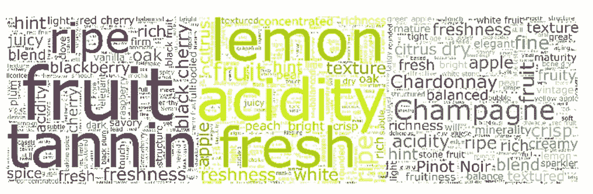

# 争论酒的话语

> 原文：<https://medium.com/analytics-vidhya/wrangling-the-words-of-wine-9cb3cc96d671?source=collection_archive---------12----------------------->

## 使用硒和自然语言处理从 2020 年的葡萄酒评论中获取标记

这张图片来自托尼·博斯科在 2020 年发表的葡萄酒评论

**欢迎扯皮酒的话 101！**

正如你将看到的，这篇文章将结合我最喜欢的一些东西…

1.  用 Python 中的 Selenium 来抓取一个网站，然后在熊猫数据框架中操作我们的数据。