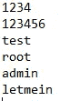

# 编写一个 Python 程序来生成 http 基本验证强力列表

> 原文：<https://medium.com/analytics-vidhya/write-a-python-program-to-generate-http-basic-authentification-brute-force-lists-fa56ae1a482a?source=collection_archive---------4----------------------->

最近在一次测试中，我发现一个网站的目录受到了 http 基本认证的保护。由于 http basic 实际上无法抵御暴力攻击，所以我想至少测试最常见的用户名/密码组合，看看是否有可能访问该目录。

由于找不到合适的蛮力列表，我决定写一个小的 Python 程序，在以后的任何时候生成 http 基本蛮力列表。我想和你分享这个程序(你可以在[我的 GitHub 账号](https://github.com/ChrisInmodis/http-Basic-Bruteforce)上找到代码和一些测试文件)。

**什么是 http Basic？使用 http Basic，用户可以向网络服务器验证自己的身份。当您访问需要 http 基本身份验证的网站或目录时，浏览器会弹出一个小窗口，您可以在其中输入用户名和密码。**

管理员的 http 基本身份验证:管理员

如果您随后登录，请求中会传输一个授权头，它包含用户名和密码，格式为:用户名:密码，用 Base64 编码。重要:编码，不加密！因此，如果连接没有加密(即 http)，编码的数据实际上将以纯文本形式传输，因为任何人都可以解码它。为此，您可以使用在线工具，如 [this](https://www.base64decode.org/) 。

如果您以这种方式解码上面截图中的字符串( *YWRtaW46YWRtaW4=* )，您将得到字符串 admin:admin。因此，用户使用用户名 admin 和密码 admin 登录。

**Python 程序**

创建 http 基本验证强力列表的 Python 程序

这个程序实际上非常简单，只有 42 行代码。第 4–6 行定义了输入参数和帮助消息。参数是用户名和密码文件的两个路径。然后相应的文件被打开并转换成一个列表(重要的是，否则内部循环只运行一次)。

在嵌套循环中，首先读取用户名，strip()用于删除行尾的空格或换行符。然后，在一个内部循环中，密码文件中的每个密码都被添加到用户名中，结果用 Base64 编码。

新字符串被写入输出文件(bruteforce.txt ),模运算符用于检查字符串数是否能被一百万整除。如果是这种情况，命令行上会显示一条消息。

**输出**
对于用户名文件中的每个用户名，脚本生成该用户名与密码文件中每个密码的所有组合。然后用 Base64 编码该字符串，并将其写入输出文件。在 [GitHub](https://github.com/ChrisInmodis/http-Basic-Bruteforce/tree/main/Test%20Files) 上，你可以找到两个简单的测试文件:一个包含四个名字的用户名文件:

带有用户名的测试文件

以及包含 6 个密码的密码文件:

带密码的测试文件

从这两个文件中生成了 24 个 http 基本认证字符串，这些字符串可以在文件 bruteforce.txt 中找到:

输出文件:bruteforce.txt

通过任何在线工具，可以检查字符串的生成和编码是否按预期工作:

一切都按预期运行

**如何使用**
要使用脚本，您只需下载它，打开命令行，然后切换到保存脚本的目录。
然后你可以用*python http _ basic _ brute force . py-u【用户名文件路径】和-p【密码文件路径】*运行。两个参数都必须输入。

帮助消息

使用-help 或-h，您可以显示屏幕截图中的帮助消息。
在执行过程中，脚本会在每一百万个生成的 http 基本字符串后，在命令行上打印一条消息。如果您认为这个消息是不必要的，您可以简单地删除相应的 if-query(第 36/37 行)。

如果您想更详细地了解脚本，您还可以包括第三个参数-v (verbose ),并且只有在指定了该参数的情况下才显示输出。

命令行输出

最后，还显示了生成的 http 基本字符串的总数。在本例中为 867.700.000。请注意，对于大型输入文件(在本例中，使用了一个包含大约 86.000 个用户名的用户文件和一个包含 10.000 个密码的密码文件)，输出文件可能会变得非常大。在这种情况下，大约 20GB:

20GB 的输出文件

当然，这不再是真正实用的，而且更多的是为了测试目的。实际上，更小的列表当然更有意义，例如，只使用那些您事先列举的用户名，并且可以安全地分配给目标网站。密码单词表可以在 GitHub 上找到，也可以使用 Kali 中包含的单词表。

例如，生成的输出文件可以在 Burp Suite Intruder 中使用。

希望您觉得这很有用，请随意使用它并根据您的需要进行调整:)