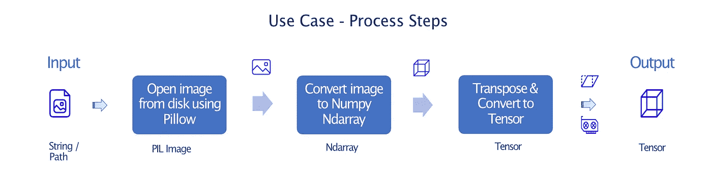
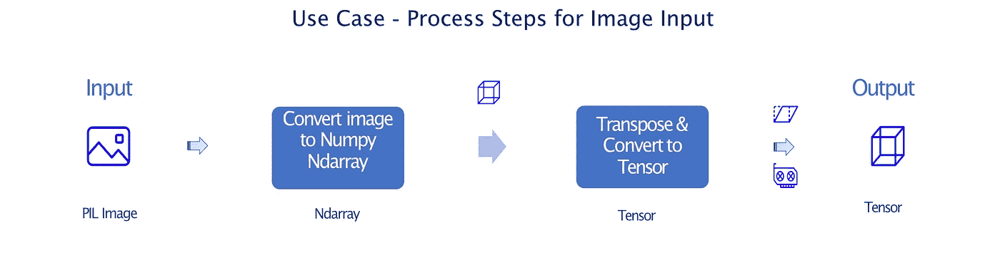
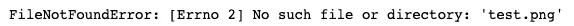
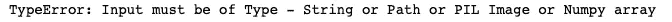
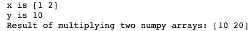
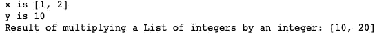
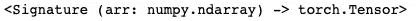
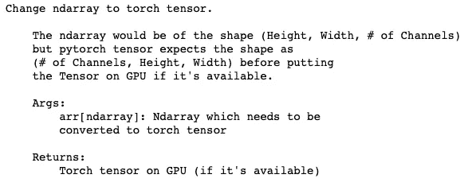

# 编写更好的 Python 函数(使用类型分派)

> 原文：<https://medium.com/analytics-vidhya/write-better-python-functions-using-type-dispatch-94b550f5dde8?source=collection_archive---------6----------------------->

## 用 python 写一个函数很容易，但是写一个好的函数却不那么容易。大多数 python 程序员经常不知道如何编写清晰简洁的函数，更不用说使用类型调度了。让我们看看如何使用类型调度在 python 中编写更好的函数。

# 入门指南

在我们进入什么是类型调度之前？或者类型调度如何让你成为更好的 python 程序员，让我们先了解一些基本知识，比如*什么是好的 Python 函数？*老实说，我宁愿让[杰夫·克努普](/hackernoon/write-better-python-functions-c3a9a36382a6)来解释。

我真的相信，真正理解一个东西如何工作的唯一方法是把它分成一个个小块，然后把它们重新组合在一起，或者从头开始构建。让我们以一个定义非常明确的用例为例，从头开始为它编写一个函数。我所说的从头开始，是指从伪代码到 python 代码的一对一转换开始，而不考虑任何最佳实践。

然后通过*分析什么可行&什么不可行*，我们可以在此基础上进行构建。我们将重复这个过程，直到我们用尽改进代码的方法。所以这篇文章不是一个版本，而是同一个用例的多个版本。

如果你想知道为什么？因为我们将忘记我们所知道的关于编写函数的一切，并在编写时质疑每一行代码。这样，我们就可以清楚地看到每一块是如何贴合的。我们将创建自己的清单，而不是盲目地遵循关于编写函数的项目清单。如果这篇文章遗漏了一些有价值的东西，请告诉我，我会很乐意更新它。


我们将尝试在 4 次迭代中为特定用例编写最好的或者至少是我最好的 python 函数。每一次迭代都将是对上一次的改进，并在前面声明一个明确的目标。变得更好是一个迭代的过程，取决于你在 python 熟练程度谱中的位置，4 个迭代中的一个会比其他的更能引起你的共鸣。这篇文章的下一步是理解用例。系好安全带，这将是一次非常有趣的旅行。

# 用例

## 简报

将给定的图像输入转换成 PyTorch 张量。对，就是这样。很简单，对吧？

具有数据科学背景的人可以跳过这一部分，跳到下一节，因为我将简要介绍这个用例所需的 python 库。

1.  [**Pillow**](https://pillow.readthedocs.io/en/stable/) 是一款，增加了对打开、操作和保存多种不同图像文件格式的支持。
2.  [**Numpy**](https://numpy.org/) 代表数值 Python。Numpy 是 Python 中科学计算的核心库。它为处理这些数组提供了高性能的对象和工具。
3.  [**PyTorch**](https://pytorch.org/) 是开源的，它提供了两个主要的功能，即通过&建立在基于磁带的自动微分系统上的深度神经网络提供强大加速的计算(如 NumPy)。如果没有 CUDA 支持的 GPU 可用，Pytorch 可以使用 CPU 运行代码，但这对于训练 ML 模型来说会慢得多。

如果您想知道这个用例为什么有用或者对谁有用？大多数以图像数据作为输入的机器学习应用程序(人脸检测，OCR)都在使用这些库。这个用例被认为是 ML 世界中的数据预处理。

## 我们该怎么做？

所涉及的步骤非常简单。使用 Pillow library 打开图像，并将其转换为 NumPy 数组&在转换为张量之前对其进行转置。顺便提醒一下，这篇文章是关于编写更好的 python 函数，而不是深度学习的数据预处理教程，所以如果它令人生畏，不要担心。一旦我们开始编码，你会感觉更舒服。



在我们继续之前，有几点需要注意。

1.  PIL 图像当转换为 Numpy 数组时，它会成形—(高度、宽度和通道数)。在 Pytorch 中，图像传感器的形状必须是——(通道数、高度、宽度)，所以我们在将数组转换为张量之前，先对其进行处理。
2.  对于有经验的 Pytorch 用户来说，他们想知道，为什么我们不使用 torch 函数，比如`ToTensor`或 transform 方法，而跳过 Numpy？是的，你是对的，我们绝对可以做到这一点，但为了更好地理解这篇文章的观点，我有意识地决定走更长的路线。

## 打嗝

不好意思，用例没那么简单。有个小嗝嗝，函数要支持多种输入数据类型，分别是`str/Path`、`Pillow(Image)`和`Numpy(Ndarray)`。

上图中定义的流程步骤仅支持数据类型`str/Path`作为输入。因此，我们需要添加对`Pillow(Image)`和`Numpy(Ndarray)`类型的支持，但是如果我们仔细想想，这些数据类型是将图像文件转换为 torch 张量的中间步骤。因此，上图中实际上没有额外的步骤，我们只需重复为`str/Path`数据类型定义的步骤，并修改一些初始步骤，以支持`Pillow(Image)`和`Numpy(Ndarray)`数据类型作为我们函数的输入。

两个额外工作流程的流程步骤如下。



在比较了 3 幅图像后，很明显:

*   图像数据类型的处理步骤是原始处理步骤的子集。
*   数组数据类型的处理步骤是图像数据类型处理步骤的子集。

# 解决办法

该函数的前两次迭代将是关于**行为实现**，而最后两次迭代都是关于代码**耐火**。如果你是那种喜欢先看一本书的结局的读者(我不是在评判)，可以直接跳到有标题的章节——*迭代 4* 。

# 迭代 1

**目标:**

让它工作。就这么简单，因为我们是从零开始，所以最好只关注基本特性或功能的工作。我们不需要那些花里胡哨的东西。对于这个迭代，我们将只关注实现*使用流程步骤*，而不担心*的停顿。*

**代号:**

```
*# Import required libraries*
**import** **numpy** **as** **np**
**import** **torch**
**from** **PIL** **import** Image **as** PILImage

*# Set Torch device to GPU if CUDA supported GPU is available*
device = torch.device('cuda' **if** torch.cuda.is_available() **else** 'cpu')

*# Function to convert image to Torch tensor*
**def** Tensor(inp):

    *# Read image from disk using PIL Image*
    img = PILImage.open(inp).convert('RGB')

    *# Convert the image to numpy ndarray*
    imgArr = np.asarray(img, np.uint8)

    *# Rearrange the shape of the array so that it is pytorch compatible*
    imgArr = imgArr.transpose(2, 0, 1)

    *# Convert Numpy array to Torch Tensor and move it to device*
    **return** torch.from_numpy(imgArr).to(device)
```

我们做了什么？

我们设法将*流程步骤*翻译成代码。代码中的行数几乎与图中的方框数相匹配。

## 快速检查:

我们需要一个样本图像来测试我们的功能，所以我们将下载一个。

```
*# Download a sample image to disk*
**import** **urllib.request** 

url = "https://upload.wikimedia.org/wikipedia/commons/thumb/c/c3/Python-logo-notext.svg/200px-Python-logo-notext.svg.png"
filename = "sample.png"
urllib.request.urlretrieve(url, filename)
```

现在，让我们测试一下我们的功能。

```
*# Pass the sample image through our function*
imgTensor = Tensor(filename)

*# Check whether the output of the function is a Tensor*
**assert** isinstance(imgTensor, torch.Tensor), "Not a Tensor"
```

看起来我们成功地实现了基本功能。厉害！

我们可以改进什么？

*   我们还没有实现多种数据类型输入功能，即支持像`PIL Image`，`Ndarray`的数据类型。
*   此外，我们肯定应该改进函数的名称，它并没有真正说明函数的任何内容。

# 迭代 2

**目标:**

当我们添加对多种数据类型的支持时，我们需要非常小心，因为如果没有适当的验证，事情可能会很快变糟，从最终用户的角度来看，错误消息没有任何意义。因此，在这次迭代中，我们将:

1.  为这些类型实现多种数据类型支持和验证。
2.  让函数名更有用。

**代码:**

```
*# Import Libraries*
**import** **numpy** **as** **np**
**import** **torch**
**from** **PIL** **import** Image **as** PILImage
**from** **pathlib** **import** Path, PurePath*# Set Torch device to GPU if CUDA supported GPU is available*
device = torch.device('cuda' **if** torch.cuda.is_available() **else** 'cpu') *# Function to convert image to Torch tensor*
**def** from_multiInput_toTensor(inp):

    *# Input type - str/ Path, then read from disk & convert to array*
    **if** isinstance(inp, (str, PurePath)):
        **try**: 
            image = PILImage.open(inp).convert('RGB')
            imageArray = np.asarray(image.copy(), np.uint8)
        **except** **Exception** **as** error:
            **raise** error

    *# Input type - PIL Image, then we convert it to array* 
    **elif** isinstance(inp, PILImage.Image):
        imageArray = np.asarray(inp, np.uint8)

    *# Input type - ndarray, then assign it to imageArray variable* 
    **elif** isinstance(inp, np.ndarray):
        imageArray = inp

    *# Raise TypeError with input type is not supported*
    **else**: 
        **raise** **TypeError**("Input must be of Type - String or Path or PIL Image or Numpy array")

    *# Rearrange shape of the array so that it is pytorch compatible*
    **if** imageArray.ndim == 3: imageArray = imageArray.transpose(2, 0, 1)

    *# Convert Numpy array to Torch Tensor and move it to device*
    **return** torch.from_numpy(imageArray).to(device)
```

**我们做了什么？**

我们已经成功实现了这个用例所需的所有功能。由于`ndarray`是输出数据类型`tensor`之前的最后一个数据类型，我们首先将输入转换为每种支持的数据类型的`ndarray`，并在转换为`tensor`之前转置它。通过采用这种编码风格，我们能够避免将输入转换为每种支持的数据类型的值`tensor` & `return`。相反，我们只在最后做一次。

在`isinstance`函数的帮助下，我们能够识别输入的数据类型，如果传递了任何不支持的数据类型，我们可以通过发出适当的错误消息`TypeError`来通知用户。io 操作经常容易出错，所以如果数据类型是`str`或`Path`，我们读取`try` & `except`块中的图像文件，让用户知道错误(如果有的话)。

**快速检查:**

在我们继续之前，我们将编写一个助手函数来检查两个张量是否相同。

```
*# Test if two torch tensors are same or not*
**def** is_same_tensor(tensor1, tensor2):
    **assert** torch.eq(tensor1, tensor2).all(), "The Tensors are not equal!"
    **return** **True**
```

当编写一个测试函数时，最好抛出一个适当的错误，而不是简单的打印函数，它可能会隐藏在其他消息中。我们还将检查几件事情，并确保更新版本都是好的。

1.  *最后两次迭代的函数输出是否相同？*

```
*# Verify that the output of two versions are same or not*
is_same_tensor(Tensor(filename), from_multiInput_toTensor(filename))
```

*2。对多种数据类型的支持有效吗？*

```
*# Check the support for Path*
path = Path(Path.cwd(), filename).resolve()
is_same_tensor(Tensor(filename), from_multiInput_toTensor(path))*# Check the support for PIL Image*
image = PILImage.open(filename).convert('RGB')
is_same_tensor(Tensor(filename), from_multiInput_toTensor(image))*# Check the support for Ndarray*
imageArray = np.asarray(image, np.uint8)
is_same_tensor(Tensor(filename), from_multiInput_toTensor(imageArray))
```

*3。验证有效吗？*

```
*# Validate whether an error is thrown when user passes wrong file*
from_multiInput_toTensor('test.png')
```



```
*# Validate whether an error is thrown when input type is list*
from_multiInput_toTensor([filename])
```



太好了！我们没有打碎任何东西。现在让我们像完成行为实现一样继续进行耐火化。

我们可以改进什么？

*   为了增加对多种数据类型的支持，我们写了一段类似意大利面条的代码。至少变量`imageArray`的生命周期是混乱的，这种类型的代码设计不是很直观，会让维护这个代码库的人生活在地狱里。当然，对于我们的简单用例来说这不是 case，但本着编写更好的函数的精神，让我们避免这种类型的编码风格。
*   函数名好了很多但还是不理想。为什么？因为它仍然没有清楚地说明函数的输入类型是什么。让用户用`TypeError`玩 trail & error 肯定不是正确的编码方式。
*   正如这个函数的名字所暗示的，它需要很多输入，这意味着我们在一个函数中有很多活动的部分。从长远来看，这可能会导致许多意想不到的副作用。

# 迭代 3

**目标:**

仔细研究了上一节的要点后，很明显我们需要将函数分成 3 个更小的函数。即每种数据类型一个函数。

**代码:**

```
*# Import Libraries*
**import** **numpy** **as** **np**
**import** **torch**
**from** **PIL** **import** Image **as** PILImage
**from** **pathlib** **import** Path, PurePath*# Change numpy array to torch tensor*
**def** numpy_ToImageTensor(imageArray):

    *# if not type - ndarray then raise error*
    **if** **not** isinstance(imageArray, np.ndarray):
        **raise** **TypeError**("Input must be of Type - Numpy array")

    *# Set Torch device to GPU if CUDA supported GPU is available*
    device = torch.device('cuda' **if** torch.cuda.is_available() **else** 'cpu') *# Transpose the numpy array before converting it to Tensor*
    **if** imageArray.ndim == 3: imageArray = imageArray.transpose(2, 0, 1)
    **return** torch.from_numpy(imageArray).to(device)*# Change image to torch tensor*
**def** pil_ToImageTensor(image):

    *# if not type - PIL Image then raise error*
    **if** **not** isinstance(image, PILImage.Image):
        **raise** **TypeError**("Input must be of Type - PIL image")

    *# Convert the image to numpy* 
    imageArray = np.array(image)

    *# Return output of numpy_ToImageTensor function*
    **return** numpy_ToImageTensor(imageArray)*# Change image file to torch tensor*
**def** file_ToImageTensor(file):

    *# if not input - string or Path then raise error*
    **if** **not** isinstance(file, (str, PurePath)):
        **raise** **TypeError**("Input must be of Type - String or Path")

    *# Read the image from disk and raise error (if any)*
    **try**: 
        image = PILImage.open(file).convert('RGB')
    **except** **Exception** **as** error:
        **raise** error

    *# Return output of pil_ToImageTensor function*
    **return** pil_ToImageTensor(image)
```

我们做了什么？

这是一个很好的进步，我们去掉了意大利面条式的代码，增加了模块化。现在就好像我们有一个三个函数的线性链，其中两个函数调用另一个函数，这样更容易理解和维护。

`file_ToImageTensor`->-`pil_ToImageTensor`->-`numpy_ToImageTensor`

模块化使得添加新功能变得非常简单，并且易于测试，因为我们只需要修改一个特定的功能。为假设特征请求修改的函数的一些例子:

1.  `file_ToImageTensor` -也能读取黑色&白色图像。
2.  `pil_ToImageTensor` -在将图像转换为张量之前调整其大小。

请注意，即使您没有接触上述示例的其余代码，也最好测试其他函数，以避免任何意外。

随着输入类型变得更加具体，模块化设计也为更好的函数名和参数名铺平了道路。

`from_multiInput_toTensor`->`file_ToImageTensor`-
`inp`->-`file`

这些细微的变化可以使代码更加用户友好。老实说，在这一点上，我觉得我是在说教，所以我会尽快结束这个话题。

**快速检查:**

这篇文章对我来说太长了，所以我不打算再测试负面的或不同的数据类型场景，只检查原始用例。耐火后你真的不应该跳过测试。

```
is_same_tensor(from_multiInput_toTensor(filename), file_ToImageTensor(filename))
```

我们可以改进什么？

*   看起来我们正在遵循相同的模式，用`isinstance`函数检查数据类型，并为每个函数引发`TypeError`，这也是一种代码重复。
*   好的，我们必须对函数名做些什么。我很确定没有人会记得这些名字，绝对不是未来的我。

# 迭代 4

**目标:**

借助类型调度改进文档并避免代码重复。

**类型调度:**

类型调度允许您根据函数接收的输入类型来改变函数的行为方式。这是 Julia & Swift 等一些编程语言的突出特点。我们所要做的就是在函数前添加一个装饰器`typedispatch`。大概，论证容易解释难。

**类型调度示例:**

函数定义:

```
**from** **fastcore.all** **import** *
**from** **typing** **import** List*# Function to multiply two ndarrays*
@typedispatch
**def** multiple(x:np.ndarray, y:np.ndarray ): 
    **return** x * y*# Function to multiply a List by an integer*
@typedispatch
**def** multiple(lst:List, x:int): 
    **return** [ x*val **for** val **in** lst]
```

调用第一个函数:

```
x = np.arange(1,3)
print(f'x is **{**x**}**')y = np.array(10)
print(f'y is **{**y**}**')print(f'Result of multiplying two numpy arrays: **{** multiple(x, y)**}**')
```



调用第二个函数:

```
x = [1, 2]
print(f'x is **{**x**}**')y = 10
print(f'y is **{**y**}**')print(f'Result of multiplying a List of integers by an integer: **{**multiple(x, y)**}**')
```



如果程序员不必在目的不变的情况下(针对各种数据类型)想出不同的函数名，他们的生活会好得多。如果这还不能鼓励你尽可能使用类型调度，那么我不知道还有什么可以🤷

我们将使用 [fastcore](https://fastcore.fast.ai/) 包来实现[类型的分派](https://fastcore.fast.ai/dispatch.html#TypeDispatch)到我们的用例。有关 fastcore 和 Type Dispatch 的更多详细信息，请查看 Hamel husa in[的博客](https://twitter.com/hamelhusain)。也可以看看 [fastai](https://docs.fast.ai/) ，它启发了我写这篇文章。

**代码:**

```
*# Import Libraries*
**import** **numpy** **as** **np**
**import** **torch**
**from** **PIL** **import** Image **as** PILImage
**from** **pathlib** **import** Path, PurePath
**from** **fastcore.all** **import** * @typedispatch
**def** to_imageTensor(arr: np.ndarray) -> torch.Tensor:
    *"""Change ndarray to torch tensor.*

 *The ndarray would be of the shape (Height, Width, # of Channels)*
 *but pytorch tensor expects the shape as* 
 *(# of Channels, Height, Width) before putting* 
 *the Tensor on GPU if it's available.*

 *Args:*
 *arr[ndarray]: Ndarray which needs to be* 
 *converted to torch tensor*

 *Returns:*
 *Torch tensor on GPU (if it's available)* 
 *"""*

    *# Set Torch device to GPU if CUDA supported GPU is available*
    device = torch.device('cuda' **if** torch.cuda.is_available() **else** 'cpu')

    *# Transpose the array before converting to tensor*
    imgArr = arr.transpose(2, 0, 1) **if** arr.ndim == 3 **else** arr
    **return** torch.Tensor(imgArr).to(device) @typedispatch
**def** to_imageTensor(image: PILImage.Image) -> torch.Tensor:
    *"""Change image to torch tensor.*

 *The PIL image cast as numpy array with dtype as uint8,*
 *and then passed to to_imageTensor(arr: np.ndarray) function*
 *for converting numpy array to torch tensor.*

 *Args:*
 *image[PILImage.Image]: PIL Image which* 
 *needs to be converted to torch tensor*

 *Returns:*
 *Torch tensor on GPU (if it's available)* 

 *"""*
    **return** to_imageTensor(np.asarray(image, np.uint8)) @typedispatch
**def** to_imageTensor(file: (str, PurePath)) -> torch.Tensor:
    *"""Change image file to torch tensor.*

 *Read the image from disk as 3 channels (RGB) using PIL,* 
 *and passed on to to_imageTensor(image: PILImage.Image)*
 *function for converting Image to torch tensor.*

 *Args:*
 *file[str, PurePath]: Image file name which needs to*
 *be converted to torch tensor*

 *Returns:*
 *Torch tensor on GPU (if it's available)*

 *Raises:*
 *Any error thrown while reading the image file,*
 *Mostly FileNotFoundError will be raised.*

 *"""*
    **try**: 
        img = PILImage.open(file).convert('RGB')
    **except** **Exception** **as** error:
        **raise** error
    **return** to_imageTensor(img) @typedispatch
**def** to_imageTensor(x:object) -> **None**:
    *"""For unsupported data types, raise TypeError. """*
    **raise** **TypeError**('Input must be of Type - String or Path or PIL Image or Numpy array')
```

**我们做了什么？**

通过利用类型分派功能，我们成功地对所有 3 个函数使用了相同的名称，并且每一个函数的行为都因其输入类型而有所不同。随着输入类型的删除，函数名也缩短了。这使得函数名更容易记住。

通过调用函数名，我们可以看到该函数支持哪些不同的输入类型。默认情况下，Fastcore 需要两个输入参数，因为我们只将第二个参数指定为对象。第二个参数对函数行为没有任何影响。

```
to_imageTensor# OUTPUT
(ndarray,object) -> to_imageTensor
(Image,object) -> to_imageTensor
(str,object) -> to_imageTensor
(PurePath,object) -> to_imageTensor
(object,object) -> to_imageTensor
```

在 inspect 模块的帮助下，我们可以访问特定函数的输入和输出类型。

```
**import** **inspect**
inspect.signature(to_imageTensor[np.ndarray])
```



该迭代中实现的 docstrings 使代码更具可读性。特定输入类型的 docstring 可以通过调用 **doc** 和输入类型来访问。

```
print(to_imageTensor[np.ndarray].__doc__)
```



正如上一节所讨论的，我们设法将`TypeError`消息移动到一个单独的函数中，其输入类型为`object`。

**快速检查:**

还在工作！

```
is_same_tensor(file_ToImageTensor(filename), to_imageTensor(filename))
```

将不支持的数据类型传递给函数时验证错误消息。

```
to_imageTensor([filename])
```


我们可以改进什么？

这就是了。我想我们到此为止了。

# 结束语

我们真的为这个用例编写了*最佳函数*吗？我想是的，但是不要相信我的话。你可以在这里找到本帖[的笔记本版本](https://github.com/6aravind/tidbits/blob/main/base/Write%20better%20python%20functions%20using%20type%20dispatch.ipynb)。如果你想给这篇文章添加什么，请随时通过[推特](https://twitter.com/@6aravind)或评论区联系我。我很乐意根据你的评论更新这篇文章。

尽管当我开始写这篇文章时，类型调度是重点，但很快我意识到代码进化过程也同样重要。所以我决定把它也包括进去。我希望您喜欢这段编写 python 函数的旅程。

# 信用

1.  [显卡](https://www.iconbros.com/icons/ib-b-video-card)图标由 [IconBros](https://iconbros.com/)
2.  [兹维康](https://www.zwicon.com/)

*原载于 2021 年 4 月 10 日 https://www.analyticsvidhya.com*[](https://www.analyticsvidhya.com/blog/2021/04/write-better-python-functions-using-type-dispatch/)**。**