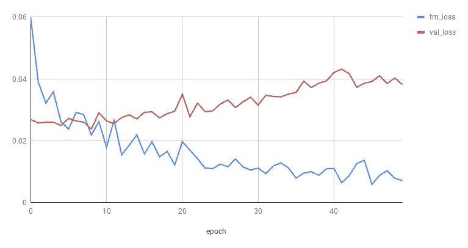
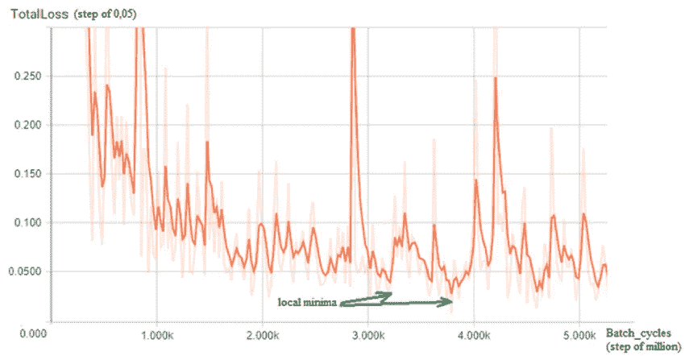
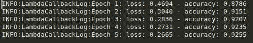

# 为 TensorFlow Keras 编写您自己的自定义回调

> 原文：<https://medium.com/analytics-vidhya/write-your-own-custom-callback-for-tensorflow-keras-f768b4264b8d?source=collection_archive---------5----------------------->


查尔斯·德鲁维奥在 [Unsplash](https://unsplash.com?utm_source=medium&utm_medium=referral) 上的照片

什么是回调？为什么需要复试？你的模特培训有什么必要写回拨？何时以及如何使用它们？最后，如何定制回调函数？希望从这个博客来回答这一切。:')

# 什么是回调函数？

Mozilla 将回调函数解释为:

> 回调函数是作为参数传递给另一个函数的函数，然后在外部函数中调用该函数来完成某种例程或操作。

如果函数`A`作为参数传递给函数`B`并且函数`B`使用函数`A`给自己添加某种功能，那么函数`A`被称为回调函数。

这对 TensorFlow 意味着什么？在 TensorFlow Keras [文档](https://www.tensorflow.org/api_docs/python/tf/keras/callbacks)页面中，回调函数被解释为:

> 回调:在模型训练期间的某些点调用的实用程序。

简而言之，它们是您可以添加到代码中的某些功能，将在模型训练期间的某些时候被调用。这意味着你可以以任何你想要的方式操纵模型训练，这打开了许多可能性。回调最常见的用例是调整模型的超参数，或者监控一些模型指标，并在训练进行时对它们进行操作。

# 为什么需要回调函数？

请考虑这种情况，因为您让您的模型训练了大量的历元，所以您的模型过度适应了训练数据。训练损失持续减少，但测试/验证却相反。解决这个问题的一个好策略是监控验证损失，如果验证损失不再减少，我们可以停止训练。这意味着必须在每个时期后监控验证损失值。



培训和验证损失—过度拟合

另一种非常常见的情况是，当你设置太大的学习率时，模型不收敛，损失振荡太多。为了解决这个问题，我们可以监控验证损失，如果它波动太大，我们可以降低学习率，以便采取更小的步骤。



培训和验证损失——振荡损失

在这种情况下，如果你想在训练的时候进行操作，使用回调函数会有所帮助。

## TensorFlow Keras 回调

TensorFlow 为我们提供了一些回调，其中一个著名的回调可能是 [EarlyStopping](http://tensorflow.org/api_docs/python/tf/keras/callbacks/EarlyStopping) ，这在许多 TensorFlow 官方教程和大多数教程视频中都有提及。EarlyStopping 回调的功能是通过监控一个超参数(`val_loss`是最常见的一个)来停止训练。当使用`val_loss`作为超参数时，在每个时期之后，将检查`val_loss`是否在减少，如果在一些时期之后，它没有显示减少的趋势，将停止模型训练。

您可以在此查看 TensorFlow 文档[中的所有其他回调。找到这篇](https://www.tensorflow.org/api_docs/python/tf/keras/callbacks)[文章](https://blog.paperspace.com/tensorflow-callbacks/)，它令人惊讶地解释了 TensorFlow 提供的所有回调。

# 自定义回调

这里最明显的问题是，如果库已经提供了这样的通用函数，为什么还要编写自己的函数呢？的确，在大多数情况下，您只需要使用 TensorFlow 提供的回调。但是在极少数情况下，你需要写你自己的，有两种方法可以做到这一点，这个博客会解释这两种方法。

## 了解回调事件

在我们深入讨论如何编写自定义回调之前，我们需要了解何时可以触发我们的函数。TensorFlow 提供以下事件，在这些事件上可以触发回调函数:

*   `on_batch_begin`:在批处理开始时调用。有 3 种变化:`on_(train/test/predict)_batch_begin`，分别在每批`.fit`、`.evaluate`、`.predict`方法开始时调用。它将`batch`和`logs`作为输入。
*   `on_batch_end`:在批处理结束时调用。有 3 种变化:`on_(train/test/predict)_batch_end`，分别在每批`.fit`、`.evaluate`、`.predict`方法结束时调用。它以`batch`和`logs`为输入。
*   `on_epoch_begin`:在一个时期开始时调用。它将`epoch`和`logs`作为输入。
*   `on_epoch_end`:在一个时期结束时调用。它以`epoch`和`logs`为输入。
*   `on_(train/test/predict)_begin`:分别在`.fit`、`.evaluate`、`.predict`方法开始时调用。它将`logs`作为输入。
*   `on_(train/test/predict)_end`:分别在`.fit`、`.evaluate`、`.predict`方法结束时调用。它将`logs`作为输入。

调用训练/测试/预测方法时，TensorFlow 在内部提供方法的所有输入。在[文档](https://www.tensorflow.org/api_docs/python/tf/keras/callbacks/Callback)中可获得更多用于这些方法的细节和参数。

# 创建自定义回调

## 使用 LambdaCallback

创建定制回调的一种方法是使用 LambdaCallback。TensorFlow 文档将 LambdaCallback 解释为:

> 回调创建简单的，定制的动态回调。

`tf.keras.callbacks.LambdaCallback`可以将任何普通的函数转换成回调函数，可以在上述事件中调用。

```
tf.keras.callbacks.LambdaCallback(
    on_epoch_begin=None, on_epoch_end=None,
    on_batch_begin=None, on_batch_end=None,
    on_train_begin=None, on_train_end=None, **kwargs
)
```

自定义函数的定义中应该有与事件方法相同的参数。我用一个例子来阐述一下。如果要记录值`loss`、`accuracy`、`val_loss`等。对于一些调试，可以通过下面的代码使用日志模块轻松完成。

这将把`epoch`、`loss`和`accuracy`写入文件`lambdacallback.log`，看起来像这样。



训练时使用`printlogcallback(LambdaCallback) instance` 的参考代码

## 继承回调类

创建回调的第一种方法有一些限制，因此创建自定义回调的另一种方法是从回调基类继承并创建一个自定义回调类。如果您需要部署代码或者需要复杂的功能，这是我推荐的方法，因为类提供了很大的灵活性。

`tf.keras.callbacks.Callback`是一个“用于构建新回调的抽象基类”。基类必须被继承，无论我们想要触发哪个事件，都必须被覆盖。同样的`printlogcallback`可以像这样创建一个类实例:

这将像以前一样把`epoch`、`loss`和`accuracy`写入文件`lambdacallback.log`。与第一种方法相比，这可能看起来有些费力，但是这种方法有很大的灵活性，因为它现在是一个类。当我们将复杂的功能集成到培训管道中时，这种方法将大有裨益。

训练时使用`printlogcallback(Callback)`实例的参考代码

使用这种方法的主要优点是模型本身的操作。因为它是从`tf.keras.callbacks.Callback`继承的，所以它能够使用`model`变量操作模型属性。例如，如果您想要停止训练，您可以在其中一个方法中使用`self.model.stop_training = True`，训练将会停止。为了降低移动中的学习率，我们可以使用`self.model.optimizer.lr = new_lr`。这给了我们很大的权力和灵活性。您也可以在一个类中使用上述所有事件来创建一个复杂的回调。我在这里没有提到所有的参数，但是你想要调整的任何超参数都可以这样做。我鼓励您查看文档以了解更多信息。

# 结论

现在，您已经知道如何使用第一种方法编写简单的回调，或者使用第二种方法重载基本方法来创建复杂的回调，并将其用于您的模型训练。大多数时候 TensorFlow 提供的回调可能是足够的和必要的，比如使用`EarlyStopping`进行过度拟合。有时为了在管道中增加额外的功能，我们需要编写自定义的回调函数，现在你知道怎么做了。:')

如果您有任何疑问，请随时通过[arjun.06muraleedharan@gmail.com](mailto:arjun.06muraleedharan@gmail.com)联系我