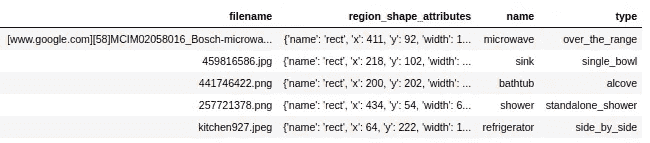

# 为 TensorFlow Keras 编写您自己的自定义数据生成器

> 原文：<https://medium.com/analytics-vidhya/write-your-own-custom-data-generator-for-tensorflow-keras-1252b64e41c3?source=collection_archive---------0----------------------->

本教程处于中级水平，希望读者了解 Python、TensorFlow 和 Keras 的基本概念。

因此，您希望使用一个定制的数据生成器来向模型提供值。有意思。为什么需要数据生成器？为什么是发电机？这个“发电机”是什么？数据生成器与机器学习有什么关系？

弗兰基·查马基在 [Unsplash](https://unsplash.com?utm_source=medium&utm_medium=referral) 上拍摄的照片

# 什么是发电机？

如 [PEP 文件](https://www.python.org/dev/peps/pep-0255/)所述:

> 当一个生产者函数有足够困难的工作需要维护所产生的值之间的状态时，大多数编程语言除了向生产者的参数列表中添加一个回调函数，用所产生的每个值来调用它之外，没有提供令人愉快和有效的解决方案。

因此，基本上发生的事情是，它不是把困难的(计算密集型或内存密集型)工作作为一个整体来做，而是把它分成几个批次，然后作为一个批次来处理。这样，调用子函数的父函数不必等到父函数完成处理，而是可以随时工作。我们在日常代码中使用的生成器函数是`range`函数。当你用`range(start, end, step)`写一个`for`循环时，它不会创建一个包含从`start`到`end`的所有元素的列表，而是创建一个生成器，它可以生成从`start`到`end`的值，然后它会在运行中创建值。

# 什么是数据生成器？

您是否遇到过这样的问题:数据集太大，无法一次加载到内存中，导致内存不足？例如，在训练一个图像分类器时，我们不能在训练前将所有这些图像加载到内存中。即使对于小数据集是可行的，对于大数据集也是不可行的。我们应该能够充分利用现有数据的潜力。

因此，如果我们创建一个数据生成器，我们就可以在移动中读取将用于训练的图像。因为我们在移动中读取图像，所以我们节省了内存，甚至 8GB RAM 的系统也可以用于 100GB 的数据集。

# 标准 Keras 数据生成器

Keras 为图像数据集提供了一个数据生成器。这在`tf.keras.preprocessing.image`中作为 [ImageDataGenerator](https://www.tensorflow.org/api_docs/python/tf/keras/preprocessing/image/ImageDataGenerator) 类提供。使用`ImageDataGenerator`的好处是它将生成带有增强的批量数据。`ImageDataGenerator`用法如下

`train_generator`将是一个可以在`model.fit`中使用的生成器对象。`train_datagen`对象有三种方式提供数据:`[flow](https://www.tensorflow.org/api_docs/python/tf/keras/preprocessing/image/ImageDataGenerator#flow)`、`[flow_from_dataframe](https://www.tensorflow.org/api_docs/python/tf/keras/preprocessing/image/ImageDataGenerator#flow_from_dataframe)`和`[flow_from_directory](https://www.tensorflow.org/api_docs/python/tf/keras/preprocessing/image/ImageDataGenerator#flow_from_directory)`。在本例中，使用了`flow_from_directory`，这意味着根据目录结构加载数据。如果你有一个带有图像路径和标签的数据帧，它可以和`flow_from_dataframe`方法一起使用。请参考本[要点](https://gist.github.com/fchollet/0830affa1f7f19fd47b06d4cf89ed44d)和[图像数据生成器](https://www.tensorflow.org/api_docs/python/tf/keras/preprocessing/image/ImageDataGenerator)文档了解更多信息。

## 为什么我需要自定义数据生成器？

标准的 Keras 生成器功能有限。例如，如果您的网络有多个输出节点，您将无法使用标准数据生成器。它也不支持表格数据。因此，如果您有一个大的表格数据集，您将需要编写一个定制的生成器。最重要的是，为 Keras 实现一个数据生成器非常容易，而且非常强大和灵活。在将数据作为模型的输入之前，我们可以对数据执行复杂的功能和预处理。

# 如何编写自定义数据生成器

要理解定制数据生成器，您应该熟悉模型开发的基本方式以及如何在`tf.keras`中使用`ImageDataGenerator`。如果你做到了，那就很容易了。

编写自定义数据生成器的一种方法是编写一个简单的生成器本身。这个[帖](https://towardsdatascience.com/writing-custom-keras-generators-fe815d992c5a)中给出了这样一个生成器。这也适用于`model.fit`，但建议使用`tf.keras.utils.Sequence`为 Tensorflow Keras 创建数据生成器。在[文件](https://www.tensorflow.org/api_docs/python/tf/keras/utils/Sequence)中解释为:

> `*Sequence*`是一种更安全的多处理方式。这种结构保证了网络在每个时期的每个样本上只训练一次，这与发电机的情况不同

## 使用序列的数据生成器

要创建自定义数据生成器，需要创建一个从`tf.keras.utils.Sequence`继承的类。如[文档](https://www.tensorflow.org/api_docs/python/tf/keras/utils/Sequence)中所述:

> 每个`Sequence`都必须实现`__getitem__`和`__len__`方法。如果你想在不同时期之间修改你的数据集，你可以实现`on_epoch_end`。方法`__getitem__`应该返回一个完整的批处理。

就这么简单。我们可以用我们想要的任何方式实现`__getitem__`和`__len__`方法。唯一的要求是`__getitem__`方法应该返回`(X, y)`值对，其中`X`表示输入，`y`表示输出。内部带有`[batch_size, ...]`的输入和输出可以采用任何形状。

# 让我们进入代码

正如文档中提到的，我们需要实现两个方法。但是我也会实现一些我们在真实场景中使用的助手函数。

我的目标是读取包含一些元数据的 csv 文件，并训练一个图像分类模型。我掌握的数据是物体探测数据。因此，一个单独的图像将包含多个对象，我需要从图像中裁剪出这些对象用于图像分类训练。还有，我的网络有两个输出节点，一个用于分类`name`，另一个用于`type`。使用标准的 Keras `ImageDataGenerator`类，并不是不可能的。

## 数据

数据将是一个 CSV 文件，它将包含列

1.  `filename` / `filepath` —图像在驱动器中的位置
2.  `name` —将包含第一个标签“名称”的类别
3.  `type` —将包含第二个标签“类型”的类别
4.  `region_shape_attribues` —图像中感兴趣的区域

我的数据看起来像这样:

—模型的输入将是形状为`(None, input_height, input_width, input_channel)`的图像，其中`None`代表`batch_size`。

—模型的输出将是包含两个数组`([None, n_name], [None, n_type])`的元组，其中`None`表示`batch_size`，`n_name`是标签“名称”的类的数量，`n_type`是标签“类型”的类的数量。

## 入门指南

数据生成器的输入将是数据帧以及要使用的列。另外，声明文档`__getitem__`、`__len__`和`on_epoch_end`中提到的三种方法。让我们暂时将`__getitem__`和`on_epoch_end`留空。`__len__`将返回生成器可以生产的批次数量，将为`floor(number_of_samples // batch_size)`。我们还将计算“名称”和“类型”中唯一值的数量。

## __getitem__ 方法

`__getitem__`方法的作用是生成一批数据。在这种情况下，一批数据将是`(X, y)`值对，其中`X`代表输入，`y`代表输出。

*   `X`将是一个形状为`[batch_size, input_height, input_width, input_channel]`的 NumPy 数组。应该从磁盘中读取图像，从图像中裁剪出感兴趣的区域，并且必须根据数据帧进行预处理(如果有的话)。
*   `y`将是一个元组，包含两个形状为`[batch_size, n_name]`和 `[batch_size, n_type])`的 NumPy 数组。这些将是标签的一个热编码值。

我们将定义两个助手函数，一个用于输入，另一个用于输出。

输出的帮助函数

这个函数接受一个图像的路径、作为字典的边界框和图像的目标尺寸。该函数将返回形状为`[target_height, target_width, 3]`的 NumPy 数组。

输出的帮助函数

该函数获取类的值和数量，并返回一个形状为`[num_classes,]`的独热编码 NumPy 数组

生成包含批量样本的数据

这个函数将接受一批数据，X_col 作为一个字符串，y_col 作为一个字典。它将迭代批处理并调用助手函数，聚合它们，并相应地返回一个元组`(X, y)`。

`__getitem__`函数使用索引从数据帧中取出一批数据，并将其传递给`__get_data`函数，以获得用于训练的`X`和`y`。传入函数的`index`将在训练时由`fit`函数完成。使用该索引选择正确的数据批次。

__getitem__ 方法使用一个批处理数据调用 __getdata 方法

## 在 _ 纪元 _ 结束时

该函数将在每个时期结束时由`fit`方法调用。因此，在该函数中可以实现对历元之间的数据集的任何修改。我们将在这个函数中打乱数据集，以产生一些随机性。

在每个时期后洗牌

# CustomDataGen

合在一起，发电机看起来会像这样

CustomDataGen 类作为一个整体

现在我们只需要创建这个类的一个对象，并像这样把它传递给 fit 函数

创建实例并拟合模型

# 结论

现在，您可以通过更改`__get_input`、`__get_output`和`__get_data`功能，根据 Keras 模型的任何输入和输出进行更改。由于我们的 CustomDataGen 是从`Sequence`模块继承而来，所以整个操作将是线程化的，数据由 CPU 并行生成，然后直接馈送到 GPU。

## 一些常见错误以及如何避免它们

*   定制数据生成器时最常见的错误是使用列表而不是 NumPy 数组。Tensorflow 将抛出一个与此无关的错误，您可能会搜索几个小时才意识到这是一个问题。所以要经常检查你的数据和标签是否都是 NumPy 数组
*   另一个常见错误是，当有多个输入/输出节点时，输入/输出的形状是错误的。永远记住要有一个带`([batch_size, ...], [batch_size, ...], ...)`而不是`([...], [...], ... [(batch_size — 1)nth item])`的批处理项元组。每个元组项目的大小必须是`[batch_size, ...])`。
*   确保`__len__`的输出为`int`类型。如果是任何其他类型的训练都会抛出错误，甚至`np.int`。
*   尝试从生成器中获得一个项目:`X, y= traingen[0]`，这将有助于确保您从生成器中获得的输出是您所期望的
*   由于`to_categorical`需要整数输入，请务必在数据帧中对所有输入进行编码。如果没有，在生成器类中实现一个系统来处理它。

如果您有任何疑问，请随时通过[arjun.06muraleedharan@gmail.com](mailto:arjun.06muraleedharan@gmail.com)联系我