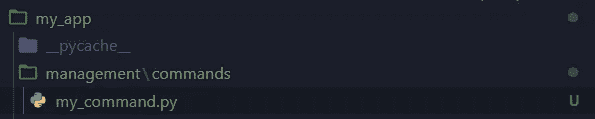

# 用 Django 编写定制管理命令

> 原文：<https://medium.com/analytics-vidhya/writing-custom-management-commands-in-django-d66044c37433?source=collection_archive---------9----------------------->


图片来源:[此处](https://miro.medium.com/max/1838/1*_jaOKxXn1e7ho6mhT4U7Ow.jpeg)

有时我们需要执行一次性任务。例如:自动更改数据库中的某些内容，发送报告或通知，安排一些任务，等等。如果您想随时调用这些命令，那么管理命令是最佳选择。你甚至可以使用管理命令作为生产中的**工人**。Django 本身有几个命令比如 ***migrate、makemigrations、runserver*** 等等。现在，我将向您展示如何编写自己的管理命令。我们开始吧！

# 项目结构

我假设你已经有一个名为**“我的项目”**的 Django 项目和一个名为**“我的应用”**的应用。进入该应用程序，创建父目录**“管理”**和子目录**命令。**现在你的项目结构应该是这样的:


忽略 **__pycache__** 目录

# **命令**

在命令目录下创建一个名为**“my _ command . py”**的 python 文件:



让我们打开 **my_command.py** 并创建一个简单的命令来检查该命令是否有效。要编写命令，我们必须定义一个继承自 **BaseCommand** 类的 **Command** 类。为此，让我们导入 **BaseCommand** 和 **CommandError** 类来处理错误。

```
from django.core.management.base import BaseCommand, CommandErrorclass Command(BaseCommand):
    help = "Command to print a text"def handle(self, *args, **options):
        try:
            print('Command is executed')
        except Exception as e:
            raise CommandError(e)
```

你可以定义一个变量**帮助**解释这个命令的目的是什么。函数**句柄**将执行我们的命令。命令完成了，让我们检查一下。打开终端，用以下命令调用它:

```
py manage.py my_command
```

你会看到输出: ***命令被执行***

我们学习了如何编写简单的命令，现在我们可以执行更高级的命令，如发送报告、电子邮件等。让我们开始吧:

## 1.创建报表模型:

转到 **my_app.models** 并创建一个模型:

```
*from* django.db *import* modelsclass Report(models.Model):
    receiver = models.EmailField()
    content  = models.TextField(max_length=500)
    sent = models.BooleanField(default=False)
    created_date = models.DateField(auto_now_add=True)

    def __str__(self):
        return self.receiver
```

**2。写一个命令:**

回到 **my_command.py** 并这样修改:

```
from django.core.management.base import BaseCommand, CommandError
from django.core.mail import EmailMessage
from my_app.models import Reportclass Command(BaseCommand):
    help = "Execute to send all unsent reports" def handle(self, *args, **options):
            try:
                reports = Report.objects.filter(sent=False)
                if reports.exists():
                     for report in reports:
                         subject = 'Report'
                         receiver = report.receiver
                         content = report.content
                         new_email = EmailMessage(
                         subject, content,
                        'youremailaddress', [receiver]) new_email.send(fail_silently=False)
                         report.sent = True
                         report.save()

             except Exception as e:
                raise CommandError(e)
```

在这个例子中，我们获取所有未发送的报告并发送它们。

在某些情况下，您可能希望发送特定的报告。为此，我们将把***add _ arguments***函数添加到命令类中。现在这个类应该是这样的:

```
from django.core.management.base import BaseCommand, CommandError
from django.core.mail import EmailMessage
from my_app.models import Reportclass Command(BaseCommand):
     help = "Execute to send all unsent reports" def add_arguments(self, parser):
        parser.add_argument('report_ids', nargs='+', type=int) def handle(self, *args, **options):
           for id in options['report_ids']:
                try:
                   report = Report.objects.get(id=id)

                except Report.DoesnNotExist:
                   raise CommandError('Report doesn not exist')

                subject = 'Report'
                receiver = report.receiver
                content = report.content
                new_email = EmailMessage(
                    subject, content,
                   'youremailaddress', [receiver])
                 new_email.send(fail_silently=False)
                 report.sent = True
                 report.save()
```

***add_aruments*** 中的第一个属性向我们展示了如何访问 ***句柄*** 函数中的 id。

使用特定 id 调用此命令:

```
py manage.py my_command <report_ids>
```

您可以发送一个 id，甚至是一个 id 列表

# 结论

在本教程的最后，我们学习了如何以不同的方式定制管理命令并执行它们。如果您有任何问题，请写在下面

> 感谢阅读。请继续关注更多✌