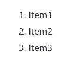

# 编写 Github 自述文件

> 原文：<https://medium.com/analytics-vidhya/writing-github-readme-e593f278a796?source=collection_archive---------1----------------------->

**README** 是吸引开发者/访问者来查看你的项目的东西。如果你的自述文件只包含纯文本，啊哈，那就没有说服力了。它就像你成长过程中的学科书籍；图片少，字体小，段落大，没有趣味性。我想不仅仅是我过去常常在书中搜索图片来估计它会有多有趣，我将来会读多少，或者我是否会触摸它。

如果我写这个博客没有任何 pictures🖼️，同样大小的字体🔤，没有分离，没有幽默🤡，没有奇闻轶事；总之没有 interest❌；从技术上来说，我写它是徒劳的。它不会被卖掉，我会一直穷下去。**可怜的我**😭。我不知道我的博客能有多有趣，但我希望它能帮助你。

**自述**是你项目的脸面，你需要在上涂上最好的**妆容** **，让它看起来足够像样，这样你就不会失去**你的脸面**。所以，让我们开始了解我们所有的化妆品和如何应用它。**

**化妆套件包括:-**

1.  标题
2.  换行
3.  强调
4.  大宗报价
5.  不要渲染代码
6.  列表—有序和无序
7.  横向规则
8.  链接
9.  图片/GIF
10.  录像
11.  标签
12.  桌子
13.  任务列表
14.  添加颜色
15.  将文本写成代码
16.  添加表情符号

***全在一个套件。没有更好的地方可去。让我们开始***

# 1.标题

和 HTML 一样，这里有 6 个标题。

**代码:-**

> # heading 1
> # # heading 2
> # # # heading 3
> # # # # heading 4
> # # # # heading 5
> # # # # # heading 6

标题

默认情况下，标题 1 和标题 2 有一行。其他人则没有。

# 2.换行

对于换行或写入新行，您可以选择 *markdown 方式*或 *HTML 方式*。两个都很好。

**Markdown** :-创建一个换行符，用**两个或更多空格**结束一行，并点击回车键。

> 断货方式

抱歉，这里不允许超过 1 个空格，所以复制粘贴上面的代码对你无效。

HTML :-添加中断标签(` `)

> HTML 方式
> 
> 的破坏

换行

# 3.强调

**粗体**和*斜体*是两种加重模式。给你单调的文字增加了一点重量。

粗体:- 双打代表粗体

> **粗体* *
> __ 粗体 _ _

**斜体:-** 单音代表斜体

> *斜体*
> _ 斜体 _

如果我们两个都想要，一个 ***混合*** 呢？

> ***杂种* * *
> _ _ _ 杂种 _ _
> * * _ 杂种 _ * *
> * _ _ 杂种 __*

# 4.大宗报价

块引号是作为段落或文本块从主文本中引出的引号。

**代码:-** (第二行的>是输出中的空行)

> >这是一行
> >
> >这是下一行

**嵌套块引用**

> >这是主块引用
> > >这是嵌套块引用
> > >
> > >让我们跳出嵌套
> >
> >让我们跳出主

# 5.密码

“别渲染了。我说了不要。把它作为一个代码保存起来。”

写下代码，并给所有的标签，即 4 个空格。**将它们缩进 4 个空格**以保持它们为普通文本。如果不缩进，它会被当作 HTML 块读取。

**代码:- (** 此处不允许超过 1 个空格)

> <body>
> 
我们把它保留为一个代码块不渲染一次

> </body>
> </html>

# 6.列表

对于 README 来说，列表是非常必要的，比如当你想列出特性或者使用的语言等等。

**无序列表:-**

> *项目 1
> *项目 2
> *项目 3
> 
> -项目 1
> -项目 2
> -项目 3

**有序列表:-**

> 1.项目 1
> 2。第 2 项
> 3。项目 3

# 7.横向规则

要创建水平线，请使用三个或更多的星号(`***`)、破折号(`---`)或下划线(`___`)。

> `---`
> 
> `****`
> 
> `_______`

# 8.链接

要创建链接，请将链接文本括在括号中，然后紧跟在括号中的 URL 后面。你也可以简单地复制粘贴一个链接。

> [投资组合网站链接]([https://gaganpreetkaurkalsi.netlify.app/](https://gaganpreetkaurkalsi.netlify.app/))

输出

**带标题的链接:-**

> 【投资组合网站链接】([https://gaganpreetkaurkalsi . netlify . app](https://gaganpreetkaurkalsi.netlify.app)“我的投资组合网站”)

当您悬停在上方时，标题会显示出来

# 9.形象

图片对于让你的自述文件更有吸引力非常重要。

为了放置图像，

1.  将其上传到您的存储库
2.  在下面给出的降价中提及它的路径

> ！[Alt](img 的路径)
> 
> ！[Image](/component-library/images/website . SVG)

**GIF**——你也可以上传一张 GIF。只需提到它的链接来代替图片链接。语法保持不变。

> ！【主】([https://media.giphy.com/media/wKoPDy4mp8Lr6IJ9ce/giphy.gif](https://media.giphy.com/media/wKoPDy4mp8Lr6IJ9ce/giphy.gif))

自述文件中显示的 website.svg

您也可以在自述文件中拖放图像。这个功能是最近添加的。

很抱歉质量不好

# 10.录像

与图片相同，您可以将视频上传到您的自述文件中。为你的项目制作一个短视频，并粘贴它以获得更多的观众。

拖放。就这么简单

# 11.标签

下面是几个标签的代码。放心使用。在提到的地方提到你的 Github 用户名和库名。

> ！【GitHub 所有发布】([https://img . shields . io/GitHub/downloads/{ username }/{ repo-name }/total](https://img.shields.io/github/downloads/GaganpreetKaurKalsi/TypingSpeedTest-JS/total))
> ！【GitHub 语言计数】([https://img.shields.io/github/languages/count/](https://img.shields.io/github/languages/count/GaganpreetKaurKalsi/TypingSpeedTest-JS){用户名}[/](https://img.shields.io/github/languages/count/GaganpreetKaurKalsi/TypingSpeedTest-JS)[{ repo-name }](https://img.shields.io/github/downloads/GaganpreetKaurKalsi/TypingSpeedTest-JS/total))
> ！【GitHub 顶级语言】([https://img.shields.io/github/languages/top/](https://img.shields.io/github/languages/top/GaganpreetKaurKalsi/TypingSpeedTest-JS?color=yellow)[{用户名}](https://img.shields.io/github/downloads/GaganpreetKaurKalsi/TypingSpeedTest-JS/total)[/](https://img.shields.io/github/languages/top/GaganpreetKaurKalsi/TypingSpeedTest-JS?color=yellow)[{ repo-name }](https://img.shields.io/github/downloads/GaganpreetKaurKalsi/TypingSpeedTest-JS/total)[？颜色=黄色](https://img.shields.io/github/languages/top/GaganpreetKaurKalsi/TypingSpeedTest-JS?color=yellow) )
> ！[bit bucket open issues]([【用户名】](https://img.shields.io/github/downloads/GaganpreetKaurKalsi/TypingSpeedTest-JS/total) [/](https://img.shields.io/bitbucket/issues/GaganpreetKaurKalsi/TypingSpeedTest-JS) [【回购名称】](https://img.shields.io/github/downloads/GaganpreetKaurKalsi/TypingSpeedTest-JS/total) )
> ！【GitHub forks】([https://img.shields.io/github/forks/](https://img.shields.io/github/forks/GaganpreetKaurKalsi/TypingSpeedTest-JS?style=social)[{用户名}](https://img.shields.io/github/downloads/GaganpreetKaurKalsi/TypingSpeedTest-JS/total)[/](https://img.shields.io/github/forks/GaganpreetKaurKalsi/TypingSpeedTest-JS?style=social)[{ repo-name }](https://img.shields.io/github/downloads/GaganpreetKaurKalsi/TypingSpeedTest-JS/total)[？风格=社交](https://img.shields.io/github/forks/GaganpreetKaurKalsi/TypingSpeedTest-JS?style=social) )
> ！【GitHub Repo stars】([https://img.shields.io/github/stars/](https://img.shields.io/github/stars/GaganpreetKaurKalsi/TypingSpeedTest-JS?style=social)[【用户名】](https://img.shields.io/github/downloads/GaganpreetKaurKalsi/TypingSpeedTest-JS/total)[/](https://img.shields.io/github/stars/GaganpreetKaurKalsi/TypingSpeedTest-JS?style=social)[{ Repo-name }](https://img.shields.io/github/downloads/GaganpreetKaurKalsi/TypingSpeedTest-JS/total)[？style=social](https://img.shields.io/github/stars/GaganpreetKaurKalsi/TypingSpeedTest-JS?style=social)

输出标签

**欲了解更多此类标签，请访问**[**https://shields.io/**](https://shields.io/)

# 12.桌子

嗯，我还没有在我的任何项目中使用它们，但也许你只是在寻找它，我救了你。

您可以创建带有竖线`|`和连字符`-`的表格。连字符用于创建每一列的标题，而管道分隔每一列。标题行的每一列中必须至少有三个连字符。`**Copy pasting code won't work.**`

> | header 1 | header 2 | header 3 |
> |—————————|
> | R1 C1 | R1 C2 | R1 C3 |
> | R2 C1 | R2 C2 | r2c 3 ||

桌子

**对齐表格:-**

要对齐项目:-

*   左对齐— `:---`
*   居中对齐— `:---:`
*   右对齐— `---:`

> | header 1 | header 2 | header 3 |
> |`:----`|`:----:`|`----:`|
> | R1 C1 | R1 C2 | R1 C3 |
> | R2 C1 | R2 C2 | R2 C3 |

对齐表格

**注意:-** *复制粘贴代码行不通。我测试过了。你自己写就好了*

# 13.任务列表

这是另一件你可以在自述文件中找到的事情。

> - [x]写博客
> - [x]让它变得有趣
> - [ ]发表它

任务列表

# 14.添加颜色

不知道这是什么，也不知道我如何使用它，但我在寻找如何添加颜色时发现了这个。我不认为谷歌得到了我。但是当我记录所有的时候，为什么要留下这个。**没有偏见**。

> ` ` diff
> -这是一条红色的线
> +这是一条绿色的线
> @@这是一条紫色的线@@
> ` `

输出

# 15.将文本写成代码

你想给你的文本加一个灰色背景，让它看起来像一段代码吗？这是你需要的。

> `你好，这是一个代码'
> 
> ``在双反勾号中使用`单反勾号'

输出

# 16.添加表情符号😊

最后但同样重要的是，你想在你的自述文件中添加一些表情符号吗？下面是怎么做的。

1.  转到[**https://emojipedia.org/**](https://emojipedia.org/)
2.  寻找完美的表情符号
3.  将其复制并粘贴到自述文件中

从这里复制

我知道你们很多人可能知道这个。但对那些不知道的人来说。很酷。

我想就这样吧。我已经记录了所有有用的降价，你可以添加到你的自述文件中。让它**漂亮**让每一位顾客**爱上它** 🥰。记住是**面**。化妆要得体。

这是我最近创建的一个自述文件的链接。我真的不记得怎么写了。因此，我想写一个博客，这样如果未来的我不知何故又忘记了，它只是一个复制、粘贴和输入。如果你喜欢，记得**给回购一颗星** ⭐.

这里有一些你可以联系到我的链接

gagansinghkalsi4126@gmail.com**邮箱**

**Github**——[https://github.com/GaganpreetKaurKalsi](https://github.com/GaganpreetKaurKalsi)

我希望我能有所帮助，并能够通过将所有东西放在一个地方来减少您的一点努力。**如果你喜欢，请鼓掌👏我会拍拍我的背。**

谢谢大家！

大家再见！再见👋